# Agentic AI 时代的操作系统课：绪论

> **原视频**：[Bilibili · BV1opAfzpEf9](https://www.bilibili.com/video/BV1opAfzpEf9/)
> **课程**：NJU《操作系统原理》2026 第 1 讲
> **整理说明**：本书由视频语音转录后经 AI 重构而成，口语已转写为书面语；关键时间点均标注 *(参考时间)*，截图卡片可跳转视频对应位置。

---

## 1. 为什么在 AI 时代还要学操作系统

- 用过或听说过 ChatGPT 一类「和 AI 对话」的工具
- 知道计算机能写程序、能运行软件即可
- 本章零基础可跟

*(参考时间: 00:00)*

主讲人以「AC 5 年」（GPT 诞生后的第 5 年）开篇，指出过去五年计算机世界发生了巨大变化：模型能力从「从 50 数到 100 都会卡」进化到 IMO/IOI 金牌水平，推理速度可达每秒上万 token，Coding Agent 也从聊天框进化为「有手脚、能改文件」的智能体。

在这一背景下，许多同学会问：既然 AI 什么都能写，为什么还要学操作系统？

### 软件曾是物理世界的投影

在 AI 之前，计算机只能求解用数学语言精确定义的问题（如图上的最短路径）。软件工程师的核心工作，是把物理世界中不规则的需求，翻译成计算机可以求解的问题——也就是「软件是物理世界在信息世界的投影」。

如今 AI 非常擅长完成这类翻译：自然语言描述不清的需求，它也能猜一个合理实现。这使得「顶级劳动力」的价值受到挤压。

### AI 仍做不了的事

*(参考时间: 00:29)*

AI 目前在**复杂系统的顶层设计**上仍显不足。操作系统正是这样一个抽象：

- 它要支撑百万、千万级应用生态；
- 设计接口时既要底层好实现，又要对上层开发者友好；
- 还要能一层层长出完整的软件世界。

本门课的 takeaway message 是：**如何设计一个好的抽象层（把复杂性隔在上下两层之间，中间只留简单接口）**，依赖下层接口，给上层提供服务。

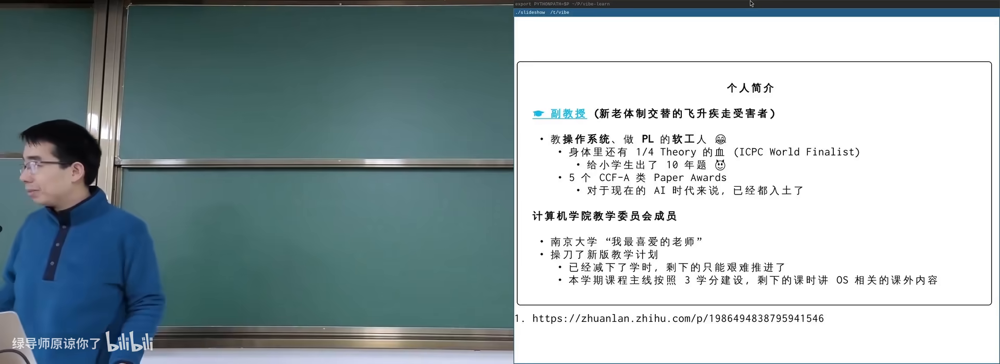

操作系统还是 AI 的「手脚」。没有操作系统提供的网络、文件、虚拟环境，AI 写脚本、拉数据、改本地文件都无从谈起。

### 学习态度的转变

*(参考时间: 00:38)*

经典格言 *Talk is cheap, show me the code* 在 AI 时代反转为：**Code is cheap, show me the talk**——只要能把问题说清楚，AI 就能帮你生成答案。但前提是你要真正掌控计算机，操作系统课能提供这种启发。

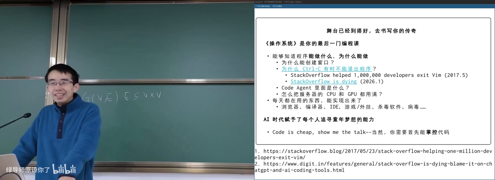

---

## 2. 课程安排与成绩构成

- 本章零基础可跟
- 知道大学课程有学分、作业、考试即可

*(参考时间: 00:03)*

课程按 3 个学分组织：两周 4 次课，其中 3 次讲正课，1 次为 Hacking Day（与 OS 相关但不计入考试的课外内容）。

| 项目 | 占比 | 说明 |
|------|------|------|
| 期末考试 | 50% | 课堂理解了即可应对 |
| 随堂测验 | 10% | 约五一前后；缺席则以期末成绩代替 |
| 实验 | 40% | 编程为主，含实现大语言模型推理器 |

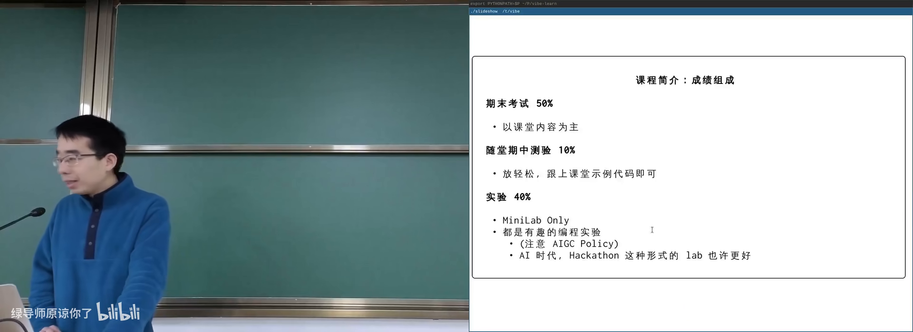

### 学习与 AI 的边界

课程鼓励用 AI 辅助学习（读文档、问 API），但实验中禁止直接让 AI 代写作业的完整实现——只允许就局部 API 用法提问。原因是：真正理解操作系统 API 的能力，是掌控计算机软件的基础。

重要信息通过邮件推送；每周四下午 16:30–17:30 为 office hour。课程主页承载全部资料，支持直播与录播。

---

## 3. 什么是操作系统：硬件与软件之间

- 知道计算机有 CPU、内存
- 听说过「程序」这个词
- 数电/计组概念本章会用大白话回顾

*(参考时间: 00:39)*

教科书定义：操作系统是 *a body of software*，让程序能够运行、共享内存、与设备交互。主讲人认为不必死记定义——压缩损失太多，应从历史发展理解它怎么变成今天的样子。

### 三条线索

操作系统管理硬件与软件，因此有三条线索：

1. **硬件**：操作系统直接接管的底层资源；
2. **软件**：应用程序（终端、浏览器、Agent 等）；
3. **操作系统本身**：夹在硬件与软件中间的那一层。

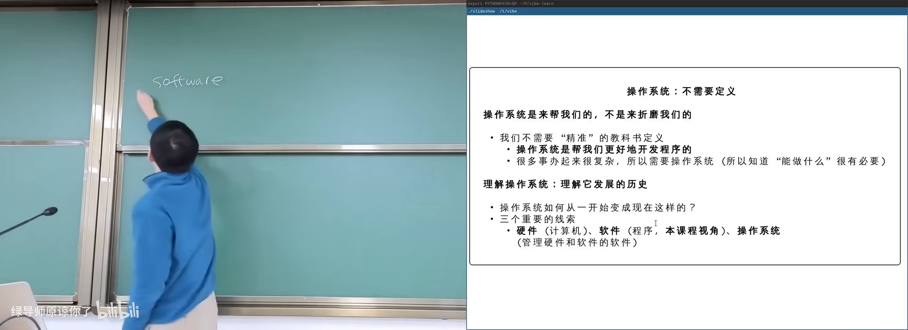

### 硬件是状态机

**状态机（系统在每一刻处于一个确定状态，执行一步后迁移到下一个状态）**：硬件的状态是内存和寄存器里所有 bit 的取值；每执行一条指令，状态迁移一次。

**指令集**（CPU 认识的指令集合，决定机器能做什么）：取指、译码、执行——循环往复。数电中的导线、时钟、逻辑门、触发器四种元件就足以构造任意数字系统。

**状态转移图**（画出「当前状态 → 下一状态」关系的图）：计数器 `00 → 01 → 10 → 11` 是最简单的例子。

主讲人现场展示了一个数字逻辑电路模拟器：打印 `A=0 B=1` 这样的文本，再通过管道接到另一个程序，就得到真实的数码管显示。这体现了 UNIX 管道组合复用的威力。

### 软件也是状态机

*(参考时间: 00:58)*

`a.c` 经过编译链接变成 `a.out`，程序在 CPU 上运行时同样是一个状态机：寄存器 + 内存 + 程序计数器（PC，指示「下一条要执行的语句在哪里」）。

用 GDB 调试汉诺塔递归时，每一步都是状态迁移。**栈帧（函数调用时在栈上分配的一块保存局部变量和返回地址的空间）** 堆叠起来构成调用历史。

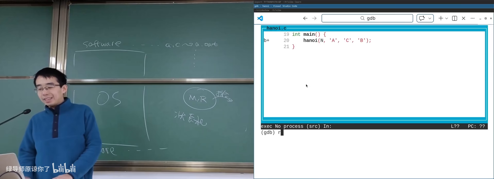

---

## 4. 操作系统简史：从无到有时分复用

- 读过上一节「状态机」概念
- 知道程序是写好后交给计算机执行的
- 历史细节零基础可跟

*(参考时间: 01:05)*

操作系统怎么从 1940 年的「没有」走到今天的现代系统？三个里程碑：

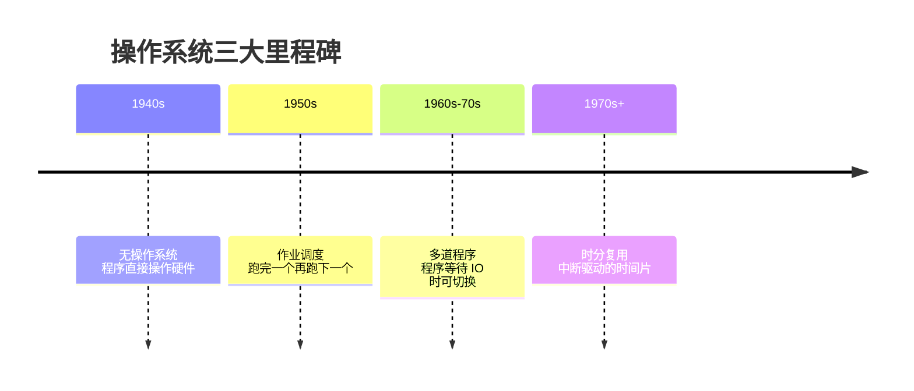

### 1940 年代：没有操作系统

ENIAC（1946）用真空管和延迟线存储，程序以打孔纸带形式输入。当时的目标仅仅是「让程序跑起来」，所有程序直接操作硬件。延迟线（把数据编码成线上波形循环传输以临时保存）是天才但原始的存储方案。

最早的软件包括打印素数表——这解释了为何编程课第一课常是判断素数。bug 一词也来自真实飞虫卡在继电器里。

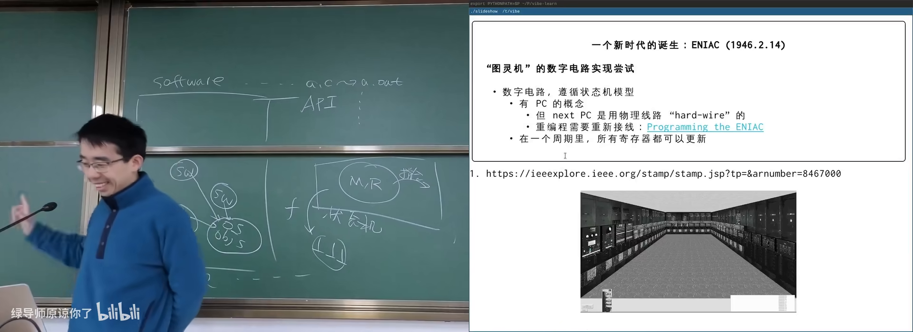

### 1950 年代：作业系统

一台计算机价值数万到百万美元，全校共用。多任务排队需要公共软件来管理加载、切换、终止——**作业调度（决定哪个程序先上机运行的机制）** 应运而生。繁体中文将 OS 译作「作业系统」正源于此。

### 1960–70 年代：多道程序与分时

集成电路让内存大于单个程序，多个程序可同时载入。当 P1 执行 `write` 等待 IO 时，CPU 可切换给 P2——操作系统获得了**切换与恢复**能力。

再进一步，时钟中断可以在任意时刻打断程序，实现**时间片（每个程序轮流占用 CPU 一小段时间）**。这解释了：为何死循环不会让整机卡死。

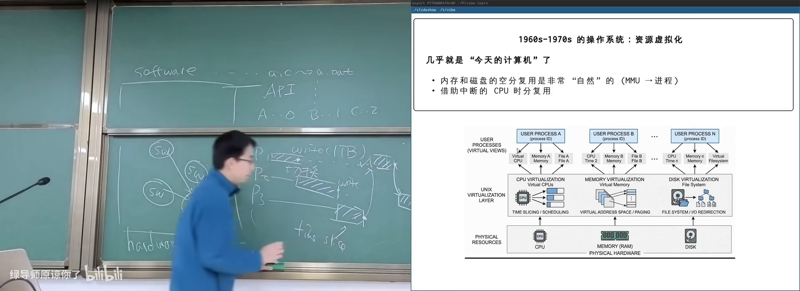

### Unix 定调

1973 年 Unix 体系基本完善：信号、管道、grep；1983 年 socket；1984 年 procfs。此后衍生出 BSD、GNU、Windows、Linux、macOS、iOS、Android 等庞大系统。核心理念始终未变：**管理程序的软件**。

---

## 5. 抽象层与 UNIX 哲学

- 知道「接口」是上下层约定好的调用方式
- 了解过或听说过 UNIX / 命令行
- 本章概念会用例子展开

*(参考时间: 00:32)*

从应用视角看，**操作系统就是一组 API（应用程序请求系统服务的调用接口）**。程序通过系统调用访问操作系统里的对象：文件、磁盘、显卡、其他进程。

### 抽象层设计

好的抽象层：

- 上下两层各自可以很复杂；
- 中间接口保持简单稳定；
- 支撑上层生态生长。

同样模式可推广：多机集群 → 分布式系统 API；GPU 多核 → CUDA；存储设备 → 文件系统。

### UNIX 哲学的启示

UNIX 提供可组合的小工具，工具之间通过管道连接。编程语言的威力在于**无限组合与低成本复用**——AI 的 skills/MCP 目前还缺少这一特性。

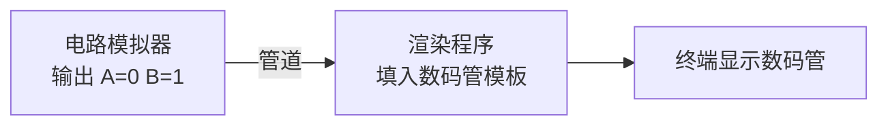

管道把一个程序的输出作为下一个程序的输入，不断串接即可搭出复杂系统。这是 AI 时代仍值得反复回味的设计。

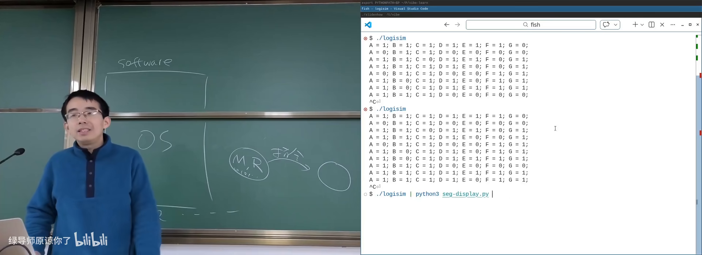

---

## 6. 怎么学这门课

- 本章零基础可跟
- 已阅读前几章关于课程目标的说明会有帮助

*(参考时间: 01:32)*

学习操作系统，学的是：

- **基本动机**：为什么需要这个机制；
- **基本方法**：人类如何想到并实现它；
- **里程碑与弯路**：哪些设计留下来了，哪些被抛弃。

AI 时代学习方式已变：你只需要抓住几个 first principle（状态机、API、抽象层），细节可以随时问 AI。主讲人自己的上课系统把讲义全部代码化，可自动生成 lecture notes，甚至让 AI 按听众背景定制讲法。

### 给同学的建议

- 不要为眼前的分数牺牲长期能力；
- 做出有亮点的东西比刷分更能体现价值；
- 实验中亲手写与操作系统 API 交互的部分；
- 有任何问题发邮件，保证回复；也可以先问课程 AI 工具。

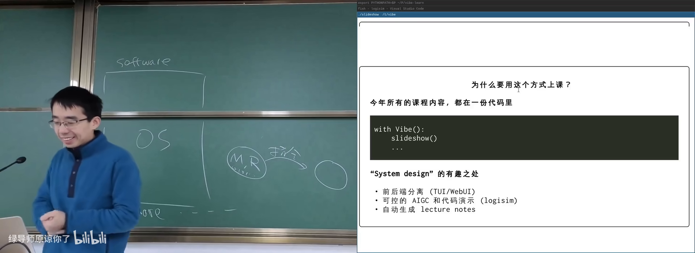

---

## 附录：概念补给

- 读过正文各章即可；每条独立成卡
- 本章零基础可跟

### 状态机

- **是什么**：系统每一刻处于一个状态，按规则迁移到下一状态。
- **课上为何出现**：硬件和软件都可以用同一模型理解。
- **和什么像**：红绿灯、游戏存档点。

### 指令集（ISA）

- **是什么**：CPU 能识别并执行的指令集合。
- **课上为何出现**：硬件状态迁移的规则；也是操作系统与硬件之间的抽象层。
- **和什么像**：一门语言的词汇表和语法规则。

### 程序计数器（PC）

- **是什么**：指示下一条要执行指令/语句位置的寄存器。
- **课上为何出现**：GDB 里高亮的那一行就是 PC。
- **常见误解**：PC 不是「个人电脑」，在本课语境中是 Program Counter。

### 栈帧（Stack Frame）

- **是什么**：一次函数调用在栈上占用的局部变量与返回地址区域。
- **课上为何出现**：解释递归与函数调用的状态机模型。
- **和什么像**：叠放的便签，每层记着自己从哪里来。

### 抽象层

- **是什么**：隔开上下两层复杂性的中间接口。
- **课上为何出现**：本课核心 takeaway；操作系统、指令集、游戏引擎都是抽象层。
- **常见误解**：抽象不是「模糊」，而是「上层不必知道下层细节」。

### 系统调用（System Call）

- **是什么**：应用程序请求操作系统服务的唯一正式通道。
- **课上为何出现**：从应用看，OS 就是一组 API。
- **和什么像**：到医院签手术同意书后全麻——你不知道过程，醒来事情已办完。

### 作业调度

- **是什么**：决定多个排队程序谁先上机运行的机制。
- **课上为何出现**：1950 年代计算机昂贵，OS 最早的职责之一。
- **和什么像**：医院挂号分诊。

### 时间片 / 分时复用

- **是什么**：CPU 轮流给每个程序一小段执行时间。
- **课上为何出现**：死循环不卡死整机的原因。
- **和什么像**：多个窗口轮流显示，感觉上「同时」在用。

### 管道（Pipe）

- **是什么**：把一个程序的输出接到另一个程序输入的机制。
- **课上为何出现**：UNIX 哲学的体现；工具可无限组合。
- **和什么像**：流水线上工位之间的传送带。

### 延迟线存储

- **是什么**：早期用线上传输的电脉冲循环来保存 bit 的存储技术。
- **课上为何出现**：解释 1940 年代计算机如何在没有 DRAM 时工作。
- **和什么像**：不停甩绳子，用绳波形状编码 0/1。

### Firmware / BIOS / UEFI

- **是什么**：厂商固化在硬件里、CPU 复位后最先执行的代码。
- **课上为何出现**：没有操作系统时，机器靠固件完成初始化并加载 OS。
- **常见误解**：BIOS 是 UEFI 的旧称呼之一，现代机器多用 UEFI。

### Agentic AI

- **是什么**：能调用工具、与环境交互、自主完成多步任务的 AI 程序。
- **课上为何出现**：本课所处时代背景；OS 是 AI 的手脚。
- **和什么像**：不只会聊天的实习生，还能自己开电脑干活。

*书架 Shelf 流水线生成 · 内容衍生自 B 站公开课程视频 BV1opAfzpEf9*
