# 应用视角的操作系统

> **原视频**：[Bilibili · BV1KNPHzPEra](https://www.bilibili.com/video/BV1KNPHzPEra/)
> **课程**：NJU《操作系统原理》2026 第 2 讲
> **整理说明**：本书由视频语音转录后经 AI 重构而成，口语已转写为书面语；关键时间点均标注 *(参考时间)*，截图卡片可跳转视频对应位置。

---

## 1. 程序是什么：C 作为状态机

<div class="prereq" data-label="你需要先知道">

- 学过 C/C++ 的基本语法（变量、if、循环、函数）
- 知道程序可以「单步调试」
- 状态机概念若不熟，本章会用 C 程序展开

</div>

*(参考时间: 00:00)*

本学期从**应用程序视角**理解操作系统：操作系统就是一组 API。本讲主角是**程序**——精确到每一个 bit 都有定义的计算对象。

课程选用 C 语言：它介于汇编（可直接与 OS 交互）与高级语言之间，是最早构建应用生态的语言，也是「高级的汇编语言」。

### 把 C 改写成简单形式

任何 C 程序都可以改写成**每行只做一小件事**的形式（课程称之为 **Simple C**）：

```c
t1 = y + z;
t2 = t1 + w;
x = t2;
```

条件判断可以改写成「变量为真则跳到 A，否则跳到 B」；循环同理。这样 C 的语法成分几乎可以直译成汇编——这正是 C 编译器容易构建的原因。

对比 C++ 虚函数调用：对象里有 **vtable（函数表）**，调用时可能查表，编译行为比 C 复杂得多。

### C 程序的形式语义

*(参考时间: 00:22)*

**形式语义（用严格数学定义描述语言各成分「执行时做什么」）**：C 程序的状态不是「PC + 全局变量」那么简单，而是：

- 一个**函数调用栈**：从 `main` 开始，每层栈帧有局部变量和**栈帧内的 PC**；
- 全局变量的取值；
- 每次执行都是从**最顶层栈帧的 PC** 取出一条语句执行。

**函数调用** = 在栈顶压入新栈帧，旧 PC 记为返回地址；**函数返回** = 弹出栈顶，恢复旧 PC。

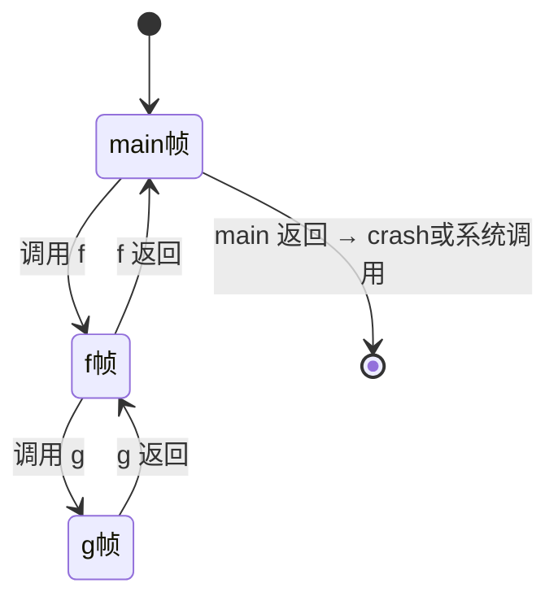

### 非递归汉诺塔

*(参考时间: 00:13)*

递归汉诺塔几乎人人都会写；改写成非递归则困难，因为程序调用顺序有副作用，不能像数学函数那样随意交换。

正确做法是把 C 程序本身当成状态机来模拟：定义 `struct Frame { int pc; ...局部变量... }`，用栈保存帧，每次从栈顶 `pc` 取语句机械执行。这样 F 调 G、G 调 F 自然解决——你根本不需要关心 PC 指向谁。

用 GDB 的 trace 脚本可以把任意程序的「状态 + 迁移」打印出来，直观看到 `n=42 → q=4` 这样的变化。

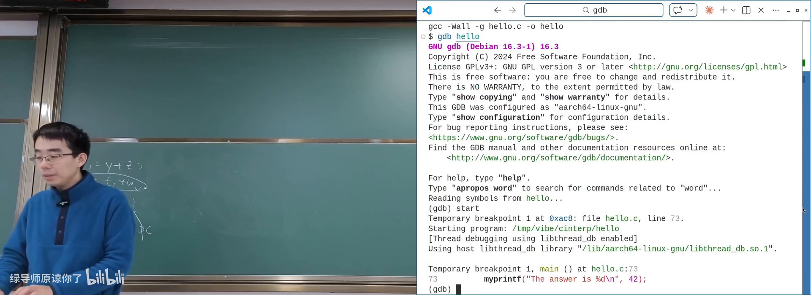

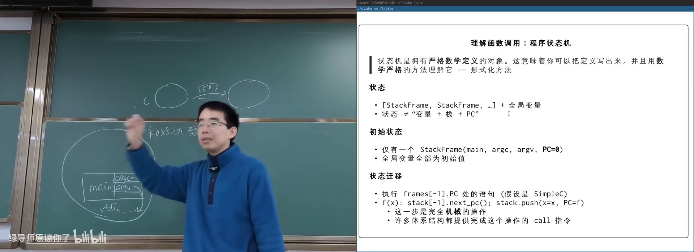

---

## 2. 编译器与编译正确性

<div class="prereq" data-label="你需要先知道">

- 知道「源代码经编译变成可执行文件」
- 了解 GCC 有优化级别（-O0 / -O2）更好
- 状态机与 Simple C 概念来自上一章

</div>

*(参考时间: 00:29)*

编译器把 `.c` 翻译成 `.out`。`.out` 的执行模型是寄存器 + 内存的指令状态机——和硬件同一模型。

早期编译器只做语句到指令的「原样翻译」；后来发现编译器**可以改变程序行为**，只要对外可观测的效果不变。

### 什么可以优化

*(参考时间: 00:32)*

| 源代码特征 | 编译器处理 |
|-----------|-----------|
| 死代码 `x=1+2;` 且 x 不再使用 | 可删除 |
| `x=1; x=1;` 重复赋值 | 可消掉一次 |
| 常量表达式 `2*3+1` | 可预计算为 7 |
| `printf` / 外部函数调用 | **不可优化掉** |

**编译正确**：对任何输入，编译前后程序的**输出序列完全相同**。

唯一不能优化的是**向外部的调用**——操作系统看不到的边界。当 `printf(x)` 把 x 送到外部时，那次运行 x 必须是什么值，优化后也必须是什么值。

若程序从不输出任何东西且会终止，编译器理论上可以优化成空程序。

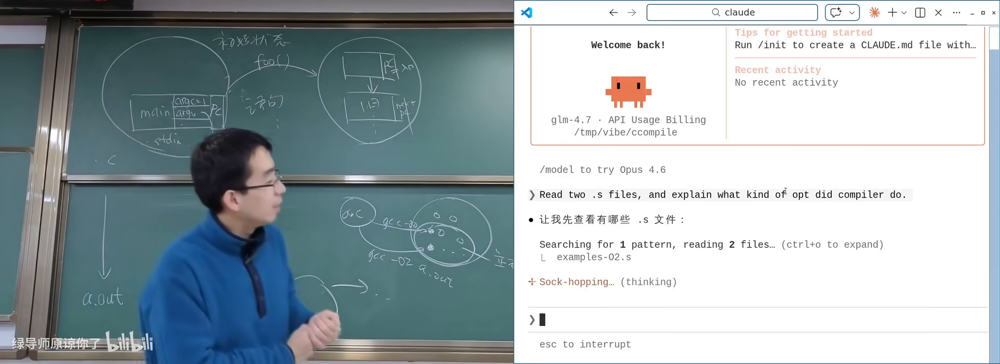

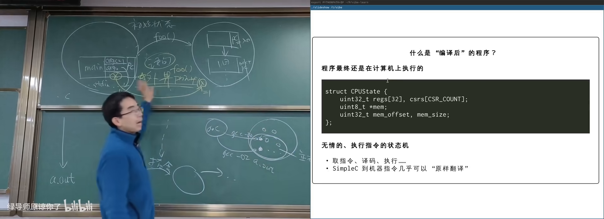

---

## 3. 系统调用：操作系统提供的 API

<div class="prereq" data-label="你需要先知道">

- 知道 C 程序从 `main` 开始执行
- 了解寄存器、栈的基本概念
- 汇编指令「把参数放进寄存器」零基础可跟

</div>

*(参考时间: 00:41)*

### 最小程序不是从 main 开始的

尝试写最小 `hello.c`：`gcc hello.c` 得到的二进制很大；直接 `ld` 会报 `undefined reference to puts`——标准库未链接。

若写一个只有 `_start` 里死循环的汇编程序，`ld` 可以链接，程序真的能跑。但若 `_start` 直接 `ret`：栈顶初始返回地址是 0，PC 变成非法地址 → **段错误（进程访问了不该访问的内存，被操作系统终止）**。

这说明：真实进程的初始状态由 **ABI（应用二进制接口，规定调用约定、栈布局、初始状态等）** 定义，有一段初始化代码会调用 `main`，`main` 返回后初始化代码再调用系统调用退出。

### 汇编里的最小 hello world

*(参考时间: 00:50)*

x86-64 系统调用约定：

1. 系统调用号放入 `RAX`；
2. 参数依次放入 `RDI, RSI, RDX, ...`；
3. 执行 `syscall`。

ARM64：参数在 `X0–X5`，调用号在 `X8`，执行 `svc #0`。

```asm
; ARM64 伪代码示意
mov x0, #1          ; 文件描述符：标准输出
ldr x1, =msg        ; 缓冲区地址
mov x2, #len        ; 长度
mov x8, #64         ; write 的系统调用号
svc #0              ; 陷入操作系统
mov x8, #93         ; exit
mov x0, #1          ; 返回值
svc #0
```

GDB 单步执行到 `svc` 时，hello world 已经打印出来——操作系统在背后执行了可能上万条指令。

### 系统调用像全身麻醉

*(参考时间: 00:54)*

**系统调用（应用程序把控制权完全交给操作系统、请求完成某项服务的指令）** 的行为：

1. 像签手术同意书：事先把参数写入寄存器（contract）；
2. 执行 `syscall` 后，程序失去对执行过程的感知；
3. 操作系统检查权限，合理则完成服务（可能改你的内存、填 buffer）；
4. 返回后程序继续；若是 `exit`，则永远不再返回。

其他指令只能改变**当前进程**的寄存器和内存；只有系统调用能影响进程外部的世界。

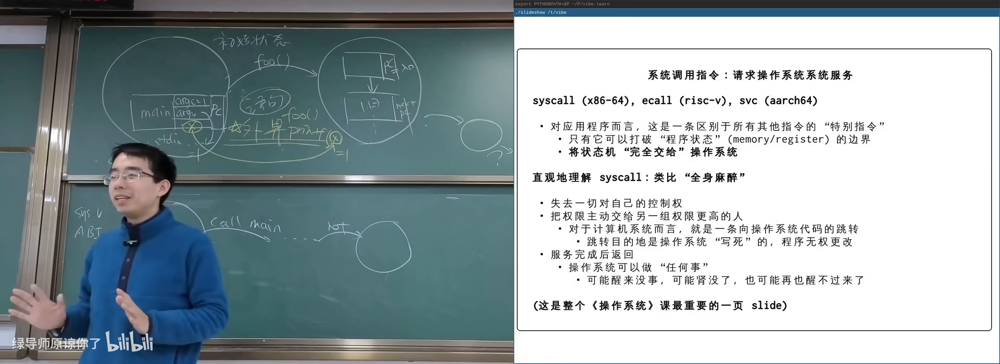

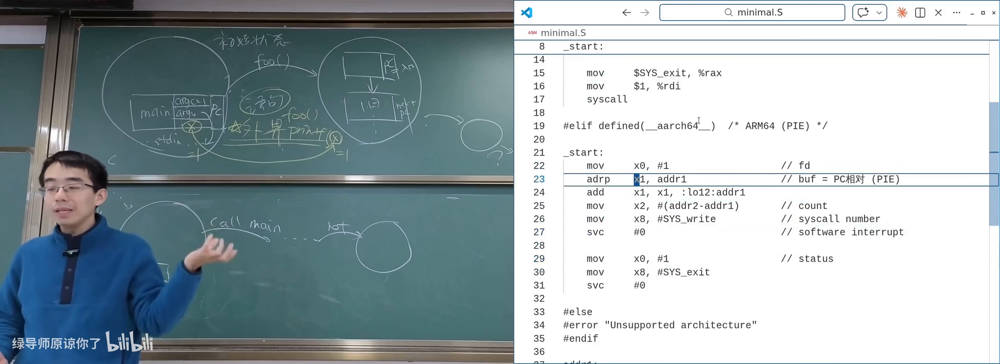

---

## 4. 应用生态：从最小程序到完整世界

<div class="prereq" data-label="你需要先知道">

- 已理解「所有程序共享同一套系统调用」
- 知道 Linux 上程序是可执行文件
- 生态分层零基础可跟

</div>

*(参考时间: 00:59)*

在操作系统面前，**众生平等**：桌面、VS Code、Claude Code、浏览器与最小的 `minimal.s` 一样，都是 ELF 可执行文件，都通过同一套系统调用请求服务（调度策略上可能有 nice 优先级差异）。

### 分层的应用世界

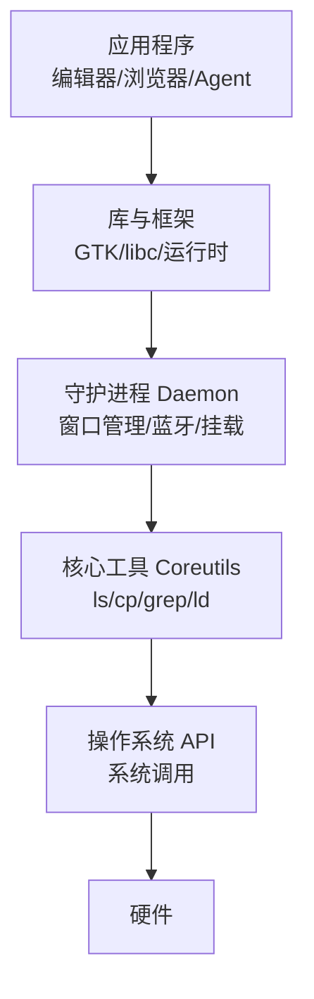

- **Coreutils / 二进制工具**：`ls`、`cp`、`grep`、`ld`、`objdump`、`strings` 等，直接建立在系统调用之上；
- **Daemon（后台服务进程）**：`bluetoothd`、`cron`、`udisksd`（U 盘自动挂载）等——插 U 盘自动出现图标，是某段程序与 OS 交互的结果；
- **图形层**：应用 → 库（GTK）→ 窗口管理器 → Wayland/X11 → 操作系统，而不是每个程序直接抢屏幕。

### 文件系统可以构建信息系统

课程提交系统演示：提交物以目录+文件形式存放，Online Judge 扫描目录评测，`find` + 删除文件即可批量 rejudge。相比数据库，文件系统更易被 hacker（包括 AI Agent）直接操作。

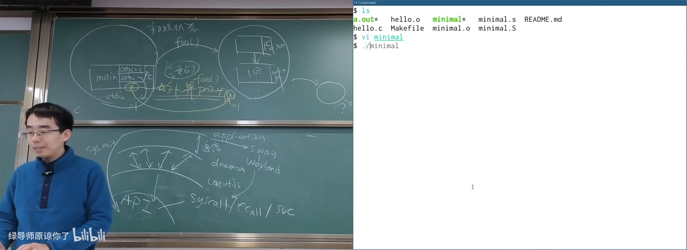

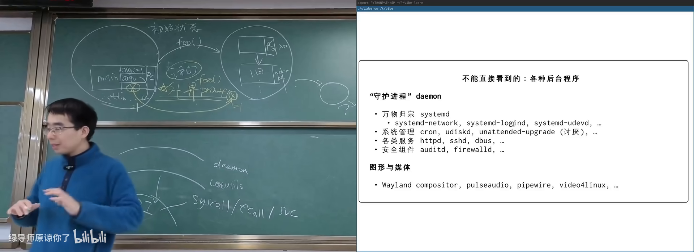

AI 可以读懂二进制中的 ARM 机器码，定位 `mov` 返回值指令并修改——计算机世界没有魔法。

---

## 5. 库与工具：站在系统调用之上

<div class="prereq" data-label="你需要先知道">

- 知道系统调用是 OS 提供的服务接口
- 用过 `man` 或让 AI 读过文档
- 本章零基础可跟

</div>

*(参考时间: 01:20)*

直接用 `write` 一个字符一个字符打印很痛苦，因此需要**复用机制**——第一个就是 C 标准库（libc）。此后 C++、Python、Java、Android 等生态层层垒起。

系统里处处是手册：`man 4 pts`（伪终端）、`man 5 proc`、`man 7 pipe`。把手册输出管道给 AI，即可获得 summary 并继续追问实现方式。

### 学习方式的变化

以前需要自己啃厚重文档；现在只需知道「世界上有什么」，让 AI 帮你提取需要的部分。AI 对已广泛使用的开发者工具的了解，往往超过单个人类专家。

用 `file` 可以看到系统中程序都是同一种 ELF；用 `hexdump` / `objdump` / `strings` 可以剖析二进制——这些工具本身就是 Coreutils 的一部分。

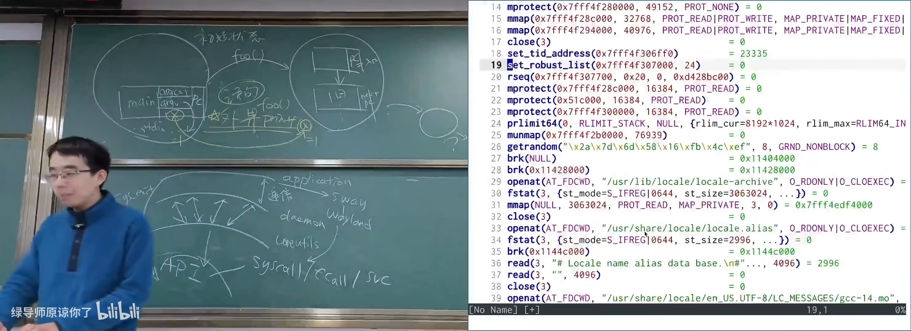

---

## 附录：概念补给

<div class="prereq" data-label="你需要先知道">

- 读过正文各章即可；每条独立成卡
- 本章零基础可跟

</div>

### Simple C

- **是什么**：把任意 C 程序改写成每行只做一件小事的简化形式。
- **课上为何出现**：说明 C 是「高级汇编」，语句可直译指令。
- **和什么像**：把长句拆成主谓宾清楚的短句。

### 形式语义

- **是什么**：用严格数学定义描述程序各成分执行时的行为。
- **课上为何出现**：C 状态 = 栈帧序列 + 全局变量，执行规则可精确写出。
- **常见误解**：不需要你真的去写集合论定义，但要知道背后可精确定义。

### 栈帧 / Stack Frame

- **是什么**：一次函数调用对应的栈上区域，含局部变量与 PC。
- **课上为何出现**：函数调用/返回的状态机语义；非递归模拟的基础。
- **和什么像**：叠便签，每层写「我从哪来、局部记了什么」。

### vtable（虚函数表）

- **是什么**：C++ 对象里存放虚函数地址的表，调用时查表跳转。
- **课上为何出现**：对比说明 C 比 C++ 更接近汇编、编译器更简单。
- **和什么像**：菜单上的菜名到后厨做法的对照表。

### 编译优化

- **是什么**：编译器在保持外部可观测行为不变的前提下改进代码。
- **课上为何出现**：死代码消除、常量折叠等；界定什么能优化。
- **常见误解**：优化不是「改逻辑」，对外输入输出序列应完全一致。

### 段错误（Segmentation Fault）

- **是什么**：程序访问非法内存时被 OS 强制终止的现象。
- **课上为何出现**：空 `_start` 返回后 PC=0 的必然结果。
- **和什么像**：闯入未开放区域被保安带走。

### ABI（应用二进制接口）

- **是什么**：规定调用约定、寄存器用途、栈布局、进程初始状态等的约定。
- **课上为何出现**：解释真实程序为何不从 `main` 的第一条源码开始。
- **和什么像**：快递面单格式——双方按同一格式才能交接。

### 系统调用（syscall）

- **是什么**：程序请求 OS 服务的指令，执行时控制权交给内核。
- **课上为何出现**：应用视角下 OS 就是一组 API。
- **常见误解**：库函数（如 `printf`）不是系统调用本身，底层可能封装了 `write`。

### Daemon（守护进程）

- **是什么**：在后台持续运行、提供服务的进程。
- **课上为何出现**：U 盘自动挂载、蓝牙等「系统行为」都是 daemon 做的。
- **和什么像**：小区里值班的物业，你没叫他也在干活。

### Coreutils

- **是什么**：`ls`、`cp`、`mv`、`grep` 等基础命令行工具的集合。
- **课上为何出现**：直接建立在系统调用上的第一批应用。
- **常见误解**：`grep` 严格说常是独立项目，但 busybox 等套件会捆绑。

### ELF（可执行文件格式）

- **是什么**：Linux 上可执行文件/目标文件的标准格式。
- **课上为何出现**：系统中所有程序（含 minimal）都是同一种 ELF。
- **和什么像**：统一规格的集装箱，机器知道怎么装卸。

### procfs

- **是什么**：以文件形式暴露进程与内核信息的虚拟文件系统（`/proc`）。
- **课上为何出现**：UNIX「一切皆文件」的典型；可读 `maps`、`mem` 等。
- **常见误解**：`/proc` 下多数「文件」不占磁盘空间。

*书架 Shelf 流水线生成 · 内容衍生自 B 站公开课程视频 BV1KNPHzPEra*
