# 硬件视角的操作系统

> **原视频**：[Bilibili · BV18fcozAEsy](https://www.bilibili.com/video/BV18fcozAEsy/)
> **课程**：NJU《操作系统原理》2026 第 3 讲
> **整理说明**：本书由视频语音转录后经 AI 重构而成，口语已转写为书面语；关键时间点均标注 *(参考时间)*，截图卡片可跳转视频对应位置。

---

## 1. 用 AI 补齐动手能力

- 知道课程示例代码在课程主页上
- 用过或听说过 coding agent（如 Claude Code）
- UNIX 命令零基础可跟

*(参考时间: 00:00)*

本讲从应用视角的操作系统（一组 API）转向**硬件视角**。开课前先示范：觉得「下载课程示例代码很麻烦」时，可以问 AI「如果你是这个领域的专家，你会怎么做」——主讲人称之为**改变世界的 prompt（用专家视角引导 AI 给出方法）**。

AI 会调用 `curl` 抓取网页、识别目录结构、用 `wget -R` 递归下载，做错还会自查重做。观察这一过程本身就是学习：你知道了工具存在，再追问原理。

### 两种学习方式

- **主动**：每一步追问「为什么用这个工具、原理是什么」；
- **被动**：让 AI 监控你的操作，每隔几分钟问「刚才我在做什么？如果是专家会怎么做」。

AI 时代人与人之间的工作效率与学习效率可能相差十倍、百倍甚至千倍。

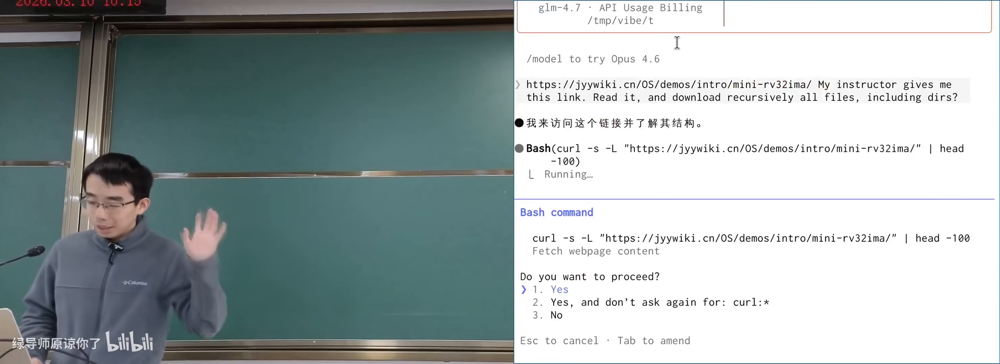

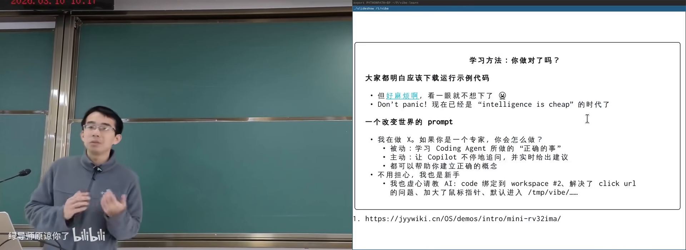

---

## 2. 抽象层：硬件并不知道操作系统

- 知道 CPU 执行指令、内存存数据
- 听说过「系统调用」
- 抽象概念本章会展开

*(参考时间: 00:09)*

回顾应用视角：`.c` 是状态机 → 编译成 `a.out`（指令状态机）→ 运行在操作系统上 → 操作系统运行在硬件上。`a.out` 里的进程本身也是操作系统中的对象。

程序有一条特殊指令 **系统调用（程序把控制权交给操作系统、请求服务的指令）**，如同全身麻醉：失去意识，醒来时请求可能已完成。

### 硬件视角一句话

**硬件根本不知道有没有操作系统，也不知道上面跑的是什么。** 它只是无情的执行指令的机器：看见什么指令就执行什么。

写 NEMU 模拟器时用的就是这个模型：`ADD`、`MOV`、`INT`、`IN`/`OUT` 按手册做状态迁移。`INT`/`in`/`out` 等指令常被用来实现操作系统，但硬件并不禁止你跑一个不是 OS 的程序。

### 什么是抽象

**抽象（隔离上下两层复杂性的中间接口）**：上层很复杂，下层也很复杂，中间接口保持简单。

系统调用是典型抽象：应用通过 `read`/`write` 等少量 API 即可支撑整个应用生态；底层为画一个像素要驱动显卡、走线到显示器，应用完全不必知道。反过来，操作系统也不关心上面是 Android、云服务还是树莓派。

指令集（ISA）同样是抽象：向上是 OS 与全部应用，向下是乱序执行、数据流分析、多发射等复杂硬件。

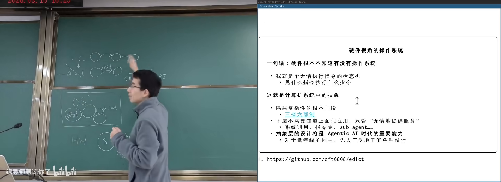

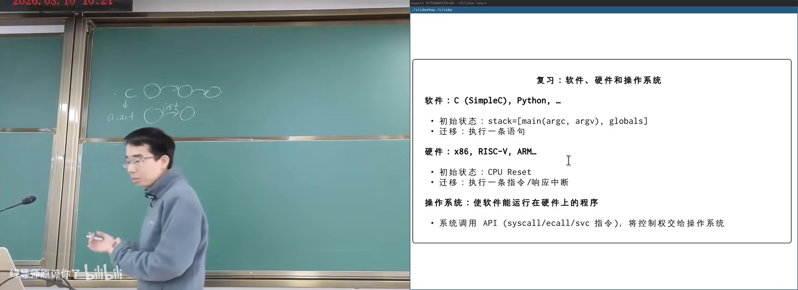

`printf` 有时输出到屏幕、有时到文件，代码完全相同——因为 `write` 的**文件描述符（指向操作系统对象的整数编号）** 可以指向不同对象。抽象层设计在 Agentic AI 时代可能是重要产品能力。

---

## 3. 计算机系统的状态与迁移

- 理解「硬件 = 内存 + 寄存器 + 取指执行」
- 听说过中断或 GPIO 更好，非必须
- 本章会用例子建立概念

*(参考时间: 00:20)*

计算机系统 = 状态机：

- **状态**：内存与寄存器的数值；
- **初始状态**：CPU reset 后由设计者规定（如 PC = 特定地址）；
- **迁移**：从 PC 取指 → 译码 → 按手册执行。

### 系统内状态与系统外状态

内存、CPU 插在主板上，主板处在物理世界中。因此状态还包括：

- **系统内**：寄存器、内存；
- **系统外**：传感器、摄像头、网络等物理设备。

`in` 指令从外部读入（如摄像头像素写入 AX）；`out` 把电平送到外部。任天堂「打鸭子」的光枪就是一个像素的摄像机：开枪后屏幕闪一白一黑，命中则相机检测到该序列。

树莓派上的 **GPIO（通用输入输出引脚，可用程序控制电平高低）**：`gpio set value 23` 即可拉高/拉低 23 号引脚；接上 LED 即可闪烁。一行 C 代码就能与物理世界交互。

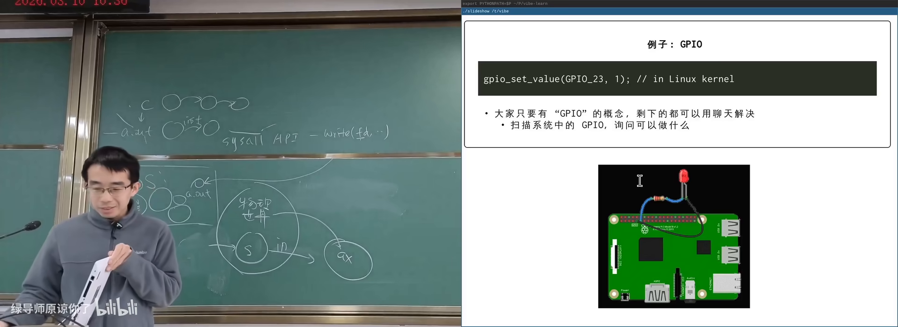

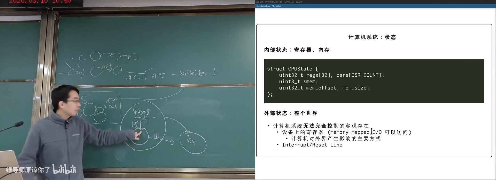

### 中断：死循环为何不会毁掉系统

**中断（外部设备通过专门线路通知 CPU「有事发生」的机制）**：时钟、键盘、网卡都可以拉中断线。信号到来时，CPU 会**强行跳转**到中断处理程序，无论当前在执行什么（除非中断被屏蔽）。

应用程序**不能**关中断——试用内联汇编关中断会得到段错误。只有操作系统代码有权限关中断；若 OS 在关中断时出 bug 死循环，系统才会真正死机。中断机制赋予了操作系统「霸主地位」。

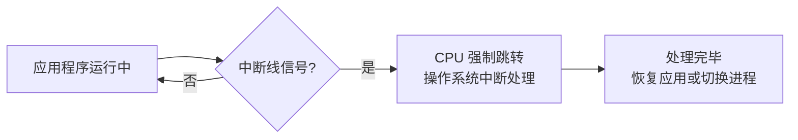

---

## 4. CPU Reset、固件与启动

- 理解 PC、内存、指令执行
- 知道「开机」会让系统从某个地方开始跑
- 本章历史细节零基础可跟

*(参考时间: 00:33)*

Reset 后许多寄存器未定义（省电路），通常中断处于关闭状态；PC 会被规定成确定值。内存条是**易失性存储（掉电即丢数据）**，冷启动时内存里不能指望有合法指令。

### 固件

答案是主板厂商把一段 **ROM/闪存** 内存映射到 reset 后 PC 所指的地址空间。这段代码出生就拥有完整机器控制权，称为 **固件（厂商固定在硬件中、复位后最先执行的代码）**，旧称 BIOS，现代多为 UEFI。

固件职责：

1. 扫描、初始化、配置硬件（时钟、CPU 核、风扇等）；
2. 可弹出启动菜单（双系统选择）；
3. 把磁盘/网络上的操作系统加载到内存；
4. 释放自己占用的资源，跳转到 OS 入口。

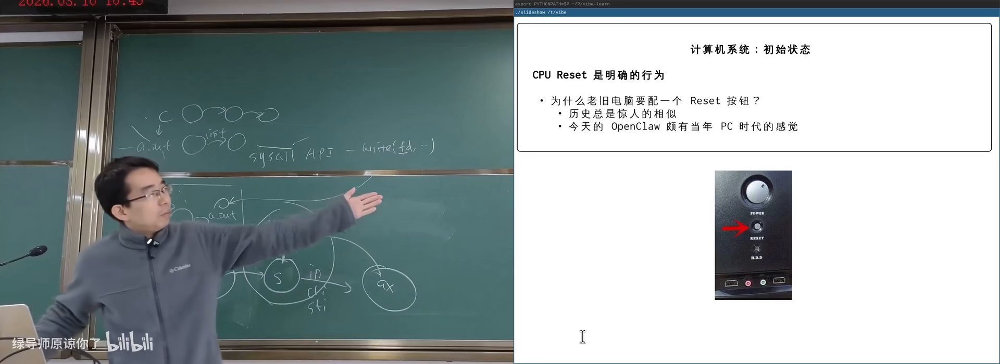

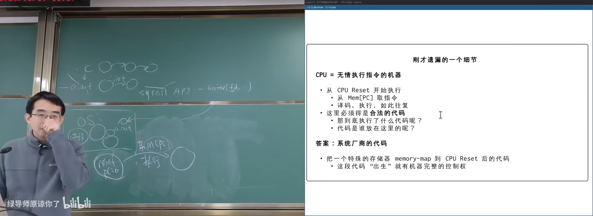

早期 DOS 时代固件常驻内存，应用通过 `int 0x10` 等中断向量调用固件服务（画点、读盘）。现代 OS 自己驱动设备；固件还要处理指纹锁、USB 扩展坞、网络启动等复杂硬件。

固件曾是纯 ROM，后来变为可编程 ROM：厂商发软盘/补丁更新。写保护平时打开；更新时需向总线写入特定序列解锁——更新失败机器会「变砖」。

UEFI（统一可扩展固件接口）本身像一个编程框架：FAT 分区里可放驱动与引导加载器。

---

## 5. 多处理器与操作系统的角色

- 理解单处理器状态机模型
- 听过多核 CPU
- 并发细节本章只建概念

*(参考时间: 00:45)*

### 多处理器模型

概念上很简单：

- 每个 CPU 有**自己独立的寄存器**；
- 它们**共享内存**（shared memory；大核小核访存延迟可能不同 → NUMA）。

状态迁移变成：任选一个 CPU 执行一条指令；任一 CPU 都可能响应中断。因此多处理器上的程序运行多次结果可能不同——强大也带来了理解上的困难。

### 操作系统启动后是什么

硬件视角下 OS 只是普通程序：初始化日志、Windows 的转圈圈结束后，操作系统变成：

- **中断处理程序**；
- **系统调用服务程序**。

它常驻内存，但一般**不在 CPU 上执行**——只有中断到来或程序发起系统调用时，OS 代码才运行。它是服务提供者，并创建出应用世界。

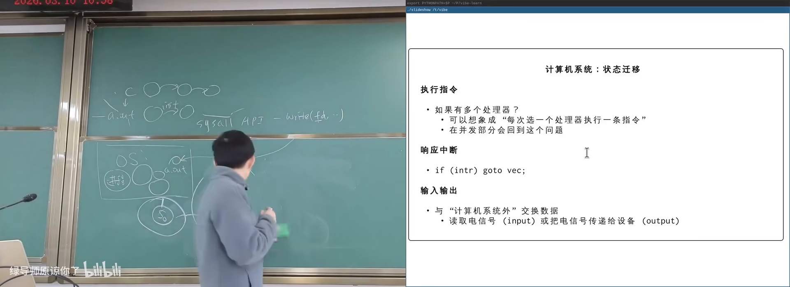

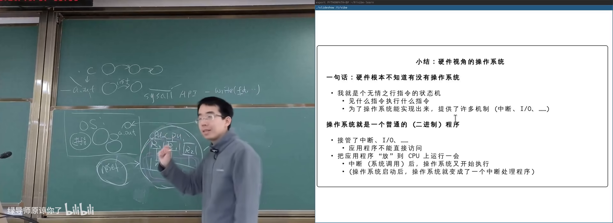

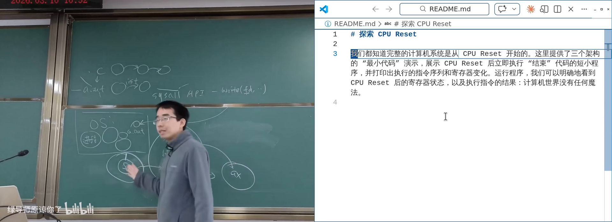

### 用 AI 验证硬件概念

主讲人让 coding agent 编写 RISC-V/ARM 的最小启动代码：在模拟器中观察 reset 后寄存器现场，执行 `ecall`/`svc`。概念（reset、ISA、抽象层）比死记手册细节更重要；细节可以随时问 AI，甚至把手册丢进上下文。

改变世界的 prompt 依然有效：相信任务能完成，并能说清楚要什么。

---

## 附录：概念补给

- 读过正文各章即可；每条独立成卡
- 本章零基础可跟

### 抽象层

- **是什么**：隔开上下两层复杂性的中间接口。
- **课上为何出现**：系统调用、指令集都是抽象；硬件不知道 OS。
- **和什么像**：你按电梯按钮，不必知道曳引机怎么工作。

### GPIO

- **是什么**：可用程序控制电平高低的通用引脚。
- **课上为何出现**：说明计算机通过「线」与物理世界相连。
- **和什么像**：可编程的电源开关排插。

### 中断（Interrupt）

- **是什么**：外部或内部事件通知 CPU 暂停当前工作并处理该事件。
- **课上为何出现**：死循环不卡死整机；OS 的霸主地位。
- **常见误解**：应用程序不能随便关中断，否则可能段错误。

### CPU Reset

- **是什么**：硬件复位信号，使 CPU 进入手册规定的初始状态。
- **课上为何出现**：完整计算机系统的起点。
- **和什么像**：游戏机电源键重开，存档点回到关卡起点。

### 固件（Firmware）/ BIOS / UEFI

- **是什么**：固化在硬件中、reset 后最先执行的代码。
- **课上为何出现**：初始化硬件并加载操作系统。
- **常见误解**：BIOS 是历史名称；现代多用 UEFI，二者常被混称。

### 易失性存储（Volatile Memory）

- **是什么**：掉电后数据丢失的存储器（如 DRAM 内存条）。
- **课上为何出现**：解释 reset 后内存里为何不能直接有合法代码。
- **和什么像**：黑板上的字，断电（擦黑板）就没了。

### 指令集体系结构（ISA）

- **是什么**：硬件对外提供的指令集合与行为规范。
- **课上为何出现**：硬件视角的抽象层；模拟器按 spec 实现。
- **和什么像**：电器说明书上的操作菜单。

### 内存映射（Memory-Mapped）

- **是什么**：把设备/ROM 等映射到地址空间，用访存指令即可访问。
- **课上为何出现**：固件如何出现在 reset 后的 PC 地址上。
- **和什么像**：把校外实验室登记成校内房间号。

### 段错误（Segmentation Fault）

- **是什么**：访问非法地址时进程被强制终止。
- **课上为何出现**：用户态关中断等非法操作的可能后果。

### NUMA / 共享内存多核

- **是什么**：多核共享内存，但不同核访问不同内存区域延迟不同。
- **课上为何出现**：现代手机/电脑都是多处理器系统。
- **常见误解**：「共享内存」不等于所有访存速度相同。

### 内联汇编（Inline Assembly）

- **是什么**：在 C 代码中嵌入汇编指令片段的机制。
- **课上为何出现**：演示关中断等底层操作；AI 也能写好。
- **和什么像**：在中文作文里夹一段机器码。

### 改变世界的 prompt

- **是什么**：「如果你是这个领域的专家，你会怎么做？」
- **课上为何出现**：AI 时代通用的学习与执行策略。
- **和什么像**：先问老师傅的套路，再自己动手。

*书架 Shelf 流水线生成 · 内容衍生自 B 站公开课程视频 BV18fcozAEsy*
