# LLM、Agents 与 Scaling Law

> **原视频**：[Bilibili · BV1gEcmzzE4P](https://www.bilibili.com/video/BV1gEcmzzE4P/)
> **课程**：NJU《操作系统原理》2026 第 4 讲（Hacking Day）
> **整理说明**：本书由视频语音转录后经 AI 重构而成，口语已转写为书面语；关键时间点均标注 *(参考时间)*，截图卡片可跳转视频对应位置。

---

## 1. 为什么是「大」语言模型

- 用过或听说过 ChatGPT 一类工具
- 知道「神经网络」这个词即可
- 量子/物理史细节零基础可跟

*(参考时间: 00:00)*

本讲是 Hacking Day：不讲考试内容，讲 **Scaling Law（模型能力随算力/参数/数据规模扩大而系统性提升的经验规律）**、对 Agentic AI 的理解，以及现场演示让 AI 写最小操作系统。

### 为什么必须「大」

薛定谔在小册子开篇问：「我们为什么这么大？」经典原子理论下单个原子携带的信息很少，几个原子不可能支撑生命这样复杂的行为。**大是应对世界复杂性的必要条件**——同理，大语言模型的「大」是能力的前提。

### 为什么是「语言」

深度学习的爆炸案例先是图像（AlexNet）和围棋（AlphaGo，2016）。但质变发生在语言上，因为：

**语言（人类沉淀数千年的、可在人与人之间对齐的世界模型）**：一句话「路上看到一个美女」背后是说话人几十年的观察与文化共识。语言抽象掉了大量细节，但保留了可传承、可对齐的结构。

人类共享相似的物理世界与教育体系，因此语言能对齐；语言模型无法直接和外星人对齐——除非对方也有可对齐的抽象。

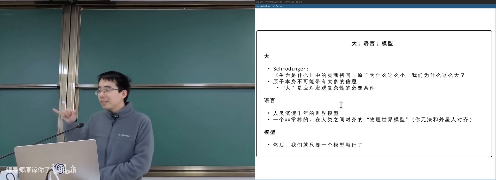

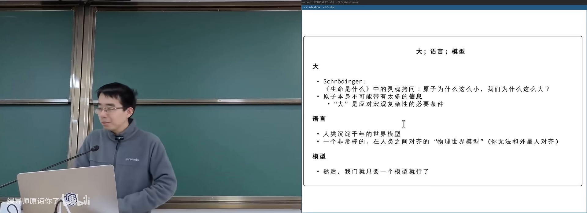

---

## 2. 大语言模型如何工作

- 知道模型会「接着说」下一段文字
- 听说过训练/推理
- 注意力机制细节零基础可跟

*(参考时间: 00:08)*

GPT = Generative Pre-trained：先用海量文本**预训练（学会说人话）**，再**后训练（调成助手）**。

工作机制：

1. 维护一个 **上下文（context，模型当前能看到的全部文本）**；
2. **Next token prediction（根据已有文本给出下一个词的概率分布，再选一个）**；
3. 图像等模态也可对齐成 token 向量（如 16×16 图块变成向量）。

### 从竞赛到「会写代码」

*(参考时间: 00:10)*

AlphaCode（2022，ChatGPT 之前）已能在竞赛网站拿到 2000+ 分。人类竞赛选手的「预训练」是：想清伪代码后，把代码近乎顺序地写在纸上，一次通过。

机器也是：在「脑内」（上下文/参数）形成 idea，再像翻译一样展开成代码。足够大的模型 + 足够多语料，理论上能做到这一点。

### 给 AI 草稿纸

若把所有想法只放在脑子里，人是**有限状态机（状态种类有限的自动机）**；有了纸笔（外部工作记忆）就是**图灵机（可无限扩展工作记忆的计算模型）**。

同理，让模型在文本里展开步骤：

- `123+456` 可写成 `100+400 + 20+50 + 3+6` 再逐步合并——降低注意力负担；
- 这就是 **thinking model（先输出思考过程再给出答案的模型）**；
- GPT-4 时代一句 `think step by step` 就能明显提升复杂任务表现。

### 工具与感知

- 眼睛/耳朵：多模态对齐到同一 token 空间（GPT-4o）；
- 计算器：模型输出特殊 token 触发外部计算再写回结果；
- ReAct / Toolformer：学会「查工具再回答」。

今天模型能推理、会犯错、能纠正，越来越像人。

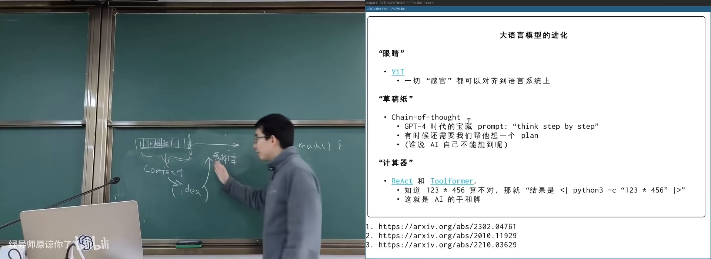

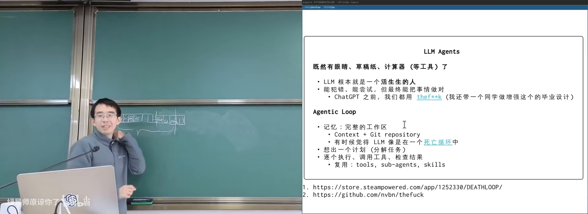

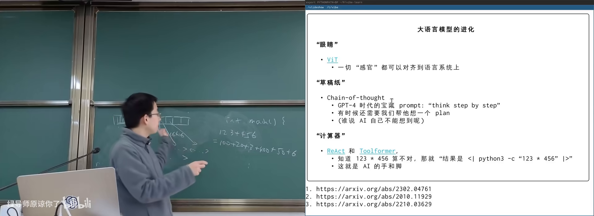

---

## 3. Agentic AI：工作区与死亡循环

- 知道 Git 可以管理文件历史（概念即可）
- 用过 coding agent 更好
- 本章零基础可跟

*(参考时间: 00:29)*

如何用好一个「智力极高、但每次醒来失忆」的概率分布模型？

### 工作区就是 working memory

计算机世界里的工作记忆：**工作区（workspace，一个组织良好的目录）**，里面有：

- README / 设计意图；
- docs；
- 源代码与测试；
- plan 等进度文件。

软件工程多年的 best practice，恰好给 AI 搭好了舞台。

### Git：平行宇宙

**版本控制系统 Git（管理目录快照、允许随时回退/分支的工具）** 给了 AI（和人）平行世界：改坏了可以回到旧快照，可以 cherry-pick，可以开分支试验。

主讲人甚至认为 Git 是给 AI 量身定制的：无记忆的 agent 在死亡循环里每次重新探索，但只要工作区与版本历史还在，就能持续推进。

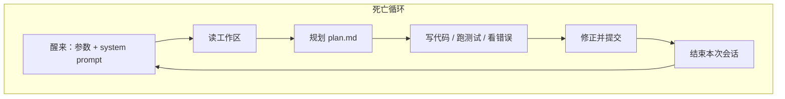

### 规划与执行

Agent 收到任务后：粗粒度 plan → 写入 `plan.md` → 勾选完成项 → 继续下一步。开源社区的 milestone 文化同理。

执行阶段与人一样：写代码、写测试、跑 lint、调试。这些工具调用在理论上与计算器等价——模型输出 token，环境执行并回传结果。

### 可推广到非程序员

学习数学也可以：每个 lecture 一个目录，错题本、作业勾选、期末前让 AI 出模拟题。接上 Telegram bot 或 cron 定时任务，还能自动抓天气、发挑战题。火爆的「小龙虾」类产品有其历史必然性。

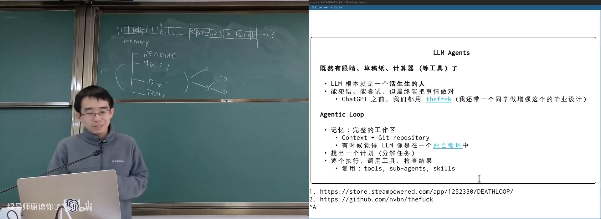

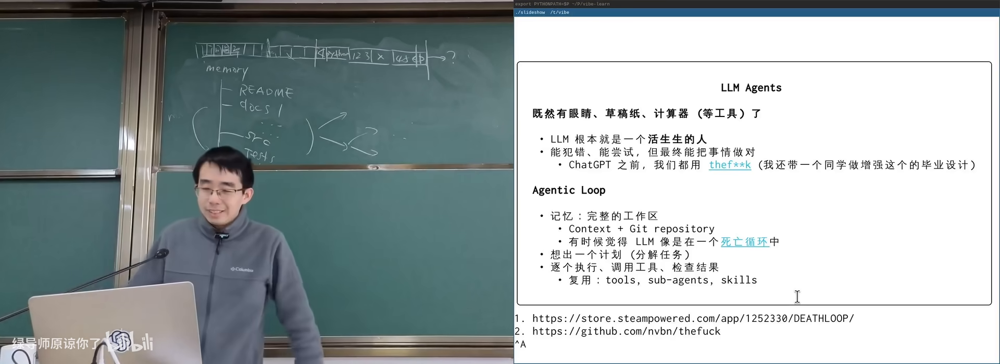

---

## 4. Scaling Law 与苦涩的教训

- 知道「算力」大致指计算能力
- 听说过国际象棋/围棋人机大战更佳
- 统计细节零基础可跟

*(参考时间: 00:38)*

### The Bitter Lesson

Richard Sutton（强化学习、图灵奖）指出：**通用方法的巨大力量**长期压过人类手工设计的启发式。可总结为「量变引起质变」——但只有找到**能累积的那条轴**，量变才会质变；在错误轴上优化只是原地踏步（给马车加速并不能造出高铁）。

### 棋类：智能 ≈ 算力

- 国际象棋程序用 α-β 剪枝暴力搜索；
- 搜索深度每增加一层，评分稳定上升；
- Ken Thompson（UNIX 之父）等人参与后意识到：要尽快击败人类，最有效的是**造加速器**；
- 1997 年 Deep Blue 击败卡斯帕洛夫：超级计算机 + 专用下棋电路。

AlphaGo（2016）用卷积网络「像看图一样看棋盘」+ 蒙特卡洛树搜索，再次验证：所谓智能在很大程度上可以还原为算力。

### 大模型的 Scaling Law

*(参考时间: 00:48)*

Kaplan 等人的 Scaling Law 与 Chinchilla 论文表明：在对数坐标下，算力↑ → 可喂更多数据、更大模型 → training loss↓（预测更好，可近似理解为「更聪明」）。

OpenAI 训练 GPT-3（175B）时并不确定能否成功，只是相信小规模实验可以外推。人类在尝试中造出了可用的智能机器。

现存模型未必是最优架构——如同生物进化带上了大量历史包袱；未来或可由机器在设计空间中搜索更好的模型。

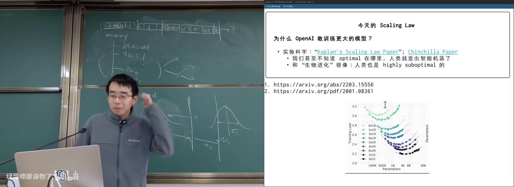

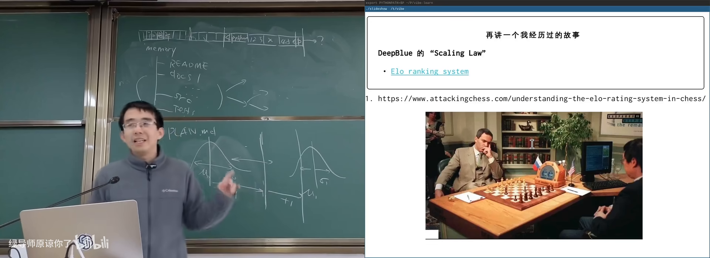

### 启发式之死与抽象

Jim Gray 曾说 *Disk is tape, Flash is disk, RAM is local*。今天更接近：**启发式已死，智能便宜**。

你需要的是：

1. **分解问题**：用独特视角切开疯狂想法；
2. **构建合适抽象**：系统调用之上的应用生态、指令集之上的计算机世界；
3. **可扩展机制**：能吸引人（和 AI）往上插东西的底座。

主讲人展示自己的上课系统：子系统之间不用函数调用紧耦合，而用**文件系统 + 日志协议**解耦，前端、播放器、导出工具可并行开发，AI 可分别实现。

---

## 5. 现场：让 AI 写最小操作系统

- 知道操作系统可以「从零实现」
- 对 RISC-V 无先验要求
- 翻车过程本身就是内容

*(参考时间: 01:09)*

演示目标：完全假装自己不懂 OS，把任务丢给 AI。

1. 先用 GPT 生成任务分解：启动运行时 → 创建内核线程 → 上下文切换 → 展示调度；
2. 工作风格约束：`keep the design tiny and explicit`，每步解释与测试；
3. 再让国产模型（豆包）执行写文件、Makefile、启动代码。

结果可能翻车，也可能一次做对。关键是观察：

- AI 如何分解；
- 犯错后如何根据 error message 修复；
- 人应如何判断设计是否合理。

这门课真正想传达的是：**会编程，你会拥有全世界**——包括指挥 AI 构建以前不敢想的系统。

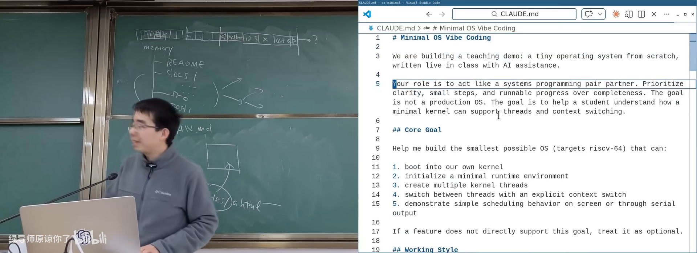

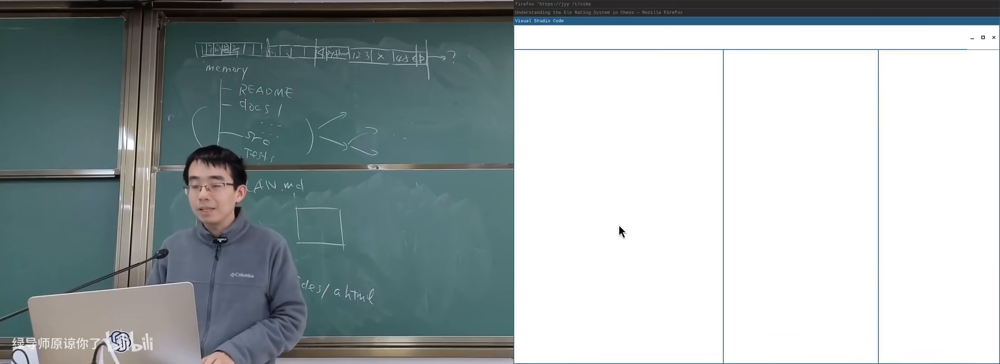

---

## 附录：概念补给

- 读过正文各章即可；每条独立成卡
- 本章零基础可跟

### Scaling Law

- **是什么**：模型性能随算力/参数/数据规模扩大而可预测改善的经验规律。
- **课上为何出现**：解释大模型能力来源；与棋类「智能≈算力」同构。
- **和什么像**：引擎排量与马力的大致关系曲线。

### The Bitter Lesson（苦涩的教训）

- **是什么**：依赖算力的通用方法长期胜过人类手工启发式。
- **课上为何出现**：指导今天应投资可扩展机制而非雕花技巧。
- **常见误解**：不是「细节不重要」，而是「要选对能累积的轴」。

### Next Token Prediction

- **是什么**：根据上下文预测下一个词（token）的概率分布。
- **课上为何出现**：LLM 的基本工作机制。
- **和什么像**：输入法联想下一个字，只是强大无数倍。

### 上下文（Context）

- **是什么**：模型当前能「看到」的全部输入文本。
- **课上为何出现**：溢出问题、注意力工程的基础。
- **常见误解**：上下文不是模型的永久记忆，会话结束即丢。

### Self-Attention（自注意力）

- **是什么**：模型根据相关性分配「关注权重」的机制。
- **课上为何出现**：提示词工程实质是 attention engineering。
- **和什么像**：长文中自动盯住关键词。

### Thinking Model / 思维链

- **是什么**：先输出推理步骤再给最终答案的模型/技巧。
- **课上为何出现**：给 AI「草稿纸」，降低一步到位的难度。
- **常见误解**：思考过程未必是人类意义上的意识活动。

### Token

- **是什么**：模型处理文本的最小单位（词/子词/符号）。
- **课上为何出现**：图像也可切成 token 对齐进语言模型。
- **和什么像**：积木块，句子由积木拼成。

### Agentic AI / Coding Agent

- **是什么**：能规划、调用工具、与文件系统等环境交互的 AI。
- **课上为何出现**：OS 课所处时代；工作区+Git 是其舞台。
- **和什么像**：失忆但能干的实习生，靠工位便签续命。

### 工作区（Workspace）

- **是什么**：组织良好的项目目录，充当 AI/人的外部记忆。
- **课上为何出现**：Agent 完成长程任务的必要条件。
- **和什么像**：实验室工位：样品、笔记、仪器都在固定位置。

### Git 快照 / 平行宇宙

- **是什么**：Git 保存目录历史状态，可回退、分支、挑选提交。
- **课上为何出现**：Agent 犯错后可恢复；支撑试错文化。
- **常见误解**：Git 主要不是「从网上下载代码的工具」。

### 有限状态机 vs 图灵机

- **是什么**：前者状态有限；后者带无限长纸带，可做更复杂计算。
- **课上为何出现**：说明为什么要用外部草稿纸/工作区。
- **和什么像**：心算 vs 列竖式打草稿。

### 提示词注入（Prompt Injection）

- **是什么**：在模型可见输入中插入指令，诱导其执行非预期行为。
- **课上为何出现**：Agent 时代类似病毒/固件攻击的安全议题。
- **和什么像**：在传单里夹一张「请打开金库」的假命令。

*书架 Shelf 流水线生成 · 内容衍生自 B 站公开课程视频 BV1gEcmzzE4P*
