# 访问操作系统对象：文件描述符

> **原视频**：[Bilibili · BV1QFQmB7EQD](https://www.bilibili.com/video/BV1QFQmB7EQD/)
> **课程**：NJU《操作系统原理》2026 第 7 讲
> **整理说明**：本书由视频语音转录后经 AI 重构而成，口语已转写为书面语；关键时间点均标注 *(参考时间)*，截图卡片可跳转视频对应位置。

---

## 1. 从实验与对象说起

<div class="prereq" data-label="你需要先知道">

- 知道实验代码在 Git 仓库里，会更新
- 听说过 fork / 进程（前几讲内容）
- 文件与目录概念零基础可跟

</div>

*(参考时间: 00:00)*

课程实验已发布；代码可用 AI 辅助获取与阅读。若老师说「某日更新了 main 分支」，即使你不熟 Git，也可以让 agent：查看提交历史 → `git fetch` → 合并远程更新。短时间内就能学会 `git log`、`reset`、`fetch`、`merge` 等命令的概念。

上讲已覆盖：`fork` / `execve` / `exit` 管理进程状态；`mmap` / `munmap` / `mprotect` 管理地址空间。进程之间若要交换数据（例如 128 个进程各算一个数再求和），光靠复制进程状态不够——需要操作系统里**共享的对象**。

本讲主题：**操作系统中的对象，以及管理它们的 API**。

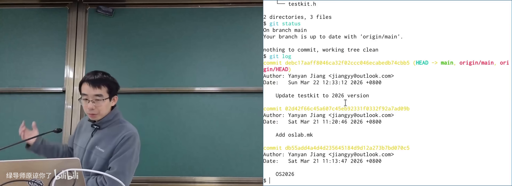

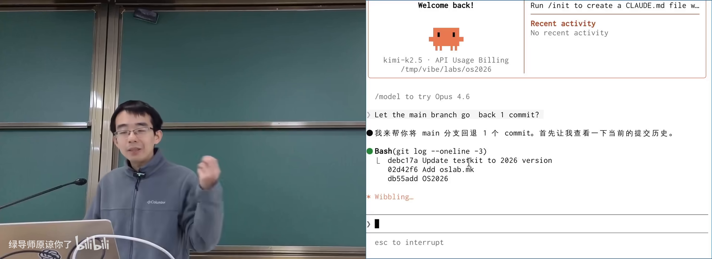

---

## 2. UNIX 与 Windows：两种 API 哲学

<div class="prereq" data-label="你需要先知道">

- 知道操作系统「提供接口给开发者」
- 用过文件与目录
- 两套系统设计差异零基础可跟

</div>

*(参考时间: 00:10)*

应用开发者想做的事很具体：读 `/proc/1234/maps`、改另一个进程的内存、发网络请求。操作系统设计者则提供**通用机制**：简单、稳定、可支撑整个生态的 API。

### 两种路线

| | UNIX / Linux | Windows |
|--|--------------|---------|
| 理念 | 把对象暴露成文件，用小工具组合 | 开发者要什么就提供什么 API |
| 查进程内存 | 读 `/proc/<pid>/maps`（文本） | `OpenProcess` + `ReadProcessMemory` / `VirtualQueryEx` |
| 性能 | 文本序列化/解析有开销 | 直接传参进内核，更高效 |
| 用户假设 | hacker / power user | 软件开发者 |

UNIX 选择 **everything is a file（一切皆文件）**：进程信息、设备、管道都伪装成文件，复用 `open`/`read`/`write`/`readdir`。

Windows 更像软件工程产品：功能对应明确 API，句柄（handle）里还带权限信息。

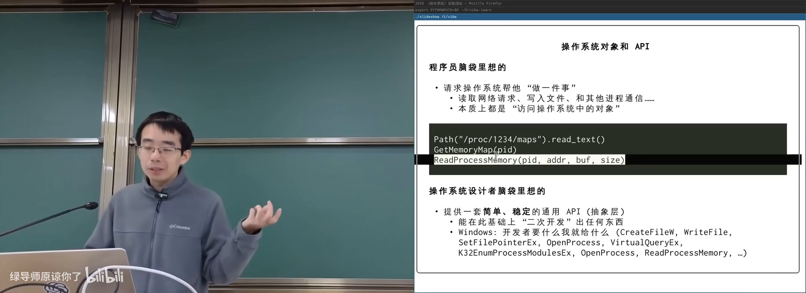

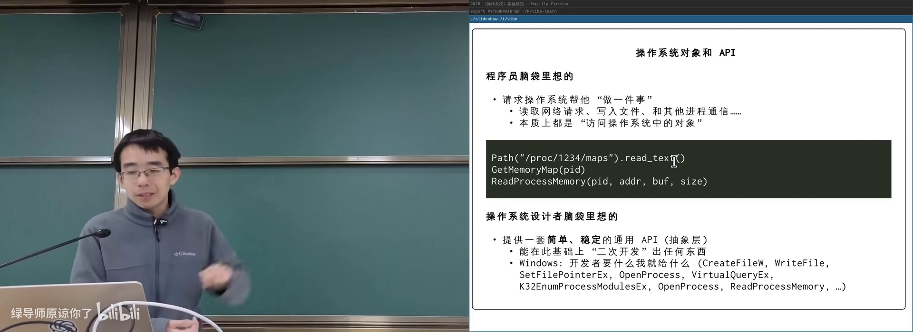

---

## 3. 一切皆文件：文件作为抽象

<div class="prereq" data-label="你需要先知道">

- 知道文件是「有名字的数据」
- 用过 `open`/`fopen` 或等价工具
- 字节序列概念本章会展开

</div>

*(参考时间: 00:17)*

**文件（有名字的数据对象）** 的经典模型是**字节序列（一串可按顺序读写的字节）**。它足够朴实，几乎能表示一切：

- 键盘输入流；
- 图片、JSON、数据结构数组；
- 网页 HTML（含头部 + 空行 + 正文）；
- 打印机、终端、显卡；
- 锁、管道。

只要都是文件，就能用同一套工具（`cat`、`wc`、`grep`…）处理。UNIX 的设计准则是：把操作系统对象暴露出来，再给一组可组合的工具。

### 文件系统可构建信息系统

课程提交系统将每个学生的作业存成目录里的文件；评测器扫描目录生成 result 文件。批量 rejudge 只需 `find` + 删除 result，不必在数据库产品里实现专用后台。

代价是**一致性较弱**（写多个文件时崩溃可能留下中间状态）；换来的是极强的可组合性，AI agent 也能直接改目录。


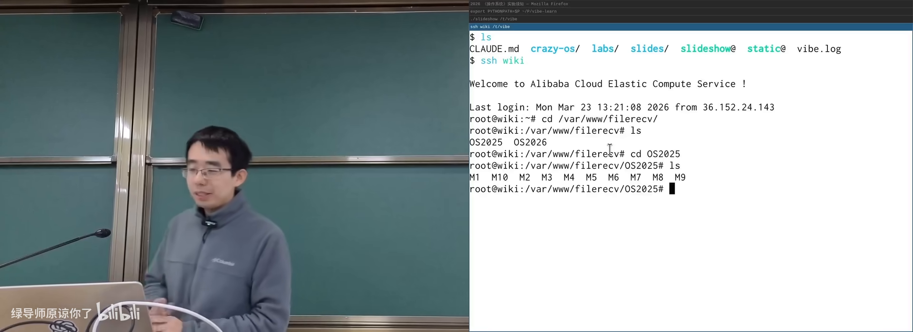

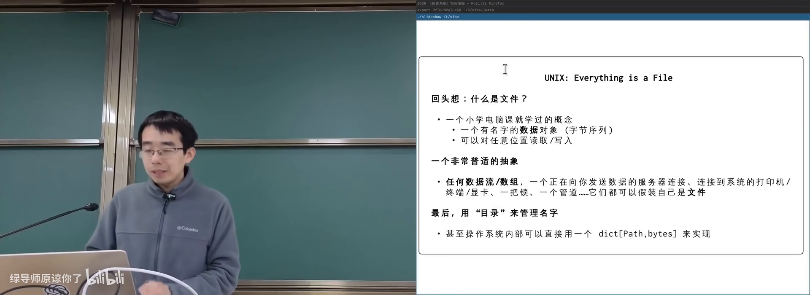

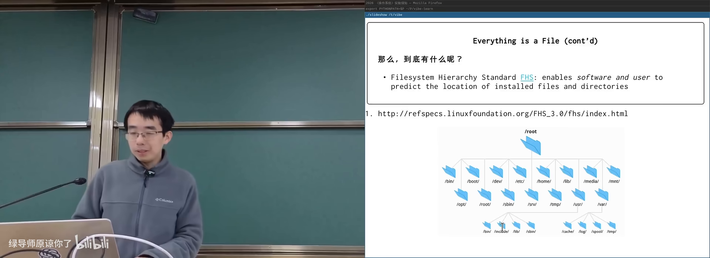

### UNIX 哲学要点

- 每个工具只做一件事并做好；
- 工具可组合；
- **文本流作为通用接口**（人可读、机器可读）。

1970 年代用性能换可组合性是勇敢的取舍；今天文本接口对大模型格外友好。命令行是自然语言与编程语言之间的平衡点——quick and dirty，但高效。

文本接口的代价：空格分隔会把带空格的文件名拆成两个参数；`make` 至今对空格支持不佳。

---

## 4. 打开的文件与文件描述符

<div class="prereq" data-label="你需要先知道">

- 理解「进程有内存和寄存器」
- 听说过指针
- 系统调用概念来自前几讲

</div>

*(参考时间: 00:42)*

在教学用 CrazyOS 里，`putchar` 的实现往往就是往进程的一个 buffer 写字符——这其实就是「打开的文件」。

操作系统内部的典型结构：

- 进程持有若干**打开的文件对象**：指针指向 OS 里的文件/设备 + 当前读写位置 offset；
- 文件系统里则是「路径 → 字节序列」的映射。

### 文件描述符

应用程序的地址空间里只有普通内存；OS 内核里的「打开的文件表」不能用指针直接访问。UNIX 的办法：

**文件描述符（file descriptor，进程用来引用操作系统对象的小整数，从 0 开始编号）**

- `0, 1, 2` 惯例为标准输入、标准输出、标准错误；
- `open` 从最小的未用编号开始分配（常为 3）；
- `read`/`write`/`lseek`/`close`/`dup` 都以该整数为句柄。

因为 everything is a file，它实际上是 **everything descriptor（一切对象描述符）**。

Windows 中类似概念叫 **handle（句柄/把柄，抓住它就能操作那个对象）**。任务管理器里的「句柄」即此；中文译名来自早期编译教材的误译并沿用至今。


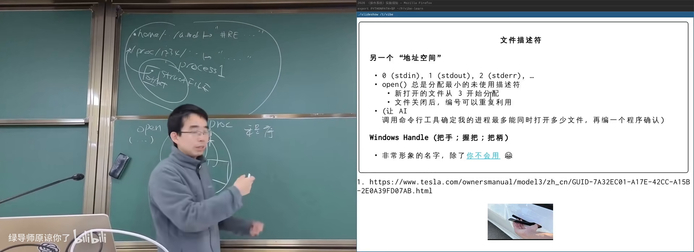

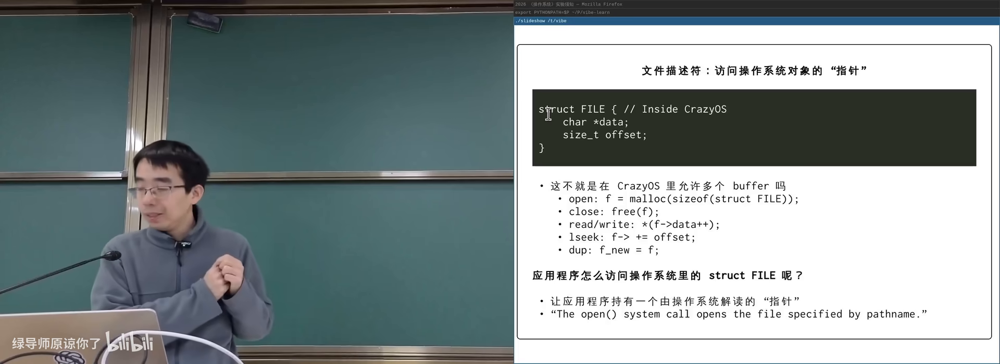

### lseek 与 dup

- `lseek`：重定位读写 offset（从头/当前位置/末尾）；
- `dup`：再创建一个描述符指向**同一个**打开文件对象。

打开失败时返回负数，可用 `perror` 按系统语言打印原因（如 `No such file or directory`）。

---

## 5. fork 与文件 offset 的共享语义

<div class="prereq" data-label="你需要先知道">

- 知道 `fork` 会复制进程
- 理解文件描述符是指向打开文件的编号
- 本章会用「写日志」例子展开

</div>

*(参考时间: 00:59)*

假设 `log.txt` 被进程打开为 fd=3，写 `1` 后 offset 后移。此时 `fork`：

- 方案 A：父子各有一份独立的打开文件结构与 offset → 可能都写在位置 0，互相覆盖；
- 方案 B：父子共享同一打开文件对象与 offset → 依次写 `1`、`2`，日志追加不丢。

**UNIX 选择方案 B（浅拷贝）**：希望父子共享文件追加时不覆盖。若需要独立 offset，应再次 `open`。

Windows handle **默认不继承**，符合最小权限；UNIX 默认继承，后来才补充 `O_CLOEXEC`（执行 `execve` 时关闭描述符），避免子进程意外获得敏感文件访问权。

这说明：`fork` 看起来只是「复制」，实际上要与几乎每一种操作系统对象约定复制语义；设计系统时处处要考虑交互。有论文（*A Fork in the Road*）甚至主张不要继续以 fork 为中心教学。

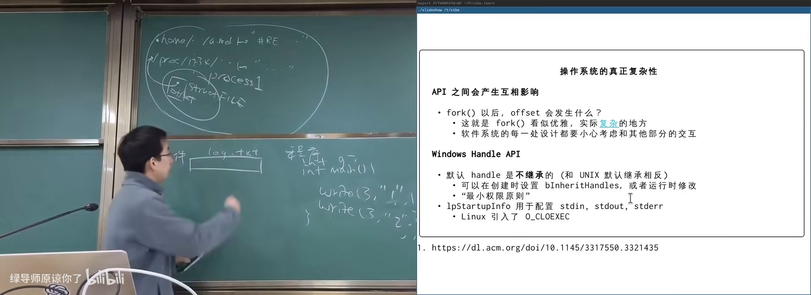

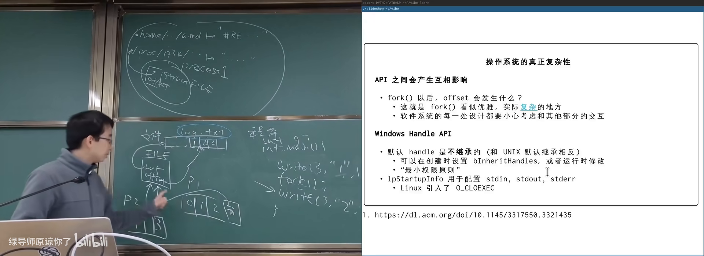

---

## 6. 在文件系统里看见一切

<div class="prereq" data-label="你需要先知道">

- 知道 `/proc` 可能存在
- 用过 `ls`、管道或愿意让 AI 写命令
- 本章零基础可跟

</div>

*(参考时间: 01:07)*

因为一切皆文件，可以枚举：

```bash
ls -l /proc/*/fd/*
```

每个进程打开的文件描述符都出现在 `/proc/<pid>/fd/` 下，符号链接指向真实对象：终端 `/dev/pts/N`、管道 `pipe:[inode]`、普通文件路径等。

主讲人将清洗后的列表管道给 coding agent 解释，或直接演示：向某人的伪终端设备 `write`，对方屏幕上就会出现字符——权限允许时，终端也只是文件。

### 启发

- 计算机世界没有魔法，都有干净解释；
- 想知道系统在干什么，文件系统往往是入口；
- 文本 + 管道 + AI，极大降低观察内核状态的成本。

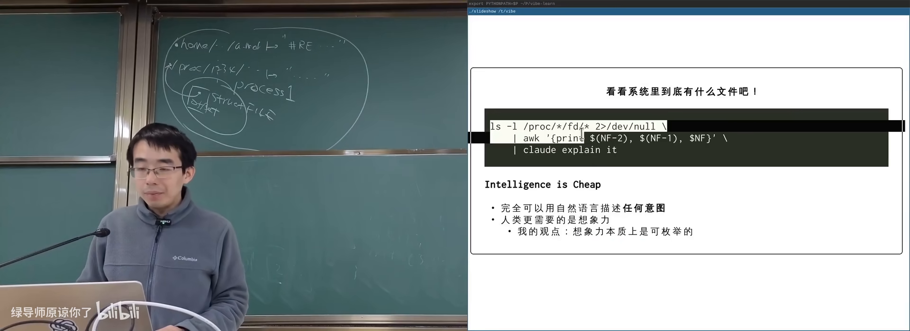

---

## 附录：概念补给

<div class="prereq" data-label="你需要先知道">

- 读过正文各章即可；每条独立成卡
- 本章零基础可跟

</div>

### 文件描述符（fd）

- **是什么**：进程引用 OS 对象的小整数，从 0 起编号。
- **课上为何出现**：用户态无法拿内核指针，需要间接编号。
- **常见误解**：它不只是「磁盘文件编号」，终端、管道也是 fd。

### 句柄（Handle）

- **是什么**：Windows 中指向系统对象的引用，常含权限信息。
- **课上为何出现**：与 UNIX fd 对比；任务管理器中的「句柄」。
- **和什么像**：门把手/把柄——抓住它才能开关这扇门。

### 一切皆文件（Everything is a File）

- **是什么**：把 OS 对象统一成可读写的字节序列接口。
- **课上为何出现**：UNIX API 哲学；一套工具处理一切。
- **常见误解**：不是所有对象都存在磁盘上，设备/proc 是虚拟文件。

### 字节序列

- **是什么**：按顺序排列的字节，文件的经典抽象。
- **课上为何出现**：几乎能表示流、数组、网页、设备数据。
- **和什么像**：无限长的纸带，上面写满字节。

### offset（文件读写位置）

- **是什么**：打开文件对象中「当前读到/写到哪」的指针。
- **课上为何出现**：`read`/`write`/`lseek` 的核心状态。
- **常见误解**：offset 属于「打开的文件对象」，不是磁盘上的文件本身。

### open / read / write / lseek / close

- **是什么**：访问文件对象的基本系统调用族。
- **课上为何出现**：UNIX 提供的最小通用 API。
- **和什么像**：开门 → 读写 → 关门；lseek 是翻页。

### dup（描述符复制）

- **是什么**：创建新的文件描述符，指向同一打开文件对象。
- **课上为何出现**：管道、重定向、继承场景的基础。
- **常见误解**：dup 通常共享 offset，不是复制文件内容。

### 浅拷贝 vs 深拷贝

- **是什么**：浅拷贝共享子对象；深拷贝整棵结构复制。
- **课上为何出现**：fork 后文件 offset 是共享还是独立的设计选择。
- **和什么像**：复印通讯录条目 vs 把整本通讯录重抄一份。

### O_CLOEXEC

- **是什么**：标志位，使文件描述符在 execve 时自动关闭。
- **课上为何出现**：修补 UNIX 默认继承带来的敏感 fd 泄露。
- **和什么像**：搬家时自动不带上的钥匙。

### procfs

- **是什么**：以文件树暴露进程与内核信息的虚拟文件系统。
- **课上为何出现**：`/proc/<pid>/fd`、`maps`、`mem` 等观察入口。
- **常见误解**：其中多数文件不占用磁盘空间。

### UNIX 哲学 / KISS

- **是什么**：工具做一件事、可组合、文本作通用接口。
- **课上为何出现**：解释为何用目录而不是专用数据库也能搭系统。
- **常见误解**：文本接口不是「落后」，而是可组合性的代价与收益。

### perror

- **是什么**：按当前 locale 打印最近一次失败原因的库函数。
- **课上为何出现**：open 失败时解释「为什么」。
- **和什么像**：客服根据错误码念出人话说明。

*书架 Shelf 流水线生成 · 内容衍生自 B 站公开课程视频 BV1QFQmB7EQD*
