# 终端和 UNIX Shell

> **原视频**：[Bilibili · BV1nQXsBuEUz](https://www.bilibili.com/video/BV1nQXsBuEUz/)
> **课程**：NJU《操作系统原理》2026 第 8 讲
> **整理说明**：本书由视频语音转录后经 AI 重构而成，口语已转写为书面语；关键时间点均标注 *(参考时间)*，截图卡片可跳转视频对应位置。

---

## 1. 键盘与打字机的遗产

- 用过键盘和命令行窗口
- 知道 `printf` 里有 `\n` 之类转义字符
- 历史细节零基础可跟

*(参考时间: 00:00)*

今天的终端看起来现代，接口却仍是「一个字节一个字节」的字符流——这套设计可以从钢琴与打字机讲起。

### 从乐器到键盘

- 公元前水风琴已有按键；
- 1500 年前后钢琴原型：按键 → 击弦；
- 机械打字机：按键 → 锤子击打色带 → 纸上留字；松键时弹簧蓄力并把字车右移一格。

两键同时按下容易卡死，因此 1860 年代出现了 **QWERTY 键盘（通过键位排列降低打字速度以减少卡键的布局）**。

### 键位的机械含义

| 键 | 机械动作 | 延续到今天 |
|----|----------|------------|
| Shift | 整体抬起字锤一格，改打上档字符 | 大写/符号 |
| Caps Lock | 锁定上档 | 大写锁定 |
| Enter / CR | 字车推回行首 | `\r` |
| LF | 纸上移一行 | `\n` |
| Backspace | 光标左移一格 | 退格 |
| Space | 光标右移 | 空格 |
| Tab | 跳到下一个制表位 | 对齐 |

若在 `printf` 中插入 `\r`，光标回行首后再打印会**覆盖**同一行内容——打字机时代用退格 + 斜线「划掉」错字。

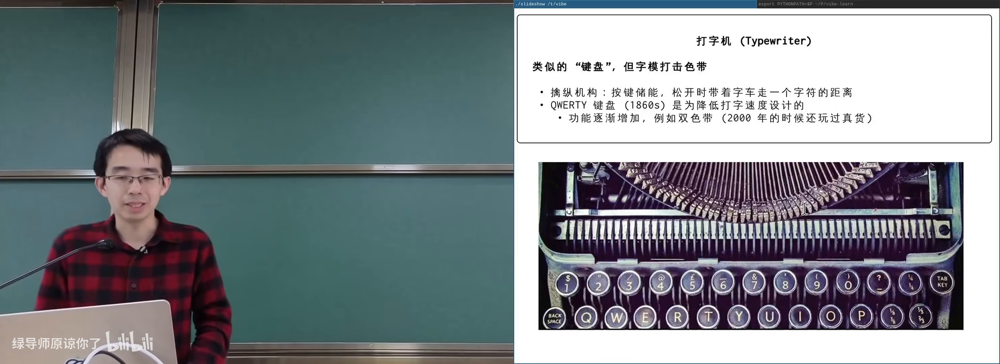

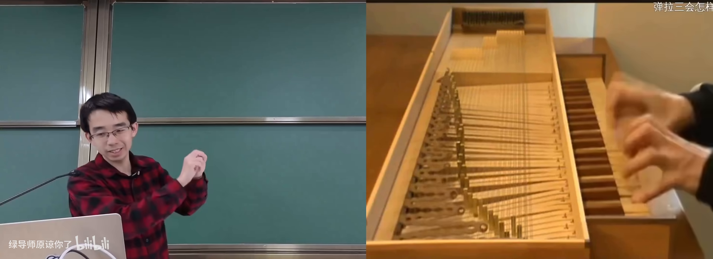

---

## 2. 电传打字机与 TTY

- 知道终端窗口可以显示文字
- 听说过 ASCII
- 编码概念本章会展开

*(参考时间: 00:10)*

**电传打字机（teletypewriter，按下的字符可在导线另一端被打印出来的设备）** 是跨时代产品：不必把纸交给邮差，只要线路和中继站可靠，字符可以跨大陆传输。

每个字符被编成二进制码（早期 5 bit）。计算机时代沿用这一接口：

- 对 OS 而言，终端接受 `putchar`：写入一个字符，它就打印一个字符；
- 写入 `\r` 回行首，`\t` 跳制表位。

**TTY** 即 teletypewriter 的缩写，今天 Linux 设备名 `/dev/tty*` 源于此。

### ASCII 与控制字符

**ASCII（美国信息交换标准代码，用数字对应字符的编码表）** 不只含字母数字，前面还有大量控制字符——它们就是给电传打字机用的：

- Ctrl+C → 编码值 3；
- Ctrl+D → 编码值 4（传统「传输结束」）；
- ESC → 0x1B；
- 回车 → `\r`（0x0D），不是 `\n`。

键盘上的 **Shift 本身不产生送往计算机的数据**，它只是终端本地的换挡状态；真正按 `A` 时才送出大写 A。

### VT100 与转义序列

1978 年 DEC **VT100** 成为事实标准：支持完整的 **转义序列（escape sequence，以 ESC 开头的字符组合，用来控制颜色、光标、滚动等）**，80×24 字符布局沿用至今。

ASCII 没有「上下左右」方向键编码，因此方向键会被编码成 ESC + 若干字符（如 `ESC [ A`）。终端模拟器（terminal emulator）软件模拟了 VT100 行为。

Unicode 加入后，终端还能用框线、色块字符拼出复杂 UI 甚至图像。

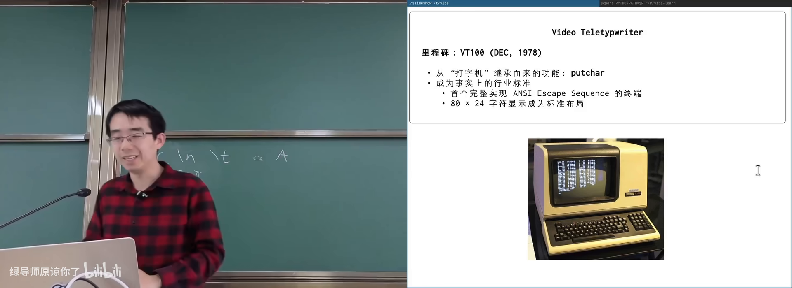

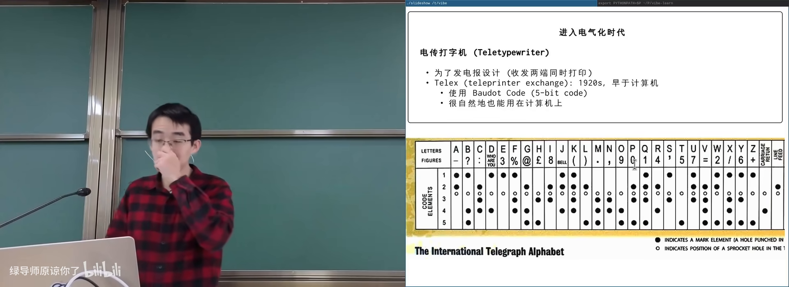

---

## 3. 终端作为输入设备：原始字节

- 知道程序可以从标准输入读数据
- 用过或见过 `cat`、`strace`
- 信号概念本章后半展开

*(参考时间: 00:21)*

终端既是输出设备（接收字符并打印），也是输入设备：按键被编码成字节送入操作系统，**是否回显、如何解释，由操作系统与应用程序共同决定**。

主讲人准备了一个「原始模式」demo：终端收到的所有按键原样打印。

观察到：

- 普通字母：ASCII 码正常；
- Shift：不产生字节；
- Ctrl+C：得到单个字节 `0x03`，**程序并没有立刻被杀**（因为关闭了默认解释）；
- Ctrl+D：`0x04`；
- 方向键：一串 ESC 序列。

若程序配置成「所有字符直通」，Ctrl+C / Ctrl+Z 都无效，只能另开终端 `kill`。

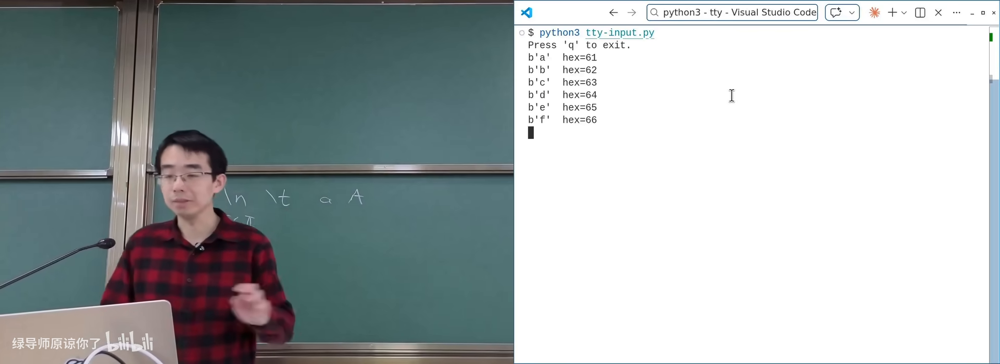

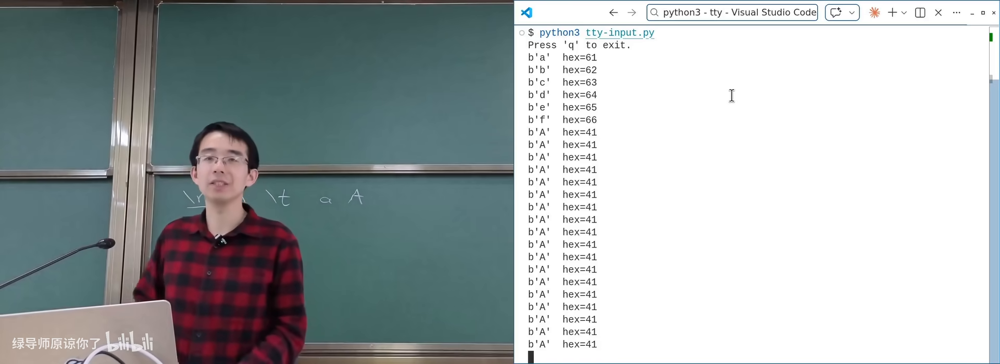

---

## 4. 伪终端与终端中的终端

- 知道「一切皆文件」
- 知道 `open` 可以打开设备文件
- fork/exec 概念有助于理解 shell

*(参考时间: 00:28)*

现代操作系统可以无限分配**伪终端（pseudo-terminal，模拟 VT100 行为的虚拟设备对）**：`/dev/pts/N`。要多少有多少，用完销毁，名字可复用。

创建方式（一切皆文件）：

1. `open("/dev/ptmx")` 请求新的 master 端；
2. `grantpt` / `unlockpt` 完成权限与从端准备；
3. 得到 master 文件描述符与从端路径（如 `/dev/pts/4`）；
4. 在从端上运行程序；master 侧可读写转发。

**tmux / 终端分屏器** 的原理就是：在当前终端里再开伪终端，把输入输出在多个 PTY 之间转发。主讲人现场 web coding 的 `mini-tty` 在 `/dev/pts/3` 里创建 `/dev/pts/4`，实现「终端中的终端」。

### ttyrec

利用 PTY 可以录制会话：劫持字符流并带时间戳保存，`ttyreplay` 可完整回放，甚至渲染成网页里的 SVG 动画。教学演示与 AI 配讲解脚本都建立在这一机制上。

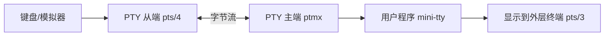

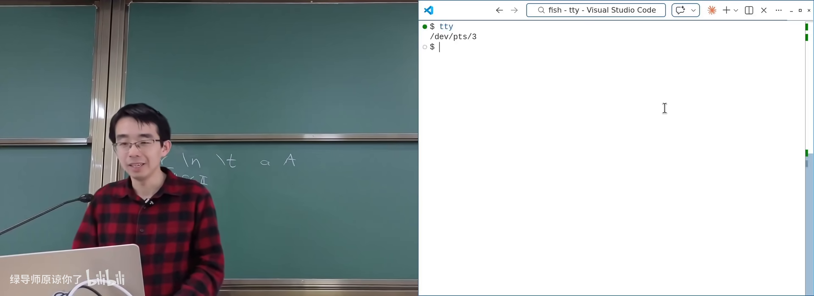

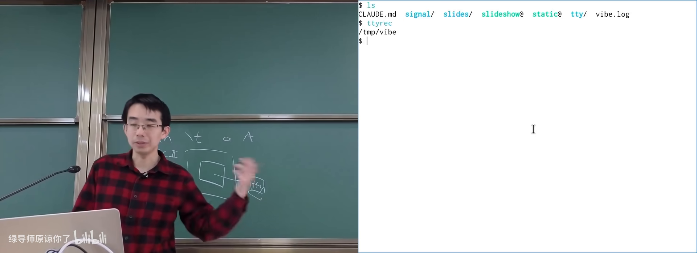

---

## 5. 规范模式与 Ctrl+C

- 知道 Ctrl+C 常用来终止程序
- 听说过信号或愿意先接受「OS 会发信号」
- 进程树概念有助于理解进程组

*(参考时间: 00:42)*

### 系统启动时如何准备终端

1. 固件 → 操作系统初始化；
2. 扫描并初始化终端设备；
3. `init` 启动 **getty（打开终端、提示登录并启动 login 的程序）**；
4. `login` 打开对应 TTY，把文件描述符 0/1/2 指向它，建立 session；
5. 远程 SSH 则由 `sshd` 分配 PTY 再启动 shell。

早期还有波特率（baud rate）等串口参数；现代模拟终端常假显示为 38400。

### 行编辑：Canonical mode

`cat` 在等待输入时：你敲 `AAAA` 可退格修改，但 `read` 尚未返回；按回车后才一次性读到一行。

这是因为默认 **规范模式（canonical mode，操作系统终端驱动提供行缓冲与行编辑的模式）**：

- 字符先进入驱动内部 buffer；
- 支持退格等行编辑；
- 可关闭回显（输入密码时）；
- 回车后才把整行交给进程。

用 `stty -a` 可以看到当前配置，例如：

- `intr = ^C`：中断键；
- `quit = ^\`：退出键；
- `eof = ^D`：文件结束。

### 信号

**信号（操作系统异步通知进程「发生了某事」的机制）** 可以在程序任意执行点强制跳转到处理函数。

- 未自定义处理时：Ctrl+C 触发默认行为 → 终止；
- `signal(SIGINT, handler)` 可打印消息、选择忽略或自行退出；
- `kill -INT <pid>` 与终端 Ctrl+C 效果相同（同一信号）。

Ctrl+C 在**规范模式**下才被驱动解释成中断；原始模式下它只是字节 `0x03`。

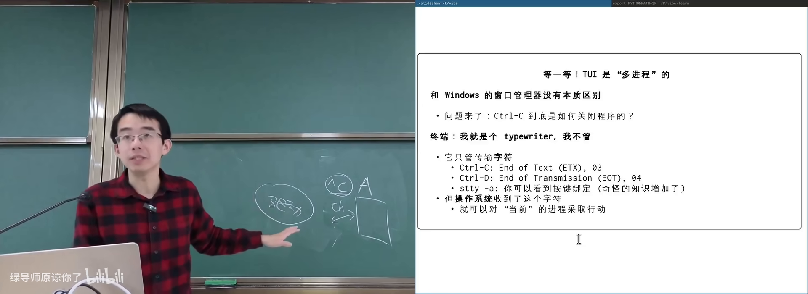

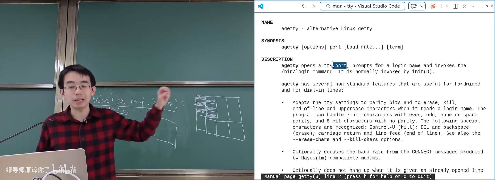

---

## 6. Session、进程组与 Job Control

- 理解 fork 会形成进程树
- 知道 shell 可以启动程序
- 本章机制较「历史包袱」，听懂概念即可

*(参考时间: 00:57)*

问题：Ctrl+C 时，进程树里哪些进程该被杀？父进程死了子进程可能被 init 收养，按父子关系杀并不准确。

UNIX 引入两级分组：

- **Session（会话，一次登录关联的进程集合，拥有 controlling terminal）**；
- **Process group（进程组，shell 启动一个命令时分配的前台/后台分组）**。

行为：

- Ctrl+C：向**前台进程组**内所有进程发送 `SIGINT`；
- 后台进程组不会收到，可继续跑；
- Session leader 退出（如 SSH 断开）→ 组内进程收到 `SIGHUP` 默认退出；
- 长任务可用 `nohup` 忽略挂断，或挂在 `tmux` 里（session 不随 SSH 结束）。

### Job Control

Shell 提供类似窗口管理器的能力：

| Shell 操作 | 类比 Windows |
|------------|--------------|
| Ctrl+Z（SIGTSTP） | 最小化 |
| `jobs` | Alt+Tab 窗口列表 |
| `fg %1` | 切换到某窗口 |
| `bg` | 后台继续运行 |
| Ctrl+C | 关闭前台程序 |

背后是 `setpgid`、`tcsetpgrp` 等系统调用，用来标记前台/后台进程组。

这一套成为 POSIX 标准，兼容性很强，但也是历史包袱：现代容器/沙箱（按用户隔离、namespace/cgroup）本可以用更干净的模型。Android 甚至按「每个 App 一个用户」做权限隔离，强停时直接杀该 UID 下全部进程。

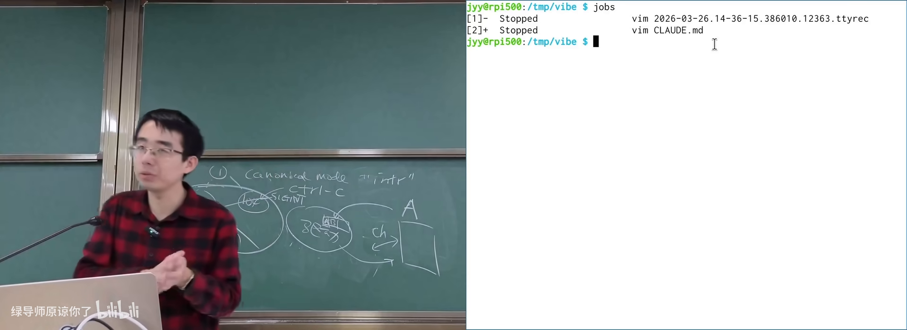

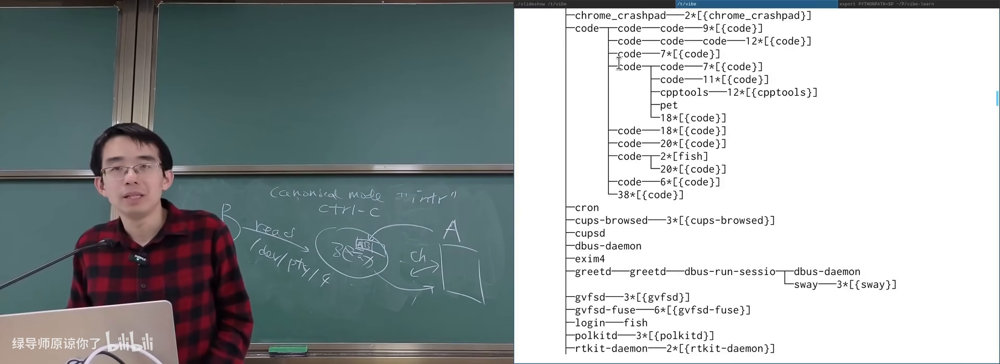

---

## 附录：概念补给

- 读过正文各章即可；每条独立成卡
- 本章零基础可跟

### TTY / 电传打字机

- **是什么**：通过线路收发字符的打字设备；今为终端子系统代称。
- **课上为何出现**：解释 `/dev/tty`、终端接口的由来。
- **和什么像**：传真机与打字机的结合体。

### 转义序列（Escape Sequence）

- **是什么**：以 ESC 开头、控制终端显示/光标等行为的字节串。
- **课上为何出现**：ASCII 无法表达颜色、方向键等功能。
- **和什么像**：文档里的「打印机控制码」。

### 规范模式（Canonical Mode）

- **是什么**：终端驱动做行缓冲与行编辑，回车后才把一行交给进程。
- **课上为何出现**：解释 `cat` 为何 read 不立刻返回。
- **常见误解**：回显和行编辑是 OS 驱动做的，不是 `cat` 自己实现的。

### 伪终端（PTY）

- **是什么**：由 master/slave 组成的虚拟终端设备对。
- **课上为何出现**：tmux、SSH、终端录制的基础。
- **和什么像**：电话总机：你这头说话，另一头假扮成一台打字机。

### 信号（Signal）

- **是什么**：OS 异步通知进程的机制，可触发自定义处理函数。
- **课上为何出现**：Ctrl+C、Ctrl+Z、SIGHUP 的底层语言。
- **和什么像**：门铃——可选择去开门、忽略或按你的规矩处理。

### SIGINT / SIGTSTP / SIGHUP

- **是什么**：中断（Ctrl+C）、停止（Ctrl+Z）、挂断（终端断开）信号。
- **课上为何出现**：前台作业与 SSH 断开时进程命运不同。
- **常见误解**：Ctrl+C 不是「硬件直接杀进程」，而是信号约定。

### Session / 控制终端

- **是什么**：一次登录对应的进程集合及其绑定的终端。
- **课上为何出现**：决定 SIGHUP 发给谁；job control 的边界。
- **和什么像**：一次值班班次：人走灯灭（leader 退出则通知全体）。

### 进程组 / 前后台

- **是什么**：shell 为每个命令分配的进程分组，区分前台与后台。
- **课上为何出现**：Ctrl+C 只作用于前台组。
- **和什么像**：前台窗口 vs 最小化到后台的应用。

### Job Control

- **是什么**：shell 中挂起、切换、后台继续运行作业的机制。
- **课上为何出现**：命令行里的「窗口管理器」。
- **常见误解**：后台进程默认可能是「停止」状态，需 `bg` 继续。

### QWERTY

- **是什么**：为降低打字机卡键而设计的键盘布局。
- **课上为何出现**：现代键盘布局的历史成因。
- **常见误解**：并非单纯为「提高速度」而设计。

### getty / login

- **是什么**：打开终端、提示并完成登录的程序。
- **课上为何出现**：系统如何把「人」与进程、TTY 绑定起来。
- **和什么像**：前台接待：先验身份，再带你进入工位。

### Unicode 与终端图形

- **是什么**：统一字符集，终端可用大量符号拼 UI/图像。
- **课上为何出现**：从 80×24 文本到现代 TUI/图片显示。
- **和什么像**：用有限积木块拼出复杂浮雕。

*书架 Shelf 流水线生成 · 内容衍生自 B 站公开课程视频 BV1nQXsBuEUz*
