# C 标准库原理

> **原视频**：[Bilibili · BV1GHXCBkEZf](https://www.bilibili.com/video/BV1GHXCBkEZf/)
> **课程**：NJU《操作系统原理》2026 第 9 讲
> **整理说明**：本书由视频语音转录后经 AI 重构而成，口语已转写为书面语；关键时间点均标注 *(参考时间)*，截图卡片可跳转视频对应位置。

---

## 1. 从系统调用到库：生态的地基

- 知道 fork/exec/exit、mmap 等系统调用大致做什么
- 知道 C 程序会调用 printf 等库函数
- 实验/手册使用零基础可跟

*(参考时间: 00:00)*

实验二已发布；环境变量与 Makefile 细节可让 AI 读并配置。Online Judge 并非唯一路径——测试用例也可以自己写，关键是动手体验。

前几讲已说明：系统调用三大类足以实现应用世界中的几乎一切（进程、地址空间、文件对象）。但真实软件生态**不是直接站在裸系统调用上的**，而是：

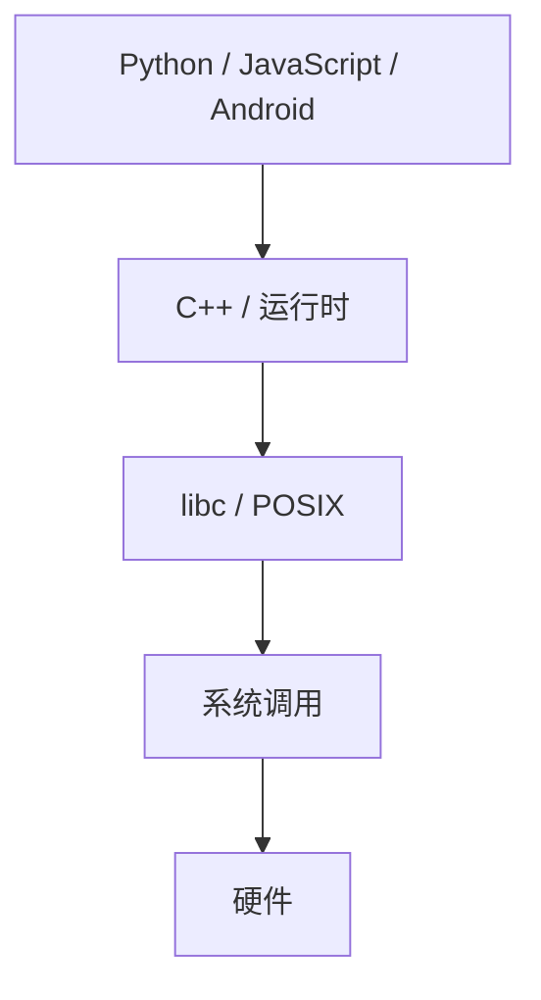

C 语言与其标准库是这个洋葱的**第一层可复用封装**。本讲主题：**C 标准库（libc）的原理与实现**。

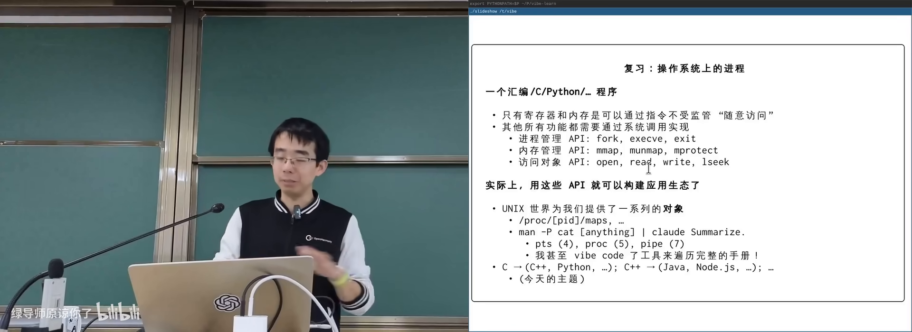

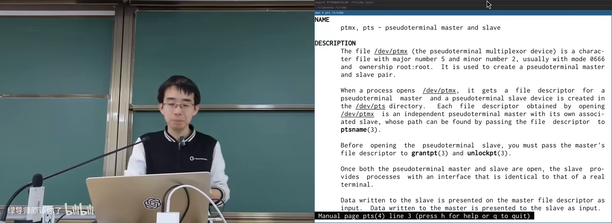

### 手册与 AI

系统里处处有手册：`man 4 pts`、`man 5 proc`、`man 7 pipe`。把手册管道给 AI，可得到 summary 并继续追问实现。主讲人还让 AI 把全部 man page 做成可搜索的树状浏览器——现代学习方式是「知道有什么 + 会提取」，而非死记全文。

---

## 2. C 的完全体：Simple C 与 FFI

- 理解 Simple C / 状态机模型（第 2 讲）
- 知道程序最终是机器码
- 汇编、调用约定概念本章会展开

*(参考时间: 00:08)*

Simple C 只覆盖了 C 的**计算**部分：赋值、分支、循环，可直译汇编。但 C 还有完整体：

### 跨语言调用 FFI

**外部函数接口（Foreign Function Interface，一种语言调用另一种语言实现的函数的机制）**。Python 的 `mmap` 模块背后是系统调用，而系统调用必须用更低层的手段发出——C/汇编正是那一层。

两种在 C 里接入汇编的方式：

1. **链接汇编实现的函数**：按 **ABI（应用二进制接口）** 的调用约定，x86-64 约定参数在 `RDI/RSI/...`，栈上保存返回地址等；
2. **内联汇编（inline assembly）**：在 C 源码中嵌入汇编片段。

一旦 C 能调用汇编，就能发起系统调用——`fork`、`pipe` 等最终都落到汇编例程。

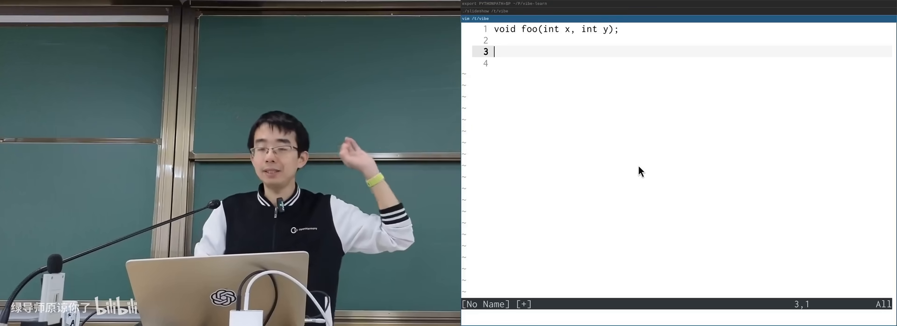

---

## 3. 内联汇编：概念重要，细节交 AI

- 知道寄存器、指令序列
- 了解编译器会优化代码
- 本章只需建立正确心智模型

*(参考时间: 00:13)*

内联汇编是为了「在 C 的词法作用域里引用变量，同时执行一段指令序列」。代价是语法像一块**领域特定语言（DSL，只服务某个领域的专用语言）**：

- 指令写在字符串里，像 `printf` 一样用 `%0`、`%1` 引用操作数；
- 约束：`=r` 表示写入任意寄存器；读写同一变量要用 `+`；
- 必须正确声明 **clobber（被这段汇编破坏、编译器应避开的寄存器）**。

### 为什么人类容易写错

- 编译器**不解析**字符串里汇编的语义，只负责替换操作数后交给汇编器；
- 漏写副作用（例如改了 X5 却未声明）时，今天可能碰巧正确，编译器升级后突然崩溃；
- 系统调用约定要求把参数放进特定寄存器（如 ARM64 的 X0–X5、调用号 X8），与优化器寄存器分配存在张力。

### 今天的正确态度

建立概念即可：内联汇编是 FFI 的一种，最终原样进入汇编器。写法细节交给 AI/文档；需要极致性能（矩阵乘法、向量点积）时，再让 AI 针对目标指令集生成优化片段。

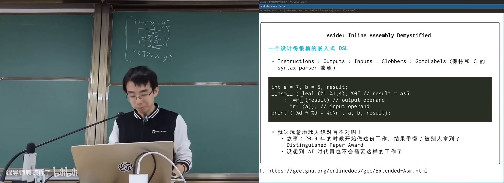

---

## 4. Free Standing 与 Hosted

- 知道有的程序依赖操作系统，有的跑在裸机
- 听说过「标准库」
- 宏与类型概念有助于理解示例

*(参考时间: 00:24)*

C 程序有两类环境：

| 环境 | 含义 | 例子 |
|------|------|------|
| **Hosted** | 有操作系统与完整库：`fopen` 等最终会系统调用 | 普通应用 |
| **Free standing** | 无 OS：只用不依赖系统调用的语言与库子集 | 操作系统内核、固件 |

Free standing 下可用：

- 固定宽度类型与格式化宏：`int32_t`、`PRIu64` 等（`%d`/`%ld` 随机器字长变化，需宏展开成正确格式串）；
- `offsetof`：结构体成员相对首地址的偏移；
- `stdarg.h`：变参宏与 `va_list`（现代体系结构参数多在寄存器，库与编译器协作把变参正确落入内存）；
- `memcpy`/`memmove`/`strcpy`、伪随机数、`atoi`、`qsort`、数学库等纯计算设施。

`qsort` 在 C 里比较难用（函数指针 + `void*`），因为 C 的语法机制有限——这是「高级汇编」的代价。

### setjmp / longjmp

**setjmp/longjmp（记录/恢复执行位置，实现跨函数「大跳转」的一对函数）** 在状态机模型下很自然：

- `setjmp(buf)` 记下当前栈高度与 PC，正常返回 0；
- 之后任意深入调用后 `longjmp(buf, val)` 会把栈弹回标记处，并让 `setjmp` 像刚返回一样取值为 `val`。

无需系统调用，只要编译器生成正确指令并保存寄存器。用途包括：错误处理集中跳转、协程等。

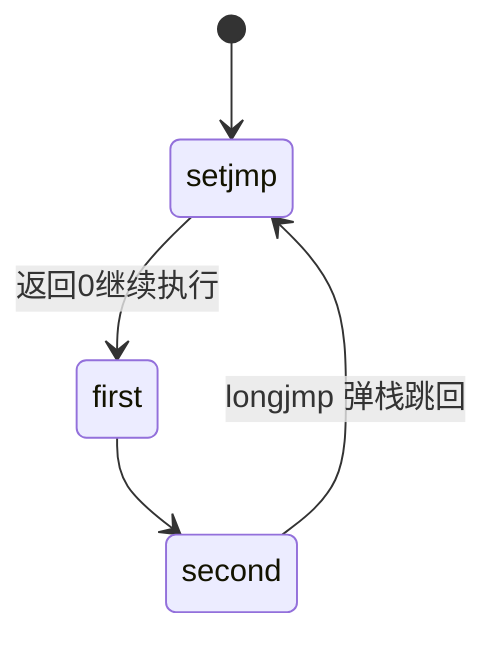

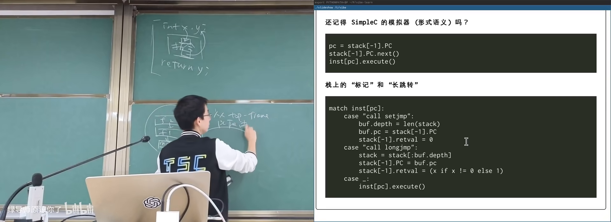

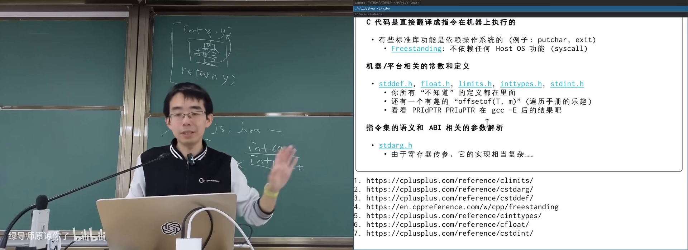

浮点数学还有坑：`NaN` 满足「不大于、不小于、不等于自己」。

---

## 5. musl libc：读懂标准库

- 知道 Linux 常用 glibc，也存在其他 libc
- 会编译程序或愿意让 AI 编译
- 调试器零基础可跟

*(参考时间: 00:30)*

系统默认往往是 **glibc（GNU C 库，功能全但历史包袱重）**。适合学习的是 **musl（更干净、贴合现代 Linux API 的 libc 实现）**：

- 可下载源码；
- 让 AI 编译出带调试信息的版本与 `musl-gcc`；
- 用 `musl-gcc -g3 -static` 编译教学小程序；
- 用 GDB 单步进库函数源码。

### 源码里能看到什么

- `stdio.h` 中 `SEEK_SET` 等就是普通宏；
- `FILENAME_MAX`、buffer 大小等也是宏定义——计算机世界没有魔法；
- 从 `inttypes.h` 宏展开可见字符串字面量拼接如何变成最终格式串。

主讲人曾让早期模型实现教学版 libc（栈对齐都错）；2026 年的大模型已能实现完整教学 libc，偶尔出错也能根据报错自修。但**读懂已有实现**仍比从零写更有教学价值。

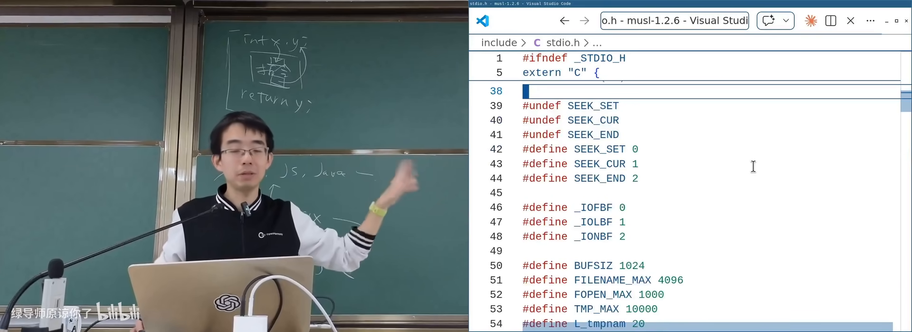

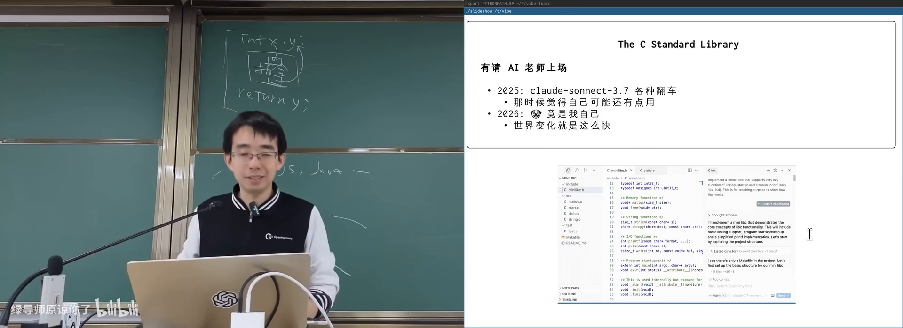

---

## 6. stdio：文件描述符上的面向对象

- 理解文件描述符
- 知道 `printf`/`fopen`
- 函数指针概念有助于理解 FILE

*(参考时间: 00:55)*

C 标准 IO 与 UNIX 系统调用几乎一一对应：

| C 库 | 系统调用侧 |
|------|------------|
| `fopen` / `fclose` | `open` / `close` |
| `fread` / `fwrite` | `read` / `write` |
| `fseek` / `ftell` / `feof` | `lseek` 等 |

**`FILE`（标准库中代表打开文件的结构体）** 内部包含：

- 文件描述符（真正的 OS 句柄）；
- 用户态 **buffer（缓冲区，减少系统调用次数）**；
- 函数指针表：`read`/`write`/`seek`/`close`——这是 C 语言式的面向对象：同一 `FILE*` 可对接真实文件、`sprintf` 的字符串缓冲等不同后端。

`printf` 家族最终收敛到一份核心实现（解析格式串 + `va_list` 取参 + 往 `FILE` 写），`fprintf(stdout, ...)` 与 `printf` 等价，避免代码复制。

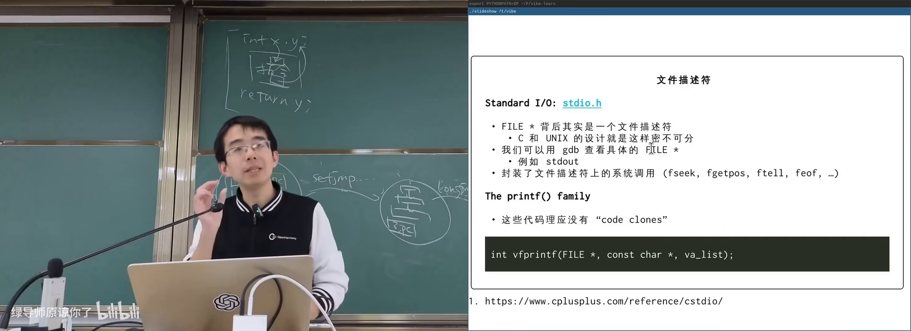

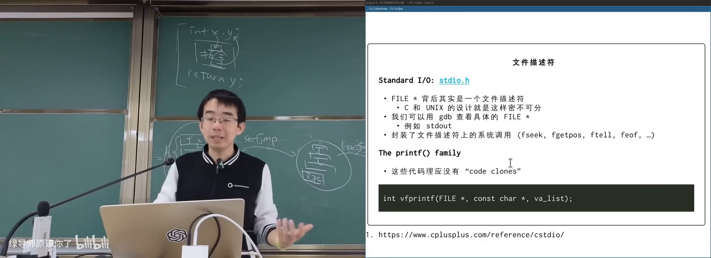

### 进程退出相关

- `atexit`：注册正常退出时要跑的清理函数（删临时文件等）；
- `exit`：执行 atexit 链表后走系统调用退出；
- `abort`：给自己发 `SIGABRT`，常配合 **core dump（把进程内存快照转储到文件，便于调试）**——名称来自早期磁芯内存 core memory。

---

## 7. 错误处理与 POSIX

- 知道系统调用失败会返回错误
- 用过 `ls` 等命令
- 本章零基础可跟

*(参考时间: 01:02)*

几乎每个系统调用/库函数失败时都可能出错；手册的 **ERRORS** 小节列出原因：

- `EAGAIN`：暂时失败，可重试；
- `ENOMEM`：资源不足；
- `EACCES` / `ENOENT` / `EEXIST`：权限、不存在、已存在等。

C 库通过全局 `errno`（或返回值约定）传递错误号；`perror` / `strerror` 把编号翻成当前 locale 的人话。因此**同一个 `ls` 程序**在 `LANG=zh_CN` 与 `LANG=en_US` 下报错语言不同——行为在 libc，不在内核。

### system / popen

- `system(cmd)`：启动 shell 执行命令，重但方便；
- `popen`/`pclose`：返回单向 `FILE*` 管道，可读子进程输出（C 的 FILE 只有一个 fd，API 被迫单向，是有历史包袱的妥协）。

### POSIX 与一致性

**POSIX（规定 UNIX 类系统 API 行为的标准）** 之上，libc 提供可移植封装。C 语言有 ISO 标准；只要遵循标准写 portable 的 C，从超级计算机到 1KB 内存设备都可能跑同一份代码。

生态稳定性来自这种分层一致：今天自然语言编程 / AI 生成代码能成立，是因为底下有 C → libc → POSIX → 系统调用这条被标准化的地基。

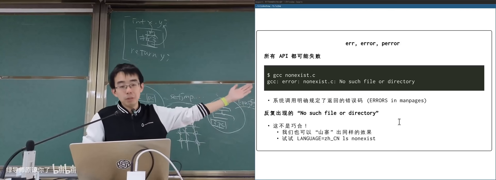

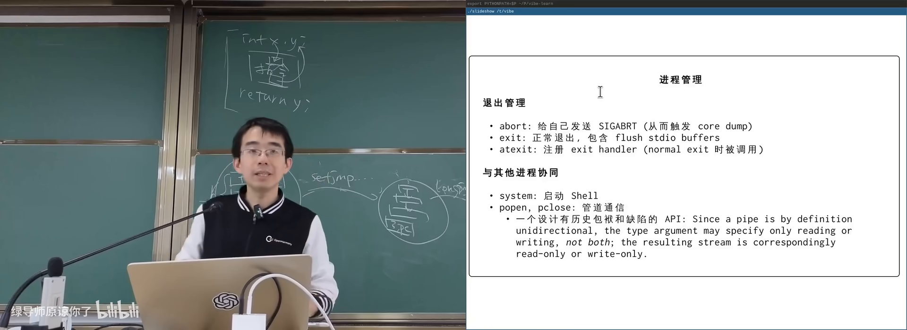

---

## 附录：概念补给

- 读过正文各章即可；每条独立成卡
- 本章零基础可跟

### libc（C 标准库）

- **是什么**：C 语言语法之外的运行时库：stdio、string、math、进程等。
- **课上为何出现**：应用生态在系统调用之上的第一层复用。
- **和什么像**：毛坯房（系统调用）之上的标准装修部品。

### glibc vs musl

- **是什么**：两种 C 库实现；glibc 历史包袱多，musl 更干净现代。
- **课上为何出现**：学习 libc 原理时更适合读 musl。
- **常见误解**：「Linux 的 libc」不唯一，Android 等还用 bionic。

### FFI（外部函数接口）

- **是什么**：在一种语言里调用另一种语言函数的机制。
- **课上为何出现**：Python/C/汇编如何衔接；系统调用的必经之路。
- **和什么像**：跨国公司各部门之间的标准对接邮件格式。

### ABI（应用二进制接口）

- **是什么**：调用约定、寄存器用途、栈布局、数据对齐等二进制层约定。
- **课上为何出现**：C 与汇编互相调用的前提。
- **常见误解**：API 是源码级接口，ABI 是二进制级接口。

### 内联汇编（Inline Assembly）

- **是什么**：嵌在 C 源码中的汇编字符串 + 操作数约束。
- **课上为何出现**：FFI 的极端形式；系统调用、极致优化。
- **常见误解**：编译器不校验其中汇编语义，漏声明 clobber 是经典坑。

### Free Standing 环境

- **是什么**：不要求完整宿主 OS 与标准库的 C 执行环境。
- **课上为何出现**：内核/固件也能用 C；划定库能力边界。
- **和什么像**：户外生存只带多功能刀，不带整套厨房。

### Hosted 环境

- **是什么**：有操作系统与完整标准库支持的普通 C 程序环境。
- **课上为何出现**：与 free standing 对比；`fopen` 依赖 OS。

### setjmp / longjmp

- **是什么**：保存/恢复执行位置，实现跨栈帧跳转。
- **课上为何出现**：不靠系统调用也能操纵状态机；协程基础。
- **常见误解**：不是常规控制流，中间跳过的帧不会执行析构/清理（C 没有析构，C++ 中更危险）。

### FILE / stdio

- **是什么**：标准库中带缓冲的打开文件对象。
- **课上为何出现**：对文件描述符的封装与面向对象式后端。
- **常见误解**：`printf` 不是系统调用，内部可能缓冲后再 `write`。

### 变参（va_list / stdarg）

- **是什么**：处理参数个数不定的函数调用的机制。
- **课上为何出现**：`printf` 一族的基础；现代 ABI 下实现更复杂。
- **和什么像**：不固定件数的包裹单，按约定顺序在传送带上取。

### errno / perror

- **是什么**：记录最近错误号；按 locale 打印错误说明。
- **课上为何出现**：解释为何同一程序中英文报错都可能。
- **常见误解**：errno 是线程局部的，且应在失败后立刻检查。

### Core Dump

- **是什么**：进程异常终止时把内存写入文件以便调试。
- **课上为何出现**：`assert`/`abort` 与 `SIGABRT` 的关联。
- **和什么像**：事故现场的完整监控备份。

### POSIX

- **是什么**：UNIX 类系统 API 与行为的国际标准族。
- **课上为何出现**：解释 Linux/macOS/鸿蒙等为何能共享大量软件。
- **常见误解**：POSIX 不是某个操作系统，而是一组标准。

*书架 Shelf 流水线生成 · 内容衍生自 B 站公开课程视频 BV1GHXCBkEZf*
