# 调试 C 标准库

> **原视频**：[Bilibili · BV1yu9cBCEAb](https://www.bilibili.com/video/BV1yu9cBCEAb/)（时长约 81 分钟）
> **课程**：南京大学《操作系统原理》（2026）第 10 讲
> **整理说明**：本书由视频语音转录后经 AI 重构而成；口语已转为书面语；关键时间点标注 *(参考时间)*，截图占位对应视频位置。

---

## 1. 开场：实验与上讲翻车复盘

<div class="prereq" data-label="你需要先知道">

- 知道实验 Online Judge 会自动测提交
- 了解 system call（系统调用，程序请求操作系统干活的唯一入口）
- 听说过 C 标准库 / libc

</div>

*(参考时间: 00:00)*

实验 Online Judge 已发布。若结果被 reject，不必焦虑：可以用 vibe coding（用自然语言驱动 AI 写代码的方式）让 AI 生成测试用例。Lab 的隐藏测例并非全空——可以主动猜测 OJ 如何测进程等行为，甚至让 AI「扮演老师」推断判题策略。

上讲「翻车」的原因值得记录：主讲人让 AI 编译并安装 musl libc（一个强调小巧可移植的 C 标准库实现），看到 `make install` 与「成功」提示后未做严谨验证，实际系统仍走 apt 安装的工具链，调试信息完全不可用。这次改为**每条命令后人工核对**，才保证演示可靠。

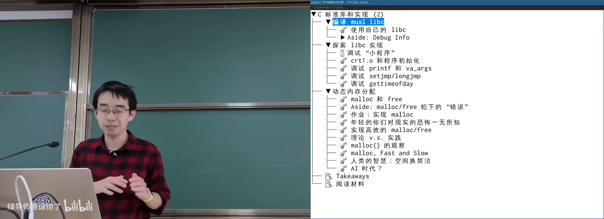

图：可关注「AI 说成功 ≠ 系统真的装对了」这一工程判断。

### 1.1 为什么需要 libc

操作系统与应用之间只有一层很小的接口：system call。进程、文件、显卡等一切 OS 对象都只能通过系统调用访问。但若直接用系统调用写程序，代码会极其冗长——例如 `write` 需要文件描述符、缓冲区、长度三个参数，每次都要自己算长度。

**libc**（C 标准库，把系统调用包装成更易用的 C 接口）因此出现：

```text
应用程序
  ↓
libc（平台无关的抽象层：printf / fopen / malloc …）
  ↓  （经 C 的 FFI / 内联汇编）
system call
  ↓
操作系统对象（进程、文件、设备…）
```

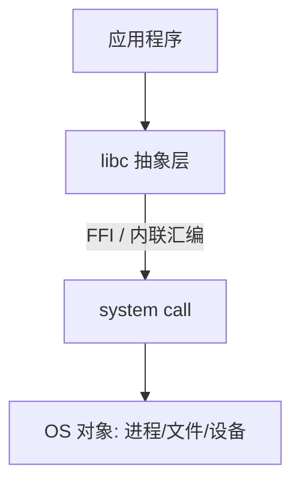

libc 与 C、与 UNIX 深度绑定：`FILE*` 与文件描述符紧密相关。但只要操作系统「还是给人用的」，就应提供打开文件一类能力——因此从 Linux、Windows 到树莓派 Pico 级微控制器，几乎都有语义相近的 libc 接口。

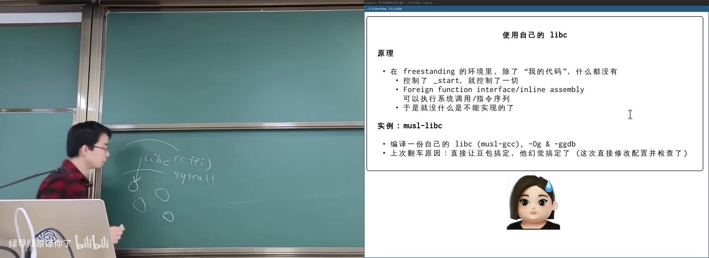

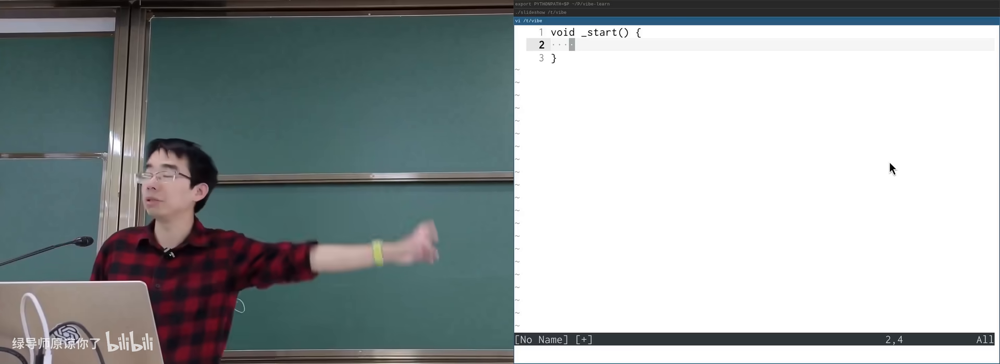

图：可关注自定义 `_start` 后从零接管入口。

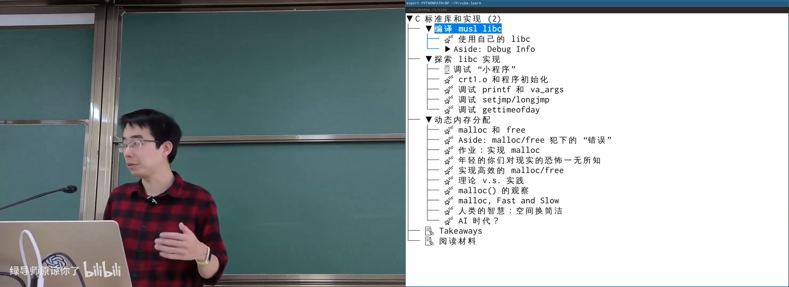

图：可关注 OJ 与让 AI 猜测测例的策略。

---

## 2. 调试信息：`-g` 到底做了什么

<div class="prereq" data-label="你需要先知道">

- 会用 `gcc -g` 编译并用 GDB 下断点
- 大致知道 ELF 是 Linux 可执行/目标文件格式
- 听说过「优化过的代码不好调」

</div>

*(参考时间: 00:08:00)*

上讲翻车的直接症状是：GDB 提示「没有可用的源代码」。根因是没有**调试信息**（debug info，把二进制地址映射回源码位置与变量含义的元数据）。

对用户程序，`gcc -g` 即可；要调进 musl libc，必须用带调试信息的方式编译库本身（如 `-Og -ggdb`，并确保 CFLAGS 真正生效）。

### 2.1 二进制里的 `.debug_*` 段

`-g` 会在 ELF 中塞入额外 section（段，二进制里按用途划分的数据块），例如：

- `.debug_info`：类型、变量、函数等核心信息
- `.debug_line`：地址到源码行号的映射
- `.debug_frame`：栈展开（调用帧）信息
- `.debug_str` / `.debug_line_str`：调试用字符串表
- `.debug_ranges`：地址范围到编译单元的映射

这些信息对应的标准是 **DWARF**（调试信息的主流格式；名称取自「矮人」，与 ELF「精灵」形成起名梗）。

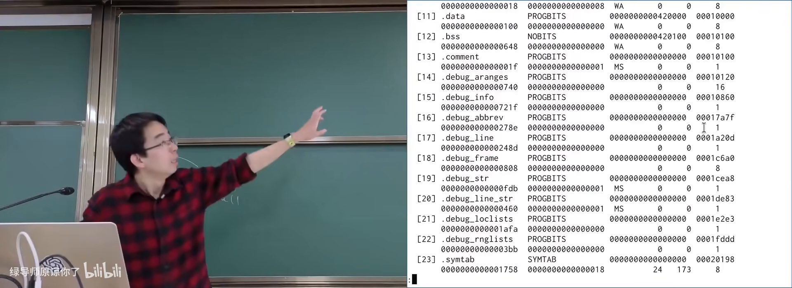

图：可关注 `.debug_*` 段名与符号表中 `crt1.o`、`__libc_start_main` 等字符串。

### 2.2 符号表也能粗定位

即使没有完整 debug info，ELF 仍有**符号表**（符号表，记录函数/变量名与其地址的表）。`nm a.out` 可看到 `main` 在 `.text` 中的地址；PC 走到该地址时即可知道进入了 `main`。

- 符号表：能回答「现在在哪个函数」
- 完整 debug info：还能回答「在函数第几行」「变量在哪、值是什么」

`addr2line` 可把 PC 映射回源码行。优化（内联、重排）会让「一条 C 语句 ↔ 一段汇编」的对应变难；不优化时对应关系更直观。

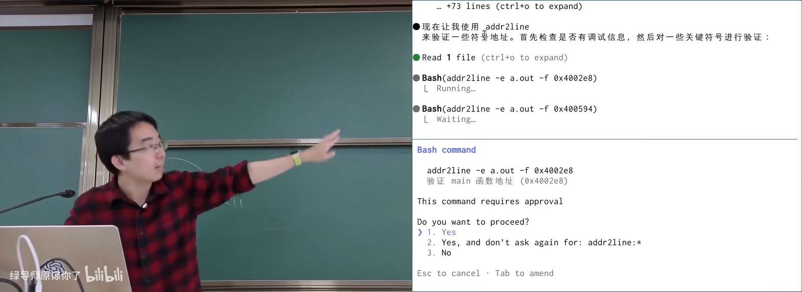

### 2.3 DWARF 为何像一门小语言

变量可能在寄存器、内存，或已被优化掉；位域还要从 32 位整数里抠出某一位。因此 DWARF 内含一套近似图灵完备的 bytecode（字节码指令集），用于描述「在某 PC 范围内，如何算出变量的值」。

同一套机制也用于 C++ 异常的栈展开（stack unwinding，抛出异常时沿调用栈回退到上一层处理点）。

### 2.4 其他语言的 debug info

JavaScript/TypeScript 会经多层转译（transpiler）到可执行 JS，浏览器沙盒又没有项目目录，因此 debug info 常把**源码一并嵌入**（如 `*.js.map`）。这与 C 中「debug info 只存映射、源码在磁盘路径」的设计不同，但目标一致：从底层状态重构上层含义。

---

## 3. 有了 debug info 能做什么

<div class="prereq" data-label="你需要先知道">

- 读过本册第 2 章，知道 `-g` 与 DWARF
- 了解 GDB 的 break / step / backtrace

</div>

*(参考时间: 00:27:00)*

调试信息让「汇编意义上的状态」可被重构回 C 源码模型：

| 能力 | 说明 |
|------|------|
| addr2line | PC → 源码行 |
| backtrace | 恢复完整函数调用栈 |
| 采样性能分析 | 定时暂停并恢复调用栈，得到火焰图（flame graph，横轴时间、纵向堆叠调用栈） |
| 崩溃快照调试 | 对 core/快照恢复状态，甚至改 PC 继续跑 |
| Sanitizer 报告 | AddressSanitizer 等工具用 debug info 指出 use-after-free 等错误位置 |

`strace` 看到的是系统调用层；debug info + 采样则进入**用户态代码结构**。musl 静态程序系统调用极少，glibc 静态链接也会多出 `readlinkat`、`getrandom` 等调用。

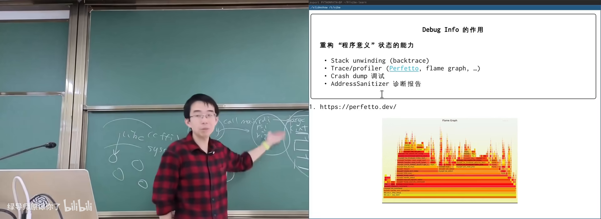

**Use-after-free 示例**：`free(p)` 后再使用 `p`，地址空间里往往仍可读，程序未必崩溃，但是未定义行为（undefined behavior，标准不保证结果的程序状态）与安全隐患。开启 `fsanitize=address` 后会明确报 `heap-use-after-free`。

---

## 4. 实战：从 `_start` 调到 `main` 与 `exit`

<div class="prereq" data-label="你需要先知道">

- 知道 `main` 是 C 程序入口（更准确说，进程入口是 `_start`）
- 记得 `argc/argv/envp` 大致含义
- 会用 GDB `starti` 从第一条指令调试

</div>

*(参考时间: 00:35:00)*

### 4.1 CRT 启动：进程栈上的 argc/argv/envp

对几乎为空的 `dummy.c`（`return 1`）用 musl 编译后 `strace` 可见：`execve` 之后只做很少事再 `exit`。用 GDB 从 `_start` 单步：

1. `_start` 是一段汇编，从进程初始栈指针 `SP` 取参数；
2. 从指针可逆向出 **initial process stack**（进程初始栈，内核在 execve 时布置的 argc/argv/envp 与辅助向量）；
3. `argc` 在 `p[0]`，`argv` 从 `p+1` 起，`envp` 在 `argv + argc + 1` 之后；
4. 再往后是 **auxv**（辅助向量，内核传给运行时的元数据：VDSO 地址、随机数种子等）。

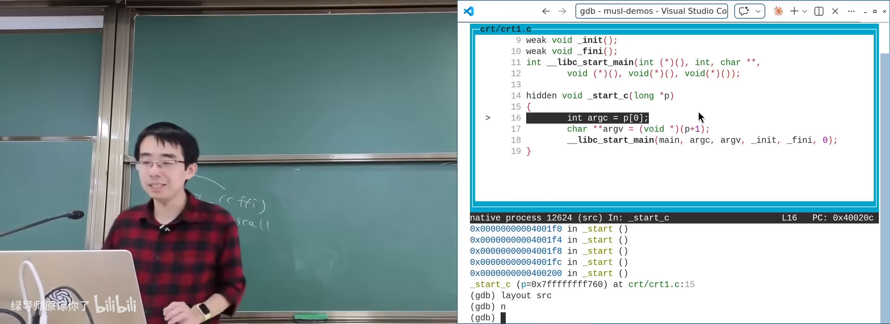

图：可关注 `p[0]=argc`、`argv`、`envp` 与环境变量内容。

### 4.2 `__libc_start_main` 与 `main`

`init_libc` 会处理环境变量与辅助向量，再通过函数指针进入 `__libc_start_main` 一类逻辑，最终按调用约定（calling convention，函数调用时参数/返回值放哪些寄存器、谁保存什么的约定）把 `argc/argv/envp` 放入正确寄存器并跳转到 `main`。

`main` 返回后走 `exit` → `stdlib` 清理 → 系统调用 `_exit`，进程结束。

### 4.3 进 musl 调 `printf`

在带 debug info 的 musl 上对 `printf` 下断点，可看到：

- `printf` 很短，取出变参后调用 `vfprintf`；
- `stdout` 是封装了文件描述符、缓冲区、flag 的结构体（`fd=1`，缓冲区大小常见 1024）；
- 最终经 `write` 一类系统调用输出。

`strace` 可验证：一次成功的格式化打印往往只触发很少的 write 类调用。

---

## 5. 变参函数与调用约定

<div class="prereq" data-label="你需要先知道">

- 知道 C 里 `void f(int x, ...)` 可声明变参
- 了解寄存器传参 vs 栈传参的大致差别

</div>

*(参考时间: 00:44:00)*

`printf` 依赖 C 的**变参数**（varargs，参数个数不定的函数）。在旧式 x86 32 位 cdecl 下，参数几乎都压栈，变参实现较直观；在 x86-64、ARM64、RISC-V 等寄存器多的体系结构上，前几个参数走寄存器，库代码必须先把寄存器存回栈上，才能按数组方式遍历变参。

ARM64 上可观察到：`mov` 把参数写入 `x0/x1/...`；libc 内再把 `x1/x2` 等 store 到 `SP+偏移`，在栈上形成可遍历的参数区。

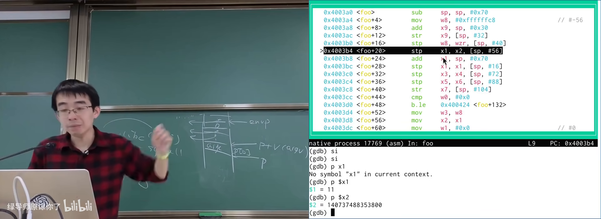

---

## 6. setjmp/longjmp 与 callee-saved 寄存器

<div class="prereq" data-label="你需要先知道">

- 听过 `setjmp` / `longjmp`：前者做「存档点」，后者跳回存档
- 知道函数调用会用到许多寄存器

</div>

*(参考时间: 00:48:30)*

**setjmp/longjmp**（在当前位置保存执行环境，之后可从任意深层调用跳回该环境）通过保存/恢复一组寄存器实现。

实验方法：先把一批通用寄存器「刷成红色」→ `setjmp` → 再刷成蓝色 → `longjmp` → 观察哪些寄存器回到红色。

在 ARM64 上典型结果是：`setjmp` 保存、`longjmp` 恢复约 `X19–X28`；`X0–X18` 不会恢复——因为它们属于 **call-clobbered**（被调用方可随意使用的寄存器，调用方不得假设其值在调用后仍保留）。与之相对的是 **callee-saved**（被调用方必须保存/恢复的寄存器）。主讲人更喜欢用 call-clobbered 描述：一旦进入某个函数调用，`X0–X18` 就「归编译器随便用」。

这正是 ABI（应用二进制接口，跨编译单元/库时调用与数据布局的约定）的一部分；通过小实验即可逆向观察到部分约定。

---

## 7. gettimeofday 与 vDSO：不进内核的「系统调用」

<div class="prereq" data-label="你需要先知道">

- 知道 `gettimeofday` / `clock_gettime` 常用来取时间
- 听说过系统调用一般要陷入内核

</div>

*(参考时间: 00:56:00)*

用 `gettimeofday` 测 `usleep(200ms)` 间隔，结果合理；但 `strace` 里**看不到** `gettimeofday`，只有 `clock_nanosleep`。时间却打印正确——这并不矛盾。

原因：现代 libc 对时间一类高频、可近似读取的操作走 **vDSO**（虚拟动态共享对象，内核映射进每个进程地址空间的一小段可执行代码）。进程直接 `call` 过去，不陷入内核。

加载/绑定过程（musl 思路）：

1. 从 auxv 中读 `AT_SYSINFO_EHDR` 得到 vDSO 的 ELF 头；
2. 像微型加载器一样解析 vDSO 的 program header 与符号表；
3. 找到 `__kernel_clock_gettime` 等符号并跳转执行。

vDSO 读时钟时常用「读 clock tick → 再读一次 → 相等则认为未跨 tick」的顺序一致性技巧；调试器单步极慢时两次 tick 几乎必变，循环看起来像死循环——正常运行则几乎总是立即成功。

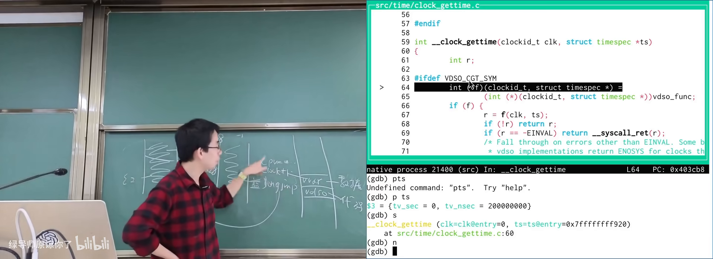

图：可关注 auxv、vDSO 映射与符号绑定路径。

---

## 8. malloc/free：机制、心智负担与安全

<div class="prereq" data-label="你需要先知道">

- 用过 `malloc` / `free` 或语言里的 new/delete
- 知道 `mmap`/`brk` 大致是向 OS 要内存的途径

</div>

*(参考时间: 01:11:00)*

`malloc` 可分配很小或很大的内存，而 OS 粒度更粗（页通常是 4KB）：`mmap` 拿到的是页的整数倍；`brk` 可调进程堆顶。libc 在用户态维护空闲块池，在系统调用拿到的大块上再切分小块。

**API 设计问题**：`malloc/free` 与 `write` 这类「只写字节、无额外配对义务」的接口不同，它要求：

- 所有可能路径上都有配对的 `free`（否则泄漏）；
- `free` 之后指针立即非法（否则 use-after-free）。

Tony Hoare 自嘲空指针是 billion-dollar mistake；`malloc/free` 给程序员的心智负担同样巨大。工程上的应对包括：

- free 后置 `NULL`（防误用，但错误路径可能变崩溃）；
- C++ 的 RAII（资源获取即初始化，构造时获取、析构时释放）；
- Rust 的 ownership/borrow（所有权与借用，编译期阻止悬垂指针）。

作业视角：大块分配直接问 OS；小块是数据结构题（维护不相交空闲区间）。算法课的平衡树解法与真实 allocator 并不完全相同，可参考 1990 年代 malloc 综述。

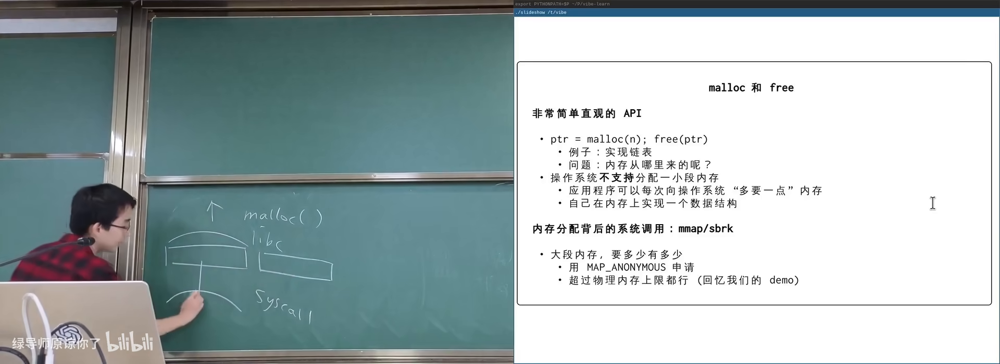

---

## 附录：概念补给

### system call（系统调用）

- **是什么**：用户程序请求内核服务的受控入口。
- **课上为何出现**：libc 之下的唯一真实接口；调试时常对照 strace。
- **和什么像**：柜台办事：你不能直接进库房，只能按窗口流程申请。

### libc（C 标准库）

- **是什么**：把系统调用包装成可移植 C 接口的一层库。
- **课上为何出现**：本讲调试对象；平台无关抽象的关键。
- **和什么像**：万能插座转换头——底下接口不同，上面电器用法一致。

### debug info（调试信息）

- **是什么**：嵌在目标文件里、把地址映射回源码与变量的元数据。
- **课上为何出现**：上讲翻车根因；`-g` 的真实产物。
- **和什么像**：地图图例：没有它只有坐标，有它才能认路。

### DWARF

- **是什么**：调试信息的事实标准格式，内含描述变量位置的小型指令集。
- **课上为何出现**：解释 `.debug_*` 段与「变量被优化掉」。
- **和什么像**：快递面单规范：承运商、分拣机都按同一套字段读。

### ELF

- **是什么**：Linux 上可执行文件与目标文件的常用格式，描述内存布局等。
- **课上为何出现**：调试段、符号表、加载都落在 ELF 结构里。
- **和什么像**：房屋图纸：写清哪层住人、哪层放货、门朝哪开。

### 符号表（symbol table）

- **是什么**：记录符号名与地址对应关系的表。
- **课上为何出现**：无完整 debug info 时也能定位函数。
- **和什么像**：班级点名册：知道名字，能找到座位号。

### addr2line

- **是什么**：把程序计数器（PC）地址映射到源码文件与行号的工具。
- **课上为何出现**：验证 debug info 是否生效的直接手段。
- **和什么像**：用门牌号反查住户。

### 火焰图（flame graph）

- **是什么**：采样调用栈得到的性能可视化，宽处代表耗时占比大。
- **课上为何出现**：debug info 在 profiler 中的应用。
- **和什么像**：交通热力图：越堵的路段颜色/面积越显眼。

### sanitizer（尤其是 AddressSanitizer）

- **是什么**：编译期插桩、运行时检查内存错误的工具集。
- **课上为何出现**：use-after-free 等 UB 在 debug info 辅助下可被指出。
- **和什么像**：工地安全巡检：不阻止你施工，但会拉警报。

### initial process stack（进程初始栈）

- **是什么**：execve 后内核布置的 argc/argv/envp/auxv 所在栈区。
- **课上为何出现**：CRT 从 `_start` 恢复参数的物理来源。
- **和什么像**：入职当天工位上已放好的门禁卡、手册与通知单。

### auxv（辅助向量）

- **是什么**：内核传给运行时的键值元数据（vDSO 地址、随机种子等）。
- **课上为何出现**：vDSO 如何被 libc 找到。
- **和什么像**：快递箱里附的安装说明，不是货本身。

### calling convention / ABI

- **是什么**：函数调用时参数、返回值、寄存器保存责任的约定。
- **课上为何出现**：变参、setjmp 实验的底层解释。
- **和什么像**：交通规则：大家都靠右行驶，才不会对撞。

### call-clobbered / callee-saved

- **是什么**：前者调用后不保证保留；后者被调用方必须保存恢复。
- **课上为何出现**：解释 longjmp 只恢复部分寄存器。
- **常见误解**：不是「所有寄存器都会被 setjmp 保存」。

### vDSO

- **是什么**：内核映射进用户地址空间的一小段代码，用于不陷入内核的快速系统功能。
- **课上为何出现**：解释为何 strace 看不到 gettimeofday。
- **和什么像**：小区内设的自助服务机，不必去总行排队。

### setjmp/longjmp

- **是什么**：保存/恢复执行环境以实现非局部跳转的 C 机制。
- **课上为何出现**：用寄存器刷色实验逆向观察 ABI。
- **和什么像**：游戏存档/读档：读档后中间过程消失。

### use-after-free

- **是什么**：释放堆内存后仍使用该指针。
- **课上为何出现**：malloc/free 语义与 sanitizer 演示。
- **常见误解**：地址还能读 ≠ 程序正确；这是 UB。

### RAII

- **是什么**：资源在对象构造时获取、析构时释放的 C++ 惯用法。
- **课上为何出现**：降低 malloc/free 与锁的配对负担。
- **和什么像**：借钥匙开门，出门自动还钥匙（离开作用域即归还）。

---

*书架 Shelf 流水线生成 · 内容衍生自 B 站公开课程视频 BV1yu9cBCEAb*
