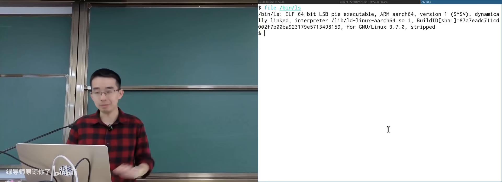
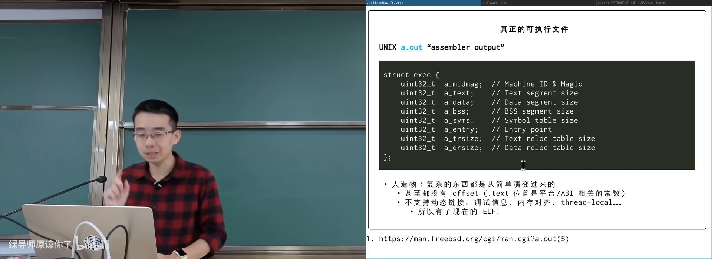
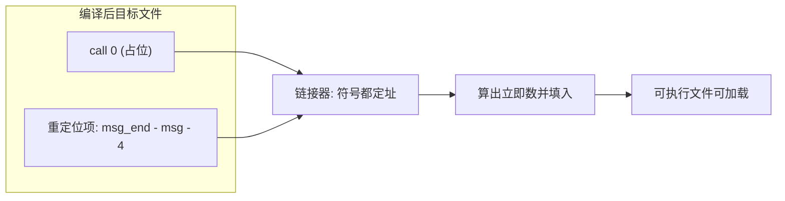
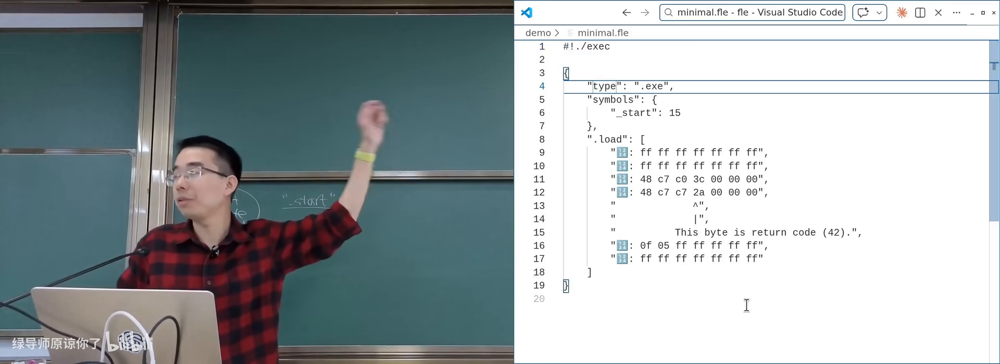
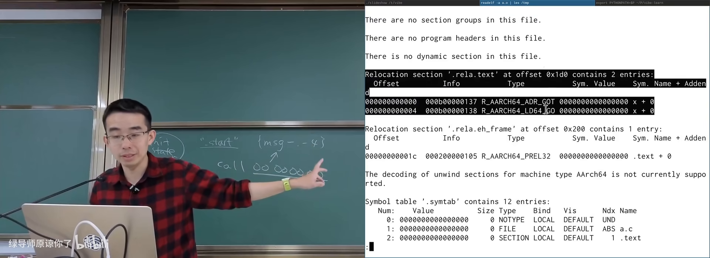
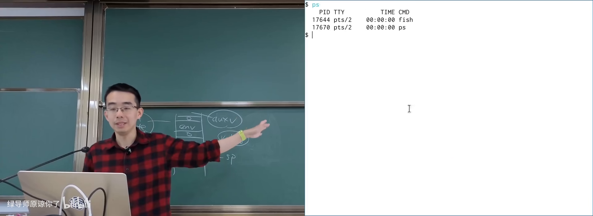
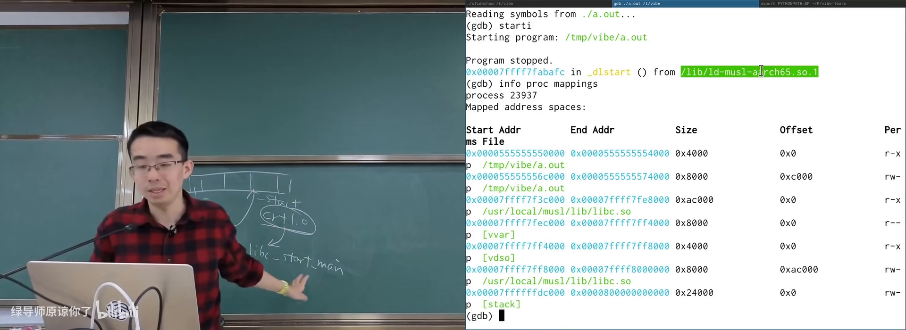
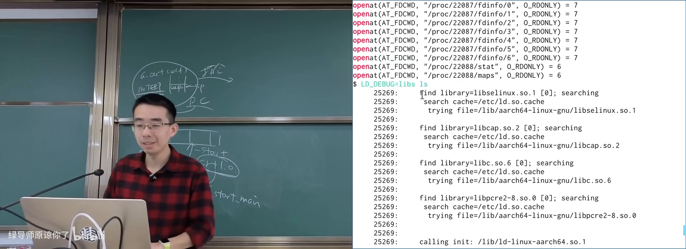
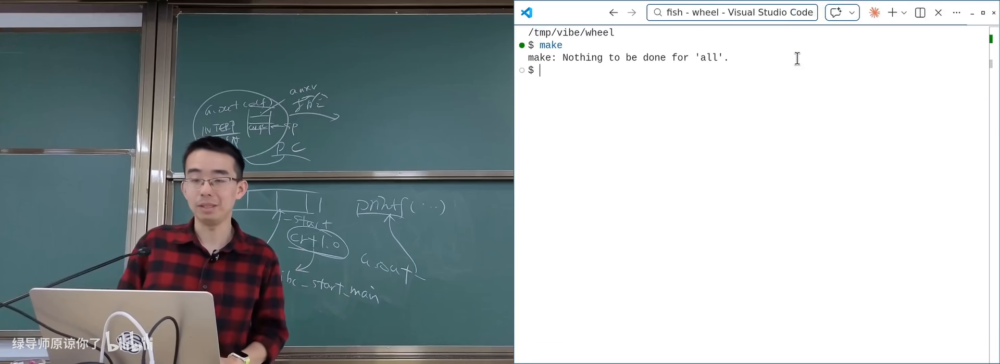
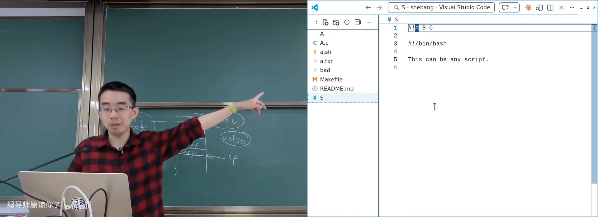

# 链接和加载

> **原视频**：[Bilibili · BV1CoDzB5Eey](https://www.bilibili.com/video/BV1CoDzB5Eey/)（时长约 89 分钟）
> **课程**：南京大学《操作系统原理》（2026）第 11 讲
> **整理说明**：本书由视频语音转录后经 AI 重构而成；口语已转为书面语；关键时间点标注 *(参考时间)*，截图占位对应视频位置。

---

## 1. 可执行文件究竟是什么

- 用 `ls`/`file` 看过二进制文件
- 知道 `execve` 可以「执行一个程序」
- 大致记得地址空间、代码段/数据段

*(参考时间: 00:00)*

课程一直在系统调用之上堆叠应用世界。本讲对象是**链接和加载**——仍然建立在系统调用之上，但视角从「API 怎么用」变成「程序文件如何变成进程」。

学操作系统前，可执行文件是「双击能弹出窗口」的东西；学完之后更精确的定义是：

> **可执行文件是描述进程初始内存布局的数据结构。**

它本身只是操作系统里的一个普通文件：可用 `file`、`cat`、十六进制查看器打开；文件头常见 `7f 45 4c 46`（ELF 魔数）。

图：可关注 ELF 魔数与「它只是文件」这一点。

### 1.1 execve 与进程初始状态

`execve(path, argv, envp)` 手册写作 execute program。path 指向可执行文件；内核加载器据此：

- 布置 **initial process stack**（argc/argv/envp/auxv）；
- 按文件中的 program header 把代码、数据、BSS 等映射进地址空间并设定权限。

真正「可执行」的是进程；文件只是初始状态的蓝图。

### 1.2 从 a.out 到 ELF

早期 UNIX 的 **a.out**（assembler output，汇编器输出）格式很简：结构体小，甚至没有显式 offset——加载地址由平台 ABI 硬编码。它也不支持动态链接、调试信息、thread-local 等后来需求。

功能不断膨胀后，演进为今天的 **ELF**（Executable and Linkable Format，可执行与可链接格式）。复杂度的根源是：ELF **为机器效率设计**——字符串身首异处、用 offset/索引、权限等信息压成 bit field，机器读很高效，人读则痛苦。

### 1.3 等价描述：Funny Little Executable

课程坚持一个方法论：

> **总可以在等价的描述形式之间转换。**

于是不必死磕 ELF 的 offset 迷宫，而可以自定义「人眼友好的可执行描述」，再实现链接器与加载器。主讲人多年迭代的 Funny Little Executable 使用 JSON（或 Markdown）表达：

- 可执行文件身份；
- 符号（如 `_start` 在何处）；
- 指令序列；
- 导出/待改写的符号；
- 重定位表达式。

链接的本质被摊平成：**算出一个数字，填进指令里预留的位置**。例如 x86 `call` 可先编译成 `call 0x00000000`，链接时把「目标地址 − 当前指令下一条地址」填入 PC-relative 立即数。

---

## 2. 静态链接与加载

- 知道 `.c` → `.o` → 可执行文件的大致流程
- 听过重定位、符号解析
- 会用 `readelf -A` / `objdump`

*(参考时间: 00:22:40)*

### 2.1 链接在做什么

编译 `extern int x;` 的 `main` 时，引用外部符号的指令会留下空位。若链接时找不到符号定义，链接器报错；找得到则按重定位类型填入正确数值。

`readelf -A` 的 `.text` relocation、反汇编中的零立即数，都是「以后再填」的痕迹。

### 2.2 加载在做什么

加载即：按描述把字节搬到内存并设定权限——典型用 `mmap` 一类系统调用完成。静态链接时代，每个可执行文件都带齐用到的库代码。

### 2.3 静态链接的代价

- **磁盘**：成千上万个程序各带一份 libc；
- **内存**：若无共享映射，物理内存也会重复；
- **安全补丁**：libc 有漏洞时，静态链接的海量二进制难以统一升级。

因此需要**动态链接**（dynamic linking，运行时才把共享库映射进来并解析符号）。

---

## 3. 动态链接与解释器

- 读过本册第 2 章静态链接
- 知道进程地址空间可用 `pmap` / `/proc/pid/maps` 查看

*(参考时间: 00:44:00)*

### 3.1 为何动态链接

共享库在系统中只需一份磁盘副本；虚拟内存下，只读代码段在物理内存中也可只有一份。接口稳定时库可独立升级。动态链接还可用于拆分大型项目（如把模拟器 CPU 做成 `nemu.so` 插进框架）。

### 3.2 实验证明：库只加载一份

构造含大量 NOP 的 `libbloat.so`（约 40MB），后台启动大量进程 `dlopen` 并调用其中函数：

- 各进程打印的函数虚拟地址可不同（地址空间随机化 ASLR）；
- 系统内存不会被「进程数 × 40MB」压垮；
- `lsof` 可见上千进程都打开同一 `.so`。

`lsof` 本身也是遍历 `/proc/*/fd`、`maps` 一类 procfs——与课程实验「打开的文件描述符」知识连通。

### 3.3 interpreter：动态程序第一条指令在哪

关键细节：动态链接的 ELF 在 program header 中有 **interpreter** 字段（请求的程序解释器路径，常为 `ld-linux-*.so` 或 musl 的 `ld-musl-*.so`）。

- 静态程序：`starti` 落在自己的 `_start`；
- 动态程序：`starti` 落在 **interpreter 的入口**，不是 `a.out` 的 `_start`。

调试对比：

1. 第一条指令时，地址空间里通常有：`a.out` 映射、vDSO、interpreter；
2. **libc 尚未映射**；
3. 解释器跑完动态加载后，再跳到程序 `_start` → `__libc_start_main` → `main`；
4. 此时 `info proc mappings` 才能看到 `libc.so`。

实验可直接修改 ELF 中 interpreter 字符串：路径不存在则无法执行；创建对应符号链接后又可执行——证明内核读的就是这个字符串。

图：可关注「先有 interpreter，后有 libc」的加载顺序。

### 3.4 ld.so 手册是一座金矿

动态链接器/加载器有专门手册（`ld.so`），记录：

- `LD_LIBRARY_PATH`：共享库搜索路径；
- `LD_DEBUG` / `LD_DEBUG=libs`：观察加载了哪些库；
- `LD_BIND_NOW`：启动时解析全部符号，关闭惰性绑定；
- `LD_SHOW_AUXV=1`：打印实际 auxv（vDSO、随机数等每次可能不同）；
- `ldd`：假装加载，列出依赖的共享库。

---

## 4. LD_PRELOAD：用「先到先得」做钩子

- 读过本册第 3 章动态链接
- 知道符号解析大致是「谁先定义谁生效」

*(参考时间: 01:16:00)*

动态链接的符号解析默认**先到先得**：谁先被加载并首次满足未定义符号，坑位就是谁的。

**LD_PRELOAD**（预加载指定共享库，使其符号抢先被解析）因此可以覆盖任意库函数。覆盖后仍调用原实现、只在前后插入日志/改写行为，就是**钩子**（hook）。

典型玩法：

| 目标 | 手段 |
|------|------|
| 变速齿轮 | 覆盖 `gettimeofday`/`usleep`/`alarm`/`select` 等，改写时间感知 |
| malloc 审计 | 覆盖 `malloc`/`free` 记录配对与泄漏 |
| 可控随机 | 劫持 `rand` 类接口 |
| 游戏外挂类 | 覆盖图形缓冲交换等（课程仅作机制说明） |

演示：对 `nsnake`、`cmatrix` 等注入 `libw.so` 后，程序体感变快；`sleep(1)` 在钩子下约 0.1 秒返回。

图：可关注钩子覆盖的时间相关 API 列表。

---

## 5. PLT/GOT：动态调用与数据的间接层

- 知道 `call` 指令与相对跳转
- 听过 PIC / 位置无关代码

*(参考时间: 01:22:00)*

### 5.1 函数调用：PLT

编译器对本文件内 `foo` 与外部 `printf` 一视同仁，都生成相对 `call`（立即数有限，且链接时未必知道外部地址）。于是：

1. 调用实际指向本文件内的 **PLT**（过程链接表，动态函数调用的跳板）；
2. PLT 查 **GOT**（全局偏移表，存放运行时真实地址的表项）；
3. 再 `call` 到真实函数。

### 5.2 数据：必须间接

`extern int x; x=1;` 在 PIC 下不能假定 `x` 与代码的相对距离，常经 GOT 间接寻址。即使用 `-fPIC`，外部数据访问也多一层间接，有一定性能代价。

这与脚本 `#!` 同属「在机器效率与灵活/共享之间加一层约定」的系统设计。

---

## 6. shebang：文本文件为何可执行

- 用过 `#!/bin/bash` 或 `#!/usr/bin/env python3`
- 会 `chmod +x`

*(参考时间: 00:35:00)*

带可执行权限、以 `#!` 开头的文本脚本可以直接 `./script` 运行。内核加载器（如 Linux 的 `fs/binfmt_script.c`）硬编码识别文件头两字节 `#` `!`：

- 把后续一行解析为解释器路径与可选参数；
- 实际 `execve` 解释器，并把脚本路径作为参数传入。

**argv 细节**：`argv[0]` 常是解释器路径，随后可能是脚本中写死的参数，再往后是命令行参数；脚本本身路径会插入列表。POSIX 未规定 shebang 行上多参数如何按空格切分——Linux 常把剩余部分当**一个**参数，macOS 可能拆成多个，存在跨系统差异。

非法 interpreter（目录、不存在的路径）会得到明确错误——同样来自内核加载器的检查。

---

## 附录：概念补给

### 可执行文件

- **是什么**：描述进程初始内存布局的数据结构（外加普通文件外壳）。
- **课上为何出现**：全讲主语；加载与链接的服务对象。
- **和什么像**：装修图纸 + 材料清单，工人（内核）按图进场。

### execve

- **是什么**：用指定程序替换当前进程映像并启动执行的系统调用。
- **课上为何出现**：加载的系统调用入口。
- **和什么像**：整店翻牌：旧店清空，按新图纸重开。

### ELF

- **是什么**：Linux 等系统上描述可执行/目标文件的标准格式。
- **课上为何出现**：符号、重定位、interpreter 都写在 ELF 里。
- **常见误解**：ELF 不是「机器码本身」，而是机器码与元数据的容器。

### a.out

- **是什么**：早期 UNIX 简单目标/可执行格式，assembler output。
- **课上为何出现**：对比 ELF，理解复杂度从何而来。
- **和什么像**：手写便签 vs 正式合同：后者字段多但防纠纷。

### 重定位（relocation）

- **是什么**：链接/加载时把占位地址改写为最终数值的过程与记录。
- **课上为何出现**：链接被还原成「算数并填空」。
- **和什么像**：先把门牌写「待定」，街道定名后再统一钉牌。

### 静态链接

- **是什么**：链接阶段把用到的库代码直接并进可执行文件。
- **课上为何出现**：对比动态链接的动机。
- **常见误解**：静态不等于「更快」，常换来磁盘与补丁成本。

### 动态链接

- **是什么**：运行时由解释器/加载器映射共享库并解析符号。
- **课上为何出现**：省磁盘省内存、可独立升级。
- **和什么像**：公共图书馆：书只进馆一份，借阅证人人可办。

### shared object（.so）

- **是什么**：共享库文件，可被多个进程映射使用。
- **课上为何出现**：bloat 实验证明物理内存可共享。
- **和什么像**：小区公共健身房器材，不必每户各买一套。

### interpreter（PT_INTERP）

- **是什么**：ELF 中记录的动态加载器路径；动态程序先执行它。
- **课上为何出现**：`starti` 落点与 libc 何时出现。
- **常见误解**：动态程序的第一条指令常不在自己的 `_start`。

### ld.so / dynamic linker

- **是什么**：动态链接器兼加载器，完成库搜索、映射与符号绑定。
- **课上为何出现**：手册是行为规格；LD_* 变量的解释者。
- **和什么像**：现场项目经理：按名单找分包、核对进场。

### LD_LIBRARY_PATH / LD_PRELOAD

- **是什么**：影响库搜索路径 / 预加载覆盖符号的环境变量。
- **课上为何出现**：可观测加载过程；实现 hook 与外挂机制。
- **和什么像**：指定去哪家供应商取货；或把自己的人排在队首。

### PLT / GOT

- **是什么**：动态函数调用跳板与存放运行时地址的全局偏移表。
- **课上为何出现**：外部 `call`/外部数据如何在 PIC 下工作。
- **和什么像**：总机转接分机号；分机号变更只改通讯录。

### PIC（位置无关代码）

- **是什么**：不依赖固定装载地址、可被映射到任意地址执行的代码。
- **课上为何出现**：共享库与 ASLR 的基础；数据访问多一层间接。
- **和什么像**：可搬家的模块化家具，不靠墙上的固定尺寸。

### shebang（#!）

- **是什么**：文件头约定，指示内核用指定解释器执行脚本。
- **课上为何出现**：内核加载器的隐藏特性与 argv 传递。
- **和什么像**：包裹单上的「由某某专送」标签。

### ASLR（地址空间布局随机化）

- **是什么**：进程映射位置带随机性，增加攻击难度。
- **课上为何出现**：各进程看到的 .so 函数地址不同。
- **和什么像**：每次入住随机分房，不固定走廊位置。

---

*书架 Shelf 流水线生成 · 内容衍生自 B 站公开课程视频 BV1CoDzB5Eey*
