# 多处理器编程：从入门到放弃

> **原视频**：[Bilibili · BV1vgQGBREyJ](https://www.bilibili.com/video/BV1vgQGBREyJ/)（时长约 83 分钟）
> **课程**：南京大学《操作系统原理》（2026）第 13 讲
> **整理说明**：本书由视频语音转录后经 AI 重构而成；口语已转为书面语；关键时间点标注 *(参考时间)*，截图占位对应视频位置。

---

## 1. 从虚拟化到并发：为何要共享内存

<div class="prereq" data-label="你需要先知道">

- 知道 CPU reset → 固件 → 操作系统 → 进程的大致启动链
- 了解 fork / execve、地址空间
- 知道现代机器有多个 CPU 核

</div>

*(参考时间: 00:00)*

虚拟化部分可以收成一句话：计算机从 CPU reset 开始，固件加载 OS，OS 再 execve 出应用世界；对上是 system call API，再往上是 libc 与应用生态，对下可兼容多种体系结构。

今天进入**并发编程**。标题里的「放弃」不是劝退并发，而是让你意识到：多处理器上的共享内存编程会碰到哪些反直觉困难。

### 1.1 顺序模型的两个不够用

顺序（sequential）程序是状态机：按语句/指令一步步迁移。写 HTTP 服务器时问题立刻出现：

- `read` 可能长时间阻塞，CPU 却还有别的请求可处理；
- 现代机器本身是**多处理器**，物理内存对多个 CPU 是同一地址空间——不用白不用。

用 `fork` 出大量进程可以并行，但回收结果要走管道等 IPC，很麻烦。自然需求是：多个执行流**共享同一内存**，直接读写全局结果。

### 1.2 线程：共享全局、独享栈

在「栈 + 全局变量」的程序模型上，扩展为：

- 每个**线程**（共享地址空间、但有独立执行栈的执行流）拥有自己的 stack frame 链与 PC；
- 全局数据与代码共享；
- 迁移 = 选中某个线程的「栈+全局」当作一个进程，执行一条语句。

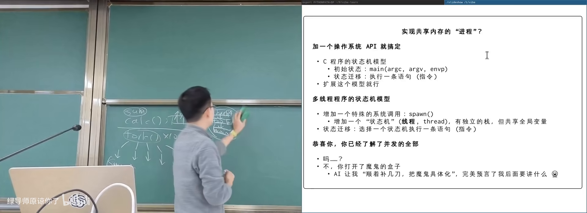

图：可关注 T1/T2 各有栈、共用 global。

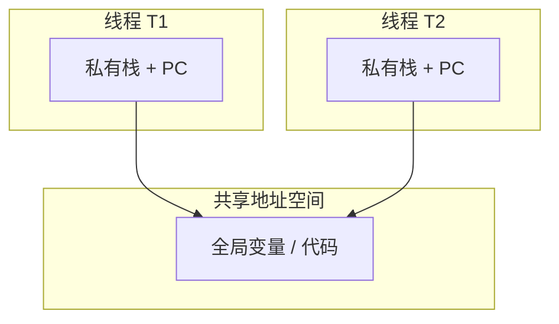

最小 API 即可表达全部并发控制的起点：

- `spawn(f)`：创建入口为 `f` 的新线程；
- `join()`：等待已创建线程结束。

在指令集意义上：地址空间平坦；每线程有自己的寄存器（含 SP），指向自己栈区。

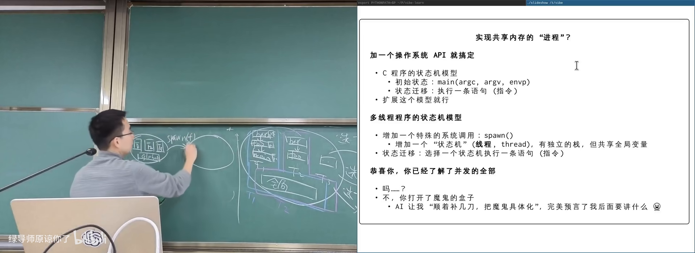

图：可关注 spawn 不复制全局，只增加一条独立执行链。

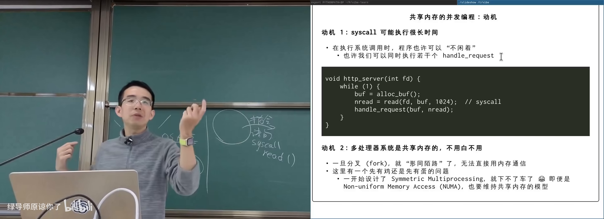

图：可关注 CPU1/CP2 访问同一物理地址时的数据可见性假设。

---

## 2. 最小线程库与实验

<div class="prereq" data-label="你需要先知道">

- 读过本册第 1 章线程模型
- 会编译运行简单 C 程序
- 听过 POSIX thread / pthread

</div>

*(参考时间: 00:19:40)*

课程提供极简线程库：`spawn` 创建线程（线程号从 1 起），`join` 等待全部返回（实现上是对 pthread 的简化包装）。

```c
void ta(int id) { while (1) putchar('A'); }
void tb(int id) { while (1) putchar('B'); }

int main() {
  spawn(ta);
  spawn(tb);
  join();
}
```

运行可见 A/B **随机交替**——符合并发/并行预期。

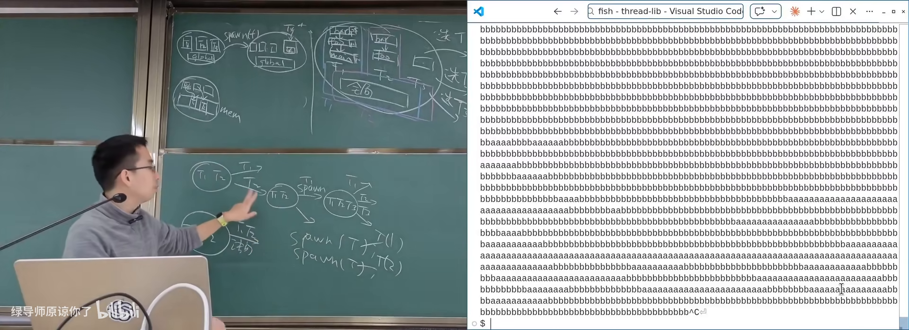

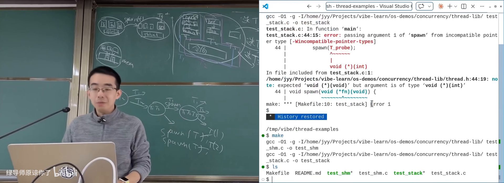

图：可关注 x 增长快于 y，说明数据确实在共享。

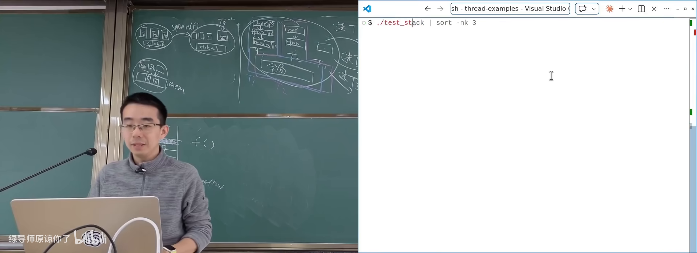

图：可关注 high/low 地址范围逼近约 8MB。

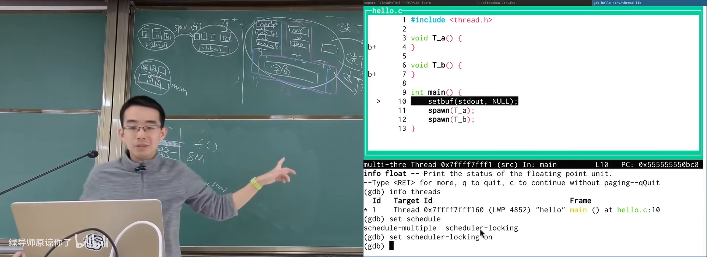

图：可关注多线程单步时切换 thread 编号。

### 2.1 用实验验证模型

| 问题 | 实验思路 |
|------|----------|
| 数据共享吗 | 一个线程写 x，另一个/main 读 x |
| 代码共享吗 | 两线程调用同一函数并取地址 |
| 栈独立吗 | 打印局部变量地址；甚至跨线程传局部变量指针 |
| 栈多大 | 无穷递归并记录局部变量地址范围，溢出前统计 |

栈大小实验可测得约 **8192 KB（8MB）**——创建线程时就要在地址空间里划出固定栈区，与「主线程栈几乎可无限长」不同。

### 2.2 多线程也能 GDB

`info threads` 查看线程；`set scheduler-locking on` 让调试时只有当前线程推进（模拟「每次只选一个线程执行一步」的概念模型），再用 `thread N` 切换。

---

## 3. 并发、并行与确定性的丧失

<div class="prereq" data-label="你需要先知道">

- 读过本册第 2 章线程实验
- 知道「函数同一输入应得同一输出」的直觉
- 听过编译优化 `-O1/-O2`

</div>

*(参考时间: 00:16:30)*

### 3.1 术语

- **并发**（concurrency）：逻辑上同时推进，可能只是单核交错调度；
- **并行**（parallelism）：物理上同时执行（多核）。

并行一定是并发；并发不一定是并行。

### 3.2 确定性：顺序世界的安全感

数学函数与顺序状态机都有确定性：给定状态，下一状态唯一；同一输入，同一输出。测试通过就能复现。

共享内存并发**彻底打破**这一点：线程相对速度无保证；每一步都可以选 T1 或 T2，状态空间指数爆炸。测一百万次通过，不代表 OJ 会过。

### 3.3 反直觉案例

**银行转账**：两线程同时「检查余额够 → 扣款」，都可能看到余额够，重复扣款；无符号整数下还可能变巨款。

**网游复制 bug（事件并发）**：捡起物品与点击地上道具交错，全局「手中物品」被覆盖，实现物品复制。

**sum++ 都算不对**：

```c
// 两线程各 N 次
sum = sum + 1;  // load / add / store
```

交错会导致互相覆盖，最终远小于 2N。多跑几次结果都不同。

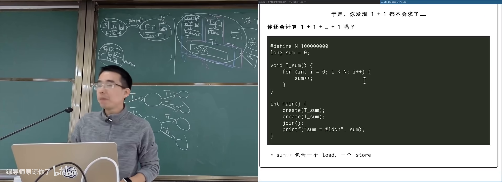

更难的概念题：三线程各做两次 `sum++`（每次=load, tmp+1, store），在允许任意交错下 **sum 最小值** 可以是 2 而非直觉的 3。把各线程读写历史拼成全局合法顺序，是 **NP 完全** 量级的搜索——与非确定性图灵机、NP 理论相关。

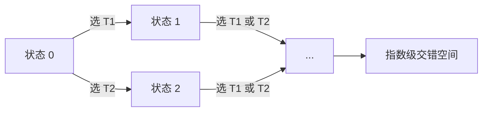

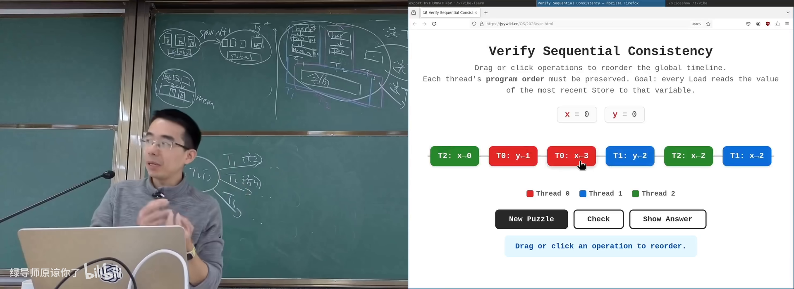

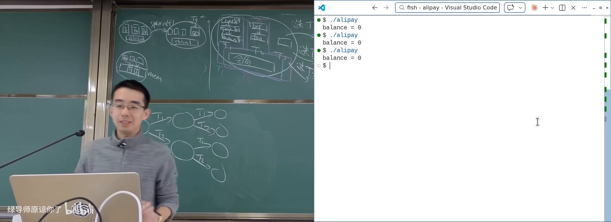

图：可关注两线程都看到余额够，导致重复扣款。

---

## 4. 编译器与硬件也在「并发地」改写你

<div class="prereq" data-label="你需要先知道">

- 知道编译器会做优化
- 大致了解 CPU 会流水线、乱序执行
- 听过 cache

</div>

*(参考时间: 01:00:00)*

### 4.1 编译优化与共享变量

编译器默认程序近似顺序、除系统调用外可自由优化（合并 `x++` 等）。但其他线程可能改同一变量——优化前提被打破。

反例：用 `while (!flag);` 等待另一线程置位。编译器认为 flag 不会被本线程改，可能改写成「只判断一次否则死等」，正确性依赖被优化掉。

可选的脆弱手段（课程不推荐当作并发方案）：

- **compiler barrier**：如 `asm volatile("" ::: "memory")`，阻止优化跨越；
- **volatile**：禁止某些合并/省略（设备寄存器等场景更正统）。

同一份 sum 代码：`-O1` 可能把 load/store 拉开成很长窗口（更易交错出错）；`-O2` 可能把循环压成一次加减（碰撞窗口极短，测试「看起来都对」）。**测试通过不是并发程序正确的证据。**

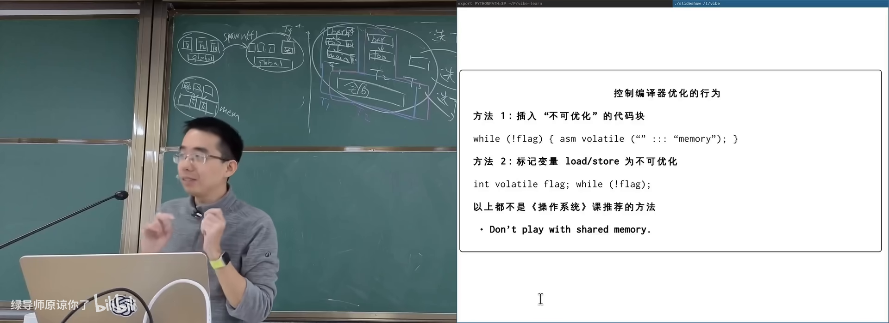

图：可关注 O1 长窗口 vs O2 被压掉循环的差异。

### 4.2 CPU 也是「编译器」

现代处理器：多发射、乱序、分支预测、cache。概念上「每次选一线程执行一条」并不存在；更接近每个核有自己的读写缓冲/缓存视图，最终才趋于一致（弱内存模型）。

**经典 litmus**：T1: `x=1; r1=y;` T2: `y=1; r2=x;`  
顺序一致性下不应看到 `(r1,r2)=(0,0)`；真实多核上**几乎总看到 00**——写还没对另一核可见就去读。


结论：**Don't play with shared memory**——并发课要学的是受控同步，而不是手搓内存序。

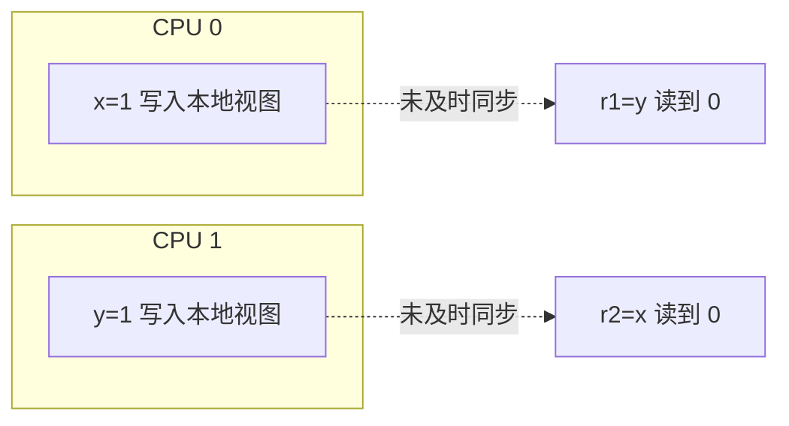

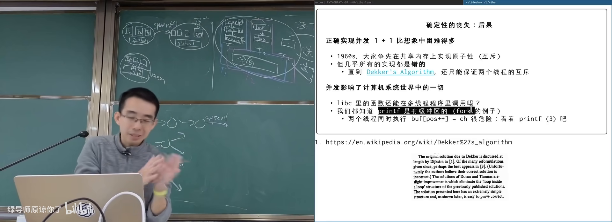

图：可关注多线程共享 buffer position 的隐患。

---

## 5. 并发如何冲击「一切 API」

<div class="prereq" data-label="你需要先知道">

- 用过 printf
- 知道缓冲区概念

</div>

*(参考时间: 00:55:00)*

`printf` 内部有缓冲区；多线程若都改 `position`、写字符，就会重演 sum++。好消息是系统设计者会标注接口的并发属性：

- 多数 printf 族是**线程安全**的（不会损坏内部结构）；
- 不保证「多次调用的输出原子交错成你要的句子」；
- `memcpy` 等同内存重叠时不保证你想要的交错语义，但通常不会「把进程搞崩」以外的魔法。

几乎全部系统调用可在多线程下正确调用，但行为细节可能变化。并发影响计算机系统里的一切：一旦程序可能是多线程的，API 设计与使用都要重新审视。

后续几讲的主题：用互斥、同步等机制**控制**不确定性，而不是假装它不存在。

---

## 附录：概念补给

### 线程（thread）

- **是什么**：共享地址空间、独立栈与寄存器的执行流。
- **课上为何出现**：多处理器共享内存编程的基本执行单元。
- **和什么像**：同一办公室多人，共用文件柜，各有草稿本。

### spawn / join

- **是什么**：创建线程 / 等待线程结束的最小 API 对。
- **课上为何出现**：极简线程库的全部接口。
- **和什么像**：派活与等交作业。

### 并发 vs 并行

- **是什么**：逻辑同时推进 vs 物理同时执行。
- **课上为何出现**：区分单核交错与多核真并行。
- **常见误解**：并发程序不一定更快；并行必须有多个执行资源。

### 确定性（determinism）

- **是什么**：状态确定则后续与输出唯一。
- **课上为何出现**：顺序程序的隐含前提，被并发摧毁。
- **和什么像**：按剧本演戏 vs 即兴群戏。

### 竞态（race condition）

- **是什么**：结果取决于多个执行流交错时序的脆弱状态。
- **课上为何出现**：sum++、转账、复制 bug 的共同结构。
- **和什么像**：两人同时改同一份文档且无锁。

### 数据竞争（data race）

- **是什么**：至少一写、无同步地并发访问同一内存。
- **课上为何出现**：C/C++ 中属未定义行为，不可「碰运气」。
- **常见误解**：不是「偶尔读到旧值」这么简单，优化后逻辑可被改写。

### 弱内存模型

- **是什么**：硬件不保证其他核立刻看到你的写，只保证最终/按某些规则可见。
- **课上为何出现**：解释为何顺序模型下不可能的 00 会出现。
- **和什么像**：各人先写便签，稍后才贴到公告栏。

### 编译器屏障 / volatile

- **是什么**：限制编译器优化合并的手段。
- **课上为何出现**：不能替代真正的并发控制。
- **常见误解**：volatile ≠ 线程安全，也不建立内存序。

### 未定义行为（UB）

- **是什么**：标准/实现不保证任何结果的程序状态。
- **课上为何出现**：数据竞争、错误内存使用都可能落入 UB。
- **和什么像**：说明书空白页：出事厂商不负责。

### Online Judge 与非确定性

- **是什么**：评测环境的调度与本机不同，暴露交错差异。
- **课上为何出现**：解释「本地过了 OJ 挂了」。
- **和什么像**：同一首歌不同耳机听感不同——环境也是输入。

---

*书架 Shelf 流水线生成 · 内容衍生自 B 站公开课程视频 BV1vgQGBREyJ*
