# 并发控制：互斥

> **原视频**：[Bilibili · BV1hNdhB1Efe](https://www.bilibili.com/video/BV1hNdhB1Efe/)（时长约 86 分钟）
> **课程**：南京大学《操作系统原理》（2026）第 14 讲
> **整理说明**：本书由视频语音转录后经 AI 重构而成；口语已转为书面语；关键时间点标注 *(参考时间)*，截图占位对应视频位置。

---

## 1. 操作系统里最早的并发

- 线程模型：共享全局、独立栈
- 知道 sum++ 会因交错出错
- 大致了解中断、系统调用会进入内核

*(参考时间: 00:00)*

上讲用线程库打开「魔鬼盒子」：只靠共享内存甚至做不对 1+1。本讲补上互斥。

为何 OS 课必须讲并发？UNIX 进程本身地址空间隔离，但**进程在内核中执行系统调用的部分共享内核数据结构**——一旦 syscall 在多个 CPU 上同时改同一文件/同一结构，问题与用户态 sum++ 同构。操作系统是人类最早、规模最大的严肃并发程序。

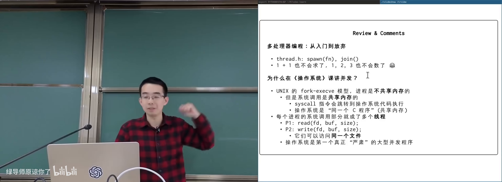

### 1.1 直觉目标：make it work

把关键代码包进一个「要么全做完，要么像没发生」的块：

- 读 sum、加一、写回，作为一个整体；
- 不允许另一线程插进中间。

这几乎是 **事务内存**（transactional memory，把一段共享内存更新做成原子提交的机制）的想法。Intel 曾加 `xbegin/xend` 一类指令，消费级平台现多不可见；ARM 也曾尝试后放弃——指令集代价大。

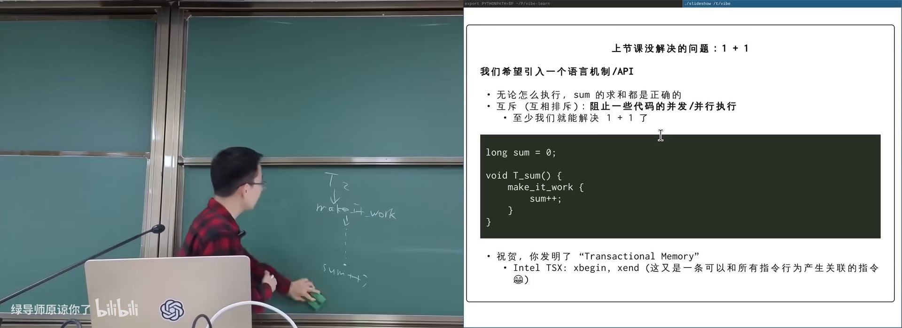

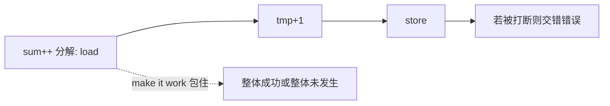

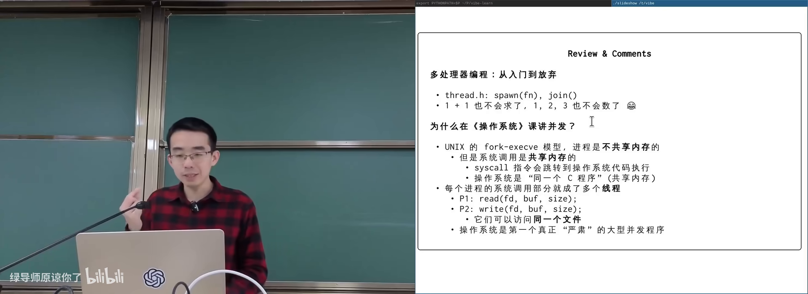

图：可关注两个进程的内核路径可能同时碰同一文件。

---

## 2. 单处理器内核：关中断

- 知道中断可打断 CPU
- 知道用户态不能随便关中断

*(参考时间: 00:06:30)*

若系统只有 **一个 CPU** 且代码在 **内核态**：关中断即可 make it work——没有其他线程能抢 CPU（在中断关闭窗口内）。若窗口内死循环，整机假死（这也是早期 Windows 蓝屏/复位故事的背景）。

用户态尝试关中断（如 x86 `cli`）会被拒绝：`SIGSEGV` / illegal instruction。内核用特权指令清除中断标志位。

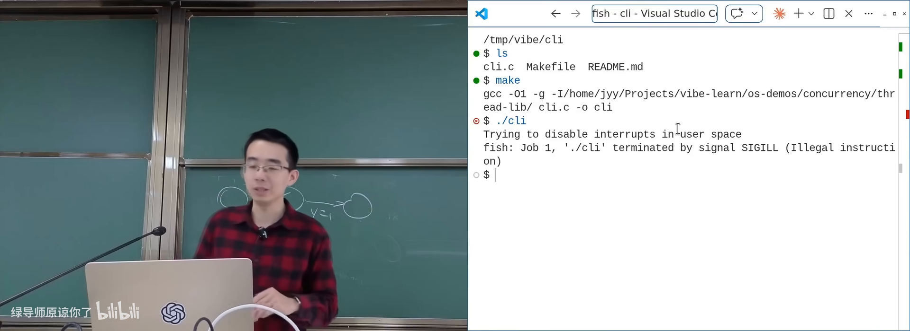

关中断/开中断可抽象为「进入临界 / 离开临界」，推广到多处理器就是互斥 API。

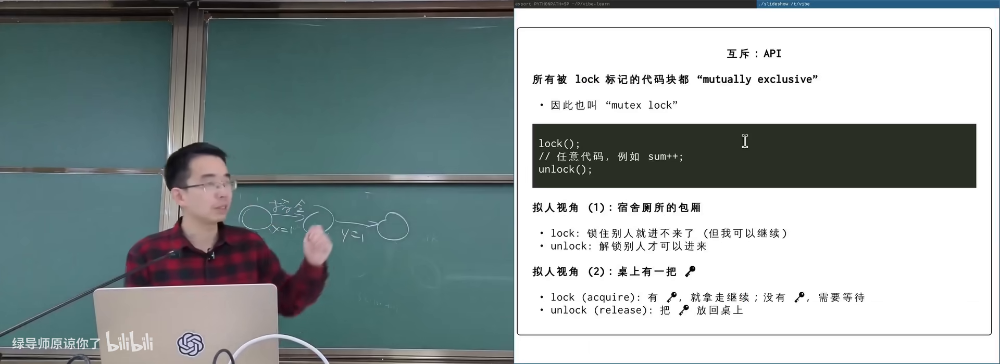

---

## 3. 互斥锁：lock/unlock

- 读过本册第 2 章
- 知道临界区是访问共享数据的那段代码

*(参考时间: 00:10:30)*

**互斥**（mutually exclusive，多个执行流不能同时进入同一临界区）用一对操作表达：

- `lock` / `acquire`：获得锁；若已被他人持有则等待；
- `unlock` / `release`：释放锁；并保证此前对共享内存的写对后续获得锁的线程可见。

时间轴上：T1 在 lock 返回后执行临界区直到 unlock；期间 T2 的 lock 不返回；T1 unlock 后 T2 才能进入。

### 3.1 两个好用的比喻

1. **单人房间**：进门上锁，别人进不来；离开开锁。
2. **桌上一把钥匙**：lock=拿钥匙，unlock=还钥匙；钥匙只有一把。

正确使用时，可把 lock…unlock 理解成 **stop the world**（理解程序时假装世界暂停，自己独占共享状态）——这是人脑友好的顺序化视角；真实执行仍可能并行，只要别人不碰你锁保护的数据。

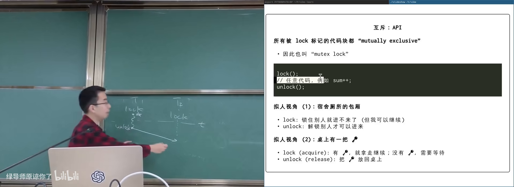

图：可关注 T2 的 lock 必须等 T1 unlock。

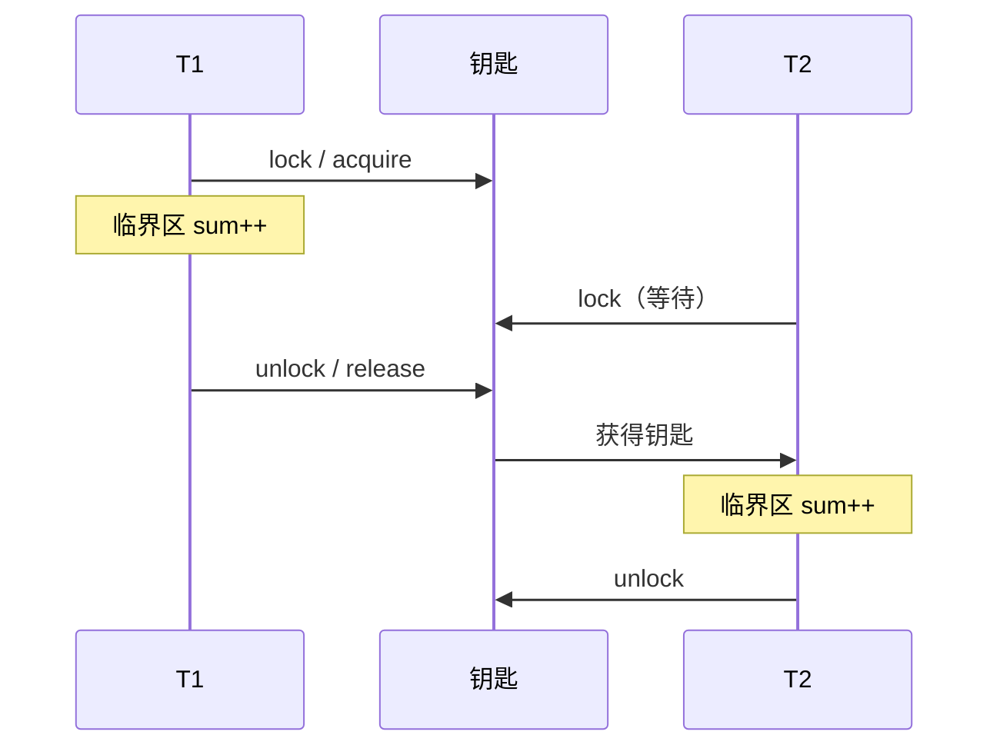

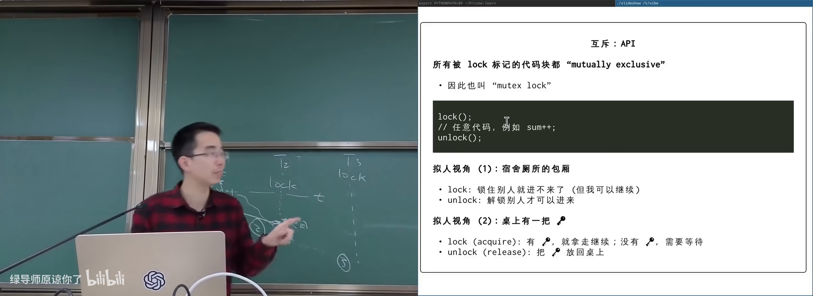

图：可关注「桌上一把钥匙，谁拿到谁能进」。

### 3.2 多把锁

不同共享变量可用不同锁（lockA 保护 x，lockB 保护 y）。**同一变量的所有访问必须同一把锁**——两把名字相近的锁（l 与 i）形同虚设。

---

## 4. 正确使用与「一把大锁」

- 读过本册第 3 章
- 知道链表等数据结构的基本操作

*(参考时间: 00:17:10)*

用课程线程库 `thread_sync.h` 可创建互斥锁，把 N 次 `sum++` 包进 lock/unlock（中间可插 compiler barrier 防止被优化成一次加 N），运行结果正确。

### 4.1 心智负担与细粒度锁

lock/unlock 必须程序员配对；返回路径漏 unlock 就会永久卡死他人。细粒度并发链表要对节点逐个上锁：遍历时先持有当前节点锁，再拿后继节点锁，再放前驱……插入删除要三把锁，删除后的内存回收更难。

课程建议第一次写并发：**能一把大锁就一把大锁**——凡可能共享的数据都用同一把锁，临界区覆盖整件事。Linux 多处理器化时先引入 **BKL**（Big Kernel Lock，大内核锁），正确优先，再按瓶颈拆细。

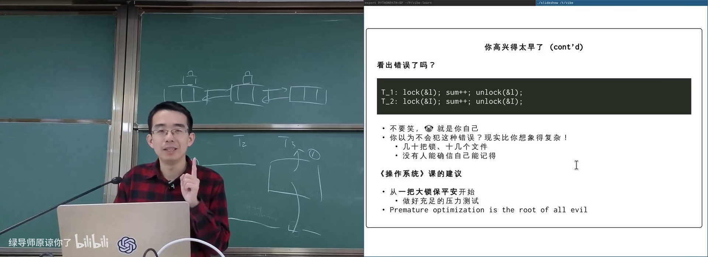

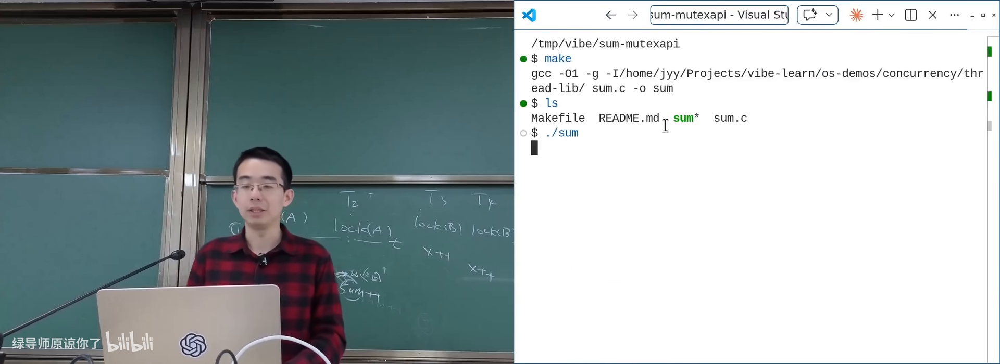

图：可关注临界区内多次自旋/加法仍得到正确 sum。

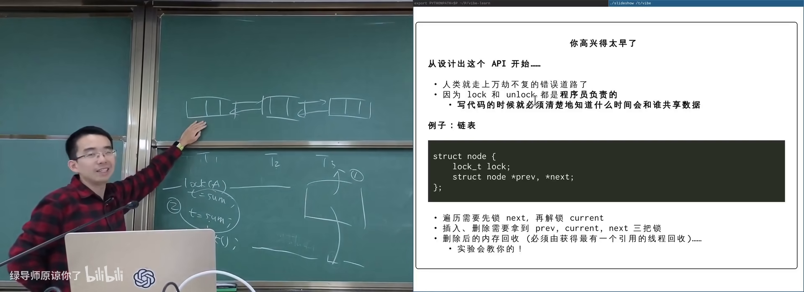

图：可关注 previous/current/next 三节点锁的交接。

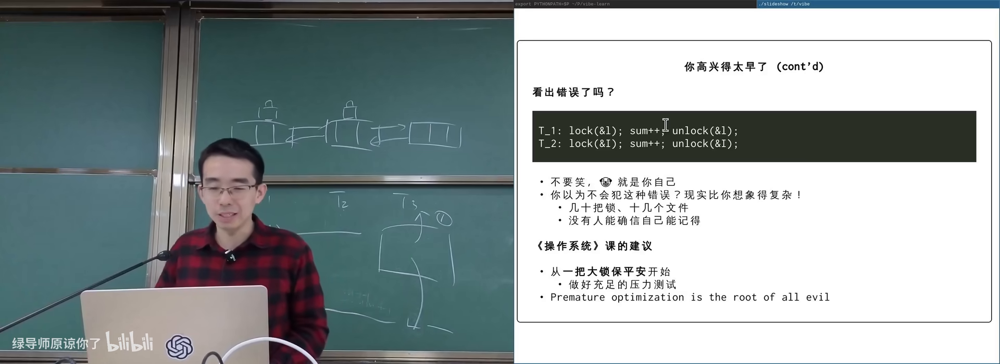

图：可关注「看似同一把锁」的拼写错误。

### 4.2 Amdahl 与 Gustafson

疑问：上锁是否毁掉并行？

- **Amdahl 定律**：若串行占比不可忽略，加速比有上限；
- **Gustafson**：串行极少、并行区可扩展时，多核可接近线性加速。

现实大量问题有局部性：计算网格各自内部算，只在边界交互；图书馆借书时才共享书架，拿到书后阅读是私有。互斥只包住「真正共享的瞬间」。

---

## 5. 历史算法与现代实现（导读）

- 读过本册第 4 章 lock/unlock
- 对「软件如何实现锁」好奇即可

*(参考时间: 00:39:00)*

1965 年起出现公开的正确双进程互斥算法（如 Dekker）；表述常像绕口令：「若对方不想进则可进；否则只在轮到自己时进」。1981 年的 **Peterson 算法** 等更简洁，但仍需在内存模型下仔细论证。

课程提供可视化/论文导读链接，指出：在共享内存上实现互斥，人类探索了很长时间，论文里也曾出现「作者自以为不对其实对」的轶事。

现代用户态库通常：

- **原子指令**（test-and-set、compare-and-swap 等）实现快速路径；
- **futex** 等系统调用实现等待/唤醒慢速路径，避免纯忙等。

细粒度锁、原子指令与内存序是后续深入内容；本讲目标是先建立正确的**使用**模型。

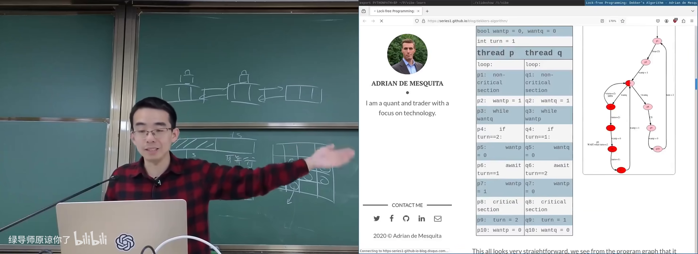

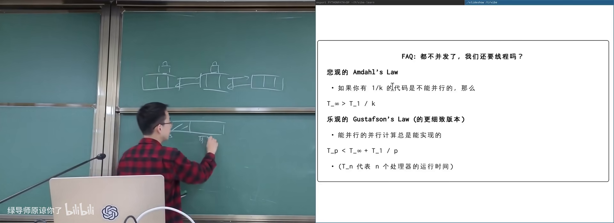

图：可关注不可并行部分成为瓶颈。

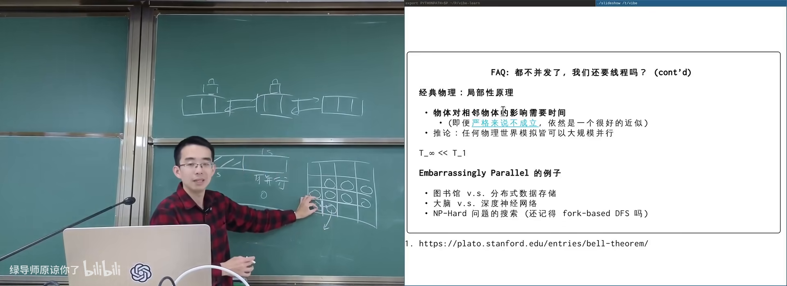

图：可关注问题规模变大时接近线性扩展。

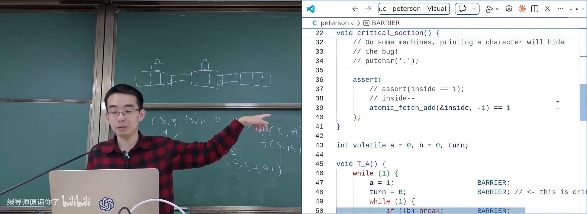

图：可关注无竞争时 CAS，有竞争时陷入内核等待。

---

## 附录：概念补给

### 互斥（mutual exclusion）

- **是什么**：同一时刻至多一个执行流进入临界区的性质/机制。
- **课上为何出现**：解决共享数据被交错破坏。
- **和什么像**：单人卫生间门锁。

### 临界区（critical section）

- **是什么**：访问共享可变数据、需要互斥的那段代码。
- **课上为何出现**：lock/unlock 包围的范围。
- **和什么像**：必须锁门才能进入的档案室。

### lock/unlock（acquire/release）

- **是什么**：获得/释放互斥锁的 API。
- **课上为何出现**：并发控制最基础原语。
- **常见误解**：unlock 还带内存可见性语义，不只是「计数减一」。

### stop the world（理解视角）

- **是什么**：把正确加锁的临界区在推理时当成世界暂停。
- **课上为何出现**：让顺序思维重新适用。
- **常见误解**：不是指实现上真的停止所有核。

### BKL（Big Kernel Lock）

- **是什么**：Linux 早期多处理器支持用的一把大内核锁。
- **课上为何出现**：说明「先正确再拆分」的工程路径。
- **和什么像**：全楼共用一把大门锁，安全但拥挤。

### 事务内存（transactional memory）

- **是什么**：让一段内存更新像数据库事务一样 all-or-nothing 的机制。
- **课上为何出现**：make it work 的理想形式。
- **常见误解**：与 malloc/文件 IO 混用极难，尚未成为通用默认方案。

### Amdahl 定律

- **是什么**：并行加速受限于程序中不可并行比例。
- **课上为何出现**：回答「上锁是否毁掉多核」。
- **和什么像**：结账只开一个柜台时，多雇导购也快不了太多。

### Gustafson 定律

- **是什么**：问题规模随核数增大时，串行占比可被压得很小。
- **课上为何出现**：乐观并行的工程含义。
- **和什么像**：货越多越值得多开卸货口。

### 一把大锁保平安

- **是什么**：用单一锁保护全部共享状态的正确性优先策略。
- **课上为何出现**：课程给初学者的明确建议。
- **常见误解**：不是永远不要细粒度，而是先对再快。

### futex

- **是什么**：用户态锁慢路径依赖的内核等待/唤醒原语之一。
- **课上为何出现**：现代 lock 如何避免纯自旋。
- **和什么像**：没钥匙时先睡着，有人还钥匙再叫醒你。

### Peterson / Dekker 算法

- **是什么**：仅用共享变量与有限硬件假设实现双进程互斥的经典软件算法。
- **课上为何出现**：历史正确性探索；现代实现的思想源头。
- **常见误解**：不能直接当作现代多核默认锁实现。

---

*书架 Shelf 流水线生成 · 内容衍生自 B 站公开课程视频 BV1hNdhB1Efe*
