# 并发控制：条件变量和万能同步方法

> **原视频**：[Bilibili · BV1t3dQBAEzd](https://www.bilibili.com/video/BV1t3dQBAEzd/)（时长约 77 分钟）
> **课程**：南京大学《操作系统原理》（2026）第 15 讲
> **整理说明**：本书由视频语音转录后经 AI 重构而成；口语已转为书面语；关键时间点标注 *(参考时间)*，截图占位对应视频位置。

---

## 1. 同步是什么

<div class="prereq" data-label="你需要先知道">

- 会用 lock/unlock 做互斥
- 知道 join 要等线程结束
- 理解线程是「独立的人」

</div>

*(参考时间: 00:00)*

互斥解决「A 与 B 不能同时进」，不解决「必须先 A 后 B」。线程一旦 spawn 就是异步的：各管各的，无法靠约定墙上的钟表强制先后——计算机里 wall-clock 时间既不存在于线程模型，用时间去对齐也极浪费。

**同步**（多个随时间变化的量在过程中保持约定关系）在现实中有许多机制：

- 同步电机靠磁场锁定；
- 同步电路靠时钟上升沿锁存触发器；
- 乐团靠指挥的手势与排练默契（人耳约 20–30ms 误差就觉得不齐）。

计算机播放音乐不断，不是因为每个线程都卡在绝对时刻，而是 **硬件缓冲 + 提前填满**：先准备好未来 20ms 的数据再播放。

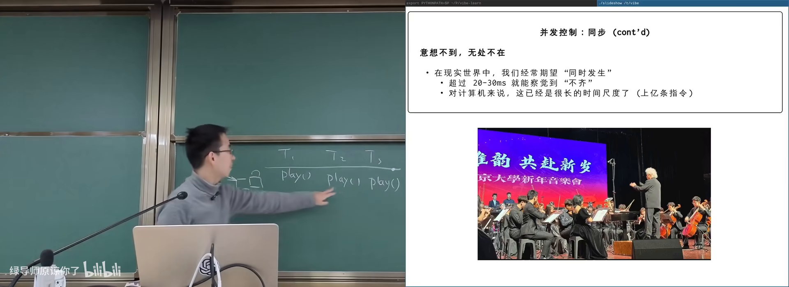

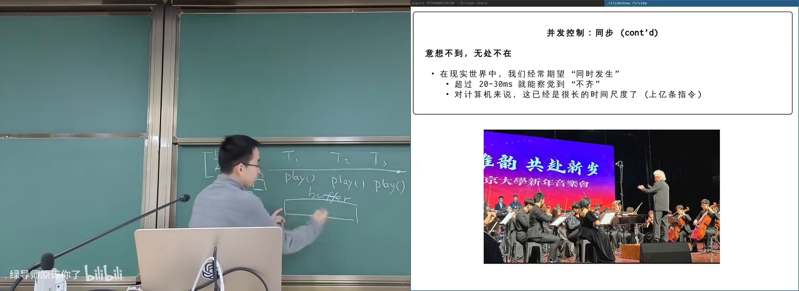

图：可关注 20ms 缓冲如何抹平调度抖动。

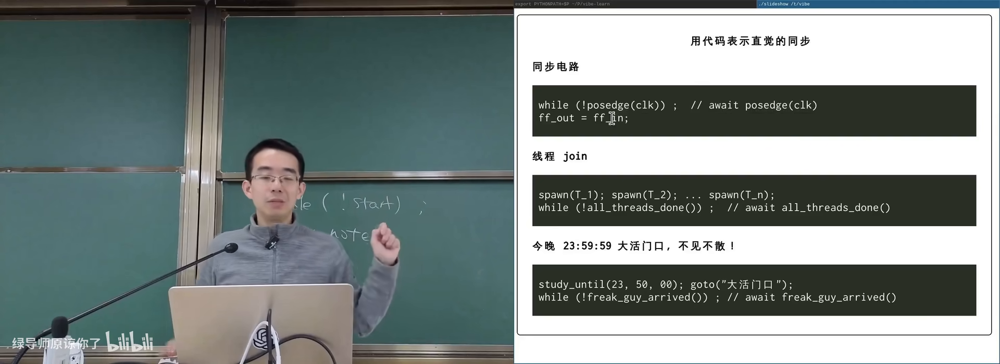

图：可关注三种场景都是「条件未达则等」。

### 1.1 共同结构：等一个条件

| 场景 | 同步条件 |
|------|----------|
| 乐手 | 指挥给出本拍 |
| 触发器模拟 | 时钟上升沿到达 |
| join | 所有工作线程结束 |
| 室友「不见不散」 | 双方都到达 |

先到者必须**等待**；条件达成瞬间形成**全局同步状态**——此时可以用 assert 写清世界是什么样。同步也定义 **happens-before**（A 发生在 B 之前的时间偏序）：同步点之前的事先于之后的事。

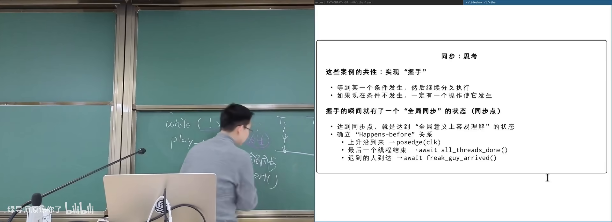


---

## 2. 自己实现同步：正确但浪费

<div class="prereq" data-label="你需要先知道">

- 读过本册第 1 章
- 会对共享变量加锁

</div>

*(参考时间: 00:16:40)*

目标：多个演奏线程都等指挥「放拍」。共享状态例如 `conductor.beat`。

```c
// 等待同步条件（示意）
do {
  lock(m);
  int b = conductor.beat;
  unlock(m);
  if (b >= my_target) return;
  /* 忙等：不断再检查 */
} while (1);
```

指挥线程在回车后 `lock`，`beat++`，`unlock`。

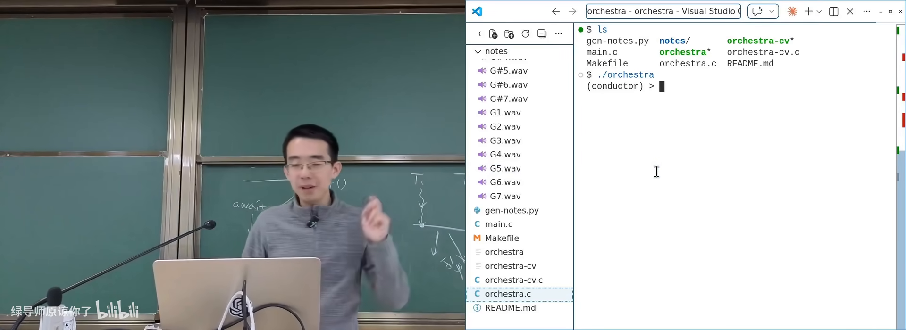

图：可关注「条件不满足时线程全部卡住」。

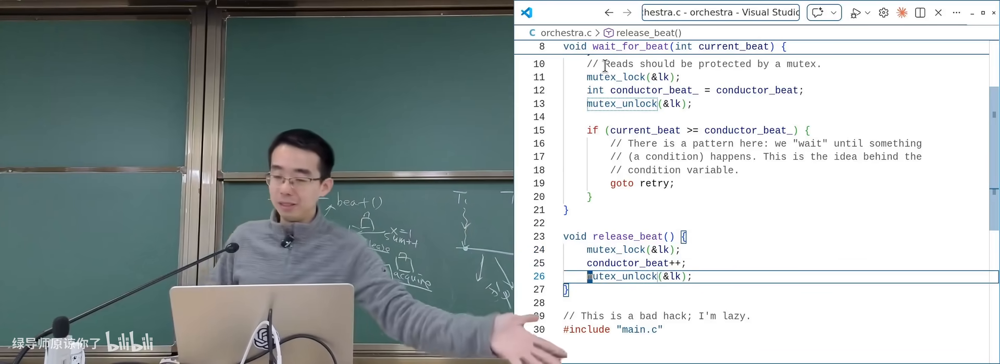

图：可关注循环读 beat 号的 spin 结构。

问题：忙等（spin，空转着反复检查条件）浪费 CPU。同步条件可能几秒甚至几天才满足，让出 CPU 才合理。

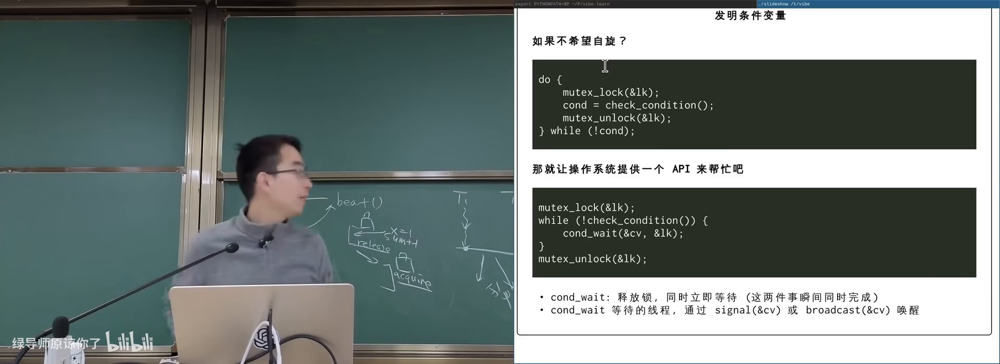

---

## 3. 条件变量与万能模板

<div class="prereq" data-label="你需要先知道">

- 读过本册第 2 章
- 知道锁的 release 与下一次 acquire 之间有可见性保证

</div>

*(参考时间: 00:25:00)*

**条件变量**（condition variable，让线程在条件不满足时睡眠、条件可能满足时被唤醒的同步原语）把「检查条件 + 睡眠」做成库/系统接口，底层多由 futex 等实现。

### 3.1 万能同步模板

```text
lock(mutex)
while (!condition) {
  cond_wait(cv, mutex)   // 原子地：释放锁 + 睡眠
                         // 被唤醒后再 acquire 锁，回到循环
}
/* 持有锁，且 condition 为真 */
... 临界操作 ...
unlock(mutex)
```

**改条件的一方**（持同一把锁）：

```text
lock(mutex)
/* 修改共享状态，使 condition 可能为真 */
cond_broadcast(cv)
unlock(mutex)
```

### 3.2 wait 语义为何关键

`cond_wait` 必须**原子**完成「放锁 + 入睡」，避免：刚放锁就被唤醒却再次睡着（丢信号）。返回前会重新抢锁；回到 `while` 再检查条件——防止虚假唤醒或条件已被别人消耗。

因此模板给出的不变量：

- 循环体内（睡眠点）：持有锁，且条件不满足；
- 循环退出后：**持有锁，且条件满足**——正是可 assert 的全局同步状态。

课程建议：凡可能让条件成立的代码路径，持锁 `broadcast` 即可，正确性优先于精打细算的 `signal`。

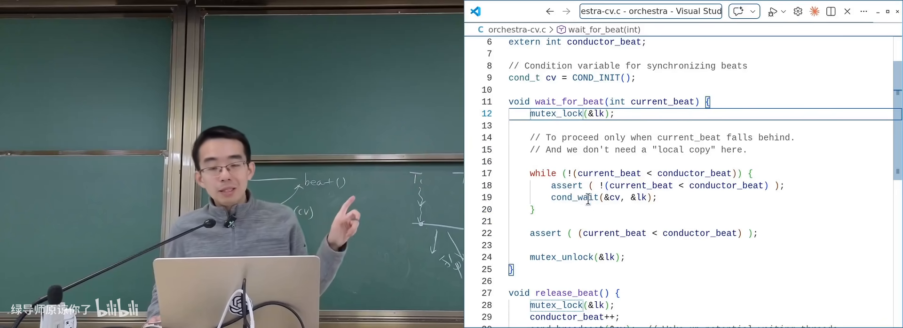

图：可关注 wait 释放锁、唤醒后重新加锁。

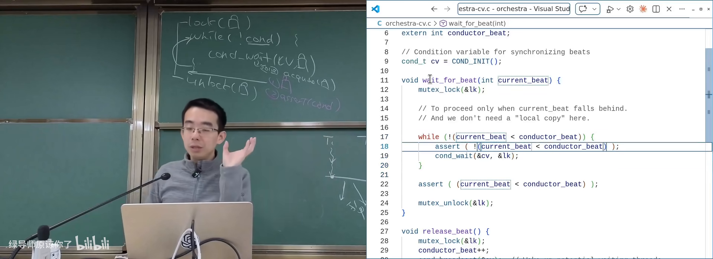

图：可关注模板给出的可验证不变量。

---

## 4. 生产者–消费者：同步的主模型

<div class="prereq" data-label="你需要先知道">

- 读过本册第 3 章模板
- 知道队列/缓冲区概念

</div>

*(参考时间: 00:37:50)*

**生产者–消费者**（一类线程放入任务/数据，另一类取走处理；共享有界缓冲区）也叫 master–slave（现多称 scheduler–worker，调度者与工人）。HTTP 网关放请求、后端取请求处理，教务系统即此模型。

约束：

- 缓冲区有界，满时生产者等、空时消费者等；
- 放入与取出都必须互斥访问缓冲结构。

同步条件写法：

- 生产者：`while (count == capacity) wait;`
- 消费者：`while (count == 0) wait;`
- 生产成功后 `count++` 并 broadcast；
- 消费成功后 `count--` 并 broadcast。

经典变体：打印左右括号——两类生产/消费约束嵌套深度。

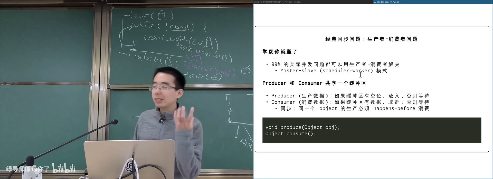

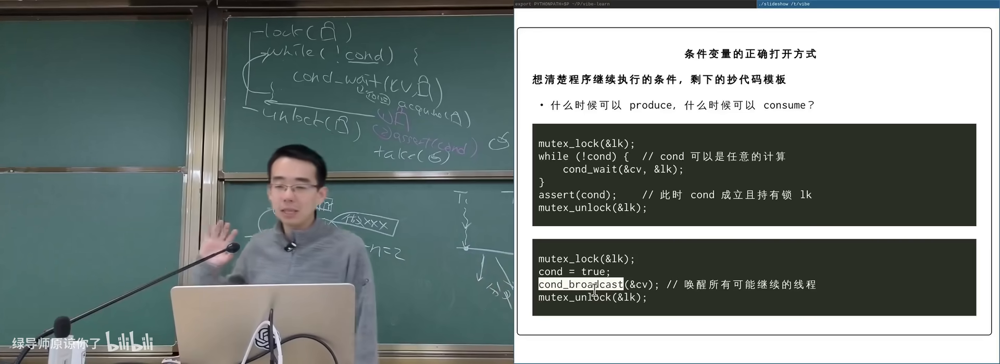

图：可关注生产者/消费者各自的等待条件。

---

## 5. 计算图：万能方法的结构化形态

<div class="prereq" data-label="你需要先知道">

- 知道有向无环图 DAG
- 听过拓扑排序

</div>

*(参考时间: 00:50:00，综合后半课）

许多问题可写成**计算图**（节点=计算，边=依赖）：

- makefile 依赖；
- 数据流变量依赖；
- 神经网络层。

无依赖的节点可并行。用条件变量实现：

- 每节点维护 `pred_done` 计数；
- `while (pred_done != indegree) wait;`
- 计算完成后对每个后继增加计数并 broadcast。

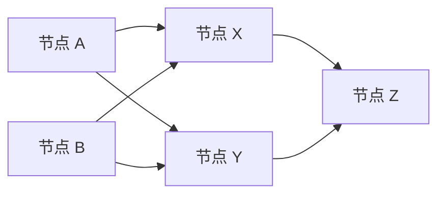

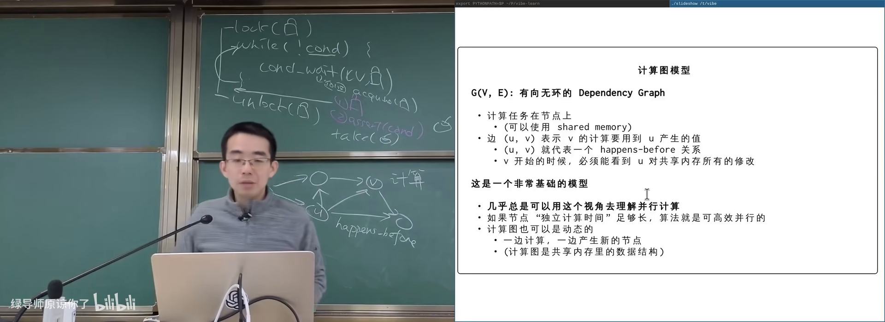

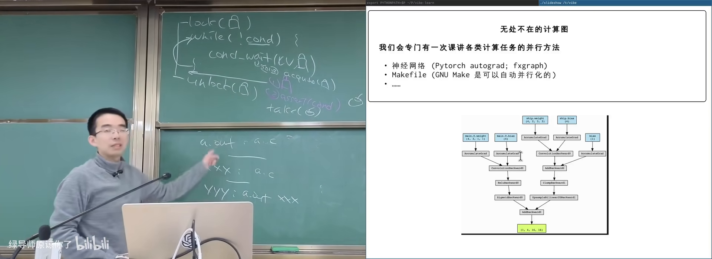

图：可关注 while (pred_done != indegree) 的条件变量写法。

同一框架覆盖 join、电路模拟、生产者消费者：只要把**同步条件写成逻辑表达式**，套用模板即可——这就是课上所说的万能同步方法。

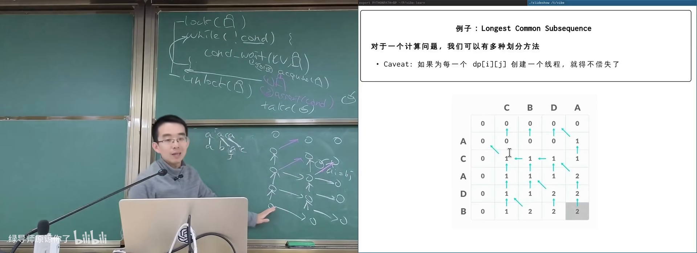

---

## 附录：概念补给

### 同步（synchronization）

- **是什么**：使多个执行流在约定的相对时序上推进。
- **课上为何出现**：互斥之外的另一大并发控制目标。
- **和什么像**：乐队按指挥把拍子对齐。

### 异步（asynchronous）

- **是什么**：各执行流独立推进、不保证相对先后。
- **课上为何出现**：spawn 后的默认状态。
- **和什么像**：各自出发，谁先到不确定。

### happens-before

- **是什么**：程序语义中事件先后的偏序关系。
- **课上为何出现**：同步点建立可推理的时间隔断。
- **和什么像**：必须先报名才能考试。

### 忙等 / 自旋等待（spin）

- **是什么**：不睡眠，反复检查条件。
- **课上为何出现**：正确但不经济的同步实现。
- **常见误解**：不是所有等待都该 spin；条件很久才成立时应睡。

### 条件变量（condition variable）

- **是什么**：配合互斥锁等待布尔/逻辑条件的原语（wait/signal/broadcast）。
- **课上为何出现**：把 spin-loop 变成可睡眠的高效版本。
- **和什么像**：挂号后在休息区等叫号，而不是堵在窗口吼。

### cond_wait / signal / broadcast

- **是什么**：睡眠等待 / 叫醒一个 / 叫醒全部。
- **课上为何出现**：模板三件套。
- **常见误解**：wait 返回后必须 while 再查条件；单用 if 不够稳妥。

### 虚假唤醒（spurious wakeup）

- **是什么**：wait 可能无明确原因返回，条件仍假。
- **课上为何出现**：解释 while 而非 if。
- **和什么像**：闹钟误响，你仍要看表再决定起不起。

### 万能同步模板

- **是什么**：lock → while(!cond) wait → 临界区 → unlock；改条件后 broadcast。
- **课上为何出现**：把并发问题还原为「写出 cond」。
- **和什么像**：一套通用题型解法：关键是把题目翻译成条件。

### 生产者–消费者

- **是什么**：有界缓冲区上放/取任务的经典并发模型。
- **课上为何出现**：覆盖面极广的工程形态。
- **和什么像**：食堂窗口排队打饭：菜不够等、窗口满了也等。

### 计算图 / DAG

- **是什么**：节点为任务、边为依赖的有向无环图。
- **课上为何出现**：同步问题的结构化总框架。
- **和什么像**：实验步骤卡：必须先完成前置步骤。

### broadcast 优先

- **是什么**：条件可能成立时唤醒所有等待者，再各自查条件。
- **课上为何出现**：课程推荐的默认正确写法。
- **常见误解**：省 signal 有时对，但极易写漏唤醒路径。

---

*书架 Shelf 流水线生成 · 内容衍生自 B 站公开课程视频 BV1t3dQBAEzd*
