# 并发控制：信号量

> **原视频**：[Bilibili · BV1yQogB2Esf](https://www.bilibili.com/video/BV1yQogB2Esf/)（时长约 86 分钟）
> **课程**：南京大学《操作系统原理》（2026）第 16 讲
> **整理说明**：本书由视频语音转录后经 AI 重构而成；口语已转为书面语；关键时间点标注 *(参考时间)*，截图占位对应视频位置。

---

## 1. 从条件变量到「钥匙与桌子」

<div class="prereq" data-label="你需要先知道">

- 熟练条件变量万能模板
- 知道 join、计算图依赖
- 理解 lock 的 acquire/release 与可见性

</div>

*(参考时间: 00:00)*

条件变量模板：持锁、while 条件不满足则 wait、条件可能成立则 broadcast。上讲计算图可用每节点计数实现。

有同学想到更「物理」的做法：把每条依赖边对应一把锁，main 先把锁都 lock（没收钥匙），前驱完成后再在对应锁上 unlock，后继 acquire 到锁即 happens-before。

逻辑可行，但 POSIX 要求 **acquire/release 同一线程配对**；跨线程 unlock 属未定义行为（库内 fast-path 优化依赖同线程假设）。

于是需要一种**允许跨线程传递许可**的原语——信号量。

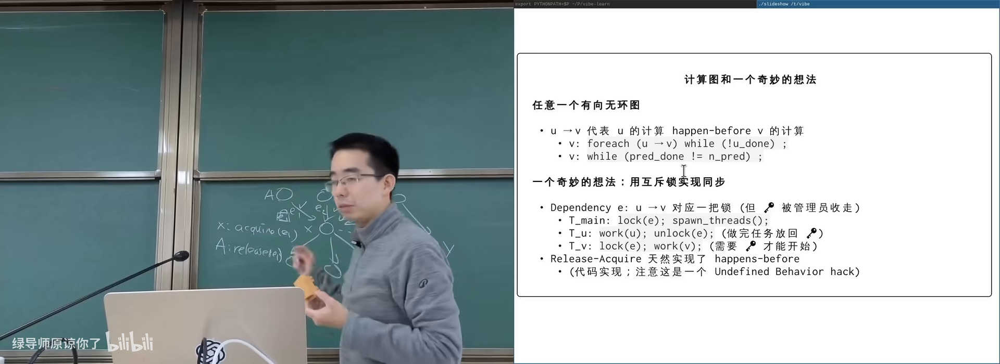

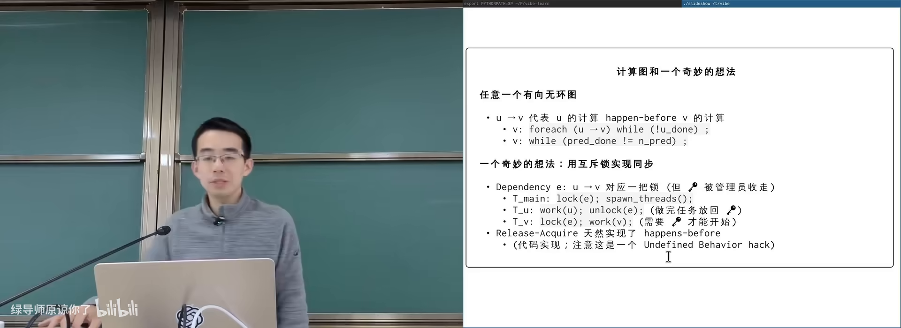

图：可关注节点 X 等待多条入边完成。


---

## 2. 发明信号量

<div class="prereq" data-label="你需要先知道">

- 读过本册第 1 章
- 有停车场/游泳馆排队的生活经验即可

</div>

*(参考时间: 00:14:00)*

把互斥锁的「一把钥匙」推广为「**若干份许可**」：

- **P**（acquire / down / wait）：许可数 >0 则取走一份并继续，否则睡眠等待；
- **V**（release / up / signal）：放回一份许可，并可能唤醒等待者。

生活对应：

| 场景 | 许可 |
|------|------|
| 停车场 | 余位（闸门处计数） |
| 游泳馆 | 手环数量 |
| 餐厅 | 空桌数 |

Dijkstra 提出的 **信号量**（semaphore，带计数的同步原语，用 P/V 操作增减许可）正是这一模型。P 是 try-and-decrease，V 是 increase/post。

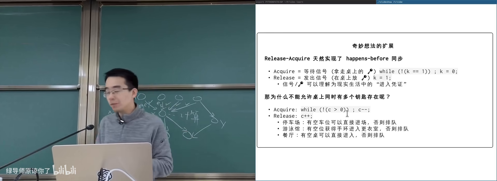

图：可关注「只管入口配额，不管场内如何停车」。

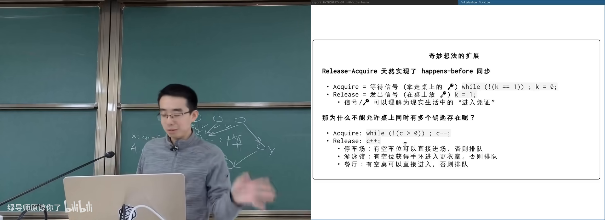

图：可关注许可发放与归还。

### 2.1 计数如何工作

初始 count=4 时，前四个 P 依次看到 4→3→2→1 并返回；第五个 P 在 count=0 时阻塞。任一线程 V 后 count 上升，等待者可被唤醒继续；全部归还后 count 回到 4。

实现上仍可是条件变量 + 互斥 + count（万能模板），但 API 语义是计数许可。

### 2.2 信号量只管入口

P 返回仅保证「至少还有一份许可被你占用」；缓冲区里具体选哪一格，仍要数据结构内部自己加锁协调。违规 V 两次会「凭空多出车位」，破坏互斥。

---

## 3. 信号量 vs 条件变量

<div class="prereq" data-label="你需要先知道">

- 读过本册第 2 章
- 用过 join 与计算图

</div>

*(参考时间: 00:22:00)*

**count=1 的信号量就是互斥锁**——互斥是信号量的特例，信号量是互斥的扩展。

| | 条件变量 | 信号量 |
|--|----------|--------|
| 心智模型 | 写出逻辑条件 cond | 想清楚谁放钥匙、谁取钥匙 |
| 计数资源 | 要自己写 count+cond | 天生支持 |
| 跨线程交接 | 靠共享状态+broadcast | V 与 P 天然跨线程 |

### 3.1 用信号量实现 join

两种等价写法：

1. **每线程一张桌子**：各自初始化 count=0；线程结束 V；main 对每个线程各 P 一次；
2. **一张桌子**：全局 count=0；每个线程结束都 V；main 已知线程数则 P 相应次数。

```c
sem_t done; // init 0
// worker 结束时: sem_post(&done);
// main: for (i=0;i<n;i++) sem_wait(&done);
```

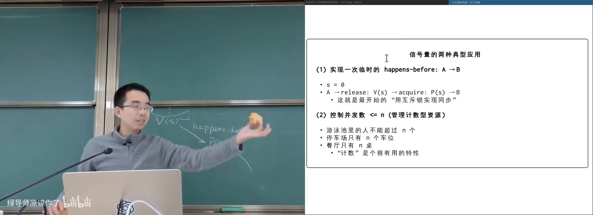

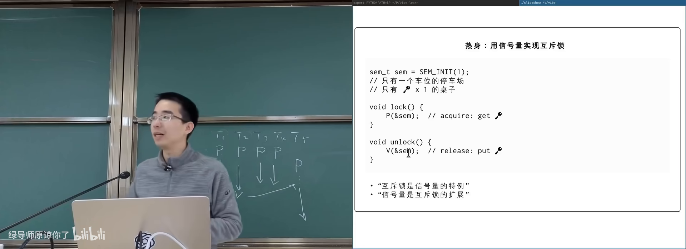

图：可关注只有一个车位的停车场。

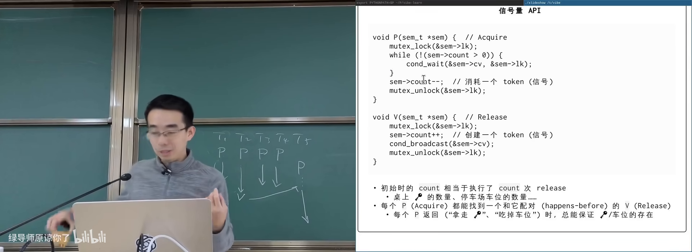

图：可关注 P/V 与万能模板的对应。

### 3.2 计算图

- **边上信号量**：每条依赖一个 count=0 的桌子；后继对每个入边 P，前驱对每条出边 V；
- **节点上信号量**：节点 count=0；执行前按入度 P 次，结束后对每个后继 V。

运行顺序与条件变量版一致（0，然后 1/2/3 并行，最后 complete）。

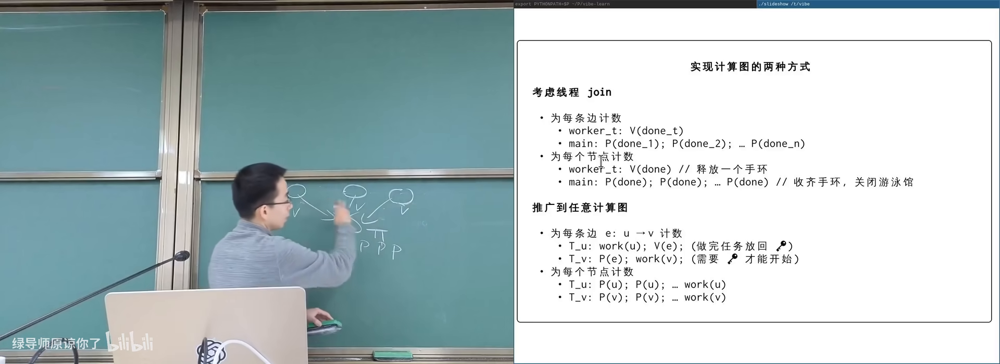

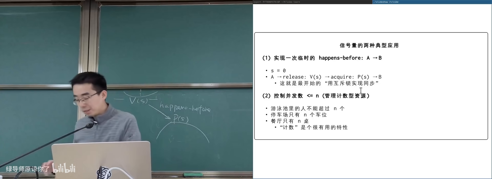

图：可关注前驱 V 出边、后继 P 入边。

---

## 4. 生产者–消费者：empty 与 full

<div class="prereq" data-label="你需要先知道">

- 读过本册第 3 章
- 知道有界缓冲区

</div>

*(参考时间: 00:34:00)*

两个信号量表达极为对称的模型：

- `empty`：缓冲区空槽数量（初始 = capacity）；
- `full`：已填充数量（初始 = 0）。

```text
Producer:                      Consumer:
  P(empty)                       P(full)
  /* 生产，写入 buffer */         /* 消费，读出 buffer */
  V(full)                        V(empty)
```

加上保护 buffer 本身的互斥锁即可。含义：

- `empty` 桌上的每个小球 = 一个空槽；
- `full` 桌上的每个小球 = 一个可消费数据项；
- 生产 = 从 empty 拿走许可，做完事后放到 full；
- 消费 = 从 full 拿走许可，处理完后把空槽还给 empty。

全局不变式：empty + full +（已拿走许可尚未完成交接的中间态）与容量相关；正确配对下缓冲不会越界。

课程用打印左/右括号演示：生产者打印 `(` 对应 V(full) 一类交接，消费者打印 `)`，嵌套深度由容量约束。

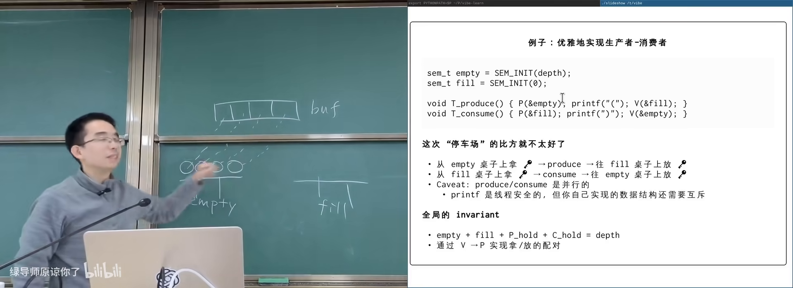

图：可关注两桌小球此消彼长。

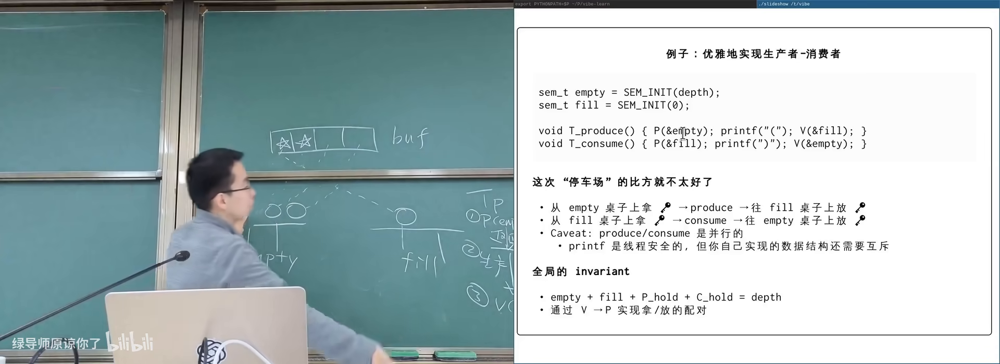

图：可关注 producer 从 empty 拿许可、consumer 还 empty。

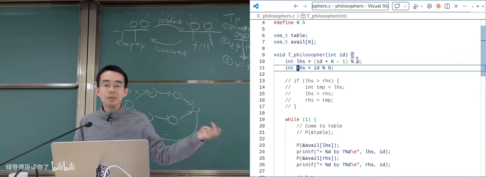

图：可关注计数资源 vs 逻辑条件两种心智模型。

### 4.1 何时用谁

- 问题本质是**条件表达式** → 条件变量更直接、可 assert；
- 问题本质是**计数资源 / 事件计数 / 任务交接** → 信号量往往更短、更不容易漏条件。

两者都建立 happens-before，都可实现几乎全部同步问题。

---

## 附录：概念补给

### 信号量（semaphore）

- **是什么**：带非负计数的同步原语；P 减、V 加，P 在零时等待。
- **课上为何出现**：跨线程传递许可，覆盖计数型同步。
- **和什么像**：停车场余位计数器 + 闸门。

### P / V 操作

- **是什么**：信号量上等待并减一 / 增加并可能唤醒。
- **课上为何出现**：Dijkstra 命名的荷兰语词源 API。
- **常见误解**：P/V 不是「生产/消费」，而是 down/up。

### 互斥锁是信号量特例

- **是什么**：count 初始为 1 的信号量。
- **课上为何出现**：统一两套工具的语义。
- **和什么像**：只有一个车位的停车场 = 一次只能进一辆车。

### empty / full 信号量

- **是什么**：生产者消费者中分别表示空槽数与已填数。
- **课上为何出现**：标准双信号量解法。
- **和什么像**：空碗数与已盛汤碗数。

### 许可 / token / 钥匙

- **是什么**：信号量计数的物理直觉对象。
- **课上为何出现**：避免一上来就陷入公式。
- **和什么像**：演唱会手环：有环才能进场。

### happens-before（经信号量）

- **是什么**：V 之前的操作先于对应 P 之后的操作。
- **课上为何出现**：信号量实现 join/计算图的正确性根据。
- **和什么像**：交接班签字：上一班事项算在下一班开工前完成。

### 未定义行为（跨线程 unlock 互斥锁）

- **是什么**：标准/实现不保证的用法。
- **课上为何出现**：说明为何需要信号量而非裸锁交接。
- **常见误解**：看起来逻辑对，不代表库实现支持。

### scheduler–worker / 生产者消费者别名

- **是什么**：同一主从任务分发模型的不同称呼。
- **课上为何出现**：API 与现实系统结构对应。
- **和什么像**：老师发卷子，学生做题交卷。

---

*书架 Shelf 流水线生成 · 内容衍生自 B 站公开课程视频 BV1yQogB2Esf*
