# 并发 Bugs 和应对

> **原视频**：[Bilibili · BV1Jg96BjE68](https://www.bilibili.com/video/BV1Jg96BjE68/)（时长约 89 分钟）
> **课程**：南京大学《操作系统原理》（2026）第 17 讲
> **整理说明**：本书由视频语音转录后经 AI 重构而成；口语已转为书面语；关键时间点标注 *(参考时间)*，截图占位对应视频位置。

---

## 1. Learning from mistakes

- 会用 spawn/join、lock/unlock
- 听过条件变量与信号量
- 知道人类天生更适应顺序思维

*(参考时间: 00:00)*

并发 API 已齐：线程库 + 互斥 + 同步 + PV，理论上可以写任意并发程序。但人类被训练成「物理世界里视角很小的顺序执行者」，并发程序容易产生**顺序幻觉**；理解所有交错是 NP-hard 量级。

本讲 **Learning from mistakes**：真实并发 bug 长什么样、人类如何系统应对。

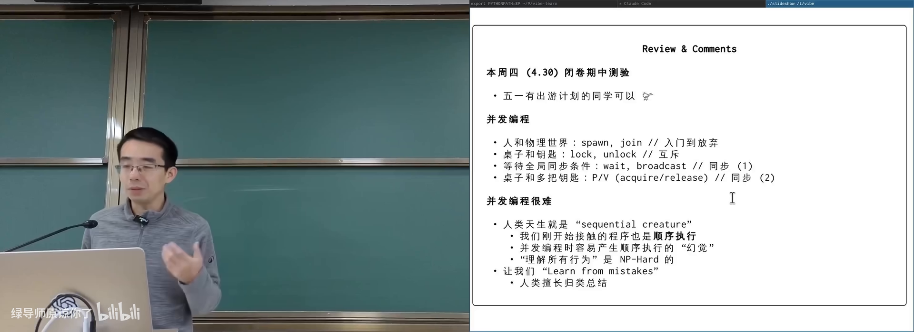

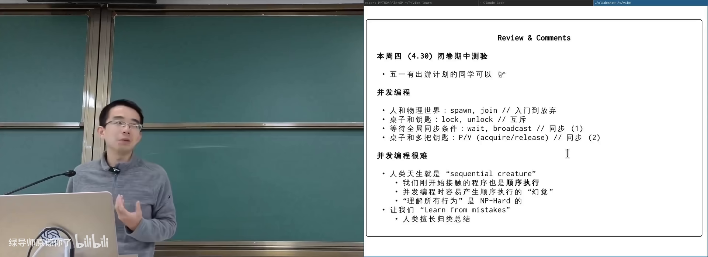

图：可关注课程工具箱（spawn/lock/cond/PV）回顾。

---

## 2. 死锁

- 知道 lock 不配对 unlock 会卡死
- 大致了解哲学家就餐

*(参考时间: 00:02:50)*

**死锁**（deadlock，一组线程互相等待对方持有的资源，全体无法继续）症状直观：程序「该结束却不结束」，日志突然静默。

### 2.1 AA 型

同一线程对**同一把锁** lock 两次。若锁不可重入（non-recursive，第二次 acquire 会等自己释放），则永久阻塞。

课堂演示：`lock(A); print; lock(A); print;`——第二条 print 永不出现。

真实场景并非「十行玩具代码」：函数调用栈很深时，外层已持锁，信号处理/回调路径又试图 acquire 同一锁，即可形成 AA。

### 2.2 ABBA 型（最常见）

- T1：`lock(A)` … `lock(B)`
- T2：`lock(B)` … `lock(A)`

交错后循环等待。哲学家就餐（各先拿左手叉子）是环形扩展版。

好消息：死锁相对容易**观察**（无进展 + gdb 看线程都阻塞在 lock）。

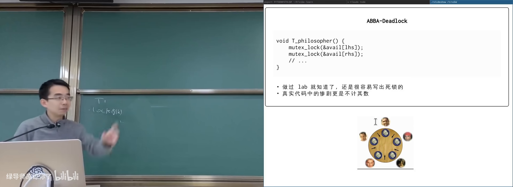

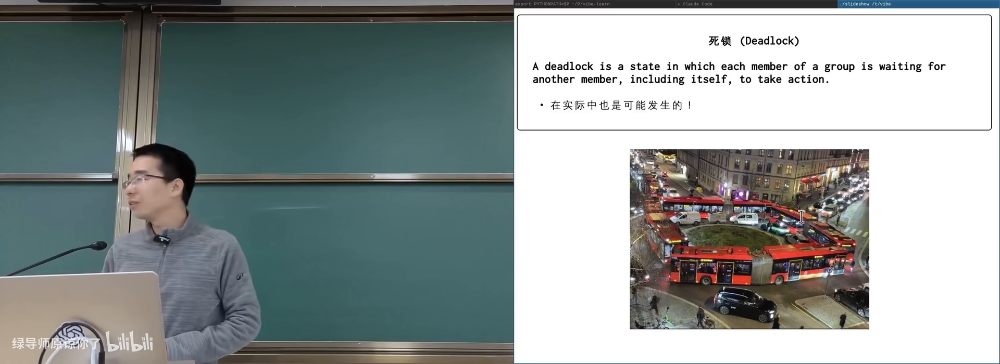

图：可关注「无人能 make progress」的物理类比。

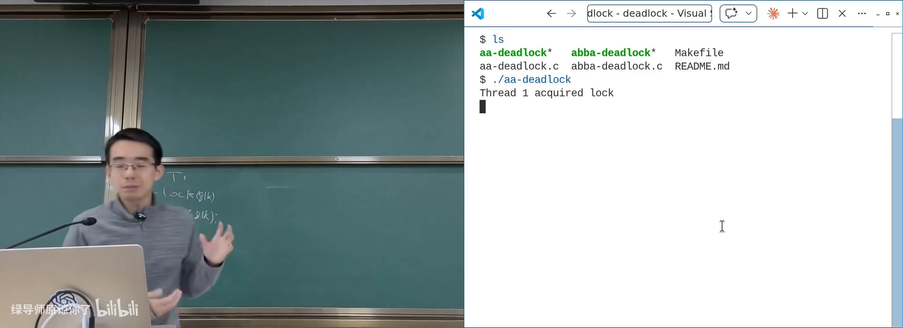

图：可关注第二条 print 未出现。

---

## 3. 死锁的四个必要条件

- 读过本册第 2 章
- 知道「必要条件」：打破任一条则死锁不发生

*(参考时间: 00:12:30)*

经典文献 *System Deadlocks*（1971）给出的必要条件：

| 条件 | 含义 | 打破难度 |
|------|------|----------|
| Mutual exclusion | 资源互斥使用 | 颠覆锁定义 |
| Hold and wait | 已持有还想再要 | 大锁/事务 |
| No preemption | 不能抢走别人已持有的 | 需回滚 |
| Circular wait | 等待成环 | **工程上最可行** |

对四个条件的空话式复述（「设计时注意不要让它们成立」）没有操作性；真正有价值的是逐条思考会打开哪些技术分支：

- 违反互斥 → 消息传递 / master–worker，减少直接共享锁；
- 违反 hold-and-wait → 一把大锁；或 **atomic 代码块** / 事务内存（all-or-nothing）；
- 违反 no-preemption → 抢锁必须回滚副作用，仍指向事务；
- 违反 circular wait → **锁顺序**（lock ordering）。

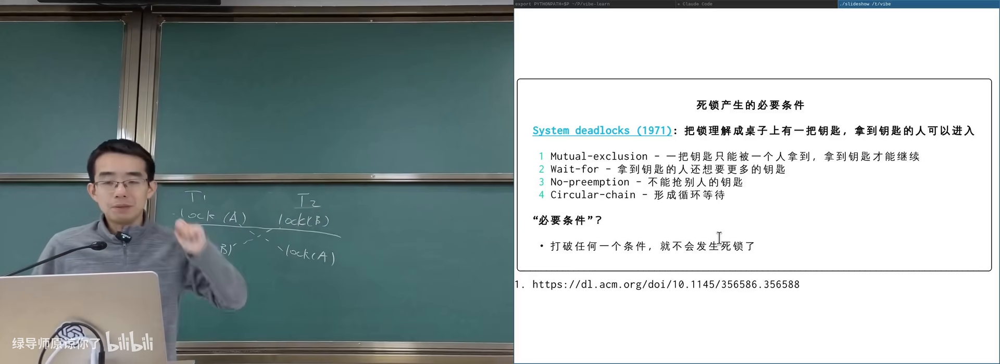

图：可关注每条对应的设计分支，而不是背名词。

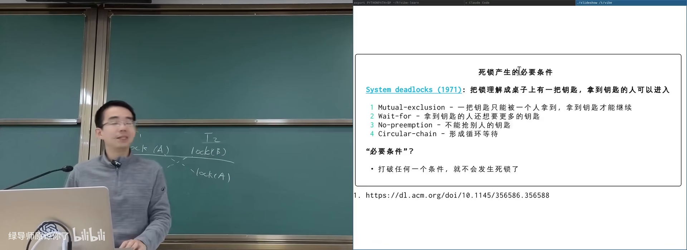

图：可关注原始文献而非二手条目。

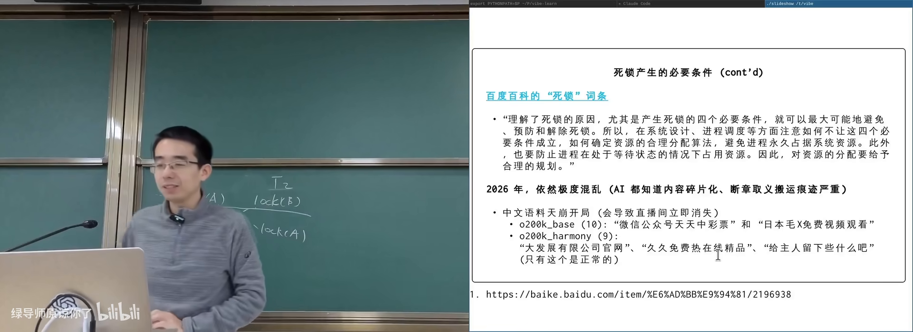

图：可关注「必要条件」应导向可实施机制。

### 3.1 lock ordering

给所有锁全局编号，强制**从小到大**获取。则任意时刻系统中必有线程持有「当前编号最大」的锁，它不必再等更大编号，可继续执行并最终释放——不会全体环等。

哲学家就餐中「有一人先拿右手叉子」即打破对称环。Linux 内核文档（如 rmap）明确写锁序。扩展到锁组：按组号排序，组内再保证顺序。

仍困难：静态证明程序满足锁序与 Rice 定理相关；文档与实现可能不一致（研究称相当比例 locking rule 文档过时）。

### 3.2 工程实践：假设程序员会写错

大型系统的防御性原则：**做最坏假设**。并发 bug 可能 99.999% 路径不触发，上线后亿级用户撞上罕见交错。

可落地手段：

1. **goto release 模式**（C 内核风格）：所有错误路径跳到统一释放点，检查 buffer/锁是否归还；
2. **RAII**：C++/Rust 作用域结束自动 unlock；
3. **锁序检查器**：`LD_PRELOAD` 覆盖 lock/unlock，记录线程锁获取顺序，维护等待图，发现新边导致成环即告警（lockdep 一类思路）。

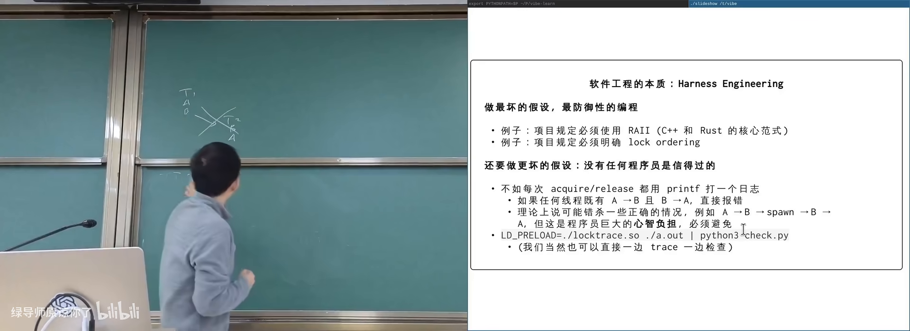

图：可关注「图中出现环 = 潜在 ABBA」。

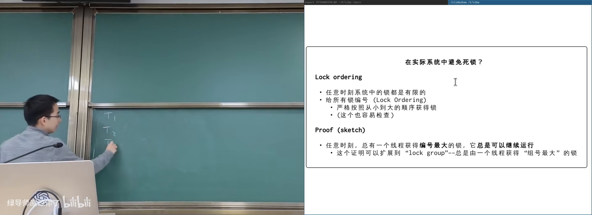

图：可关注编号最大者仍可继续执行。

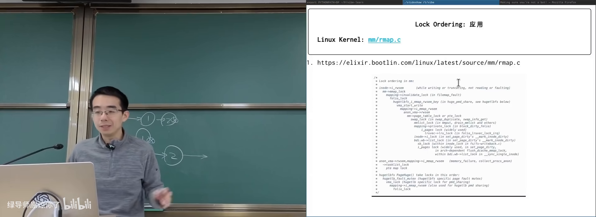

图：可关注真实项目如何写明加锁顺序。

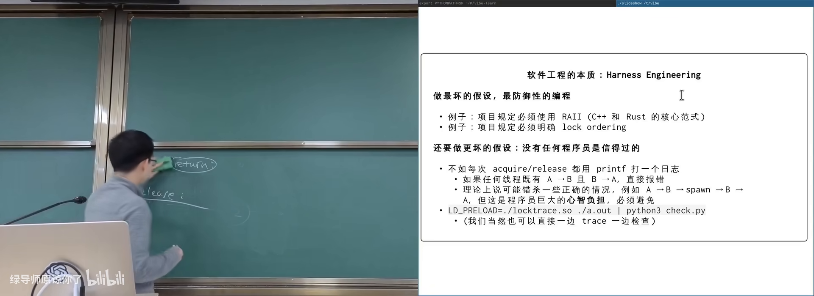

图：可关注错误路径不直接 return。

---

## 4. 数据竞争与更多并发 Bug

- 读过本册第 3 章
- 知道 sum++ 交错与 UB

*(参考时间: 00:42:00 后半课）

### 4.1 数据竞争（data race）

两个以上线程访问同一内存、至少一个写、没有同步——C/C++ 中是未定义行为。它比「结果偶尔不对」更严重：编译器优化可删除/合并访存，使代码与源码字面意思都不再对应。

工具：ThreadSanitizer 等动态检查；规范上应靠锁或原子操作。

### 4.2 死锁之外的常见问题（课程后半归纳）

结合前文与并发实践，高频问题还包括：

- **遗漏/错锁**：同一逻辑变量用两把锁；只在部分路径上锁；
- **优先级反转**：低优先级持锁阻塞高优先级（实时系统经典）；
- **活锁**：一直「有动作」但无进展（反复互相谦让）；
- **饥饿**：个别线程长期拿不到锁；
- **性能型 bug**：锁粒度过粗导致扩展性崩溃；
- **与 I/O/信号交叉**：持锁时做慢系统调用或在信号里再加锁。

应对总纲仍是：

1. 正确性优先（一把大锁 → 按测量拆分）；
2. 条件写清楚（条件变量）/ 计数用信号量；
3. 锁序 + 防御式释放；
4. 工具与 harness（sanitizer、lockdep、持续压力测试）；
5. 接受「测过 ≠ 无 bug」，为线上可观测性留钩子。

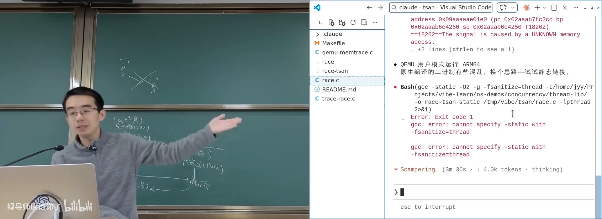

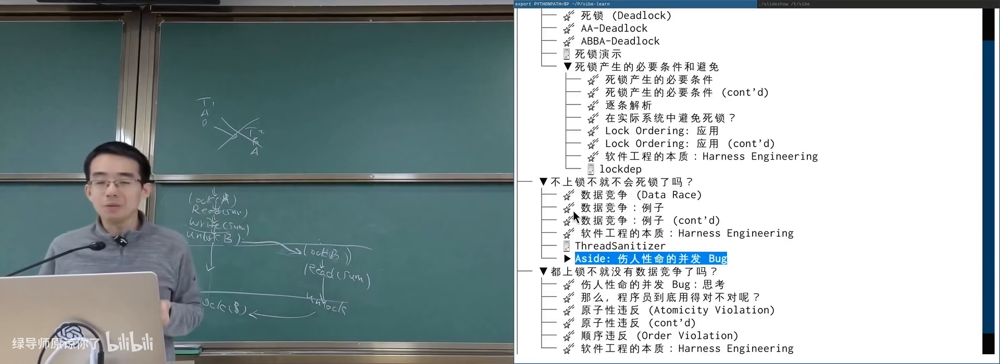

图：可关注至少一写且无 happens-before。

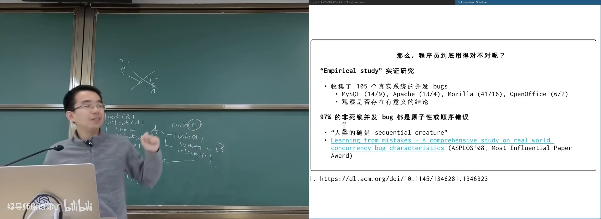

图：可关注拆锁后 easy test 也可能变红。

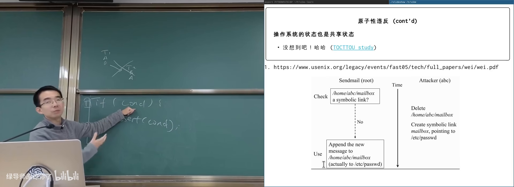

图：可关注「测过 ≠ 无 bug」的 harness 化思路。

---

## 附录：概念补给

### 死锁（deadlock）

- **是什么**：多个线程互相等待，系统无进展。
- **课上为何出现**：互斥的最著名代价。
- **和什么像**：两车在窄巷互不相让。

### AA 型死锁

- **是什么**：同一线程重复获取同一把不可重入锁。
- **课上为何出现**：最简单的死锁演示。
- **常见误解**：「我不会写这么蠢」——深层调用+回调时很常见。

### ABBA 型死锁

- **是什么**：两线程以相反顺序获取两把锁。
- **课上为何出现**：实际系统最常见形态。
- **和什么像**：哲学家都先伸左手。

### 可重入锁 / 不可重入

- **是什么**：同一线程能否多次 acquire 同一锁。
- **课上为何出现**：决定 AA 是否立刻卡死。
- **和什么像**：自家门钥匙能否再开自家门（取决于锁的设计）。

### 四个必要条件

- **是什么**：互斥、占有并等待、不可抢占、循环等待。
- **课上为何出现**：系统分析死锁的经典框架。
- **常见误解**：背条文没用，要对每条问「怎么在系统里破坏它」。

### lock ordering（锁顺序）

- **是什么**：按全局编号顺序加锁，破坏循环等待。
- **课上为何出现**：工程上最可操作的防死锁手段。
- **和什么像**：规定只能从低号会议室开到高号。

### lockdep / 锁序检查

- **是什么**：运行时记录加锁顺序并在成环时告警的工具/机制。
- **课上为何出现**：假设人会写错，用 harness 驾驭。
- **和什么像**：仓库门禁：发现异常进出记录就报警。

### 数据竞争（data race）

- **是什么**：无同步的冲突内存访问。
- **课上为何出现**：并发 correctness 的底线问题。
- **常见误解**：不是「偶尔读旧值」，而是语言层面 UB。

### 活锁 / 饥饿

- **是什么**：持续动作却无进展 / 某线程长期得不到资源。
- **课上为何出现**：死锁之外的进展性失败。
- **和什么像**：走廊里两人反复侧身让行反而都过不去。

### 防御式编程 / harness engineering

- **是什么**：假定代码会错，用模式与工具限制爆炸半径。
- **课上为何出现**：并发与 AI 编程时代的通用工程态度。
- **和什么像**：安全绳与护栏：不指望永不摔，而是摔了不断命。

### goto release

- **是什么**：C 代码中统一跳到资源释放路径的惯用法。
- **课上为何出现**：降低「多 return 漏 unlock」概率。
- **常见误解**：不是滥用 goto 写业务，而是错误路径收束。

### RAII

- **是什么**：作用域绑定资源生命周期，退出时自动释放。
- **课上为何出现**：锁与内存的现代配对手段。
- **和什么像**：借还自动记账的门禁系统。

### ThreadSanitizer（TSan）

- **是什么**：动态检测数据竞争的编译器插桩工具。
- **课上为何出现**：race 难以靠肉眼与偶测发现。
- **和什么像**：给共享文件装「同时改写」传感器。

---

*书架 Shelf 流水线生成 · 内容衍生自 B 站公开课程视频 BV1Jg96BjE68*
