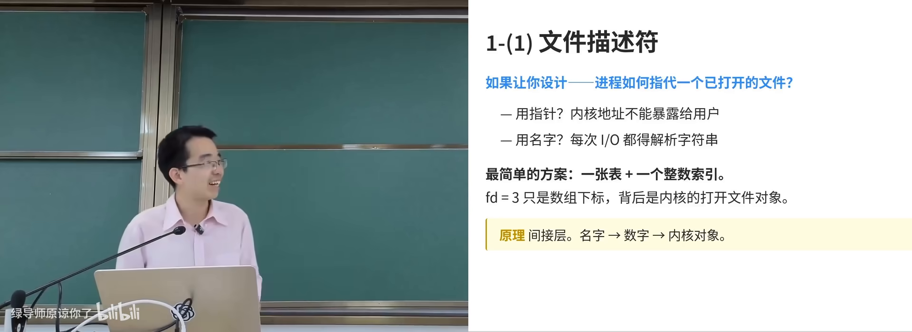
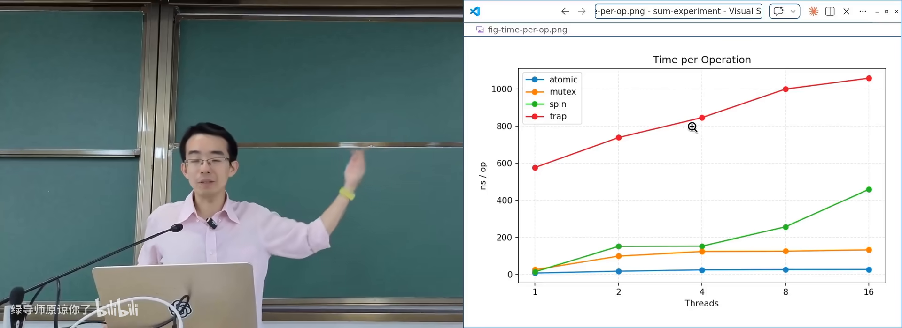
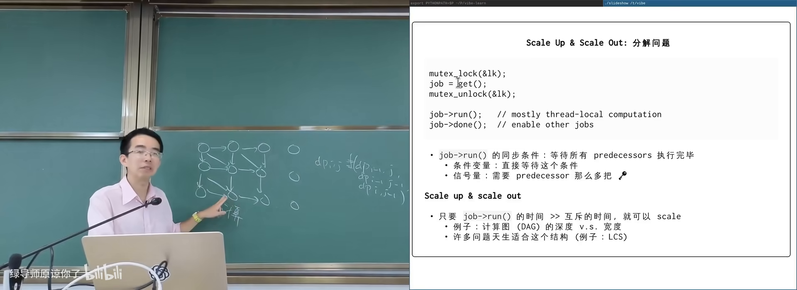
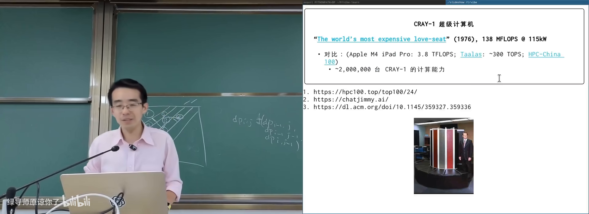
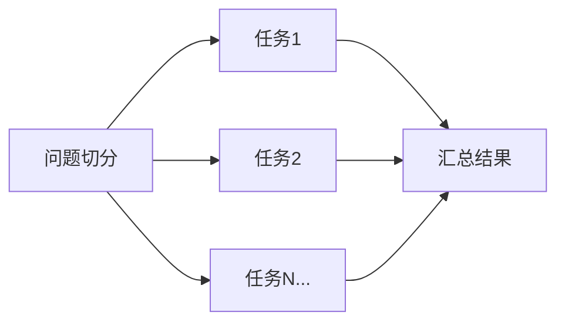
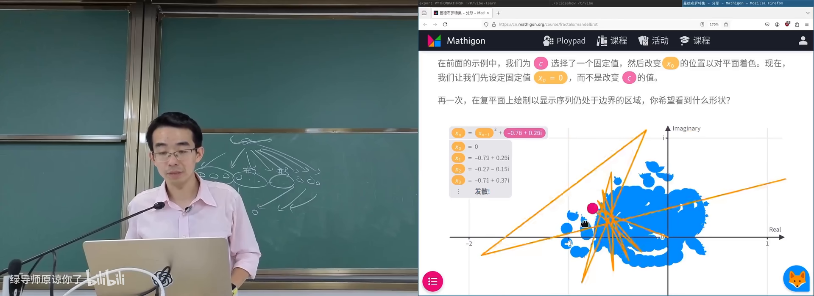
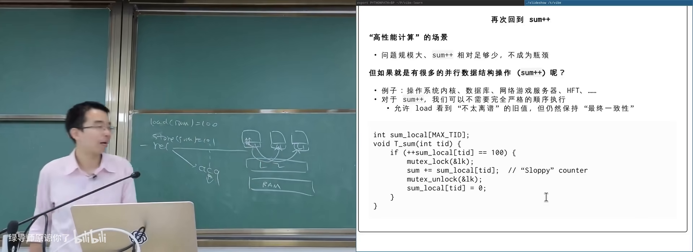
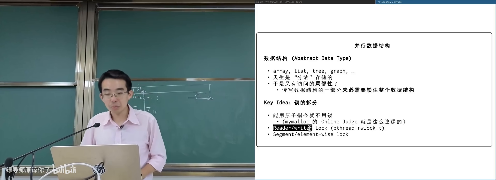

# 并行算法和数据结构

> **原视频**：[Bilibili · BV1WqdTBiEkN](https://www.bilibili.com/video/BV1WqdTBiEkN/)（时长约 87 分钟）
> **课程**：南京大学《操作系统原理》（2026）第 18 讲
> **整理说明**：本书由视频字幕经 AI 重构而成；口语已转为书面语；关键时间点标注 *(参考时间)*，截图卡片可跳转视频对应位置。

---

## 1. 期中测验回顾与并发学习的姿态

<div class="prereq" data-label="你需要先知道">

- 文件描述符、fork/execve、进程地址空间
- 互斥锁的基本用法（lock / unlock）
- 了解 AI 可以帮你写代码、查资料

</div>

*(参考时间: 00:00)*

本讲主题是**并行算法和数据结构**（在多核/多机上让性能随资源增长的算法与并发数据结构设计）。开课先回顾期中测验，不是为了排名，而是为了澄清：在 Agentic AI 时代，概念为什么仍然重要。

期中题目偏向「如果你是操作系统设计者会怎么做」，而不是死记 API：

- **文件描述符**（file descriptor，进程用来指代已打开对象的小整数）：地址空间隔离导致不能直接用指针，UNIX 选择「进程私有表 + 整数下标」，背后是内核对象（everything is a file）。
- **fork 之后文件描述符如何处理**：子进程应共享打开文件与偏移量，否则父子同时写日志会互相覆盖；shell 里 `cmd1; cmd2` 合并输出，也依赖共享 offset。
- **execve**：换掉代码与数据段，但文件描述符表和 PID 等身份信息应尽量保留，管道与重定向才得以实现。
- **终端 UI 的构成**：画界面不只靠 Unicode，更靠 **escape code**（控制光标、擦除区域的控制序列）；再叠加 PTY 与信号（如 Ctrl+C）。
- **调试与定位**：二进制是否动态加载看 ELF 的 interpreter；谁改了变量可用 watchpoint；`mmap` 系统调用可用 trace/单步定位。
- **struct file 的定义**：实际类型是 `__IO_FILE` 等 typedef；也可用预处理器 `gcc -E` 看到编译器看到的世界。
- **多线程 fork**：只有调用 fork 的线程在子进程存活，锁状态可能永远等不到释放；工程上通常 **fork 后立刻 execve**。



AI 对这些问题的回答出人意料地完整，甚至反问「你不需要记住所有答案，只要想：如果我来设计会怎么做」。主讲人由此提出一个真实的困惑：

> 每一个训练 batch 对模型都是一场「考试」，模型会越考越强；而人类若完全不建立概念，对 AI 的失控感会越来越强。

课程仍坚持把概念讲清楚：**你至少要知道该让 AI 往哪个方向努力**；在架构、系统设计、工具品位上，AI 目前仍难独立给出「更好但不那么显眼」的选择。

---

## 2. 从 sum++ 看锁的代价与可扩展性

<div class="prereq" data-label="你需要先知道">

- 线程与共享变量、data race
- 互斥锁如何保证同一时刻只有一个线程进入临界区
- 大致知道 CPU 有私有缓存

</div>

*(参考时间: 00:14:00)*

### 2.1 一个过度简化却足够典型的模式

并发程序里常见如下模式：

```c
void *tsum(void *arg) {
    pthread_mutex_lock(&lock);
    sum++;
    pthread_mutex_unlock(&lock);
    return NULL;
}
```

现实中，`sum++` 往往代表**对共享数据结构的一次操作**：往 print 缓冲写一块、更新字典项、点赞计数加一等。锁保护的是数据结构不变量，不是那一行加法本身。

### 2.2 实验：不同实现随线程数的曲线

课上对比过多种实现（在树莓派上随线程数增长）：

| 实现 | 行为特征 |
|------|----------|
| 原子指令 `sum++` | 无锁，最快 |
| pthread mutex | 进入内核/原子指令保护，线程增多后趋于饱和 |
| 自旋锁（spin lock） | 用户态忙等拿钥匙，竞争激烈时更差 |
| Futex 强行进内核 | 每次操作代价高，随线程数明显变差 |

**真正好的实现**应满足：CPU 从 1 核到 2 核、4 核，吞吐近似翻倍。互斥锁最多做到「不继续崩溃」，却**不能 scale**——串行化阻止了并行。



互斥锁给出的保证是完整的 **serializability**（所有临界区像排好队一样依次发生）以及 unlock→lock 的 happens-before 与可见性；代价是 **scalability**（性能无法随 CPU/机器数量增长）。

### 2.3 计算图视角

任何一个并行计算问题本质都是**计算图**：

- 节点：一次计算
- 边：依赖关系

若节点内计算量大、且几乎不需要共享变量上锁，则「串行化区域」被压得很小，系统才能 scale up（单机多核）与 scale out（多机扩展）。

反例：若每个 `dp[i][j]` 都做一个节点，同步代价远大于算术本身，计算图设计就很糟糕。更好的切法是：

1. 开始并行度不足时，整块串行算；
2. 并行度上来后按对角线切成 2 块、3 块……
3. 块间只保留层间依赖。



---

## 3. 高性能计算：从科学模拟到 embarrassingly parallel

<div class="prereq" data-label="你需要先知道">

- 知道多核 CPU / 计算集群可以一起干活
- 了解「把大问题拆成小问题」的基本思想
- 本章零基础可跟，会用 for 循环即可

</div>

*(参考时间: 00:24:00)*

### 3.1 HPC 的定义与客户

**高性能计算**（High Performance Computing，用超算或集群解决需要海量算力的问题）的经典定义：harness the power of supercomputers or computer clusters to solve problems that require massive computation。

主要客户一直是数值密集型科学计算：

- 有模型就能模拟：粒子系统、气流、爆炸、有机物反应（量子化学）；
- 精度与算力近似可交换：投入越多计算，结果越接近真实；
- 应用覆盖天气预报、航天、制造、能源等；
- 后来加入矿场（PoW 需要证明算力）与 AI 推理/训练。



算力量级示意：

- 1976 年 Cray-1：约 138 MFLOPS，功耗 115 kW（被称为 “the world’s most expensive love seat”）；
- Apple M4 iPad Pro：约 3.8 TFLOPS；
- 专用推理 ASIC：可达数百 TFLOPS 量级，芯片功耗仅数十瓦；
- 今日超算榜单以 PFLOPS 计。

强烈推荐阅读 Cray-1 原论文中的整机设计图（指令集 + 物理布局）。

### 3.2 什么样的程序能跑在超算上？

驱动 HPC 的科学计算问题常可**切网格**：物理系统足够大时，切成百万/千万份；每份内部独立计算，仅在边界上需要同步。

评估超算常用 **LINPACK**（求解大规模线性方程组 `Ax=b` 的基准）。几乎所有用微分方程描述的非线性系统，都可通过牛顿法等化为线性方程组求解；稀疏问题也会局部稠密化再求解。

### 3.3 embarrassingly parallel

**embarrassingly parallel**（令人尴尬地容易并行：计算图几乎不需要同步与通信）指：一个节点可以散出成千上万个独立任务，最后汇总即可。



课上例子：

- **树搜索**：围棋等状态空间可指数展开；fork-based DFS 把搜索子树分到多线程/多机。十几倍加速很有意义——1 分钟任务变 6 秒，不打断工作流。
- **蒙特卡洛**：独立采样再求均值，天然可分片。
- **视频编解码**：关键帧切好后，段间可独立处理。
- **Mandelbrot 集**：每个像素（或像素块）的逃逸时间计算完全独立。

### 3.4 Mandelbrot / Julia 集：课堂上的并行演示

从递归 `x_n = x_{n-1}^2` 出发：

- 实数轴上可讨论收敛/发散；
- 复平面上乘法含旋转，轨迹更丰富；
- 再加常数 `c`（`x_n = x_{n-1}^2 + c`），改变 `c` 得到不同 **Julia set**；
- 固定 `x_0=0`、遍历复平面上的 `c`，得到 **Mandelbrot set**。

分形边界无穷精细；渲染时可把图像切成块，每块由一个线程/机器独立算完再拼回。



### 3.5 OpenMP：把同步复杂度藏进编译器

对科学计算开发者，不希望把 data race 的自由度全交给程序员。领域常用 **MPI** / **OpenMP**（在串行代码上用编译指导并行化的编程模型）。

OpenMP 典型写法：在顺序循环前加一行并行指导，例如：

```c
#pragma omp parallel for num_threads(nthreads)
for (int i = 0; i < NSIZE; i++) {
    if (mine(i)) {
        picture[i] = mandelbrot(i);
    }
}
```

课上对比：单线程约 18 秒扫完整幅图；16 线程约 3 秒。物理系同学不必先上操作系统课，只要会一句「魔法」，就能用好多核。

HPC 真正难的部分还包括：机房高速网络、机柜内外带宽不对称、功耗/散热/稳定性、存储容错与工具链——共享内存访问代价并不均等，跨机通信更慢且可能不可靠。

### 3.6 课程实验 gpt.c 的提示

实验基于裁剪后的 llama.c / GPT-2 推理代码：

- 源码在检测到 OpenMP 时自动启用并行，否则是纯单线程；
- 学生要用课程线程库自己找出推理中**最可并行的循环**，提取计算图并做同步；
- 建议用 profiler（如 perf）定位热点，而不是直接让 AI「并行化整个文件」。

AI 默认更可能给出 pthread 实现；若 prompt 里写明「可以用 OpenMP」，更可能保持代码结构干净。

---

## 4. 并行数据结构：放松可见性以换取扩展性

<div class="prereq" data-label="你需要先知道">

- 互斥锁与 data race
- hash table 的基本思想（关键字 → 桶）
- 知道「多个线程同时改同一结构」需要同步

</div>

*(参考时间: 00:59:11)*

### 4.1 为何算法可并行之后，数据结构仍会卡住

HPC 场景里，串行化的 `sum++` 相对海量计算只是零头。但现实里有许多**操作本身就是共享数据结构读写**的场景：

- 操作系统内核：进程/文件对象几乎每次访问都要保护，否则就是 data race；
- 数据库：热点帖子点赞计数；
- 网游服务器：大量玩家挤在同一坐标；
- 量化交易：极短时间内的共享状态更新。

若程序主体就是「线程 → 上锁 → sum++ → 解锁」，再强的锁也不能 scale。

### 4.2 sloppy counter：牺牲及时可见性

互斥锁的 release/acquire 保证：unlock 之后，其他线程 acquire 一定能看到最新值。代价来自硬件：每个 CPU 有私有 cache，store 要通过总线/一致性协议传播到其他核心。

**Sloppy counter**（宽松计数器：允许读到的计数暂时落后）的做法：

1. 每个线程维护 `sum_local`；
2. 多数时候只做本地 `sum_local++`；
3. 本地累加到阈值（如 100）或超时（如 1ms）时，再上锁把本地值并入全局 `sum`。

读者几乎永远看到「稍旧」的值，但在超时上界内；换来的是绝大部分计算留在本地、很少争用全局锁。社交产品的点赞数往往就是这类实现。



### 4.3 thread_local 语言支持

没有人喜欢手写 `sum_local[tid]`。从 C++11 起有 **thread_local**（每个线程一份的存储期修饰符），C23 也正式引入。

```c
thread_local int x = 100;  // 每线程一份
```

要点：

- 类型任意（int、struct、指针），可赋初值；
- 函数栈帧作用域里定义 thread_local 会与「每调用一份」冲突，编译器会拒绝；
- 普通全局 `int x` 在多线程下 `x++` 可能看到 100,101,102…；thread_local 则每线程各自到 101，且取地址各不相同。

实现直觉（x86）：

- 全局变量：相对 PC/RIP 寻址；
- 栈上变量：相对 RSP；
- thread_local：相对线程控制块，常用 FS 段 + 偏移。

初值问题：全局 `.data` 靠 loader 搬一次即可；thread_local 的初值在线程创建时由 **TLS 初始化**（如 `copy_tls` / `.tdata`）复制到该线程的 TLS 区域。细节比课上第一眼线程模型更复杂，但对理解「每线程一份」足够。

### 4.4 抽象数据类型与锁拆分

**抽象数据类型**（ADT，只暴露 push/pop 等接口、隐藏实现的数据结构）：数组、链表、树、集合、映射等。结构变大后天然有局部性——线程 A 改节点 5、线程 B 读节点 7，往往并不冲突。

于是优化方向是**把大锁拆开**：

| 模式 | 要点 |
|------|------|
| 原子指令 | 能用原子加就不要整段锁（如在线评测的无锁日志槽：原子递增拿 slot，再写内容） |
| 读写锁 | 多个读者共享，写者独占；读多写少时收益大 |
| 锁拆分 / 细粒度锁 | 按数据结构部位上锁，如 hash 每个桶一把锁 |



### 4.5 并发 Hash Table 的陷阱

**Hash table**（关键字经哈希函数映射到桶，期望 O(1) 查找）在冲突处理上分叉：

- **链地址法**：桶内挂链表/树。并发时访问某 key 往往只需保护对应桶。
- **开放寻址**（open addressing，冲突时按探测序列找下一个空槽）：并发更难。
  - **删除**不能直接抹掉：探测链会断，后面元素找不到；需要 **tombstone**（墓碑，标记已删但探测仍可穿过）。
  - **resize**：要分配更大表并迁移元素。若 resize 期间上所有大锁，数据结构会整段不可用（可能秒级）。实际系统会用细粒度锁**渐进迁移**——这里极易出错，也是 malloc 类实验高发区。

**对库函数保持敬畏**：malloc/free 的并发语义、与锁的交互，比课堂第一层抽象复杂得多。

---

## 附录：概念补给

### scale up 与 scale out

- **是什么**：scale up 是单机加核/加资源后性能仍增长；scale out 是加机器后总吞吐仍增长。
- **课上为何出现**：并发算法与数据结构的核心目标，就是让系统能继续扩展。
- **和什么像**：一家店增加收银台 vs 再开一家分店。

### serializability

- **是什么**：并发执行的结果看起来像某种串行顺序。
- **课上为何出现**：互斥锁的强正确性保证。
- **常见误解**：正确性强 ≠ 性能可扩展；锁往往正确但不 scale。

### happens-before 与缓存可见性

- **是什么**：通过同步原语保证一个线程的写对另一个线程在 acquire 后可见。
- **课上为何出现**：解释为何「不用锁也可能看到旧值」以及 sloppy counter 的代价来源。
- **和什么像**：公告必须贴到各办公室门口大家才能看到。

### 计算图

- **是什么**：节点是计算、边是依赖的有向图。
- **课上为何出现**：并行化前先识别「哪些能独立算、哪里必须同步」。
- **和什么像**：菜谱步骤——有的菜能同时炒，有的必须等汤开。

### embarrassingly parallel

- **是什么**：任务之间几乎无依赖、无通信，拆完就能分头算。
- **课上为何出现**：树搜索、蒙特卡洛、像素渲染等模式的共同名字。
- **和什么像**：全班各改同一道选择题的不同份答卷，互不影响。

### LINPACK

- **是什么**：通过求解大规模线性方程组来衡量超算性能的基准。
- **课上为何出现**：解释超算榜单数字从何而来，以及科学计算为何高度依赖线性代数。
- **和什么像**：用「单位时间能跑多少标准步」给跑步机评级。

### OpenMP

- **是什么**：用编译指导（pragma）把串行循环并行化的模型。
- **课上为何出现**：给非系统程序员一条低门槛的多核路径。
- **和什么像**：在清单上标注「这一段可以分给全组」，秘书自动派活。

### MPI

- **是什么**：面向分布式内存集群的消息传递并行编程接口。
- **课上为何出现**：HPC 领域与 OpenMP 互补的经典工具。
- **和什么像**：各办公室不共享白板，只能互相发邮件同步进度。

### fork-based DFS

- **是什么**：用进程复制把搜索树的子树分给不同执行者。
- **课上为何出现**：embarrassingly parallel 在搜索问题上的课上演示。
- **和什么像**：总馆把书单拆开，分馆各自检索再交回总馆。

### Mandelbrot set / Julia set

- **是什么**：复二次迭代在参数平面上定义的分形集合。
- **课上为何出现**：像素独立计算的典型 embarrassingly parallel 工作负载。
- **和什么像**：一张巨大的地图，每格自己决定「留下还是逃逸」。

### sloppy counter

- **是什么**：线程本地计数、阈值或超时再合并到全局的宽松计数器。
- **课上为何出现**：演示如何用「稍旧的一致性」换可扩展性。
- **和什么像**：各班自行记考勤，课间才汇总到教务处。

### thread_local

- **是什么**：语言级「每个线程一份」的变量存储期。
- **课上为何出现**：实现线程本地数据，避免手写 tid 索引。
- **和什么像**：每人抽屉里同一本草稿纸，互不覆盖。

### TLS（线程本地存储）

- **是什么**：运行时为每线程分配的私有数据区，thread_local 变量放在这里。
- **课上为何出现**：解释初值为何在线程创建时复制，以及 x86 上 FS 段寻址。
- **和什么像**：员工入职时人事给每人发一套独立档案袋。

### 读写锁（rwlock）

- **是什么**：读共享、写独占的锁。
- **课上为何出现**：读多写少时提升并发度的常见手段。
- **和什么像**：图书馆阅览室多人可同时看，改书架必须清场。

### tombstone（墓碑）

- **是什么**：开放寻址删除时留下的「已删但可探测穿过」标记。
- **课上为何出现**：并发哈希表删除不能直接置空，否则探测链断裂。
- **和什么像**：货架空位贴「此位已撤」，顾客继续往里找。

### 锁拆分（lock striping / 细粒度锁）

- **是什么**：按数据结构部位上多把锁，而不是一把大锁锁全局。
- **课上为何出现**：并行数据结构从「正确」走向「可扩展」的关键。
- **和什么像**：超市按收银台排队，而不是全商场一个柜台。

---

*书架 Shelf 流水线生成 · 内容衍生自 B 站公开课程视频 BV1WqdTBiEkN*
