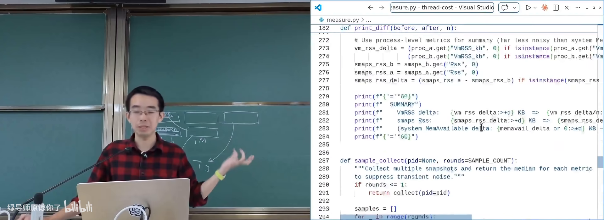
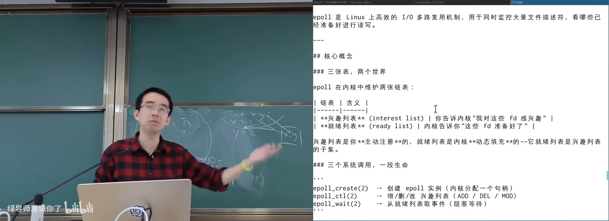
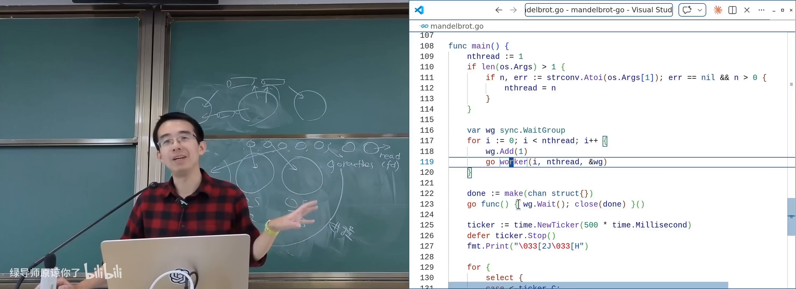
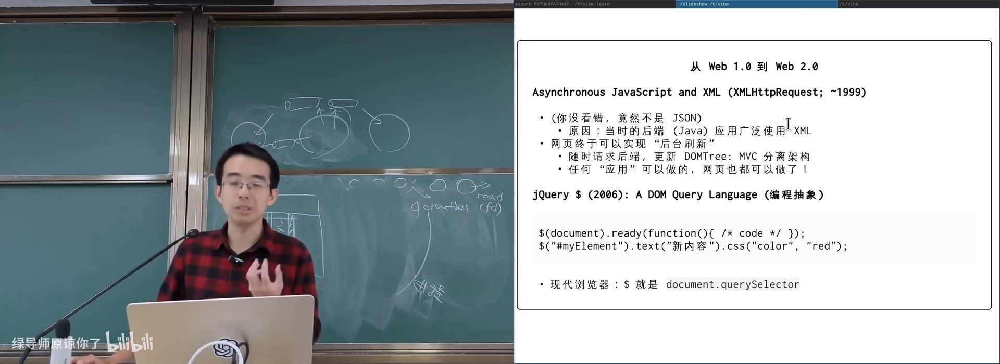
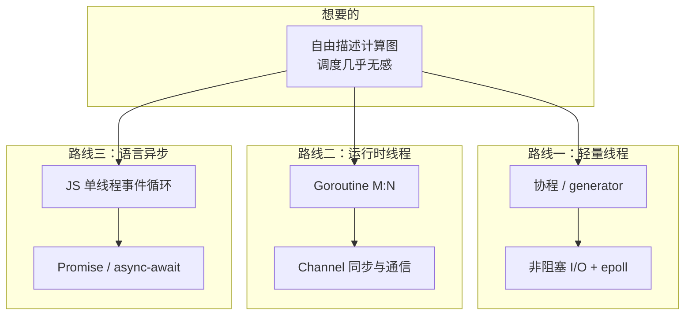

# 协程、Goroutine、异步编程

> **原视频**：[Bilibili · BV1dVRdBpEze](https://www.bilibili.com/video/BV1dVRdBpEze/)（时长约 83 分钟）
> **课程**：南京大学《操作系统原理》（2026）第 19 讲
> **整理说明**：本书由视频字幕经 AI 重构而成；口语已转为书面语；关键时间点标注 *(参考时间)*，截图卡片可跳转视频对应位置。

---

## 1. 动机：线程不是免费的，计算图才是目标

<div class="prereq" data-label="你需要先知道">

- 线程、互斥锁、data race、happens-before
- 计算图（节点=计算，边=依赖）
- malloc 实验里「一把大锁保平安」的经验

</div>

*(参考时间: 00:00)*

前几课建立的并发工具，本讲用来解释真实系统：数据中心服务、浏览器前端里的并发编程是怎么做出来的。

### 1.1 malloc 优化的启示：看真实 workload

作业里若只关心正确性，大锁往往能过 easy case，却过不了 hard case。性能调优必须先问：**到底需要什么样的性能**。

算法课习惯盯 worst case；真实系统关心的是**现实分布下的表现**，同时别把 worst case 做烂（否则攻击者可构造哈希冲突，把 Apache 之类打慢——复杂度攻击）。

对 `malloc`/`free` 的观察：

- **大对象**（数 MB～上百 MB）：多半对应 hash 表扩容、大缓冲/文件映射，之后会反复读写；分配后只碰几个字节往往是 design bug。
- **小对象**：创建/回收最频繁，生命周期短（临时字符串等）。
- **中等对象**：往往比小对象活得更久。

推论：过实验几乎只要管好**小对象分配回收的可扩展性**。思路与 sloppy counter 同构——每线程（或每 CPU）持有自己的 **slab**（按大小切好的内存板）与空闲链表：

- 小对象：按 16B/32B/… 桶化，分配/释放多为 O(1) 本地链表操作；
- 慢路径：本地耗尽时再向系统要一大块；
- 推荐阅读 malloc survey（可在 AI 辅助下读）；1964 年已有 segregated free list 等思想。

> premature optimization is the root of all evil——优化前先绑定真实 workload。

### 1.2 线程的真实开销

每个线程都有你看不见的代价：

| 开销来源 | 说明 |
|----------|------|
| 栈内存 | Linux 默认栈可达 8MB，但按需分页，实际只用栈顶 |
| 内核数据结构 | `/proc/<pid>`、线程控制块、PID 等 |
| 上下文切换 | 中断/系统调用进内核，保存/恢复寄存器 |

课堂演示思路：进程前后读系统资源状态，创建 N 个空线程，差值除以 N。实验测得每个最小线程大约带来 **~16.9KB** 量级的系统资源增长（视环境而定）。



### 1.3 两条演化路线

我们真正想要的是：**计算图想怎么写就怎么写，节点调度几乎无额外开销**。当 spawn/join 远贵于函数调用时，业界有两条路：

1. **轻量线程**：保持多线程编程模型，把 spawn/yield/join 做得接近函数调用——协程、Goroutine。
2. **改执行模型**：在语言里直接描述计算图——Promise / future / async-await。

---

## 2. 协程：用户态的「线程」

<div class="prereq" data-label="你需要先知道">

- 系统线程由 OS 创建、调度
- 函数调用与栈帧（Simple C 模型有助理解）
- 了解 generator / yield 不是必须，但会更好跟

</div>

*(参考时间: 00:20:11)*

**协程**（coroutine，用户态可控切换的执行流）可以在不创建 OS 线程的前提下，同时维护多条程序执行流。

### 2.1 Python generator：同一进程内的百万「线程」

```python
def t_worker(name):
    i = 0
    while True:
        yield (name, i)
        i += 1

threads = [t_worker(f"t{i}") for i in range(1_000_000)]
while True:
    t = random.choice(threads)
    print(next(t))
```

- 创建一百万条执行流后才开始运行；
- 每次 `yield` 把当前函数状态暂存并返回调用者；
- 再次 `next` 从上次状态继续；
- **进程内始终只有一个 OS 线程**，切换是程序主动的。

Simple C 视角：多线程像多份栈；generator 则是应用层维护的多份栈/状态，`yield` 在栈之间切换。C/C++ 曾用 `setjmp`/`longjmp` + 手工改栈顶指针实现类似机制（现在更多是语言级协程关键字）。

「能做闭包的语言」理论上都能实现这种状态保存：捕获作用域变量 + 记下 PC，执行流即可封存。

### 2.2 用户态协程的两个麻烦

1. **阻塞 I/O 会卡住所有协程**：`read` 进内核后若无数据，本 OS 线程睡眠，其他协程也跑不了。
2. **不能用互斥锁做协程间同步**：单 OS 线程下，`lock` 后 `yield`，下一个协程再 `lock` 会进内核等待 → **AA 型死锁**。

解决方案依赖 UNIX 演化出的机制：

- **非阻塞 I/O**（O_NONBLOCK）：`read` 无数据立刻返回 `EAGAIN`，执行流可 `yield` 后再试；
- **I/O 多路复用**（如 epoll）：一次监听大量 **文件描述符**（进程内对象，不受「每线程一把锁」限制），谁就绪就调度谁；
- `eventfd` / `timerfd` 等也可作为协程同步原语。



若编译器/运行时把 `sleep`、阻塞 `read` 自动改写成「标记不可运行 + 非阻塞重试 + yield」，程序员仍写同步风格代码——这便是 **Goroutine**。

---

## 3. Goroutine：轻量线程 + Channel

<div class="prereq" data-label="你需要先知道">

- OS 线程可真并行
- 管道：自带同步的消息通道
- 知道「共享内存通信」与锁的痛点即可

</div>

*(参考时间: 00:44:00)*

### 3.1 M:N 调度直觉

Goroutine 的实现草图：

- 进程内创建若干真正的 **OS worker 线程**；
- 每个线程循环从全局可运行队列取 Goroutine 执行；
- 编译器/标准库把阻塞调用改写为异步；
- `epoll` 等监听 I/O，就绪后把对应 Goroutine 放回队列。

效果：

- 用起来像线程（`go f()` 轻量 spawn）；
- **共享同一进程地址空间**，可真并行；
- 同步与 I/O 在用户态调度器 + 内核就绪通知之间完成；
- 在应用进程里几乎「长出一个小操作系统」。

前提：使用标准库/受控运行时。自己写汇编级阻塞调用，仍会占住 worker。

### 3.2 继承 UNIX 哲学：用通信共享内存

*Effective Go* 的著名主张：

> Do not communicate by sharing memory; instead, share memory by communicating.

互斥锁/信号量解决同步，数据交换却仍走共享缓冲——同步与通信割裂。UNIX 的管道本身就是**计算图**：

```bash
cat a.txt; cat b.cpp | wc
```

节点产出一行数据，下游才能继续；自带生产者–消费者同步。

Go 把管道抽象为 **channel**（在 Goroutine 间传递消息并同步的通道）：

- 可读可写、可多路；
- 同步与数据传递合二为一；
- 灵感来源与 UNIX 设计者（Ken Thompson、Rob Pike 等）一脉相承。

### 3.3 课上演示：Go 版 Mandelbrot

```go
for i := 0; i < n; i++ {
    go worker(low[i], high[i], results)
}
go monitor(results, ticks)
```

- 图像切竖条，每条一个 Goroutine；
- 结果与进度经 channel 回传；
- 创建计算节点几乎不心疼开销。

AI 生成代码也可能在同步上出错——又一个「必须自己看懂计算图」的例子。



---

## 4. 前端世界、Promise 与异步编程

<div class="prereq" data-label="你需要先知道">

- HTTP 大致是「请求文本 → 返回网页」
- 函数可以当参数传递（或愿意接受「函数是一等公民」）
- 计算图与 happens-before

</div>

*(参考时间: 00:54:18)*

### 4.1 另一条世界线：JavaScript

1995 年，Brendan Eich 在 Netscape 约十天设计出嵌入网页的脚本语言，融合 C/Java/Scheme/Self。他本人偏爱函数式，于是 **function is first-class citizen** 进入 JS——这是日后异步生态的关键伏笔。

网页生态简史：

- 早期 HTTP 极简：发路径字符串，服务器回 HTML；
- 雅虎时代页面静态，切图 + `table` 布局；
- 1999 年 **XMLHttpRequest**：JS 可随时发起请求 → **AJAX**（Asynchronous JavaScript and XML）；
- DOM + 查询选择器（jQuery / `document.querySelector`）可改样式、改文本、增删节点；
- 后端 XML（今多为 JSON）拉回后刷新界面，无需整页重载；
- Google 把 Office 搬上浏览器，Chrome OS 等；后来 Edge 借 Chromium 内核。

控制台粘贴一段脚本，即可把「土味页面」改成圆角、动画、现代控件——HTML/CSS/JS 的便利性压过 Qt 等传统 GUI。



### 4.2 JavaScript 的并发选择：单线程事件循环

JS 面向零门槛脚本，不能要求人人懂 data race。它的选择：

- **事件驱动**：加载、点击、请求返回都会生成事件；
- **单线程 + run to completion**：一个事件处理函数必须跑完，中间不被切换，禁止与别的事件并行；
- **没有阻塞 I/O**：不存在同步 `read`；发起请求立刻返回，完成后再入事件队列。

因此：事件处理在逻辑上是原子的，用户代码几乎不会踩 data race / TOCTOU；代价是——**你在事件里写死循环，整页卡死**。

### 4.3 回调地狱

有依赖的任务序列（登录 → 拉好友列表 → 拉动态）在纯 callback 模型下，计算图被迫拆成多层函数嵌套：

```javascript
login(user, function (ok) {
  if (ok) {
    fetchFriends(function (friends) {
      fetchFeed(friends, function (feed) {
        // 又嵌套一层……
      });
    });
  }
});
```

顺序逻辑被拆碎，缩进爆炸，调试极难——**callback hell**。

### 4.4 Promise 与 async/await

**Promise**（表示「未来会完成的值/任务」的对象）把计算图写进代码：

```javascript
const p = fetch(url); // 立即返回，状态 pending
// 随后 fulfilled / rejected
p.then(onSuccess).catch(onFail);

Promise.all([a, b]).then(c); // 类似 join
```

- `fetch` 立即返回 Promise；请求已在后台工作；
- `then`/`catch` 描绘先后与失败分支；
- `Promise.all` 等价于「多个前置完成后再继续」。

即便如此，人类仍想要**顺序、选择、循环**的写法。于是：

- `async function`：运行时包装为返回 Promise 的函数；
- `await expr`：等待 Promise/值；编译器/引擎把后续代码编译成链式 `then`。

```javascript
async function work() {
  const a = await f();
  const b = await g();
  const r = await Promise.all([fetchData(), p]);
  return a + b;
}
```

你在源码里保留顺序计算图；引擎生成难看的回调链，但调试与可读性归你所有。`await` 非 Promise 的值时直接得到该值（如 `await 1` → `1`）。

课程网站示例：网页里 `await` 调用 online judge 后端校验 token，即异步 API 描述计算图的日常用法。

### 4.5 生态回看

JS 从「十天设计、语义坑多」的语言，凭借一等公民函数，长出 Angular/React/Next、Electron（VS Code）、Ink（终端 UI）、乃至浏览器内执行汇编/C（Wasm）与 TensorFlow.js / Three.js。

学前端异步时，不妨重走并发史：线程 → data race → 互斥 → 同步原语 → **在语言里舒适地描述计算图**。Go 与 JS 分别代表「轻量线程」与「语言级异步」两条路线。

---

## 5. 小结：同一问题的三种答案



| 机制 | 编程心智 | 并行性 | 典型场景 |
|------|----------|--------|----------|
| OS 线程 | 多线程 + 锁 | 真并行 | 通用，但创建贵 |
| 协程 | 同步风格，主动 yield | 通常单线程（除非 M:N） | 高并发 I/O、用户态调度 |
| Goroutine | 像线程，channel 通信 | 进程内真并行 | Go 服务端 |
| Promise/async | 计算图 / 顺序异步代码 | 逻辑并发，单线程执行 | 浏览器与 Node |

---

## 附录：概念补给

### 协程（coroutine）

- **是什么**：用户态执行流，可主动挂起/恢复，切换不依赖 OS。
- **课上为何出现**：让 spawn/join 逼近函数调用，支撑百万级任务。
- **和什么像**：同场话剧演员轮流上台，导演（程序）喊换人，不关剧场大门。

### generator / yield

- **是什么**：语言级「暂停函数并交还控制」的机制。
- **课上为何出现**：用 Python 演示用户态多执行流。
- **和什么像**：书签夹在书里，下次从书签继续读。

### 非阻塞 I/O（O_NONBLOCK）

- **是什么**：I/O 未就绪立刻返回错误码（如 EAGAIN），不睡眠。
- **课上为何出现**：协程遇到 read 才不会卡住整个进程。
- **和什么像**：外卖柜空了就走人，过会儿再来看，而不是站在店门口死等。

### epoll / I/O 多路复用

- **是什么**：一次等待多个文件描述符就绪的内核机制。
- **课上为何出现**：协程运行时的就绪通知底座。
- **和什么像**：前台监控多个取餐屏，谁好谁先取。

### eventfd / timerfd

- **是什么**：用文件描述符表达事件与定时的内核对象。
- **课上为何出现**：协程间同步不必用互斥锁，可走 FD 语义。
- **和什么像**：用小旗子代替口令——谁举旗谁继续。

### Goroutine

- **是什么**：Go 的轻量执行单元，由 Go 运行时映射到少量 OS 线程。
- **课上为何出现**：同步写法 + 高并行 + 共享内存的服务端模型。
- **和什么像**：大量轻工人共享几条传送带，由调度员安排上带。

### channel

- **是什么**：Go 中传递消息并同步的管道抽象。
- **课上为何出现**：「用通信共享内存」的 UNIX 管道在语言中的重生。
- **和什么像**：部门间传阅签，签在谁手里谁签字，不共用一张纸乱写。

### XMLHTTPRequest / AJAX

- **是什么**：浏览器中发起异步 HTTP 请求的经典 API / 技术组合。
- **课上为何出现**：网页从静态页变为可后台刷新的应用。
- **和什么像**：前台办事时可以先取号，一边干别的，叫号再回来。

### 回调地狱（callback hell）

- **是什么**：多级异步依赖被写成层层嵌套回调，难以维护。
- **课上为何出现**：纯事件回调模型描述顺序计算图的痛点。
- **和什么像**：办事要一层层求人签字，字签不完，字迹也认不出。

### Promise

- **是什么**：代表未来结果的对象，可 then/catch 组合任务图。
- **课上为何出现**：把计算图写进代码，替代深层回调。
- **和什么像**：取餐号——现在拿不到饭，但号上写明了「好了怎么通知你」。

### future

- **是什么**：与 Promise 配对的「未来值」占位符（术语上常与 Promise 一起出现）。
- **课上为何出现**：说明 fetch 立即返回、值稍后可取。
- **和什么像**：借条 vs 承诺：一边是「将来给」，一边是「答应给」。

### async / await

- **是什么**：把异步任务写成顺序语法，由运行时展开成 Promise 链。
- **课上为何出现**：人类直觉的顺序结构与计算图执行的统一。
- **和什么像**：快递单写「先取件再派送」，实际由分拣中心自动排队。

### run to completion

- **是什么**：JS 事件处理函数必须执行完才处理下一个事件。
- **课上为何出现**：单线程模型避免 data race，但会整页卡死。
- **和什么像**：窗口一次只办一位，柜员中途不换人，后面队伍只能等。

### slab 分配器（本讲语境）

- **是什么**：按对象大小预切内存板，小对象在本地空闲链表上快速分配。
- **课上为何出现**：malloc 实验——小对象路径决定可扩展性。
- **和什么像**：按尺码分好的包装盒，取对应尺码即可，不必每次裁纸。

### segregated free list

- **是什么**：按尺寸分级维护空闲块链表的分配策略。
- **课上为何出现**：说明 malloc 经典思想早已存在，难点在并发与 workload。
- **和什么像**：钥匙按房间号挂在不同钩子上，归还也挂回原钩。

---

*书架 Shelf 流水线生成 · 内容衍生自 B 站公开课程视频 BV1dVRdBpEze*
