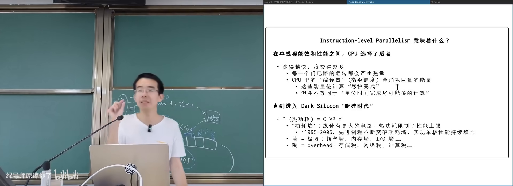
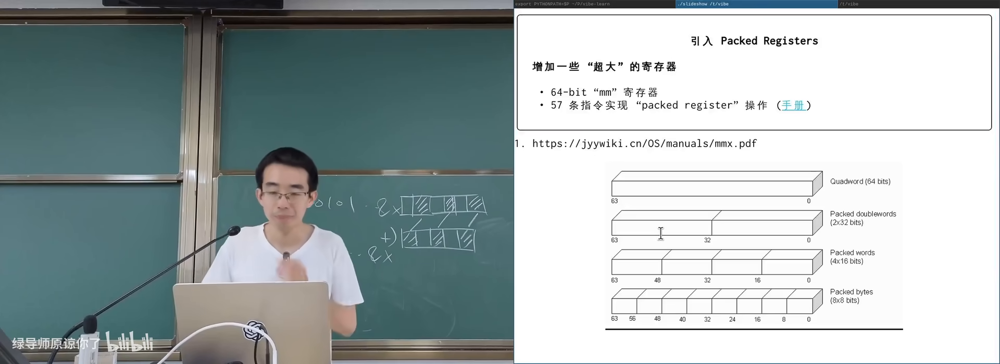
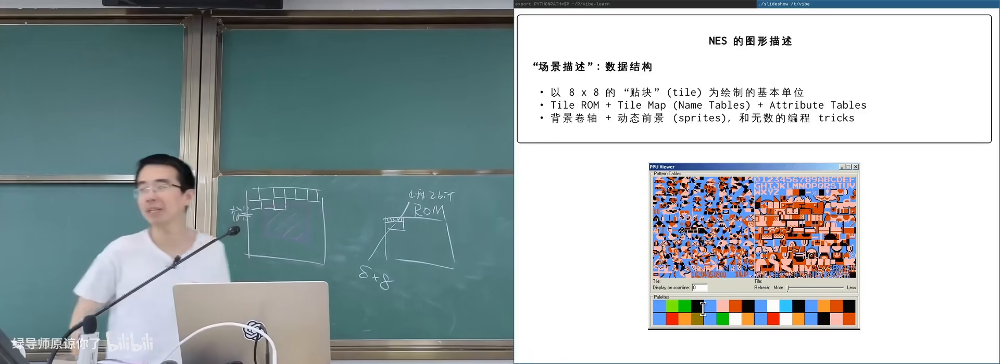
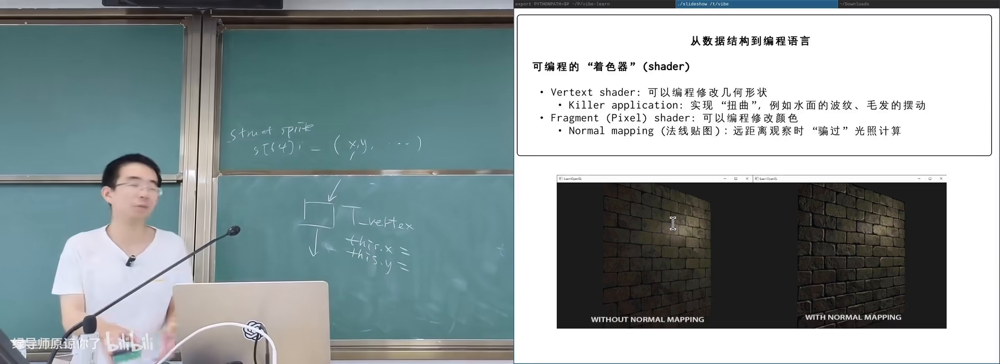
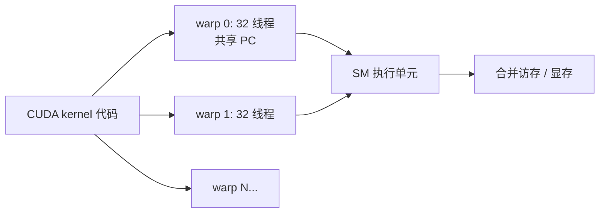
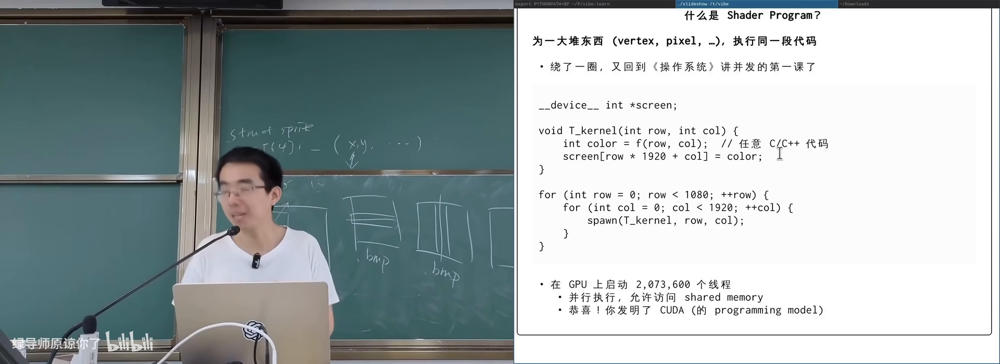

# CPU、SIMD 和 GPU

> **原视频**：[Bilibili · BV1df536aEMk](https://www.bilibili.com/video/BV1df536aEMk/)（时长约 90 分钟）
> **课程**：南京大学《操作系统原理》（2026）第 20 讲
> **整理说明**：本书由视频字幕经 AI 重构而成；口语已转为书面语；关键时间点标注 *(参考时间)*，截图卡片可跳转视频对应位置。

---

## 1. 指令级并行：CPU 是一台“在线编译器”

<div class="prereq" data-label="你需要先知道">

- 程序会编译成机器指令，CPU 按指令执行
- 逻辑门/数字电路天然可以同时动作
- 了解线程、计算图与多核并行（前几讲）

</div>

*(参考时间: 00:00)*

前面几讲都在 CPU 上做线程级并行。本讲开始**推翻 CPU 在“计算”上的垄断**，从指令内部如何并行，一直讲到 SIMD 与 GPU。

### 1.1 顺序只是假象

课程里的最小 RISC-V 模型（mini rv32ima）看起来一步一步执行；但现代 CPU 内部：

- 逻辑门天生并行：一次可以从内存取出 64/128 bit；
- 可以译码多条指令，检查依赖后并行发射；
- 双口寄存器堆允许同时读写多个寄存器；
- 用 **perf** 等工具可以度量 **IPC**（instructions per cycle，每周期完成指令数）。

`/proc/cpuinfo` 中的 **bogoMIPS**（用空转循环粗估的“百万指令每秒”）往往**大于**主频（GHz）——侧面说明一周期可完成多条指令。

课堂测 IPC 的思路：

1. 写无依赖指令流（对不同寄存器加一）与有依赖指令流（反复 `x = x + 1`）；
2. 用 Linux 性能计数器（指令数、周期数）相除；
3. 在树莓派上，有依赖时 IPC 可仍 >1，混合指令流甚至接近 3。

期末可能考的开放题：**如何证明你的处理器一个时钟周期能执行超过一条指令？**（查 CPU 信息 + 设计无冲突指令 + 用系统计数器度量）

### 1.2 功耗墙与“税”

动态流水线里，CPU 像内置了一台编译器：长指令队列、数据流分析、寄存器重命名等。这些电路**翻转发热却不直接完成你的算术**——像交税。

芯片动态功耗大致与以下因素有关：

- 容电（随制程）
- 开关频率
- 电压平方 \(V^2\)

1995–2005 年左右，制程进步 + 拉长流水线/加大缓冲，单核性能飞涨；封装散热能力有限（约百余瓦），撞上 **功耗墙**（wall，系统里还有频率墙、内存带宽墙等）后，这条路到头了。



产业选择：

- **多核**：同样面积/功耗下放更多更简单的核（单核应用可能变卡，吞吐任务更划算）；
- **big.LITTLE**（约 2011）：大核 + 小核 + 超小核，按活动状态切换；
- **让一条指令处理更多数据**：分摊调度开销。

### 1.3 激进尝试：VLIW

**VLIW**（Very Long Instruction Word，把多条可并行指令打包成超长字，由编译器保证无依赖）把调度责任从硬件搬到编译器，译码极简。IA-64 等商业上失败（迁移成本、当时 ILP+制程红利仍在），但在部分加速器上仍有影子；在强调“调度税≈0”的时代可能复活。

---

## 2. SIMD：一条指令，一批数据

<div class="prereq" data-label="你需要先知道">

- 寄存器与整数/浮点运算
- 位运算（与、或、移位）有助理解 bitset
- 知道矩阵/图像计算很吃带宽

</div>

*(参考时间: 00:25:17)*

**SIMD**（Single Instruction Multiple Data，同一条指令对一批数据做相同操作）不改变“单线程写法”，却把调度税摊薄到多个数据上。

### 2.1 MMX 时代

1997 年 **MMX**（Multimedia Extension）：为 32 位机增加 64 位寄存器，可当作 4×16-bit 整数并行加减；溢出时饱和到最大/最小值，而非像普通整数那样回绕。随处理器附赠的演示光盘展示了带光照的 3D 画面——当年的 “killer app”。

编程思想你早已用过：

- **bitset**：用一个 `uint32_t` 表示 32 个元素的集合；
- 查 `x` 是否在集合：定位字节 + 测位；
- **popcount**（数二进制里 1 的个数）的位运算 tricks（`x & -x`、与 `0x5555`/`0xAAAA` 分离奇偶位再树状相加）本质也是 SIMD 式“一次处理多位”——但在乱序 CPU 上依赖链过长，**现代更优做法是查表**（8-bit 表 + 并行 load 相加）。

### 2.2 从 MMX 到 AVX-512

寄存器一路加宽：

| 名称 | 宽度 | 名称由来 |
|------|------|----------|
| MMX | 64-bit | Multimedia |
| SSE (XMM) | 128-bit | Streaming SIMD Extensions |
| AVX (YMM) | 256-bit | Advanced Vector Extensions |
| AVX-512 (ZMM) | 512-bit | 名称用尽后的 Y/Z |

支持的数据类型从整数扩展到 float32/float64（IEEE 754），并加入 shuffle、FMA（乘加一条指令）等。AVX-512 在某些代号 CPU 上已触发热密度极限——开启后可能降频。



### 2.3 SIMD 没解决的部分

SIMD 指令仍要：

- 走 cache / 动态流水线；
- 与其他指令抢带宽与功耗。

若目标是“调度代价接近零、大规模并行”，还需要另一条路：**更简单的核心 + 更多硬件副本**。

---

## 3. 图形处理器：从场景描述到像素

<div class="prereq" data-label="你需要先知道">

- 屏幕是像素阵列，可循环 `f(x,y)` 作图
- embarrassingly parallel（像素独立计算）
- 数据结构 = 描述；硬件可以把描述变成图像

</div>

*(参考时间: 00:41:21)*

### 3.1 NES：游戏主机如何“画出来”

1972 年 Magnavox Odyssey 是家用主机先声；1983 年 NES（红白机）上已有《塞尔达》等精美画面。

CPU 侧极弱：MOS 6502，**IPC ≈ 0.43**，无复杂乱序；屏幕却有约 **64 万像素、64 色、60 FPS**。约一万条指令如何画完六万像素？

答案：**把“要画什么”与“怎么画”分开**——CPU 只维护**场景描述**（数据结构），专用 PPU 硬件并行扫描成像素。

描述模型（简化）：

- 背景：规则排列的 **8×8 tile**（每 tile 仅 4 色，含透明），调色板重映射即可换色（马里奥/路易吉同 tile 不同 palette）；
- 显示窗口可在更大背景上滑动 → 卷轴；
- **Sprite**（小精灵）：任意位置的 8×8 前景块，带优先级与水平/垂直翻转；
- 省存储 tricks：用翻转拼圆、蘑菇两帧镜像“走路”；
- 全屏变色可只换调色板，几何不变。

GPU 内部像有 `line`/`chunk` 计数器的时序电路：对每个像素，先算背景色，再叠加 sprite，取最高优先级——与 z-buffer 思想类似，且逻辑门可并行处理多个像素。



### 3.2 2D 描述语言的进化

CPU/GPU 变强后，描述不再限于固定 tile：

- 任意 **bitmap** 贴到矩形/四边形；
- 线性变换（缩放、旋转、剪切）——像拉一张有弹性的纸；
- 用 2D 挤压模拟伪 3D（Game Boy Advance 等；缺深度信息，旋转大了会穿帮）。

3D 自然化：平移在齐次坐标下也可写成 **4×4 矩阵**，顶点 + 贴图 + 光照都变成描述 + 固定管线。高中生若会线性代数，理论上能写出简易 3D 引擎。

### 3.3 Shader：描述变成可编程程序

固定结构不够用时，业界把“描述”升级为**程序**：

- **Vertex shader**（对每个顶点执行的程序）：改 `x,y` 等属性，可做水波、毛发摆动——本质仍是 embarrassingly parallel；
- **Pixel/fragment shader**（对每个像素做后处理）：改 RGB；对应摄影里对 RAW 的曝光/曲线/蒙版操作；
- **法线贴图**：不增加多边形，用像素上的法线向量与光照夹角伪造凹凸感（远景真实，近景会穿帮）。

Shader 是受限语言：可算术、分支、访存，不能随便 syscall。



### 3.4 GPGPU 前夜

约 2001 年起，研究者把科学计算“伪装”成图像：

- 矩阵乘法分解为外积之和；
- 矩阵当 BMP 送进显卡，用 vertex/pixel shader 算外积与叠加；
- 预示了今天用 GPU 做高性能计算。

Shader 程序本质是：

```text
for each vertex/pixel:
    执行同一段代码
```

这正是线程课上学的“海量线程跑同一份代码”。

---

## 4. 从 Shader 到 CUDA

<div class="prereq" data-label="你需要先知道">

- 线程、同一份代码、不同线程 ID
- 寄存器与 program counter（PC）
- 内存带宽与连续访问的好处

</div>

*(参考时间: 01:02:58)*

### 4.1 想在显卡上跑“线程课作业”

设想在显存分配 `1920×1080` 数组，希望每个像素一个线程：

```c
// 逻辑上的 kernel
void thread_kernel(int row, int col) {
    picture[row * 1920 + col] = mandelbrot(row, col);
}
```

这就是 **CUDA**（Compute Unified Device Architecture，NVIDIA 的 GPU 通用并行编程模型）的核心心智：创建海量线程，都跑同一段 kernel，数据主要在显存。

难点：若每线程 1KB 开销，200 万线程不可接受。GPU 选择**极简硬件 + 高效调度**。

### 4.2 SIMT：单指令多线程

不能省的电路：ALU、寄存器（算数必需）。可以省的：**PC 与译码器**。

**SIMT**（Single Instruction Multiple Thread，一捆线程共享一个 PC，同步推进）：

- 现代 NVIDIA 常见 **thread warp ≈ 32 线程**一捆；
- 共享 PC → 只需一份译码 → “税”大减；
- 每线程仍有自己的寄存器（颜色、循环变量等）。

执行效果：同一 warp 执行 `store` 时，地址可能是 `3*1920+0/1/2...`，形成**合并访存**（coalesced access），对内存控制器友好。



GPU 还会：

- 用多个 warp **切换隐藏延迟**（某个 warp 在等全局内存时换另一个）；
- 一个 stream multiprocessor 管理多组 warp。

### 4.3 代价：难写、怕不连续、怕分支

- 内存不连续 → 访存碎片化，性能暴跌；
- **分支**在 SIMT 下极别扭：没有“二选一 PC”，而是算条件后 **mask/disable** 不满足的线程，再走线性代码路径（A 与 B 都可能被执行，不满足的线程被关掉）；
- CUDA 汇编里少见传统 `if else branch`，更像 enable/disable 逻辑。

课上用 GPU 跑 Mandelbrot，远快于 CPU 版；让 AI 解读生成的 PTX/SIMT 汇编，有助理解“没有 if 的 if”。



---

## 5. 小结：从交税到大规模并行

| 层级 | 机制 | 调度/税 | 并行粒度 |
|------|------|---------|----------|
| 乱序 CPU | ILP、大缓冲、编译器式调度 | 高（功耗墙） | 指令 |
| SIMD | 宽寄存器，一条指令多数据 | 中 | 数据向量 |
| 多核 | 多个复杂核 | 高（单核仍贵） | 线程 |
| GPU/CUDA | SIMT：省 PC/译码，海量线程 | 低（摊薄） | 顶点/像素/数据元素 |

优化直觉：让**每一次逻辑门翻转都参与有用计算**；科学计算与图形的共同形态，是“对一堆数据执行同一段代码”。

---

## 附录：概念补给

### IPC（Instructions Per Cycle）

- **是什么**：每个时钟周期平均完成多少条指令。
- **课上为何出现**：证明现代 CPU 不是“一周期一条指令”。
- **和什么像**：每分钟能通过安检的人数。

### bogoMIPS

- **是什么**：Linux 启动时用空转循环粗估的 CPU 速度指标。
- **课上为何出现**：其数值常大于主频，暗示 ILP。
- **和什么像**：汽车厂标称油耗 vs 实测——粗糙但有信息量。

### 功耗墙

- **是什么**：封装散热能力限制下，无法再靠加大复杂单核提升性能。
- **课上为何出现**：解释多核与 SIMD/GPU 为何成为主路径。
- **和什么像**：风扇就这么大，发动机再猛也会过热。

### ILP（指令级并行）

- **是什么**：同一流内多条指令在 CPU 内部重叠执行。
- **课上为何出现**：现代 CPU 性能来源之一，也是“税”的来源。
- **和什么像**：厨房备菜与炒菜流水线并行，而不是一道菜做完再洗锅。

### SIMD

- **是什么**：单指令对向量数据并行操作。
- **课上为何出现**：不改单线程模型的前提下摊薄调度开销。
- **和什么像**：一台压面机同时压一排面，而不是一根一根压。

### MMX / SSE / AVX

- **是什么**：Intel/AMD 依次加宽的 SIMD 指令与寄存器扩展名称。
- **课上为何出现**：多媒体与数值计算硬件演进史。
- **和什么像**：货车从 4 吨加长到 12 吨，路还是同一条指令集公路。

### VLIW

- **是什么**：超长指令字，由编译器打包可并行操作，硬件简单译码。
- **课上为何出现**：把“调度税”尽量降到零的历史尝试。
- **和什么像**：演出单一次写清所有演员站位，导演现场只喊“开始”。

### tile / sprite（图形）

- **是什么**：早期 GPU 用的小图块与可任意摆放的前景精灵。
- **课上为何出现**：NES 用极简场景描述驱动并行扫描。
- **和什么像**：拼贴画：固定花色瓷砖 + 可移动贴纸。

### 调色板（palette）

- **是什么**：给少量索引色映射到具体 RGB 的查找表。
- **课上为何出现**：同 tile 不同角色色、全屏动画只换色。
- **和什么像**：同一套线稿，改印刷油墨颜色就出不同角色卡。

### shader（着色器）

- **是什么**：在图形管线上对顶点或像素执行的可编程程序。
- **课上为何出现**：场景描述升级为“可执行描述”。
- **和什么像**：从填空模板变成可运行的小脚本。

### vertex shader / fragment shader

- **是什么**：分别对顶点、对像素执行的着色器阶段。
- **课上为何出现**：水波、调光、法线贴图等效果的实现点。
- **和什么像**：先确定角色骨架位置，再给皮肤上妆。

### 法线贴图（normal mapping）

- **是什么**：用像素级法线向量伪造凹凸光照，不增加几何。
- **课上为何出现**：shader 如何用计算换多边形。
- **和什么像**：平面墙贴上带阴影的壁纸，远看有立体感。

### GPGPU

- **是什么**：用图形处理器做通用计算（通用 GPU）。
- **课上为何出现**：2001 年把矩阵乘法“画”成图片算。
- **和什么像**：把显卡当超算的散热片养着的算力矿工（正面意义版）。

### CUDA

- **是什么**：NVIDIA 的 GPU 通用并行编程模型与平台。
- **课上为何出现**：把“每个像素一线程”的心智变成日常工程。
- **和什么像**：操作系统课线程 API 的显卡特供版，但一次 spawn 两百万个。

### SIMT

- **是什么**：多线程共享 PC、同步执行同一指令流的 GPU 模型。
- **课上为何出现**：海量线程下把译码与调度税摊到接近零。
- **和什么像**：军训队列听同一口令齐步走，个人出脚时机由各自脚感微调。

### warp

- **是什么**：GPU 中一起调度的一小捆线程（常见 32 个）。
- **课上为何出现**：SIMT 的硬件调度单位。
- **和什么像**：一个班组同时上工位，而不是一个人一个工位。

### 合并访存（coalesced access）

- **是什么**：同 warp 线程的访存地址连续，可高效合并成大块传输。
- **课上为何出现**：CUDA 性能好坏的关键因素之一。
- **和什么像**：整排人同时从同一书架连续抽书，比各自跑不同楼层更快。

---

*书架 Shelf 流水线生成 · 内容衍生自 B 站公开课程视频 BV1df536aEMk*
