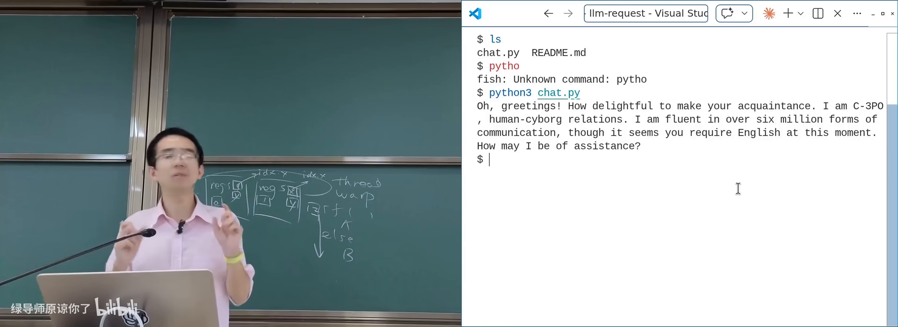
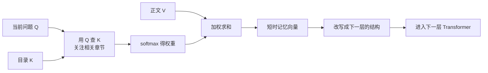

# 一个 Token 的旅程

> **原视频**：[Bilibili · BV1zS5R6tEWZ](https://www.bilibili.com/video/BV1zS5R6tEWZ/)（时长约 91 分钟）
> **课程**：南京大学《操作系统原理》（2026）第 21 讲
> **整理说明**：本书由视频字幕经 AI 重构而成；口语已转为书面语；关键时间点标注 *(参考时间)*，截图卡片可跳转视频对应位置。

---

## 1. 引言：从并发实验到数据中心

<div class="prereq" data-label="你需要先知道">

- 线程、锁、计算图；SIMD / SIMT / CUDA 的大意
- 文件描述符、环境变量、系统调用（strace）
- 知道 HTTP 请求大致如何发出

</div>

*(参考时间: 00:00)*

并发部分收官：从 spawn/join 打开“魔鬼盒子”，到协程、Go、Promise，再到 GPU 上的海量线程——本质都是**描述计算图**。malloc 实验提醒我们：真实系统里一点小错误都致命，工具（sanitizer、检测器）和敬畏心不可少。

本讲用**一次对大语言模型的对话**串起：客户端 → 网络 → 数据中心的增删改查 → 从 token 到 tensor 的推理。

### 1.1 用户侧：API 调用长什么样

典型用法（DeepSeek 等兼容 API）：

```bash
export DEEPSEEK_API_KEY=...
curl https://api.deepseek.com/... 
```

- 密钥放在**环境变量**（进程创建时加载到栈上，可被子进程继承）——shell 里设置后，`curl`、Python 等子进程都能读到；
- 请求体是 JSON，响应也是 JSON（chat completion 等）；
- 与 `make submit` 类似：脚本下载 + 执行即可完成提交；改服务端脚本可关闭入口。

### 1.2 用 strace 打开网络过程

在操作系统课上可以用 **strace**（跟踪系统调用）看客户端究竟做了什么：

1. **DNS 解析**（常见端口 53）；
2. **TCP 连接**：`connect` 到目标 IP 的 443（HTTPS）；
3. TLS/应用层请求与响应；
4. `read`/`write`/`send`/`recv` 等在文件描述符上交换字节。

课堂用 AI 分析 `strace` 日志：DNS 查询、三次握手、HTTP 头里的 `Server` 字段（如 openresty）、CDN 提示等。



严肃服务往往**不止一个 IP**：同一域名可能解析到多个地址、经 CDN（如腾讯云）而非直连源站；`traceroute` 可观察路径与 TTL。

### 1.3 请求到达数据中心之后

业务节点收到的包括：Header 里的 API Key、Body 里的 JSON。大模型服务除了“算一个 completion”，还要：

- **鉴权**（key 是否合法）；
- **计费与审计**（dashboard 上的用量可能有延迟才更新）；
- 内容策略与日志。

与 Web 1.0 / 社交网络时代的“查库返回”相比，LLM 后端多了推理集群，CRUD 仍在。

---

## 2. 数据中心的 CURD

<div class="prereq" data-label="你需要先知道">

- 增删改查：对数据库读写记录
- hash table、网络分区的大意
- 了解“云端服务”即可

</div>

*(参考时间: 00:20:43)*

**数据中心**（network of computing and storage resources，支撑共享应用与数据的算力存储网络）可粗分上下半场：

| 时代 | 主要负载 |
|------|----------|
| 1990s–移动互联网 | 静态页 → Facebook/微信/淘宝：海量 CRUD、同步云端状态 |
| 2022– | AI 推理/训练：如 DeepSeek 各版本的激活参数规模差异很大 |

数据中心是**产业链**：土地、电、水、人、散热、供应链……课堂技术只是其中一环；驱动系统演化的是**市场供需**，不只是 API 本身。

### 2.1 C10K 到 C10M

1999 年 Dan Kegel 提出 **C10k problem**（单机如何支撑约一万个并发客户端）：

- 每请求 `pthread_create` 在负载升高时不够用；
- `select`/`poll` 接口并非为万级连接设计；
- 催生 **epoll**、事件驱动（nginx）、Goroutine 等。

C10K 之后很快是千万级并发：仅靠语言级并发不够，需要**数据中心级**的架构。

体验红线：一次 hash table resize 的几十毫秒级拷贝，可能让 P99 延迟爆炸；有调研称延迟每增加约 100ms，用户流失成倍上升。突发流量（如发布会上全国设备同时唤醒语音助手）可形同拒绝服务。

### 2.2 CAP：分布式系统的一堵墙

**CAP 定理**（Consistency / Availability / Partition tolerance 不可兼得）：

- **一致性**：全局看起来操作像按顺序发生；
- **可用性**：请求能较快得到响应；
- **分区容忍**：机房之间网络可能断开仍要继续服务。

课堂例子：先拉黑母亲再发朋友圈——拉黑请求与朋友圈可能落在不同数据中心；分区下若还要立即返回，就看不到对面的最新状态，一致性被牺牲。API Key 的启用/停用与计费延迟也是同类问题。

真实系统用副本、延迟一致、工程手段把 CAP “藏”得让你几乎无感，但不可能三角仍在。

### 2.3 把计算带到数据

分布式编程的 **mindset change**：

> UNIX 习惯把数据带到程序；分布式时代要把**计算带到数据**（程序可能随时消失）。

Google 路线（GFS → Bigtable → MapReduce）的共同点：

- 先做好**分布式文件系统**（文件分片存多台机器，程序员只看见文件）；
- 在文件之上构建 **Key-value / 数据库**（鉴权、配额、计费状态）；
- 大文件计算用 **MapReduce** 等批处理框架；
- 每台机器底层仍是 Linux，对外是更高层抽象。

### 2.4 Serverless 与幂等

程序最好写成**描述计算图**；分发与容错交给平台 → **serverless / FaaS**（无服务器：按事件处理请求，平台弹性扩缩）。

```javascript
// 示意：事件驱动的鉴权 + 推理入口
async function handler(event) {
  const key = event.headers.authorization;
  if (!(await isValid(key))) return { status: 401 };
  return await runInference(event.body);
}
```

要求：函数应尽量 **幂等**（同一操作执行多次效果相同）。计费若写成“读-加-存”，崩溃重试会记两次账；可用唯一键 + set 大小等结构避免。

云厂商还通过：计算与存储分离、SSD 集群多副本、压缩与去重（相同 libc 只存一份）等，在可靠的同时压低实际存储成本。


---

## 3. 从 Token 到 Tensor

<div class="prereq" data-label="你需要先知道">

- 矩阵乘法、向量点积（高中/线性代数）
- CUDA：海量线程跑同一段代码
- 前面实验见过 gpt2.c 的 forward 循环更好

</div>

*(参考时间: 01:00:43)*

### 3.1 推理本质是“很大的函数求值”

看 `gpt2.c` / llama.c：核心是 **forward pass**（正向传播）——按层做大量加权运算。热点往往是：

- `matmul_forward`：矩阵乘法；
- `attention_forward`：注意力。

代码形态高度规则（多重 for），正是 SIMD/SIMT 最喜欢的形状。

### 3.2 Tensor：高维数组的工程名字

| 概念 | 形状 |
|------|------|
| 标量 scalar | 一个数 |
| 向量 vector | 一维数组 |
| 矩阵 matrix | 二维数组 |
| 张量 tensor | 更高维数组 |

图像：宽×高×RGB，再叠 batch、层数……深度学习自然需要 **tensor** 抽象（PyTorch/TensorFlow）。

### 3.3 Attention 的“一层书本”比喻

大模型做 **next token prediction**（根据上下文预测下一个 token）。每一层 Transformer 可想成一本书：

- **Q（query）**：要补全的问题；
- **K（key）**：书的目录；
- **V（value）**：正文内容。

流程示意：



层数加深后，中间表示越来越不像原始 token，信息密度更接近最终要输出的 token。每层的 K/V 可缓存为 **KV cache**——API 上常见 cache hit / miss 价格差异。

### 3.4 GPU 上的执行：kernel、分块与 Tensor Core

CPU 把 kernel 与数据交给 GPU（CUDA memory copy → 排队执行）。问题：多个 kernel 串行边界处，GPU 利用率会掉尾——推动 **kernel fusion**（如 flash attention 把多层计算打包）。

再往下压榨：在 SIMT 里再引入矩阵指令 → **Tensor Core**（硬件矩阵乘加单元，NVIDIA 对矩阵乘法的“打包指令”）。真正难点常是**访存布局**：

- 行优先 vs 列优先，总有一方不利于 cache；
- 现代 GPU 用 **tile**（分块）让块内可驻留缓存；
- 还要处理稀疏拷贝、转置、跨步访问等。

生态与 UNIX 类比：

```text
应用 / Chat UI
PyTorch 等训练推理框架
算子融合 / flash attention
cuBLAS、通信库等
CUDA / Tensor Core
GPU 硬件
```

就像 libc 扩展指令集一样，每代 GPU 需要更新数学库与编译策略。

### 3.5 超大模型与 PD 分离

小模型（如 1.5B、短上下文）单卡即可“一个 kernel 跑完推理”。1.6T 级参数 + 长上下文则必须多卡、多机。

**PD 分离**（Prefill / Decode 分离：把填充上下文的阶段与逐 token 解码阶段拆到不同资源）：

- Prefill：读完整 prompt，构建/填充 KV cache，算力密集；
- Decode：根据已有 KV 与当前 Q 生成下一 token，访存密集；
- API 定价区分 cache hit/miss，与 KV 是否仍热有关。

推理集群内还有 tensor parallelism、pipeline parallelism、MoE 专家并行等——最终吐出一个 **next token**，再经过审计、计费、HTTP 流式响应返回给客户端。


### 3.6 收束：永远变化的“正确答案”

- UNIX 时代：进程/系统调用是最先进抽象；
- 云计算时代：分布式 CRUD 是主战场；
- 当下：PD 分离的 LLM 推理是前沿。

教科书上的 cache 延迟数字在真实集群里可能全不对，但**分析方法**（profiler、拆阶段、看瓶颈）仍然有用。Scaling law 只说明 Transformer 在长上下文上优于部分旧架构，并未证明这是最优解——从 first principle 出发做真正有生态位的工作，而不是学术裁缝。

---

## 附录：概念补给

### 环境变量

- **是什么**：进程启动时继承的键值配置，可含 API Key 等。
- **课上为何出现**：命令行调用大模型 API 的常见方式。
- **和什么像**：进实验室前工牌上写好的权限，门禁自动认。

### strace

- **是什么**：跟踪进程系统调用与参数的工具。
- **课上为何出现**：把“神秘的 HTTP 请求”拆成 DNS/connect/read。
- **和什么像**：给程序装行车记录仪，记下它每一次进出内核。

### DNS

- **是什么**：域名到 IP 地址的解析服务。
- **课上为何出现**：API 调用的第一步；大站常返回多个 IP / CDN。
- **和什么像**：问路时得到的可能不止一个入口。

### CDN

- **是什么**：内容分发网络，把服务/静态内容放到离用户更近的节点。
- **课上为何出现**：解析结果可能指向代理而非源站。
- **和什么像**：连锁仓配，不必每单都回总仓。

### CRUD

- **是什么**：Create/Read/Update/Delete，对数据的基本增删改查。
- **课上为何出现**：数据中心上半场业务的主体。
- **和什么像**：图书馆借还登记。

### C10k / C10M

- **是什么**：单机万级 / 系统千万级并发连接的挑战代称。
- **课上为何出现**：从线程模型到 epoll、事件驱动、分布式的历史动力。
- **和什么像**：从“一个柜台”到“全国同时取件”的压力测试。

### CAP 定理

- **是什么**：一致性、可用性、分区容忍三者不可同时完美满足。
- **课上为何出现**：解释拉黑后朋友圈仍可能对母亲可见。
- **和什么像**：三人传话，电话线断了时，要么等接通要么可能听错。

### 分区（partition）

- **是什么**：分布式节点间网络断开或延迟极大的状态。
- **课上为何出现**：CAP 中的 P，数据中心地理部署下不可避免。
- **和什么像**：两地仓库之间的公路被挖断。

### 幂等（idempotent）

- **是什么**：同一操作执行一次和多次效果相同。
- **课上为何出现**：Serverless 函数被重试时不能重复计费。
- **和什么像**：按多次“电梯上行”按钮，结果仍是上行一次。

### Serverless / FaaS

- **是什么**：按事件运行函数，无需自管服务器，平台负责伸缩。
- **课上为何出现**：把计算带到数据、描述计算图的现代形态。
- **和什么像**：按次叫上门维修，不必自己养一支工程队。

### MapReduce / GFS / Bigtable

- **是什么**：Google 分布式存储与批处理计算的经典三件套。
- **课上为何出现**：说明“文件抽象 + 把计算调度到数据旁”的路线。
- **和什么像**：总仓（GFS）+ 分类货架（Bigtable）+ 分拣流水线（MapReduce）。

### forward pass / 推理（inference）

- **是什么**：给定权重与输入，算出模型输出的过程。
- **课上为何出现**：Token 旅程中数据中心真正“算”的那一步。
- **和什么像**：按固定菜谱把原料加工成成品，不再改菜谱。

### 张量（tensor）

- **是什么**：多维数组在深度学习中的统称。
- **课上为何出现**：图像、batch、多层特征都需要高维结构。
- **和什么像**：从单个数字到表格再到“表格的书架”。

### Q / K / V（注意力）

- **是什么**：查询、键、值——用问题去书中检索再加权汇总。
- **课上为何出现**：解释一层 Transformer 如何“读书再写短时记忆”。
- **和什么像**：带着问题查目录，再精读相关章节做笔记。

### KV cache

- **是什么**：推理时缓存历史键值对，避免重复计算注意力。
- **课上为何出现**：API 缓存命中/未命中计价不同的原因。
- **和什么像**：常翻的书页折角，下次不用从头找。

### kernel fusion

- **是什么**：把多个 GPU kernel 合成更少的大 kernel，减少调度空隙。
- **课上为何出现**：多 kernel 排队导致利用率掉尾的对策。
- **和什么像**：把多趟快递合并成一趟大车，少跑空程。

### Tensor Core

- **是什么**：GPU 中专做矩阵乘加的硬件单元。
- **课上为何出现**：SIMT 之后进一步摊薄矩阵运算成本。
- **和什么像**：厨房里专切配的流水线，不占用炒菜灶台。

### tile（分块）

- **是什么**：把大矩阵/图像切成适合缓存的小块再计算。
- **课上为何出现**：行列访存无法同时连续时的工程解。
- **和什么像**：整墙书一次搬不动，先按箱打包再上架。

### PD 分离（Prefill/Decode）

- **是什么**：把推理的上下文填充阶段与逐 token 解码阶段分开部署。
- **课上为何出现**：超大模型长上下文服务的主流架构之一。
- **和什么像**：先集中阅卷（Prefill），再逐题盖章下发（Decode）。

### Scaling law

- **是什么**：模型性能随规模/数据/算力变化的经验规律。
- **课上为何出现**：说明为何选 Transformer 等架构，但未证明终极最优。
- **和什么像**：体重与食量的大致关系——有趋势，不等于告诉你唯一菜谱。

---

*书架 Shelf 流水线生成 · 内容衍生自 B 站公开课程视频 BV1zS5R6tEWZ*
