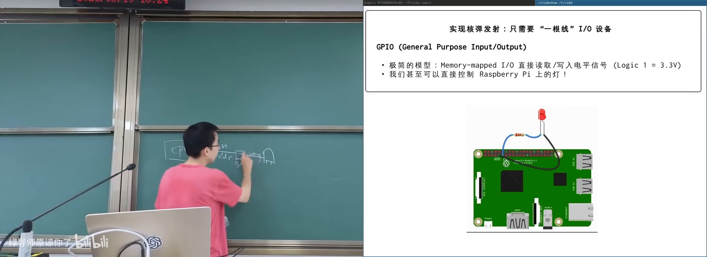
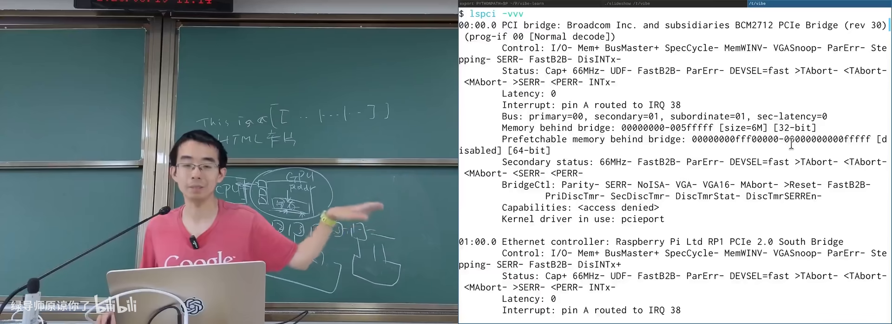
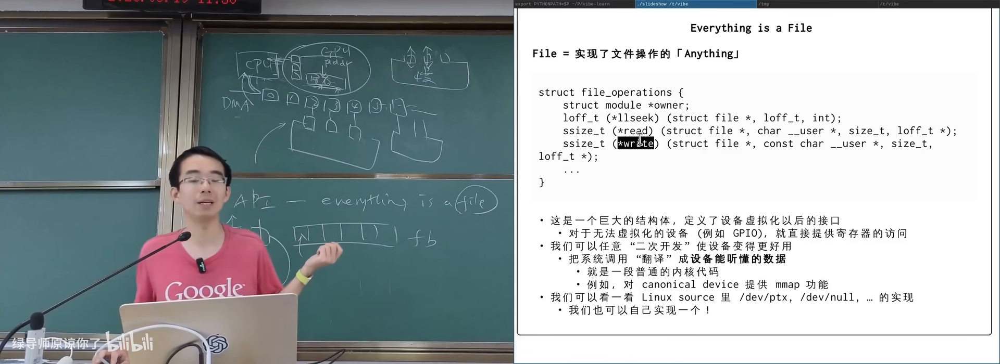

# 输入输出设备和驱动

> **原视频**：[Bilibili · BV1dYLq6gE8W](https://www.bilibili.com/video/BV1dYLq6gE8W/)（时长约 87 分钟）
> **课程**：南京大学《操作系统原理》（2026）第 22 讲
> **整理说明**：本书由视频字幕经 AI 重构而成；口语已转为书面语；关键时间点标注 *(参考时间)*，截图卡片可跳转视频对应位置。

---

## 1. I/O 设备原理：CPU 眼中的世界接口

<div class="prereq" data-label="你需要先知道">

- 寄存器、load/store、内存映射的大意
- 中断与系统调用概念
- everything is a file / 文件描述符

</div>

*(参考时间: 00:00)*

虚拟化与并发部分结束后，本讲打开操作系统对象里的“黑盒子”：**I/O 设备**，并进入持久化（persistence）主题的前奏。

### 1.1 你看见的电脑其实是外设

日常接触的是键盘、屏幕、鼠标、打印机——**输入输出设备**（I/O device，CPU/内存与物理世界之间的桥梁）。CS 课学的是底下看不见的 CPU/内存；IO 是计算机的“手和眼”。

**规范设备模型**（canonical device model）：任何能与 CPU 交换数据的接口/控制器都可以是 IO 设备。对 CPU 而言，设备通常简化为若干**寄存器**：

| 寄存器 | 作用 |
|--------|------|
| status | 设备是否 ready / 状态 |
| command | 启动、配置等命令 |
| data | 读写的数据 |

访问方式：

- **x86 port I/O**：独立 IO 地址空间，`in`/`out` 指令（如 COM1 基址 `0x3F8`）；
- **内存映射 IO（MMIO）**：设备寄存器映射到物理地址，直接 load/store（树莓派等 ARM/RISC-V 常见）。

### 1.2 中断与设备线程的想象

设备可通过中断线通知 CPU。用户态心智模型：

```text
线程 t_device:
    P(信号量)          // 等待中断
中断处理程序:
    V(信号量)          // 数据到来等事件
    唤醒 t_device
```

时钟中断保证 OS 对 CPU 的霸权地位；IO 中断则由内核处理后唤醒等待者。

### 1.3 从 LED 灯到“任何东西”

最简设备：一个可写寄存器连 LED。树莓派上可用 sysfs 路径（如 `/sys/class/leds/.../brightness`）`write` 闪烁。

能控制 GPIO 电平 → 继电器/电机/门禁在工程上同构——演示里戏称“核弹发射器”，强调**同一抽象覆盖所有设备**。

其他经典设备：

- **串口 / UART / TTY**：配置寄存器后读写 data，即可实现终端；
- **PS/2 键盘鼠标**：数据/时钟/VCC/GND 等引脚，端口 `0x60`/`0x64`；早期重复按键由键盘控制器完成，今多由软件处理；
- **ATA/IDE 磁盘**：等待 ready → 写扇区号与数量 → 命令寄存器 → 从数据口读。



---

## 2. 打印机、摄像头、协处理器与总线

<div class="prereq" data-label="你需要先知道">

- 编程语言/编译的直觉
- DMA 可先零基础，本节会解释
- 知道设备驱动“能让硬件工作”即可

</div>

*(参考时间: 00:20:25)*

### 2.1 打印机：设备是程序的解释器

早期打印机/绘图仪：卷纸（Y）+ 机械臂（X）+ 提笔/放笔 → 可画任意图形。CPU 侧只需发送“提/放/移”的指令序列。

设备变强后，描述语言升级：

- **PCL**：`ESC` + 命令 + 图像数据；
- **PostScript**：图灵完备的栈式语言，用路径/曲线/填充/字体描述矢量图形，长期是打印事实标准；
- **PDF**：更安全的容器格式（去掉通用计算），保留矢量描述；LaTeX/markdown 编译到 PDF 再 `lp`/`lpr` 打印。

> 打印机 = 解释专用语言的小计算机。

### 2.2 USB 摄像头与 UVC

现代 USB 摄像头多免驱：**UVC**（USB Video Class，USB 摄像头标准协议）规定枚举方式、格式/分辨率/帧率协商、逐帧字节流。Linux 上常见 `/dev/video0`。行车记录仪、显微镜、内窥镜等本质都是 UVC 设备。

### 2.3 协处理器与 DMA

设备能否与 CPU **共享内存**？可以——协处理器思路。

- 早期：80386 无浮点，配 80387；
- 现代：**DMA**（Direct Memory Access，专用引擎在内存与设备间搬运数据）：CPU 配置源/目的/长度后释放算力；
  - Intel 8237 等多通道 DMA 历史实现；
  - ATA 大数据量不再占用 CPU 循环端口读。

GPU/NPU：

- CPU 经寄存器配置 GPU，经 DMA 把 kernel 与数据送入显存，再“启动”kernel；
- GPU 常有独立显存（认为比系统内存更“贵”更快）；NPU 多共享系统内存。

### 2.4 总线：设备的“地址空间”

IBM PC 时代端口写死；设备种类爆炸后需要动态发现——**总线**（连接 CPU 与多类设备、负责枚举与数据通路的互连系统）也是特殊 IO 设备。

- CPU 轮询/中断感知设备变化；
- 总线可自带 DMA；
- **PCIe**：显卡/网卡/NVMe 等高速设备；CPU 手册标明 PCIe lanes 分配；
- **USB**：插上后枚举设备（`lsusb -t`），加载 UVC 等驱动；
- **CXL**（Computer Express Link）：在 PCIe 物理层上的新协议，含 IO/cache/memory 语义，目标是更远端的内存共享（disaggregated memory）。

插拔设备 → 中断 → 轮询总线 → 加载驱动：Windows 历史上的蓝屏名场面多与驱动/时序 bug 有关，Win7 后重构了驱动子系统。



---

## 3. 设备驱动程序：从寄存器到文件

<div class="prereq" data-label="你需要先知道">

- open/read/write 与文件描述符
- 结构体、函数指针（能想象“接口表”即可）
- 内核态与用户态的区分

</div>

*(参考时间: 00:52:58)*

### 3.1 为何不能让应用直接摸寄存器

- 多进程都要用 GPU/终端/打印机，必须同步；
- 底层接口过 raw，同步交给应用必然出并发 bug；
- 需要 OS **虚拟化**：把设备变成进程可见的**对象**。

UNIX 抽象：**everything is a file**——`/dev` 下设备节点，用 open/read/write（及 flock 等）访问。

显卡无驱动时的兼容模式：伪装成标准 **framebuffer**（帧缓冲：可当大数组写颜色），保证基本显示；加载驱动后才具备 DMA、3D、CUDA 等能力。

### 3.2 驱动 = 系统调用到设备语言的翻译

设备驱动是内核模块：把对设备文件的 read/write 等翻成寄存器操作（轮询 status、收发 data、等中断）。

示例：`/dev/null`

- read 返回 0；
- write 接受任意长度并丢弃（数据黑洞）。

课堂驱动示例「launcher」：

```text
struct file_operations 中注册:
    launcher_read  → 拷贝 "this is dangerous" 到用户态
    launcher_write → 校验密码，成功则在内核日志“发射”
    初始化/退出     → 注册/注销 /dev 节点
```

用 `insmod` 加载后，`cat /dev/launcher` 走 open+read；写入正确密码才触发副作用。旧驱动源码可让 AI 帮你适配新内核。

### 3.3 ioctl：UNIX 脏但必要的一面

文件抽象默认设备是**字节流/字节序列**；但设备还有 status/command 类**控制**功能（停止打印、改 TTY 模式、磁盘健康、键盘灯、GPU 功能开关……）。

UNIX 的答案是系统调用 **ioctl**（对设备文件发送与设备相关的控制请求）：参数以不加解释的方式交给驱动——所有非数据类复杂性几乎都堆在这里。

- 打印机卡纸处理、清洁、装订；
- 终端窗口大小与模式；
- 网卡、GPU 的大量功能经 ioctl 配置；
- CUDA 的 memory copy 等也通过 ioctl 类路径通知驱动启动 DMA。

复杂度体现：微软曾尝试 WSL1 用系统调用拦截模拟 Linux，因 `/proc`、ioctl 等隐藏细节无法 100% 兼容，最终改用运行真实 Linux 内核的虚拟机方案。

### 3.4 KVM：一个 ioctl 承载整台虚拟机

Linux 上的 `/dev/kvm` 演示了 ioctl 的力量：

1. `open("/dev/kvm")`；
2. ioctl 创建 VM、分配用户内存 region、创建 vCPU；
3. 把 guest 代码写入内存，设置初始寄存器；
4. ioctl `KVM_RUN`——进程逻辑上变成虚拟机，连续执行 guest 指令；
5. 触发 MMIO/IO/超调用等时 **VM exit** 回到用户态，可模拟设备后再进入。

课程早期的 CrazyOS（软件模拟 RV32 步进）与 KVM 对比，可见“专用硬件 + ioctl 抽象”的效率与复杂度。



---

## 4. 小结

| 层次 | 内容 |
|------|------|
| 物理 | 灯、笔、镜头、磁头、GPU 芯片 |
| 规范模型 | status / command / data 寄存器 + 中断 |
| 互连 | port I/O、MMIO、PCIe/USB/CXL 总线 |
| OS 抽象 | /dev 文件、驱动、DMA、ioctl |
| 应用 | open/read/write + 少量设备相关控制 |

下节课起更深入 **存储设备** 与文件系统：磁盘如何变成字节序列，再变成你每天用的文件树。

---

## 附录：概念补给

### canonical device model

- **是什么**：把设备看作可访问的寄存器组（状态/命令/数据）。
- **课上为何出现**：从 LED 到 GPU 的统一心智模型。
- **和什么像**：所有电器都有开关、指示灯和功能键。

### MMIO / port I/O

- **是什么**：用内存地址或专用 IO 端口访问设备寄存器的两种方式。
- **课上为何出现**：x86 与 ARM/RISC-V 访问设备的差异。
- **和什么像**：按货架编号取件 vs 走专门的取件窗口。

### UART / TTY

- **是什么**：串行通信接口 / 终端设备抽象。
- **课上为何出现**：有了串口，早期计算机才“能用”。
- **和什么像**：一根电话线两端的电传打字机。

### framebuffer

- **是什么**：显存中与屏幕像素对应的数组。
- **课上为何出现**：显卡无驱动时的兼容显示模式。
- **和什么像**：填色本——按格子涂，屏幕就显示颜色。

### DMA

- **是什么**：不占用 CPU 循环、在内存与设备间搬数据的引擎。
- **课上为何出现**：把 CPU 从大批量 IO 中解放出来。
- **和什么像**：物流车自己送货，老板不用亲自扛箱子。

### 总线（PCIe / USB / CXL）

- **是什么**：连接 CPU 与设备的互连，负责枚举、数据传输与供电等。
- **课上为何出现**：设备不能再写死端口，需要动态发现。
- **和什么像**：园区路网 + 门牌系统，新商户入驻即可被找到。

### 设备驱动

- **是什么**：内核中把文件 API 翻译成设备寄存器操作的模块。
- **课上为何出现**：应用不应直接竞争底层接口。
- **和什么像**：前台翻译——你说“打印”，她操作那台机器。

### struct file_operations

- **是什么**：文件对象上的操作函数表（read/write/mmap 等）。
- **课上为何出现**：驱动向 OS 注册“这个设备文件怎么读写”。
- **和什么像**：电器说明书附的按键功能表。

### ioctl

- **是什么**：对设备文件发送控制类请求的系统调用。
- **课上为何出现**：承载打印配置、TTY、GPU、KVM 等几乎所有非读写控制。
- **常见误解**：everything is a file 很干净；控制面复杂性其实堆在 ioctl。
- **和什么像**：遥控器上一堆厂商自定义按钮。

### UVC

- **是什么**：USB 摄像头设备类标准。
- **课上为何出现**：解释为何 USB 摄像头大多免驱。
- **和什么像**：充电口统一后，数据线大多即插即用。

### PostScript / PDF

- **是什么**：描述矢量打印内容的语言 / 更安全的文档容器格式。
- **课上为何出现**：打印机从“画线指令”进化到可编程描述语言。
- **和什么像**：从铅字排版到可无限放大的矢量设计稿。

### 协处理器

- **是什么**：协助 CPU 完成特定计算或搬运的附加处理器。
- **课上为何出现**：浮点单元、DMA、GPU/NPU 的共同位置。
- **和什么像**：厨房里的洗碗机——不替代厨师，但卸下重活。

### KVM（本讲语境）

- **是什么**：Linux 内核虚拟机设备，用户态经 ioctl 创建并运行 guest。
- **课上为何出现**：展示 ioctl 能承载多么重的子系统。
- **和什么像**：用一套物业接口就能申请一间“楼中实验室”。

---

*书架 Shelf 流水线生成 · 内容衍生自 B 站公开课程视频 BV1dYLq6gE8W*
