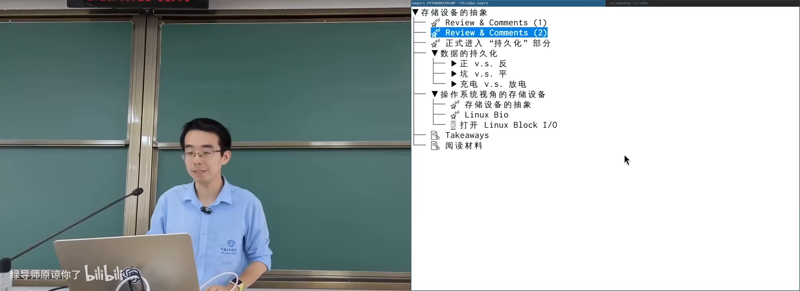
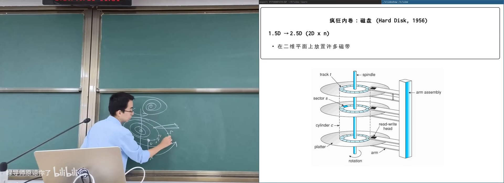
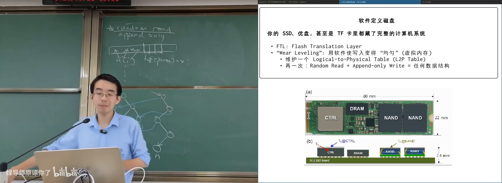

# 存储设备原理

> **原视频**：[Bilibili · BV1RHLh6pEqn](https://www.bilibili.com/video/BV1RHLh6pEqn/)（时长约 80 分钟）
> **课程**：南京大学《操作系统原理》（2026）第 23 讲
> **整理说明**：本书由视频字幕经 AI 重构而成；口语已转为书面语；关键时间点标注 *(参考时间)*，截图卡片可跳转视频对应位置。

---

## 1. 开幕：AI 原生时代的“超级个体”

<div class="prereq" data-label="你需要先知道">

- I/O 设备的规范模型（寄存器 + 中断）
- everything is a file / 驱动大致做什么
- 知道磁盘、SSD、U 盘是存数据的即可

</div>

*(参考时间: 00:00)*

课前以一则招聘（DeepSeek 等团队的 Agent / harness 研发）切入：岗位要求“**在 AI 辅助下，在没有直接经验的领域进行有质量保障的编程**”。传统“先学会再动手”的路径正在被重写——更重要的是知道**世界上有什么机制、你能提出什么问题**。

本讲主题：**一个 bit 如何持久化**，以及操作系统如何把存储设备抽象成块设备。

**持久化**（persistence，在断电或时间流逝后仍能保存的信息）不限于几千年后的考古（石刻、甲骨文），也包括手机关机后你今天的照片与文档。

童年玩具「磁性画板」就是一种持久化：铁粉被磁笔吸到表面成像，底部磁铁扫过后复位——只要有一个**可反复改写且可读出的状态**，就能 persist。计算机要求更严：每个 bit 必须能**用电读写**。



---

## 2. 从磁带到磁盘：磁性存储

<div class="prereq" data-label="你需要先知道">

- 磁铁有 N/S 极，可磁化铁磁材料
- 计算机按字节/bit 访问数据
- 顺序访问 vs 随机访问的区别

</div>

*(参考时间: 00:02:03)*

### 2.1 磁带（tape）

近百年历史：一维（现代磁带有多磁道）介质上粘附铁磁单元，用磁场方向表示 0/1；磁头靠**电磁感应**读出电流方向，用强磁场写入。

早期形态：纸带 + 铁磁体；小霸王学习机时代仍可用磁带保存 BASIC 程序（音频信号转写）。

现代磁带的优点：

| 优点 | 说明 |
|------|------|
| 密度极高 | 纳米级磁畴，可达约 300GB/平方英尺、单卷数十 TB 量级 |
| 成本低 | 主要是结晶介质，工艺相对集成电路简单 |
| 可靠性高 | 固态晶体结构，可存放数十年 |
| 顺序读写尚可 | 磁头跟得上时吞吐不差 |

**致命缺点：随机读写极差**——定位要把很长的磁带卷过去再卷回来。因此磁带适合**冷数据归档、备份**，以及本来就顺序消费的**音视频**（磁带 A/B 面、倒带重听是时代记忆）。

若把磁带映射进地址空间再随机指针访问，延迟会高到不可用。

### 2.2 磁鼓（drum）

改进：把一维磁带绕成圈，硬质鼓面高速旋转，**多磁道并行**布置读写头。

- 最坏延迟 ≈ 等待旋转一周；
- 转速可达每分钟千转量级；
- 从“一维内卷”变成“1.5 维内卷”。

### 2.3 机械硬盘（HDD）

再进一步：把一圈圈“磁带”铺在**二维盘片**上：

- 多盘片、双面读写；
- 读写头可**径向移动**切换磁道，盘片旋转带来周向定位；
- 密封环境、高转速（5400/7200 RPM 等）；
- 垂直磁记录等工艺进一步提高面密度。

特点：

- 便宜、容量大、介质稳定；
- **怕震动**：跌落时磁头可能划伤盘片（消费级笔记本风险；机柜内相对稳定）；
- 顺序读写好；**随机读写**需寻道 + 等待旋转，可达毫秒级（约 8ms 对现代 CPU 很长）；
- **可数据恢复**：盘片结构稳定，控制器坏了仍可能拆盘读取（SSD 颗粒损坏则往往不可逆）。

磁盘内部已集成控制器（自带小计算机）：请求排队、电梯式寻道等调度在盘内完成。对外仍是**大字节序列**。



### 2.4 软盘（floppy disk）

- 5.25 英寸盘片较软，驱动器读写头从窗口读取；
- 3.5 英寸外壳更硬，有保护盖与**写保护**拨片（光电传感器检测）；
- 驱动器成本低，介质密度与性能低于硬盘；
- **1980–90 年代人际传数据的主力**：DOS 曾装在一张 1.44MB 软盘上；《仙剑》等游戏多盘发行，玩到一半要“请插入下一张软盘”。

今天 Office/WPS 保存图标仍是软盘剪影——时代的吉祥物。

---

## 3. 挖坑存储：光盘与更极端的方案

<div class="prereq" data-label="你需要先知道">

- 激光、反射、干涉的大致直觉
- 模拟信号（黑胶）与数字信号的区别
- 本章零基础可跟

</div>

*(参考时间: 00:36:21)*

石碑、Rosetta Stone：在稳定介质上**挖坑**即可表示 bit（有坑/无坑）。现代工业把坑挖到肉眼不可见。

### 3.1 光盘（CD/DVD/Blu-ray）

- 坑在塑料层；激光照射产生干涉/反射差异 → 读出 0/1；
- 数字编码（如 8–14 调制）+ 纠错；
- 早期黑胶是**模拟**槽纹记录声波振动，杠杆放大还原声音；
- CD 由索尼/飞利浦等为数字音频设计，容量约对应贝多芬第九交响曲长度（约 700MB 一代 CD）。

**复制革命（压盘）**：

1. 做带凸起的**母盘/钢模**；
2. 塑料压模 → 镀反射膜 → 数百 MB 数据数秒写完；
3. 工厂并行压盘，等效写入吞吐可极高。

因此软件、电影、随书光盘大规模分发；课堂展示 Win98 盗版盘、驱动盘、教材示例代码盘等。

特点：成本极低、容量不低、可靠性尚可（划痕多在塑料面，坑在另一侧）；缺点是**随机读性能差**（开放旋转结构）、**写入困难**、母盘不可改——在“随时可更新 + 网络下载”的时代逐渐退出主流。

### 3.2 Persistent data structure：只追加也能变一切

计算机科学问题：有 **random read** 的存储，但只允许 **append-only**（只能往后写）——如何实现任意可读写数据结构？

以二叉树插入为例：**不改旧节点**，只复制从根到插入点的 O(log n) 路径，新根指向新路径，未改动的子树指针仍指旧节点。

- 空间代价 O(log n)；
- 历史版本全部保留（拿到旧根就是旧树）；
- 这类结构叫 **persistent data structure**（持久化数据结构——与存储介质语义双关）。

### 3.3 Project Silica：玻璃里挖坑

微软等探索：用聚焦激光在**玻璃**内部改变晶体结构写入 bit，append-only；读出靠光学定位。配套机器人图书馆做三维定位与取放。

配方仍是：random read + append-only write = 任意数据结构；只是介质换成玻璃、寻址换成机器人。是否商用取决于成本，但说明“存储创新仍在发生”。

---

## 4. 闪存和 SSD

<div class="prereq" data-label="你需要先知道">

- 电路门可以充放电
- 磁盘随机延迟来自机械结构
- 了解“逻辑块 → 物理位置”映射有助理解 FTL

</div>

*(参考时间: 00:53:41)*

磁/坑都有机械定位代价。高性能电子计算机需要：**电路密度 + 电路速度**。

### 4.1 Flash memory：电路里的坑

**闪存**（用浮栅等结构存住电子来表示 bit 的集成电路存储）与 MOS 管类似，多一个 **floating gate**：充电/放电表示 0/1；还可精确控制电荷量，在一个 cell 里存多个 bit（TLC 3bit、QLC 4bit 等）。

优点近乎“不讲道理”：

- 集成电路量产后价格可接受；
- 密度高、全固态封装（不怕水、灰尘，相对耐摔）；
- **并行扩展性好**：多颗颗粒多份带宽（评测里 1TB 常快于 512GB）。

2006 年前后 Jim Gray 等已预见：flash 终将大量取代磁盘类设备。普及功臣其实是 **U 盘**（USB 接口 + 闪存芯片封装的专利思路），2000 年前后开始替代软盘成为交换媒介。

### 4.2 致命伤：擦写寿命与 FTL

放电放不干净 → cell 逐渐进入不可用状态（**wear out**）。QLC 级 cell 可能只有约千次擦写量级。若“逻辑第 1 块”永远写同一物理 cell，文件很快损坏——但你很少遇到，因为：

SSD/U 盘/TF 卡内都有**完整小计算机**（主控 CPU + DRAM + 固件），其中关键软件是 **FTL**（Flash Translation Layer，把逻辑块号翻译到物理块的闪存转换层）：

- 维护 logical → physical 映射表（类似 page table）；
- 再次写同一逻辑块时**写到新物理块**，改映射；
- **wear leveling**（磨损均衡：把写入摊到所有物理块）；
- 映射表自身也要持久化 → 用 append-only / 类似 persistent data structure 的方式实现。



廉价假盘风险：主控可被改写，把 64GB 颗粒伪装成 1TB——初用正常，超出真实容量后数据静默丢失。协议层的容量查询、健康信息都可伪造——“不要买便宜到不正常的存储”。

### 4.3 操作系统视角：块设备

设备再复杂，OS 侧常简化为 **block device**（以固定大小块读写的存储设备接口）：

- 块大小常见 512B / 4KB / 16KB 等；
- 目的：摊薄**寻址电路**成本（磁盘的磁头/转轴、闪存的行列选通）；
- 接口主要是 `read_block` / `write_block`（及 flush 等一致性相关操作）。

```text
struct block_device_operations {
    // 读一块、写一块……
};
```

实现了块读写后，`read`/`write`/`mmap` 等文件语义由 OS 再向上构建。

代价：**读写放大**——只改 1 字节也要整块读出、改写回；NVMe 等新接口开始允许更直接操作内部结构以减轻放大。

课堂用 AI + eBPF 类工具观察真实系统上的 block 读写（find、写大文件时的读写颜色分布）：从 first principle（“磁盘读写一定由代码实现，故可观测”）出发，即便没有直接经验也可做出可用工具。

---

## 5. 小结

| 介质 | bit 物理形态 | 随机访问 | 典型场景 |
|------|--------------|----------|----------|
| 磁带 | 磁畴方向 | 很差 | 冷归档、顺序流 |
| 磁鼓/软盘 | 旋转磁介质 | 中等偏差 | 历史：交互与传数据 |
| HDD | 盘片磁道 | 毫秒级 | 大容量温数据 |
| 光盘 | 坑/反射 | 较差，难写 | 分发（渐退） |
| Flash/SSD | 浮栅电子 | 好，可并行 | 主力热/温数据 |
| 玻璃等 | 材料相变 | 依赖机械 | 探索中的长期存档 |

下节课起：块设备之上如何形成**文件系统**——从“读写块”到人类与程序使用的目录树。

---

## 附录：概念补给

### persistence（持久化）

- **是什么**：信息在断电、关机、时间流逝后仍可读回。
- **课上为何出现**：存储设备要解决的根本问题。
- **和什么像**：刻在碑上比写在沙上更“持久”。

### 磁带 tape

- **是什么**：顺序访问为主的磁性条带存储。
- **课上为何出现**：最古老的现代存储之一，密度与归档价值高。
- **和什么像**：一长卷电影胶片，要快进快退才能到目标帧。

### 扇区 sector / 块 block

- **是什么**：设备一次定位读写的数据单元（如 512B）。
- **课上为何出现**：用分组摊薄寻址成本，形成 block device 抽象。
- **和什么像**：图书馆按整箱调书，而不是一本书一本书找。

### block device

- **是什么**：OS 对存储设备“按块读写”的统一接口。
- **课上为何出现**：文件系统之下的设备层抽象。
- **和什么像**：把仓库简化成“整箱存取”的标准货架协议。

### FTL（Flash Translation Layer）

- **是什么**：SSD 内部把逻辑块映射到物理页并做磨损均衡的固件层。
- **课上为何出现**：解释为何闪存寿命有限却很少用坏。
- **和什么像**：图书管理员把“第 1 本借阅记录”实际指向不同书架上的书。

### wear leveling（磨损均衡）

- **是什么**：把写入/擦除尽量摊到所有闪存单元。
- **课上为何出现**：避免热点块先写穿。
- **和什么像**：轮流坐庄，不让同一人天天加班。

### 读放大 / 写放大

- **是什么**：逻辑小操作触发物理上更大的读写量。
- **课上为何出现**：块设备粒度带来的副作用。
- **和什么像**：改一页便签却要搬动整箱档案。

### append-only / 追加写

- **是什么**：只允许在末尾写入，不原地修改。
- **课上为何出现**：光盘、部分日志与 SSD 内部映射的共同约束。
- **和什么像**：日记本只往后写，改错就贴一张新便条。

### persistent data structure（持久化数据结构）

- **是什么**：更新时保留历史版本的数据结构（路径复制等）。
- **课上为何出现**：在 append-only 介质上实现任意逻辑结构。
- **和什么像**：改合同不涂改原件，另附修订页并更新目录。

### Project Silica

- **是什么**：在玻璃介质中用激光写入、用于长期存档的研究项目。
- **课上为何出现**：展示“挖坑存储”仍可现代化。
- **和什么像**：把数据刻进“不会生锈的石板”，配机器人图书馆取放。

### 压盘（光盘复制）

- **是什么**：用母盘压模批量复制光盘数据层的工艺。
- **课上为何出现**：光盘成为软件/影音分发主流的原因。
- **和什么像**：印章盖章——刻章贵，盖章便宜又快。

---

*书架 Shelf 流水线生成 · 内容衍生自 B 站公开课程视频 BV1RHLh6pEqn*
