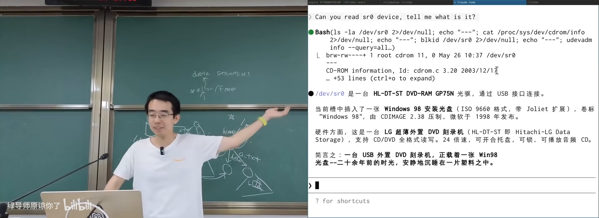
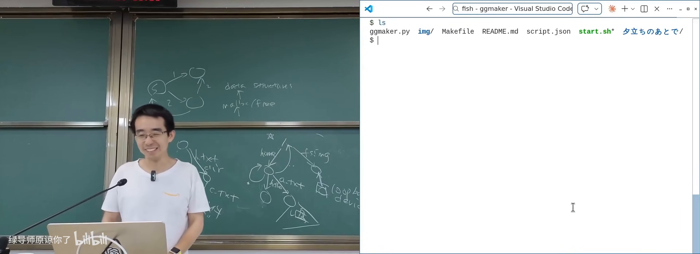
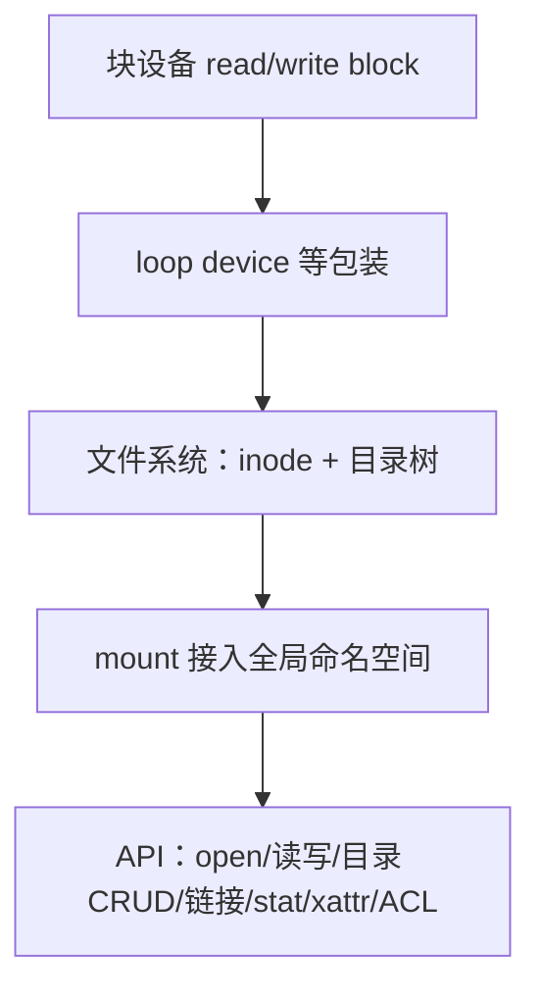

# 文件系统 API (1)

> **原视频**：[Bilibili · BV1hAGr6vEi9](https://www.bilibili.com/video/BV1hAGr6vEi9/)（时长约 79 分钟）
> **课程**：南京大学《操作系统原理》（2026）第 24 讲
> **整理说明**：本书由视频字幕经 AI 重构而成；口语已转为书面语；关键时间点标注 *(参考时间)*，截图卡片可跳转视频对应位置。

---

## 1. 从块设备到文件：为何还要一层抽象

<div class="prereq" data-label="你需要先知道">

- block device：按块读写的大字节序列
- 虚拟内存 / mmap 的直觉
- open/read/write 与文件描述符

</div>

*(参考时间: 00:00)*

上节课把存储设备抽象成 **read_block / write_block**（外加等待落盘等）。设备再简单，也**不该让进程直接抢设备文件**——多进程共享一个巨大字节序列，就像 malloc 实验里的共享堆，冲突与同步会把系统搞乱。

类比内存：

| 层次 | 物理 | 虚拟抽象 | 之上 |
|------|------|----------|------|
| 内存 | DRAM 条 | 虚拟地址空间（MMU） | malloc/free、数据结构 |
| 存储 | 块设备 | **文件（变长字节序列）** | 目录树、应用数据 |

**文件**（file，计算机中可变长的字节序列抽象）：现实里是“固定于纸张等载体的信息记录”；在系统里是 `vector of byte`，支持 read/write/lseek/truncate 等，通过 **fd** 访问。

### 1.1 PID 不友好，路径才好用

进程有 PID，数字对程序够用、对人不友好。若 `open` 全是 `open(176358)`，人类无法使用。图书馆用**分类层次**（中图法：大类→子类→书架）组织信息——文件系统同理：**目录树**。

数据结构视角：

```text
/
├── home → 目录节点
│   ├── .  → 指向自己
│   ├── .. → 指向 /
│   └── a.txt
```

- `.` 当前目录，`..` 上级目录（UNIX 把功能糅进目录项）；
- 以 `.` 开头的名字约定为**隐藏文件**（`ls` 默认过滤；`ls -a` 才显示）——BusyBox `ls` 里往往是判断 `d_name[0]=='.'` 后 `continue` 的一行逻辑；
- OS 不区分“隐藏”，是工具层的约定。

文件系统可以管理几乎一切信息（制度文档、轨迹、Agent 可读的世界状态）——层次索引是非常强的抽象。

### 1.2 Windows 的隐藏对象树

Windows 也有更底层的对象根（非盘符路径）：设备、驱动、`\\server\share` 网络路径等。A:/B: 是历史上的软驱，系统盘才从 C: 开始；用户看到的 `C:\` 只是投影。向前兼容导致补丁层叠——普通用户无感，做系统工具的人要面对。

---

## 2. 目录树的挂载（mount）

<div class="prereq" data-label="你需要先知道">

- 目录树与路径解析
- 知道 U 盘插上后“多了一个盘/目录”
- ioctl 是设备控制接口（上讲）

</div>

*(参考时间: 00:00–00:38:25 主体)*

世界上到处都是目录树：本地分区、U 盘、网络盘。OS 必须提供 API，把**另一棵树接到全局命名空间的某个节点上**。

### 2.1 mount 系统调用

**mount**（把某个存储上的文件系统目录树接到现有目录树某节点）语义：

- 通常要求源是**块设备**（或等价的 loop 设备）；
- 挂载后对该路径的读写反映到真实设备；
- 只读介质（光盘）会 `mount` 为 read-only。

最小 Linux 演示：只有 `initramfs` 与 `minimal.S` 时，需要执行挂载才能用上真实磁盘上的文件系统；启动链路里还有 `switch_root` 等步骤。

### 2.2 课堂演示：Win98 光盘

插入光驱 → `lsblk`/块设备列表出现 `sr0` 等：

1. AI/工具解释 ISO9660：在固定偏移找 `CD001` 一类标识，定位**主描述符**结构；
2. `mount /dev/cdrom /mnt`（只读警告）；
3. 可见 `autorun.inf`（Windows 自动播放）、`README` 等；
4. 中文编码可能是 GBK，需 `iconv` 转 UTF-8；
5. `strace mount`：大量 **ioctl**——确认块设备、读容量、查光驱状态（无盘则失败重试）；
6. `eject` 退出光盘同样是 **ioctl**（如 CDROMEJECT）。

> 操作系统里没有魔法：要么是 well-defined 系统调用，要么是驱动替你处理的设备语义。

### 2.3 挂载“一个文件”：loop 设备

实验常下载 `fs.img`（磁盘镜像文件）再挂载。问题：`mount` 要的是 block device，普通文件不是。

方案：**loop device**（回环设备：把对块设备的读写转发到某个文件）：

```text
1. 应用探测镜像内文件系统类型（如 vfat）
2. open("/dev/loop-control")
3. ioctl(LOOP_CTL_GET_FREE) → 分配 loopN
4. ioctl(LOOP_SET_FD) 等：绑定镜像文件描述符
5. mount("/dev/loopN", target, fstype, ...)
```

`lsblk` 里会看到多个 `loop0, loop1...`（snap 等也会占用）。文件系统类型在**系统调用参数**里必须给出；探测发生在用户态 mount 工具，OS 对非法格式直接拒绝。



### 2.4 FHS

Linux 有 **FHS**（Filesystem Hierarchy Standard，规定 `/usr`、`/home`、`/mnt` 等顶层目录含义的标准）。macOS 内核是 UNIX 传统却不完全按 Linux FHS。标准有点“过时”，但仍提供共同语言。

---

## 3. 目录树 API

<div class="prereq" data-label="你需要先知道">

- 目录、路径、cd
- 系统调用可以被 strace 看到
- 引用计数大意（有指针指向就不能删）

</div>

*(参考时间: 00:38:25)*

### 3.1 增删改查与 glob

对目录树的系统调用包括：创建/删除目录、遍历（`getdents64` 等）、路径解析下的 open 等。

通配符（glob）如 `*/*.conf` 往往是 **shell 展开**后再 exec，不直接对应单一系统调用；包在 `bash -c` 里 `strace` 可见大量 open + getdents。AI 工具的 `glob`/`grep` 也是同一类目录遍历能力。

### 3.2 硬链接（hard link）

文件在数据结构上是**带名字的指针**；同一 inode 可以有多个目录项。

```bash
ln a.txt b.txt          # 或 link(2)
ls -li a.txt b.txt      # 相同 inode 编号
```

- 改 `a.txt` 内容，`b.txt` 同步变（同一对象）；
- `rm` 实际是 **unlink**：去掉一个名字并减**引用计数**；
- 计数到 0 才回收数据；
- **不能对目录做硬链接**（否则易成环，引用计数失效，树与盘“脱钩”）。

### 3.3 符号链接（symbolic link / symlink）

**符号链接**（内容为“去哪找”的路径字符串的特殊文件）：

- 可跨文件系统、可指向目录、可成环、可指向不存在的路径（悬空后若目标回来又可用）；
- 路径解析时自动拼接目标路径；
- Windows 快捷方式语义更复杂（盘符变化后仍尝试定位目标）。

课堂演示：用 symlink 实现 **Galgame 式目录状态机**——每个状态一个目录，选项是符号链接，`cd` 即选择分支；`pwd` 路径即历史；`cd ..` 可回溯。说明 symlink 是构建**虚拟目录视图**的强力工具。



### 3.4 与 Nix 的联想

内容寻址存储 + generation：所有软件版本放进 store，用链接拼出环境；**只增不减**，可回滚——与 append-only + persistent data structure 的思想同构。今天可以让 AI 直接生成 `shell.nix` 等，无需先背语法。

---

## 4. 文件的属性

<div class="prereq" data-label="你需要先知道">

- ls -l 能看到权限、类型
- 用户/用户组的概念
- root 权限更高

</div>

*(参考时间: 00:57:56)*

### 4.1 元数据一览

`ls -l` / `stat` 可见或推断的属性包括：

- **inode 编号**（文件系统内唯一 ID，类似“文件的 PID”）；
- **类型**：目录 d、符号链接 l、管道 p、字符设备 c、块设备 b、普通文件 -；
- **权限位**：user / group / other 各 rwx（读/写/执行）；
- **owner / group**；
- 链接数、时间戳、大小等。

```bash
chmod 777 a.txt    # rwxrwxrwx
chmod 000 a.txt    # 即使 root 之外不可访问；执行 chmod 仍可改回
```

权限不足时 `open` 在系统调用层即失败（strace 可见 `EACCES`）。FAT 等早期文件系统甚至没有 POSIX 权限模型。

### 4.2 隐藏与 policy 的局限

UNIX 的“隐藏”只是命名约定；Windows 属性勾选类似。你真正想要的可能是复杂 **policy**（“仅当我一个人时才显示学习资料”）——通用 OS 不提供，因为需要判定环境。这是产品与系统设计的空隙。

**procfs 的“欺骗”**：`/proc` 下对象多半不是磁盘上真文件，而是内核数据结构（如 `task_struct`）在 `getdents`/`open` 时**动态投影**出来的幻觉——目录树 API 背后可以是任意实现。

### 4.3 extended attributes（xattr）

**扩展属性**（挂在文件上的 key-value 元数据）：

```bash
setfattr -n user.author -v "..." a.txt
getfattr -d a.txt
cp --preserve=xattr ...
```

- 可存图标、下载进度、签名、语义标签等（macOS 下载中的图标形态等）；
- **拷贝不友好**：普通 `cp` 可能静默丢掉 xattr；目标文件系统（如 FAT）不支持时也会丢；
- 适合：向量检索索引、Agent 工具的语义元数据（vector FS 等）。

### 4.4 ACL

rwx 三组权限较粗。**ACL**（Access Control List，按用户精细授权的访问控制表）可表达“除某人外都可读”等。设计问题：owner 是否应能 deny 自己？**root** 是否应 bypass？（通常 root 绝对权限，否则可被恶意占满磁盘且无人能删。）概念存在即可在需要时让 AI 帮你落地。

---

## 5. 小结



本讲是**人与普通程序**使用的文件系统 API；下一讲将讨论**程序与 AI Agent** 使用的文件系统视角——更少见，但是现代系统与 Agentic 工具链的基础。

---

## 附录：概念补给

### 文件系统（本讲语境）

- **是什么**：在块设备上组织“文件 + 目录树”的一层软件抽象。
- **课上为何出现**：多进程共享存储需要命名与并发管理。
- **和什么像**：图书馆编目系统——书在库房，你通过索引找到书。

### mount

- **是什么**：把一个文件系统目录树接到现有树的某个节点。
- **课上为何出现**：U 盘、光盘、网络盘进入全局命名空间的唯一正规方式。
- **和什么像**：在书架预留位置“挂”上另一家图书馆的分馆入口。

### FHS

- **是什么**：Linux 文件系统层次标准（/usr、/home 等含义）。
- **课上为何出现**：目录树的共同语言。
- **和什么像**：城市里“路/街/巷”的命名规范。

### inode

- **是什么**：文件系统里标识文件对象的编号与元数据载体。
- **课上为何出现**：硬链接即多个名字指向同一 inode。
- **和什么像**：书的 ISBN——多个书名条可以指向同一本书。

### 硬链接 hard link

- **是什么**：同一 inode 的额外目录项名。
- **课上为何出现**：省空间共享同一数据；unlink 只减引用计数。
- **和什么像**：同一本书在两个索书号下都能找到。

### 符号链接 symlink

- **是什么**：内容为目标路径字符串的链接文件。
- **课上为何出现**：跨文件系统、拼环境（Nix）、目录状态机。
- **和什么像**：便签上写着“真正的文件在 3 号柜”。

### loop device

- **是什么**：把文件伪装成块设备的内核机制。
- **课上为何出现**：挂载磁盘镜像 `.img` 实验的前提。
- **和什么像**：把一叠电子照片插进“虚拟光驱”再当光盘用。

### getdents / 目录遍历

- **是什么**：读取目录项的系统调用，`ls` 等工具的基础。
- **课上为何出现**：glob、工具链背后都是目录 API。
- **和什么像**：翻开图书馆抽屉里的一叠卡片。

### 引用计数（文件语境）

- **是什么**：有多少目录项指向该 inode。
- **课上为何出现**：解释 `rm` 为何是 unlink，而非立刻毁数据。
- **和什么像**：最后一位读者退卡后书才下架。

### 权限位 rwx / mode

- **是什么**：按 user/group/other 控制读、写、执行。
- **课上为何出现**：文件属性对 OS 行为的影响（execve、open）。
- **和什么像**：门禁卡分级：业主、家人、访客。

### ACL（访问控制列表）

- **是什么**：对单个文件按主体精细授权的机制。
- **课上为何出现**：mode 三组权限不够用时的扩展。
- **和什么像**：门禁名单上逐个写人名，而不是只分“住户/外人”。

### extended attributes（xattr）

- **是什么**：文件上的任意 key-value 元数据扩展。
- **课上为何出现**：隐藏 policy、语义标签、Agent 友好索引。
- **常见误解**：`cp` 默认不一定保留；FAT 等可能不支持。
- **和什么像**：书末夹页写备注——换书袋时容易掉。

### procfs

- **是什么**：把内核对象投影成文件树的特殊文件系统。
- **课上为何出现**：目录 API 可以完全是“动态幻觉”。
- **和什么像**：镜子里的仪表盘——看起来是实体，实际是投影。

---

*书架 Shelf 流水线生成 · 内容衍生自 B 站公开课程视频 BV1hAGr6vEi9*
