# 文件系统 API（二）：监控、快照、Overlay 与 FUSE

> **原视频**：[Bilibili · BV12gVs6SExQ](https://www.bilibili.com/video/BV12gVs6SExQ/)（时长约 83 分钟）
> **课程**：南京大学《操作系统原理》（2026）第 25 讲 · 文件系统 API（二）
> **整理说明**：本书由视频语音转录后经 AI 重构而成，口语已转写为书面语；关键思路标注 *(参考时间)*，`SCREENSHOT:` 占位对应演示时刻。

---

## 1. 从增删改查到文件系统级 API

- 上一讲：目录/文件的创建、删除、链接、符号链接与权限（mode）
- 听说过 mount 可以把一个块设备挂到目录树
- 了解「数据结构可以定义其上的操作」这一抽象即可

*(参考时间: 00:00)*

上一讲覆盖了文件的增删改查：`mkdir`、`link`、`unlink`、`symlink`，以及 mode / extended attributes 等元数据。这些是**对单个文件或目录的一小步操作**。

本讲的出发点是一个更根本的问题：**文件系统本身是一个数据结构**（abstract data type，给定数据与操作契约的抽象类型）。既然如此，理论就可以为它定义远超增删改查的操作——就像你在数据结构课上为集合、数组区间做 fancy 的全局操作一样。

课上规划了四条主线：

1. **监控**：文件系统变了就通知我；
2. **快照**：整棵目录树在某一时刻的样子；
3. **覆盖/合并（overlay / union）**：把两个目录「叠」成一个；
4. **终极虚拟化**：自己写代码充当一个文件系统。

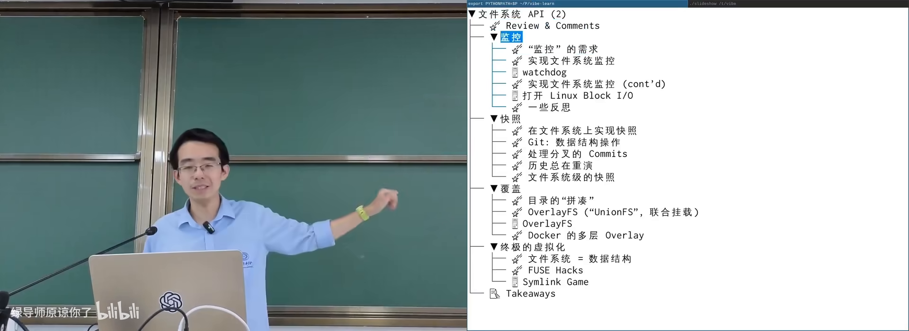

---

## 2. 文件系统监控：从轮询到 inotify

- 会用 shell 改文件、看修改时间
- 知道「热数据会进操作系统缓存」
- 本章零基础可跟

*(参考时间: 00:04:11)*

### 需求：改了就告诉我

最典型场景是 Web 开发的热重载：Python/Next.js 代码改完一保存，服务自动 reload；改一个 CSS，浏览器页面立刻变色。文件管理器自动刷新、编辑器自动重载、`systemd` 监控 unit 文件、`tail -F` 等待写入，都属于同一类需求。

原则上**不借助操作系统也能做**：写个脚本，反复 `stat`（读文件元数据）对比修改时间，`diff` 出变化即可。

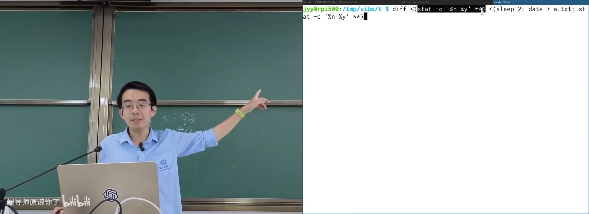

但若目录里有几百万个文件，每次全量查询代价过高（即便有内核缓存）。更自然的模型是：**事件驱动**——变了就推送。

### inotify：事件驱动的机制

Linux 提供 inotify（文件系统事件监控机制）：

- `inotify_init` 返回一个**文件描述符**（可用 `poll`/`select` 一起监听多个）；
- `inotify_add_watch` / `inotify_remove_watch` 管理关心的路径；
- 事件到来时读到结构体：哪个路径、什么类型（create/modify/close…）。

注意：内核的 inotify **默认不递归**。库（如 Python `watchdog`）往往再包一层做递归。

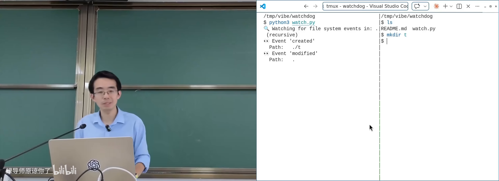

课上演示发现一个容易忽略的细节：**改文件会连带改上级目录的 mtime**，但**不会**沿目录链一路上传——多层目录里只有直接父目录被改。

### 从 inotify 到「全系统可观测」

监控若从「目录里文件变了」推广到「操作系统任意状态变了」，会碰到更本质的机制。课上展示了 bpftrace 观测块设备 I/O 生命周期：谁在读、谁在写、谁在 sync 落盘。

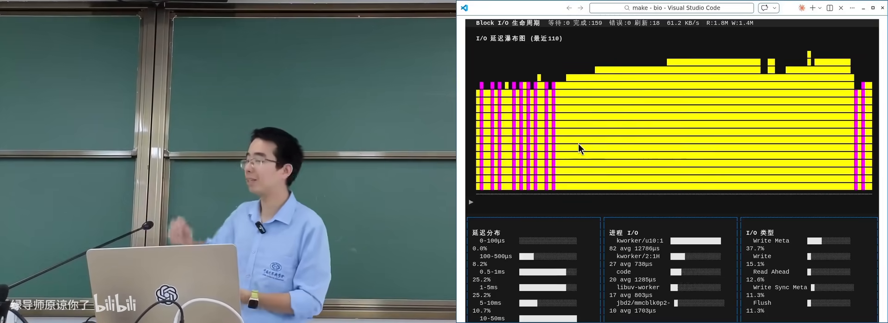

若你写过模拟器，可以把操作系统想成状态机（Everything is a state machine）：理论上任何状态变化都可以被观测。trace 家族：

- `strace`：系统调用；
- `ltrace`：库调用；
- inotify：文件系统事件——可视为**面向文件子系统的全局 strace**。

再往前一步：能否把自己写的代码插进内核钩子？这自然引出 **eBPF**（extended Berkeley Packet Filter，允许经校验的小程序挂到内核探针上的虚拟机机制）。

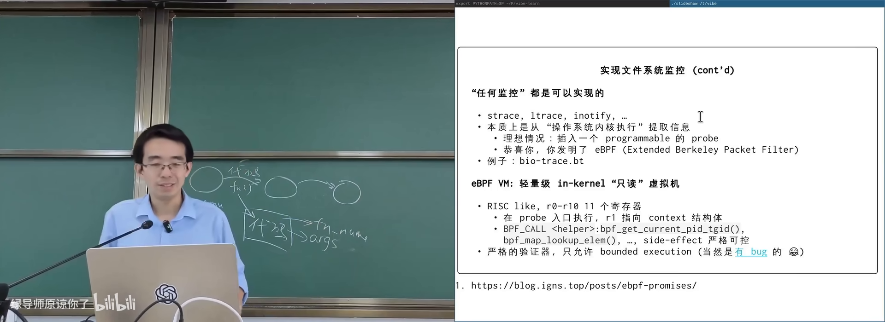

要点：

- 字节码 + 严格验证器：禁止无界循环、限制对内核内存的写；
- 通过 `bpf` 系统调用注入，挂到 tracepoint / hook point；
- 用 **BPF map**（内核预实现的键值结构）做计数等统计——没法在 BPF 里随便造数据结构；
- 历史动机：网络包过滤要在内核里高效裁决，避免来回用户态的开销。

课上强调：eBPF 也不是没有 bug（生产环境中曾遇优化器误杀应执行的 printf）。但机制本身极为强大——例如捕获键盘/鼠标事件，结合 `execve` 等 trace，几乎可以复原你在 Linux 上的操作轨迹。

---

## 3. Specification is all you need

- 知道「系统能做到什么」与「如何高效实现」可以分开
- 用过或听说过 coding agent / 大语言模型
- 本章概念零基础可跟

*(参考时间: 00:26:30)*

监控需求的现代答案是：先写一个**功能正确但可能很慢**的原型（比如反复 stat + diff），把「我想要什么」说清楚（specification，规格说明），再让模型借助操作系统现成机制（inotify、eBPF 等）做高效实现。

课上对 DeepSeek 招聘要求的解读是：在**不熟悉的东西上仍能把事搞定**。对系统底层能做到什么要 knowledgeable，能组合机制并写清规格；高效实现可以交给模型。还要会软件工程意义上的质量保障、幻觉应对与回滚。

更远的设想（Just-in-time systems）：将来系统本身可能根据 workload 与环境被 AI 从零合成、现场改内核，而不是永远使用人预先写死的通用内核。

---

## 4. 快照：文件系统作为持久化数据结构

- 知道 Git 大致能保存历史版本
- 了解「指针指向对象」的数据结构画法
- 本章零基础可跟

*(参考时间: 00:31:29)*

### 持久化数据结构

**持久化数据结构**（persistent data structure，修改后旧版本仍然可用的数据结构）的经典实现思路是：**append-only（只追加）+ random read（随机读）**。

以二叉树插入为例：不原地改节点，而是**把从根到插入点的路径拷贝一遍**得到新版本 V1，未改动的子树用指针共享。这样所有历史版本都还在。

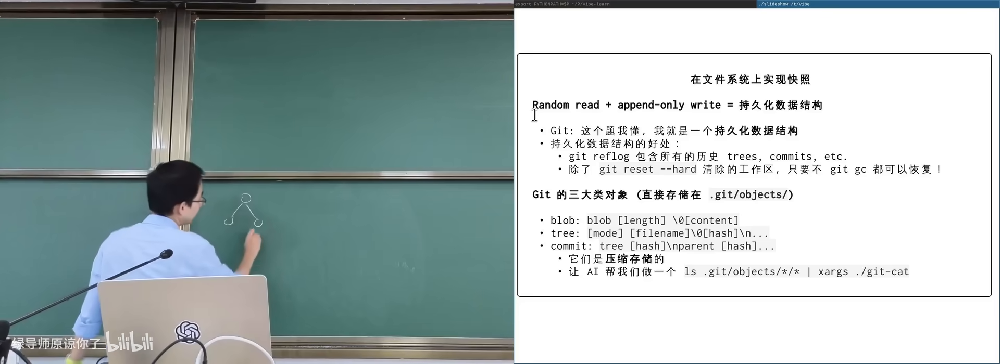

### Git 就是持久化数据结构

课上花了不少时间「打开 Git」：`.git/objects` 里只有三类对象——

- **blob**：文件内容（压缩存储）；
- **tree**：目录快照（名字、mode、指向 blob/tree 的哈希）；
- **commit**：提交说明、时间戳、指向 tree 与 parent。

其余几乎都是**以文本形式存在的指针**：HEAD、分支、stash。旧版本的 `a.txt` 与新版本会**同时**留在 objects 里。

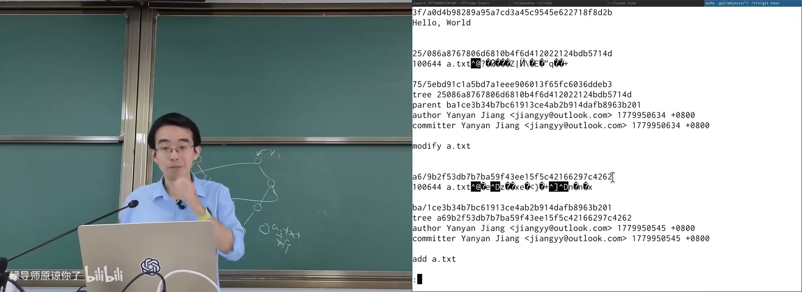

分支只是「指向某个 commit 的指针文件」；merge 的标准做法是生成有两个 parent 的新 commit（三方合并：公共祖先 + 两侧 tree）；本地无分叉时可以 fast-forward。`cherry-pick` 把某次提交的 **diff** 搬到另一历史线上；`rebase` 则是连续 cherry-pick，把本地提交「搬到」远端之后——历史看起来更直，但会改写提交 id，冲突时可能连续撞车，需要慎用。

**worktree**：因为对象库 append-only，复制「工作区」几乎零成本——新目录里的 `.git` 只是指向主仓库 `worktrees/<name>` 的文本。这解决的是「单工作区 + 单 HEAD」在被多任务打断时的窘境，在 Agent 并行改同一仓库的时代又成了标配。

### Btrfs：磁盘上的持久化文件系统

若把同一思想落到块设备上，就有了 **Btrfs**（基于 B-tree 的写时复制文件系统）：目录树、卷等都以 copy-on-write 方式更新，快照只是给当前 root 指针起个名字——`ioctl` 创建，几乎免费。

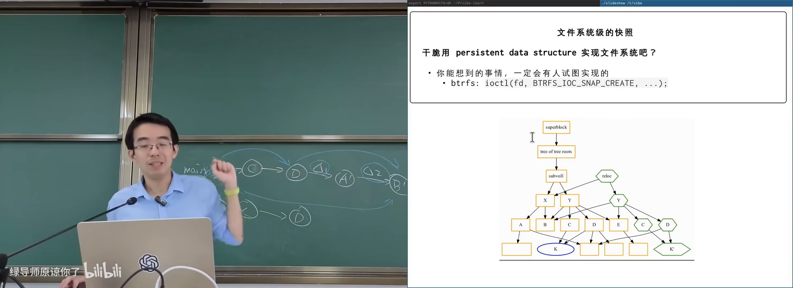

---

## 5. Union FS 与 OverlayFS：把目录叠起来

- 知道目录树、mount 挂载
- 了解 Docker 会「一层一层」构建镜像（概念即可）
- 本章机制零基础可跟

*(参考时间: 01:01:00)*

### upper / lower / merge

**联合文件系统**（union filesystem，把多个目录合并成一个虚拟目录）允许你准备：

- **lower**：底层，通常只读，可多层；
- **upper**：上层，可写；
- **merge / overlay**：对外呈现的合并视图。

访问规则：先在 upper 找，找不到再去 lower；都没有则不存在。Linux 通过 `mount -t overlay` 实现，并额外要求一个空的 **work** 目录给内核做临时操作。

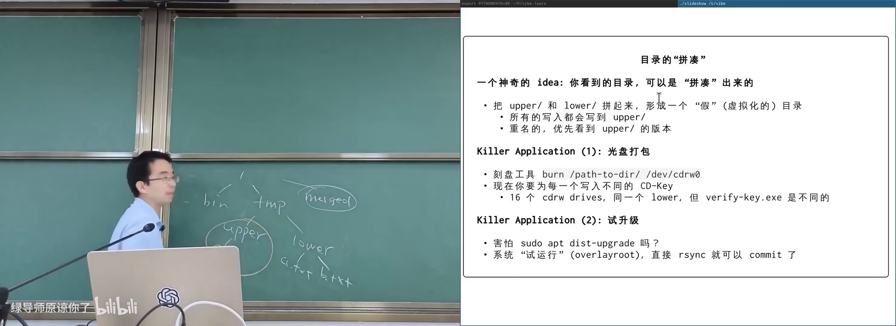

演示中的关键行为：

- 在 upper 写新文件：merge 与 upper 同时可见；
- **改 lower 里已有文件**：lower 本身不变，upper 里出现一份修改后的副本（写时复制）；
- **删除 lower 里的文件**：lower 仍不变，upper 出现 **whiteout**（白色删除标记，通常是一个特殊字符设备），让 merge 视图「看不见」该文件。

这与哈希表删除需要 tombstone（墓碑）是同一类技巧。

### 应用场景

1. **安全试错**：把系统根当 lower，空 upper 做危险升级；失败则丢弃 upper，系统完好。`overlayroot` 一类工具可自动完成。
2. **网吧 / 考试机**：lower 是干净系统，每位用户/每场考试各用一个 upper；下机或换场直接换 upper。大规模竞赛管理也用同一思路隔离场次。
3. **Docker 分层镜像**：Dockerfile 每一条 `RUN` 产生一层；该层执行时，已有层是 lower，新写入进 upper，结束后 upper 固化为新的一层。改中间某条命令，必须从该层起重放后续步骤——所以正确做法是**在顶部追加**新的 `RUN`，而不是改历史。多个容器可共享同一套 lower 镜像，各自持有 upper。

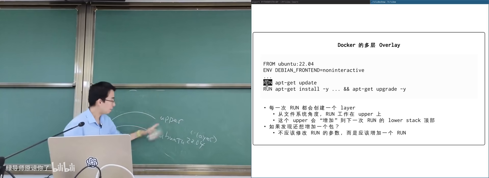

Overlay 已不是单纯的增删改查：它改变了目录树的**语义**（合并视图）。

---

## 6. FUSE：自己实现一个文件系统

- 知道「文件系统暴露目录树、支持读写」
- 听说过 `/proc` 这类虚拟文件系统
- 本章零基础可跟

*(参考时间: 01:16:20)*

既然文件系统只是数据结构，也可以**用代码直接充当文件系统**。路径之一是写内核模块；更通用的是 **FUSE**（Filesystem in Userspace，用户态文件系统框架）：内核把 lookup/read/write 等操作转发给你实现的回调结构体。

你只需实现类似 `fuse_operations` 的函数表：`open`、`read`、`readdir`、`write`……**返回什么完全由你的程序决定**。目录树可以是虚构的，背后甚至可以没有任何磁盘文件。

课上的 GGFS（Galgame 文件系统）演示：挂载后目录里出现程序生成的文件；`cat` 得到内容；向某文件 `write` 则驱动内部状态变化，目录随之改写——游戏逻辑跑在文件系统回调里。

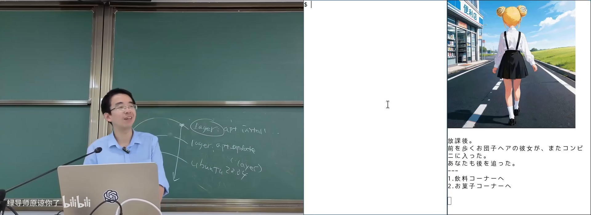

疯狂而合理的用法还包括：

- 把 SSH 远端目录映射成本地路径；
- 把远程 Git 仓库映射成本地目录；
- 用 SQLite 等数据库持久化「文件系统」；
- 把 JSON 的 key 映射成目录、value 映射成文件（如 FF 一类项目）；
- 实现「`ls` 看不见、但知其名仍可 `cd`」的隐藏目录。

这是 **Everything is a file** 的终极实现：只要约定好目录树与读写语义，任何东西都可以挂进文件系统。

---

## 7. 本讲小结与 AI 时代的做法

- 已读完本讲前几章
- 本章零基础可跟

*(参考时间: 01:22:20)*

一句话收束：**文件系统是数据结构**。从增删改查出发，借助操作系统机制，可以做出监控、快照、合并视图乃至任意虚拟文件系统。

对开发者而言：

- **先知道系统能做什么**（inotify、overlay、FUSE、journal……）；
- **把功能规格写清楚**，哪怕原型很慢；
- **让 AI 组合机制做高效实现**，自己把关质量与正确性。

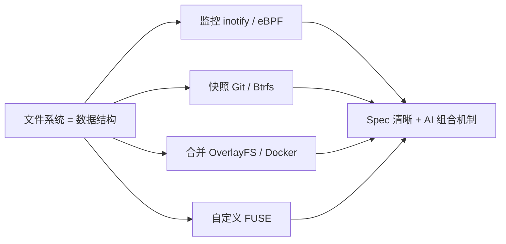

---

## 附录：概念补给

### Abstract Data Type（ADT）

- **是什么**：数据 + 在其上允许的操作，接口与实现分离。
- **课上为何出现**：文件系统首先是 ADT，才能讨论「还能定义什么操作」。
- **和什么像**：栈/队列接口 vs 数组/链表实现。

### inotify

- **是什么**：Linux 内核把文件系统变化作为事件推给应用的机制。
- **课上为何出现**：热重载、文件管理器刷新等需求不该靠狂轮询。
- **和什么像**：门铃 vs 每隔两秒开门看有没有人。

### eBPF

- **是什么**：经校验的小程序挂到内核探针上运行的框架。
- **课上为何出现**：监控需求若超出文件事件，需要更通用的内核观测点。
- **常见误解**：不是随便往内核里塞代码——有验证器与有界执行约束。

### Persistent Data Structure

- **是什么**：修改产生新版本，旧版本仍可查询的数据结构。
- **课上为何出现**：快照的理论基础；Git/Btrfs 皆属此类。
- **和什么像**：橡皮泥 vs 乐高：前者改了就没了，后者可以叠出历史造型。

### Git objects（blob / tree / commit）

- **是什么**：Git 对象库仅存内容、目录树、提交三类不可变对象。
- **课上为何出现**：证明 Git「没有魔法」，只是指针与 append-only。
- **和什么像**：给文件夹拍证件照（tree）+ 写明信片说明这张照（commit）。

### worktree

- **是什么**：同一 Git 对象库上的多个工作目录/分支检出。
- **课上为何出现**：单 HEAD 难以应付多任务与多 Agent。
- **和什么像**：一套底片冲多份相纸，各修各的，底片共用。

### Union / OverlayFS

- **是什么**：把 upper/lower 多个目录合并成一个虚拟视图。
- **课上为何出现**：安全升级、考试隔离、Docker 镜像分层的共同底座。
- **常见误解**：改 lower 不会真的改 lower——修改落在 upper。

### whiteout

- **是什么**：Overlay 删除下层文件时在 upper 留下的「已删除」标记。
- **课上为何出现**：只读 lower 无法就地删文件，必须有删除语义。
- **和什么像**：哈希表删除用的 tombstone。

### Docker layer

- **是什么**：Docker 镜像由只读层叠成，容器再加可写层。
- **课上为何出现**：OverlayFS 是其文件系统侧实现。
- **常见误解**：改 Dockerfile 中间步骤不会自动「热更新」上层——要重放。

### FUSE

- **是什么**：在用户态实现文件系统操作回调的框架。
- **课上为何出现**：证明「文件系统可以就是你的程序」。
- **和什么像**：把任何 API 包装成「看起来像目录」的适配器。

### Specification is all you need

- **是什么**：把「正确行为」写清楚，实现效率交给模型与现成机制。
- **课上为何出现**：AI 时代角色从手写高效代码转向定义系统意图。
- **常见误解**：规格清晰 ≠ 不需要验证与软件工程。
