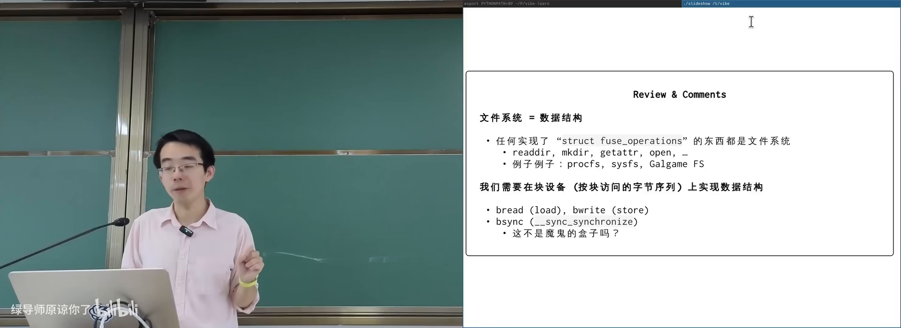
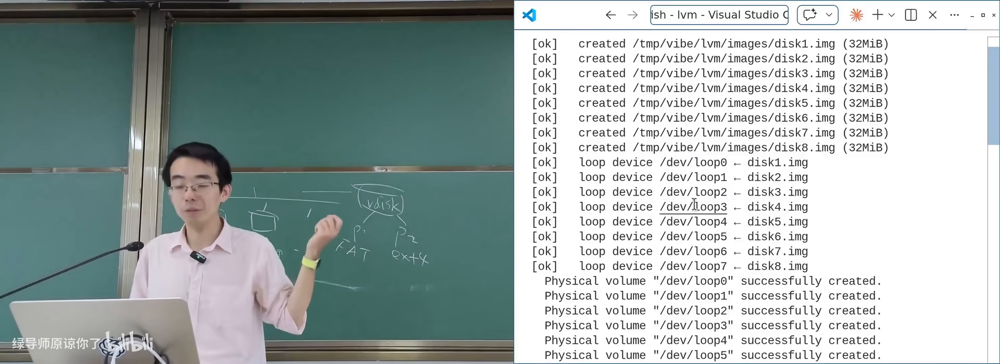
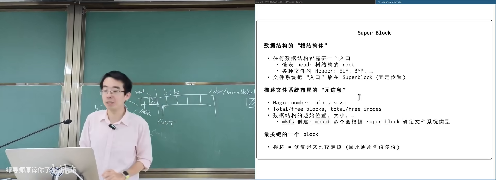
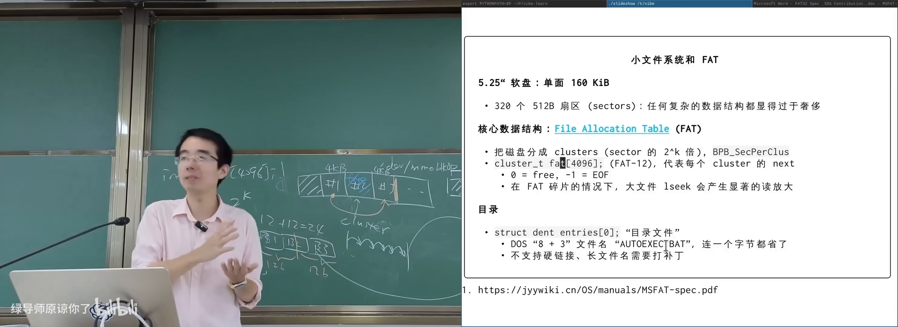
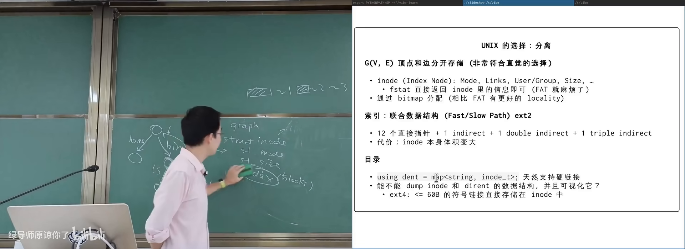
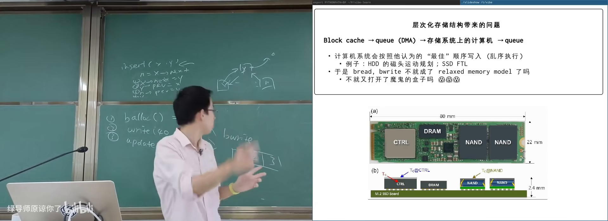

# 文件系统实现与崩溃一致性

> **原视频**：[Bilibili · BV12EV66bErd](https://www.bilibili.com/video/BV12EV66bErd/)（时长约 87 分钟）
> **课程**：南京大学《操作系统原理》（2026）第 26 讲 · 文件系统实现和崩溃一致性
> **整理说明**：本书由视频语音转录后经 AI 重构而成，口语已转写为书面语；关键思路标注 *(参考时间)*，`SCREENSHOT:` 占位对应演示时刻。

---

## 1. 在块设备上实现「目录树」

<div class="prereq" data-label="你需要先知道">

- 知道文件系统提供目录树与文件读写
- 听说过磁盘/SSD 按块（block）读写
- 了解「数据结构落在存储上」这一抽象即可

</div>

*(参考时间: 00:00)*

上一讲已说明：只要实现目录遍历、创建/删除目录、属性查询与 open/read/write 等基本操作，一个东西就可以是文件系统——包括 `/proc` 这类虚拟文件系统，甚至课上演示过的 galgame fs。

本讲问题更具体：**如何在块设备上实现一个能持久化（persistence，断电后数据仍在）的目录树数据结构**。

### 块设备的简化模型

把块设备想成三件事（与并发编程里的共享内存类比）：

| 块设备操作 | 类比 |
|-----------|------|
| 读一块 | load |
| 写一块 | store |
| 等待写入落盘（block sync / flush） | 内存屏障 / 等待所有写完成 |



现实设备更复杂：分区表、逻辑卷可以层层虚拟。课上演示了 **GPT**（GUID Partition Table，UEFI 规范的一部分，描述磁盘上分区布局的数据结构）与 **LVM**（Logical Volume Manager，把多个物理卷拼成卷组再切逻辑卷）：用 loop 设备（把普通文件伪装成块设备）叠出多层虚拟磁盘，再格式化成 FAT 与 ext4 分区，写入的 `hello`/`world` 最终落在底层镜像文件里。



对 LVM 相关命令做 strace 会发现：底层大量是 **ioctl**（设备驱动的扩展控制接口）——loop 创建、device mapper、分区映射皆然。这也说明「实现一个兼容 Linux 的系统」远不止 read/write。

### 读放大与写放大

文件系统作为数据结构，难在**高效**：

- 你只想要文件大小或 mtime，却要读进一整块元数据（**读放大**）；
- 你只改一个字节，却要更新数据块、inode/元数据、分配位图，甚至触发 SSD 内部 FTL（闪存转换层，逻辑块到物理页的映射表）的 copy-on-write（**写放大**）。

因此必须在内存里做**块缓存**（Linux 称 buffer cache）：`bread`/`bwrite` 类接口类似 load/store，miss 时再下到设备。设计时要利用 **locality**（局部性，一起访问的数据放同一块）。

---

## 2. 设计问题与工作负载

<div class="prereq" data-label="你需要先知道">

- 知道文件有「数据」和「元数据」（名字、权限、时间戳）
- 本章零基础可跟

</div>

*(参考时间: 00:17:10)*

实现目录树至少要回答：

1. **元数据存在哪**？直接塞在数据里，还是单独区域？
2. **数据块怎么组织**？一个大文件可能几十 GB，offset → 块号如何映射？
3. **目录怎么表示**？名字到文件对象的映射。

高效设计需要先做工作负载研究（workload study）。课上引用的经典统计大致是：

- 个人/源码场景：**大量小文件**；
- 少数大文件（电影、数据库）占绝大部分空间；
- 单个目录 entry 通常不多；
- 目录往往被填得较满。

这些 finding 直接指导：小文件要省元数据、头部访问要快、目录项要紧凑。

### 所有数据结构都要有 root

磁盘上的数据结构必须有**入口**：链表有 head，树有 root，ELF 有 magic number 与 header，GPT 在磁盘头（兼容 MBR）与盘尾各存一份。文件系统的入口叫 **super block**（超级块，描述块大小、inode/数据区位置、空闲空间等关键信息）。`mount` 与 `mkfs` 都围绕它工作。若只允许破坏一个块以造成最大麻烦，super block 是首选。



---

## 3. FAT：极致省空间的链表

<div class="prereq" data-label="你需要先知道">

- 知道软盘/小 U 盘容量很小
- 知道链表节点用 next 指针串起来
- 本章零基础可跟

</div>

*(参考时间: 00:26:30)*

**FAT**（File Allocation Table，文件分配表）面向极小设备：5.25 英寸软盘单面约 160KB，按 512 字节一块只有约 320 块。设计哲学不是 fancy 索引，而是**把空间省到极致**。

### 核心：next 数组

磁盘被划成 **cluster**（簇，若干扇区绑成的逻辑分配单位）。FAT 核心是一个与 cluster 编号对应的数组，可理解为：

```text
next[cluster] = 下一簇编号 | 0(空闲) | 特殊值(文件结束)
```

文件 = 从目录项记录的 first cluster 出发，沿 next 走到结束。再存一个文件 size，即可知道最后一簇有多少字节属于该文件。

FAT12/16/32 中的数字指 next 表项的位宽。FAT12 甚至把两个 12-bit 表项打包进 3 字节，按 bit 紧压。

### 目录也是文件

早期 FAT 文件名固定 11 字节（8.3 格式：8 字符名 + 3 字符扩展名）。目录项（directory entry）含名字、属性位（只读/隐藏/系统/目录等）、size、first cluster 高低位。目录本身也是用 next 串起来的线性表，**不支持硬链接**。

今天在 FAT 镜像里仍能看到 `LONGNA~1` 这类波浪线截断——为了在 DOS 下保持可访问。



### 优缺点

- **优点**：结构极简，小文件多的场景几乎全在内存里跳指针，性能可接受。
- **缺点**：大文件 + 碎片（fragmentation，分配回收导致块不连续）时，next 跳来跳去，FAT 表自身也可能很大，产生严重读放大。

课上示例代码把镜像 `mmap`（映射到进程地址空间）后，super block 变成指针、DFS 扫目录树，直接验证连续簇与碎片簇——**文件系统没有神秘，就是可解析的数据结构**。

---

## 4. UNIX 文件系统：inode 与联合索引

<div class="prereq" data-label="你需要先知道">

- 知道 `ls -l` 会显示权限、链接数等
- 了解「页表」或「多级索引」的思想（听过即可）
- 本章零基础可跟

</div>

*(参考时间: 00:41:20)*

UNIX 设计者考虑得更远：大文件、大文件系统、硬链接。目录树在 UNIX 里更接近**图**：每个目录有 `.`（自己）与 `..`（父目录）。

### 节点与边分离

- **节点元数据** → **inode**（索引节点，保存 mode、size、时间戳、数据块索引等，**不含文件名**）；
- **边** → 目录文件中的映射：`文件名 → inode 编号`，可顺序存放；
- **数据** → 由 inode 中的索引结构指向块。

### 联合索引：头部要快，还要能很大

统计表明：多数文件很小，且「读文件头」远多于「读整文件」。UNIX 因此在 inode 内直接放若干**直接指针**（指向文件前部的数据块）；不够时用一级、二级、三级**间接索引**（间接块里存的是「指向数据块的指针」，可类比多级页表）。



另有一招：所有 inode 集中存放，利用目录内文件创建时间上的连续性，一次读入相关元数据；短符号链接甚至可以**偷** inode 里索引区的空间，直接内联路径字符串。

Linux 提供 `debugfs` 等工具暴露底层：link count、block id、inline symlink 等都能看到。你不必读完全部内核源码——知道「应该有办法暴露底层信息」，再用工具/AI 构建可视化即可。

---

## 5. 崩溃一致性：又一个「魔鬼盒子」

<div class="prereq" data-label="你需要先知道">

- 知道多步数据结构更新中途失败会留下坏状态
- 听说过并发编程里锁保护临界区
- 本章故事线零基础可跟

</div>

*(参考时间: 00:50:30)*

数据结构课与并发课解决的是「多线程同时改」；文件系统还要面对 **crash consistency**（崩溃一致性）：系统随时可能掉电/崩溃，磁盘上的数据结构必须仍处于一致状态，或至少可恢复到一致。

### 为何多写一步就危险

以向文件 append 一个块为例，至少涉及：

1. 分配位图：把某块标记为已用；
2. 写入数据；
3. 更新 inode/元数据。

这三次 `bwrite` 进入设备队列后，**顺序不保证**。崩溃时任意子集都可能已落盘。最危险的例子：inode 与数据都写了，位图没更新——该块在文件系统眼里仍空闲，未来会被分配给别人，**文件内容某天突然被覆盖**。



人类曾长期「裸奔」：先用起来，坏了再 **fsck**（file system check，事后扫描并修复元数据不一致）。UNIX 会把无目录指向但仍存在的 inode 丢进 `lost+found`。

### 日志：用操作记录换一致

数据结构有两种视角：

1. **就地状态**：直接维护树/表；
2. **操作日志**：记下所有修改，重放即可重建。

**append-only 的日志天然是崩溃友好的**——多写一条日志，崩溃后按序 redo。

**Journal / write-ahead log / redo log**（先写日志再改正本）：

```text
transaction begin
  → 写入日志（元数据或完整块写）
  → flush 等待落盘
  → transaction end（再 flush）
  → checkpoint：把日志重放到正本数据结构
  → 清除日志
```

只要磁盘上能看到 `transaction end`，就说明之前的日志必然已落盘（happens-before），重启后可以安全 redo。

优化与变种：

- **合并事务**（xv6）：多次系统调用共享一次 flush；
- **JBD2**：Linux 日志块设备守护进程，周期性 checkpoint；
- **ext4 checksum 日志**：用校验和代替部分 flush 同步；
- **metadata journal**：只日志 inode/位图等元数据，文件内容可丢一小段——保证目录树完整，提高性能。

LSM-Tree（log-structured merge tree）是同一思想在存储引擎中的体现：内存 memtable + WAL，刷盘成不可变层再合并。

---

## 6. 应用层如何安全地保存文件

<div class="prereq" data-label="你需要先知道">

- 会写程序保存文件
- 知道 rename 系统调用
- 本章零基础可跟

</div>

*(参考时间: 01:14:40)*

即便文件系统有 journal，**应用**仍可能把事情做错。文本编辑器若 `open(O_TRUNC)` 后进程被杀，文件直接没了。

常见「以为安全」的序列：

```text
write a.txt.tmp → close → unlink a.txt → rename a.txt.tmp → a.txt
```

问题：unlink 与「创建空 tmp」都可能进元数据日志；崩溃后 redo 可能得到「空 tmp + 旧文件已删」。

更可靠的做法：

- 在关键步骤调用 **fsync 家族** 确保落盘；
- 或依赖 **rename 的原子性**：`rename` 要么完成替换，要么什么都没发生（Linux 语义）。

`sync` 家族：

| 调用 | 作用 |
|------|------|
| `sync` | 全局文件系统同步 |
| `fsync(fd)` | 同步该文件数据与元数据 |
| `fdatasync(fd)` | 同步数据；仅当元数据受影响时才同步元数据——固定大小文件/数据库 redo log 场景更高效 |

课上研究结论：大量软件（GNU make 的错误构建、in-place sort、早期 Node/Electron 生态等）都存在崩溃一致性问题；正确姿势并不在大众常识里。

AI 时代可以：把当年的 crash-consistency 论文丢给模型，让它实现简化检查器，对 `sort` 等工具观测系统调用并模拟崩溃现场——**知识 + 模型** 可以复现并扩大当年的实验，但更值得做的是没人做过的事。

---

## 附录：概念补给

### 块设备

- **是什么**：按块读写的存储抽象，像一个大数组。
- **课上为何出现**：文件系统正本实现其上的持久化数据结构。
- **和什么像**：共享内存，只是多了一步「等待落盘」。

### GPT

- **是什么**：GUID 分区表，描述磁盘分区布局的标准（属 UEFI）。
- **课上为何出现**：固件启动时就要看懂磁盘结构。
- **和什么像**：房间平面图：不看图就不知道卧室在哪。

### LVM

- **是什么**：逻辑卷管理器，把多块盘拼成卷组再切逻辑卷。
- **课上为何出现**：展示「块设备也能层层虚拟」。
- **和什么像**：把几间储藏室打通再重新隔断出租。

### 读放大 / 写放大

- **是什么**：为完成逻辑上很小的读/写，底层实际读/写了更多数据。
- **课上为何出现**：文件系统性能设计的核心约束。
- **和什么像**：只想改作文里一个字，却要把整页重抄一遍。

### Super block

- **是什么**：文件系统在磁盘上的「总说明书」数据结构。
- **课上为何出现**：任何持久化数据结构都要有 root。
- **常见误解**：不是「最大的块」，而是**最关键的元数据块**。

### FAT / cluster

- **是什么**：用 next 数组串起簇的文件分配表；cluster 是逻辑分配单位。
- **课上为何出现**：最小可用的磁盘文件系统设计。
- **和什么像**：用一串便利贴写着「下一页在第几页」。

### 碎片（fragmentation）

- **是什么**：频繁分配回收后，文件块不再连续。
- **课上为何出现**：解释 FAT 大文件性能崩坏。
- **和什么像**：图书馆书架上同一套书被拆散到各层。

### inode

- **是什么**：UNIX 中存放文件元数据与块索引的结构，文件名在目录里。
- **课上为何出现**：支撑硬链接与高效大文件索引。
- **常见误解**：文件名不在 inode 里；多个名字可指向同一 inode。

### 间接索引

- **是什么**：用额外块保存「指向数据块的指针」，扩展可寻址范围。
- **课上为何出现**：兼顾「头部快」与「文件可以很大」。
- **和什么像**：多级页表：目录套目录，最终才到房间。

### Crash consistency

- **是什么**：任意时刻崩溃后，磁盘数据结构仍一致或可恢复。
- **课上为何出现**：持久化系统独有的正确性要求。
- **和什么像**：并发里的「任意交错都正确」，换成「任意掉电点都正确」。

### Journal / Redo log

- **是什么**：先追加记录操作意图，崩溃后按日志重做。
- **课上为何出现**：实现崩溃一致性的主流工程手段。
- **和什么像**：先在草稿纸记账，再誊进账本；丢了账本就按草稿重抄。

### fsck

- **是什么**：事后扫描文件系统元数据并修复/找回孤儿文件。
- **课上为何出现**：日志之前人类的「先挣钱后还债」方案。
- **和什么像**：仓库着火后盘点：能对上的入库，对不上的进失物招领。

### sync / fsync / fdatasync

- **是什么**：请求操作系统把缓存数据刷到存储设备的系统调用家族。
- **课上为何出现**：应用层参与崩溃一致性的主要接口。
- **常见误解**：`close` ≠ 数据已安全落盘。
