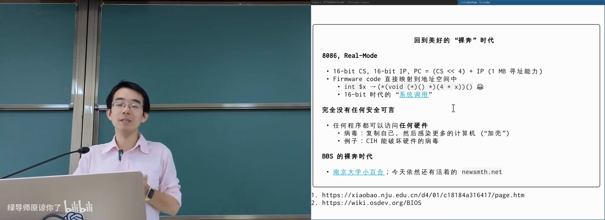
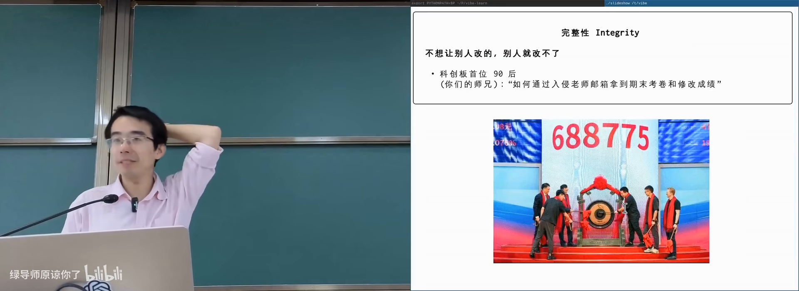
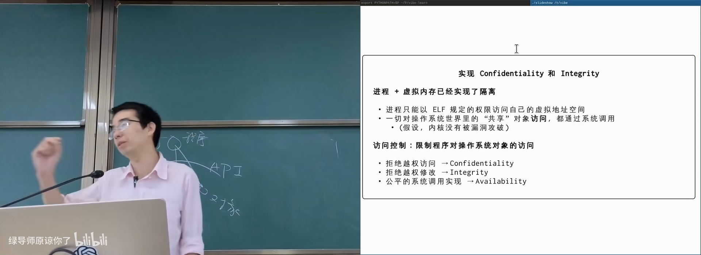
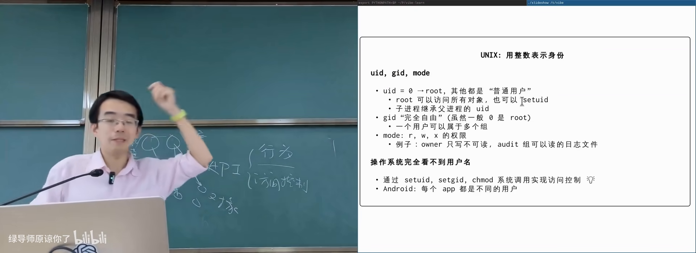
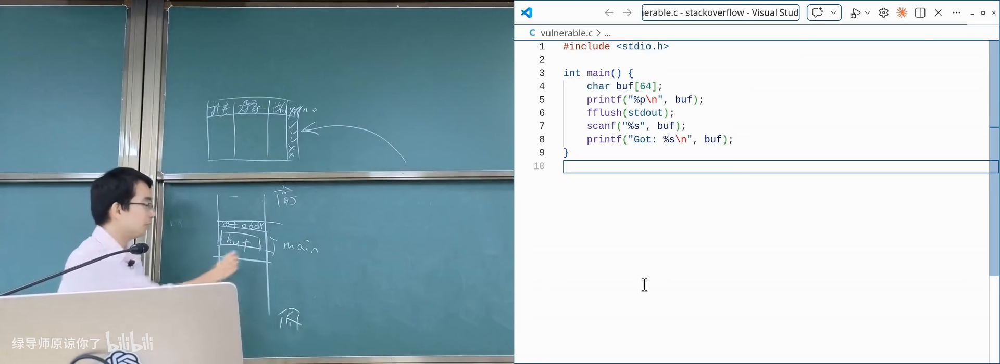

# 计算机系统安全

> **原视频**：[Bilibili · BV1qkEX6FEb5](https://www.bilibili.com/video/BV1qkEX6FEb5/)（时长约 84 分钟）
> **课程**：南京大学《操作系统原理》（2026）第 28 讲 · 计算机系统安全
> **整理说明**：本书由视频语音转录后经 AI 重构而成，口语已转写为书面语；关键思路标注 *(参考时间)*，`SCREENSHOT:` 占位对应演示时刻。本讲为补充内容，不作传统操系统主干的考试要求。

---

## 1. 从「裸奔」的早期系统谈起

<div class="prereq" data-label="你需要先知道">

- 知道程序运行时有进程与内存
- 听说过「黑客/病毒/入侵」等日常用语
- 本章历史背景零基础可跟

</div>

*(参考时间: 00:00)*

文件系统接口与实现讲完后，操作系统对象带来一个功能之外的问题：**计算机系统安全**——谁可以看、谁可以改、服务是否还能用。

早期几乎没有安全可言。8086 实模式 PC：16 位 CS 左移 4 位加 16 位 IP 得到 20 位地址，约 1MB 空间；CPU **没有任何内存保护**，任何程序都可以改写别的程序。系统调用经 `int` 指令查中断向量表跳到固件代码——固件只读尚可，但用户内存完全不受监管。

**病毒**可以加壳（给可执行文件改入口，先跑恶意代码再跳回原入口）复制自己、感染更多机器，甚至破坏硬件。网络侧同样裸奔：古早 BBS（如南大小百合、水木）登录密码**明文传输**，无 HTTPS；站点常可脚本爆破。



当互联网开始承载隐私与支付，「不安全」就不再可接受。

---

## 2. 安全的三个维度：CIA

<div class="prereq" data-label="你需要先知道">

- 本章零基础可跟

</div>

*(参考时间: 00:06:00)*

课上把安全收成三件事：

| 维度 | 含义 | 例子 |
|------|------|------|
| **机密性 / Confidentiality** | 不想给别人看的，别人看不到 | 删除的照片不应被恢复；文件系统加密；手机安全区存指纹人脸 |
| **完整性 / Integrity** | 不想给别人改的，别人改不了 | 入侵教务系统改成绩 |
| **可用性 / Availability** | 自己要用时服务还在 | 把室友柜子锁上并扔掉钥匙；DDoS |

机密性与完整性受损的真实故事：曾有学生用 XSS 钓鱼拿到教务员 session，可看可改成绩（并未改）；另有从公开视频做拨号音频率分析还原手机号等传奇经历。入侵信息系统入刑，切勿以身试法。

**拒绝服务**（Denial of Service，让合法用户用不了）与 **DDoS**（分布式拒绝服务，控制大量「肉鸡」同时请求）攻击可用性；程序若存在**算法复杂性漏洞**（algorithm complexity attack，输入可使复杂度退化），也会被用来打挂服务。



课上还提到：大模型若被要求「从 1 数到很大随机数」，有的会在思维链里先抄一遍数字——若有上万肉鸡同时触发，服务瞬间过载。

**哈希表碰撞**是经典复杂性攻击：精心构造大量键映射到同一 slot，开放寻址或链表都会退化成近似线性。部分库会在冲突过多时改用树等 worst-case 更好的结构。

---

## 3. 密码学最小拼图

<div class="prereq" data-label="你需要先知道">

- 用过密码登录
- 听说过「哈希」「公钥/私钥」这些词
- 本章数学细节零基础可跟

</div>

*(参考时间: 00:13:20)*

### 单向函数

**单向函数**（one-way function，正向好算、逆向极难的函数）如密码学哈希：`sha256sum` 对大文件很快，但给定输出几乎无法找回输入，也很难找到碰撞。与语言标准库里的普通 hash（常按 256 进制取模，改一个字符结果可预测）不同，密码学哈希看起来像随机数。

可用它做 **hash digest**：网站公布大文件的 SHA-256，下载后校验完整性。

### Trapdoor：带后门的单向函数

**Trapdoor function**（存在秘密参数时逆向变得容易的单向函数）中，秘密 `T` 相当于私钥；公开的函数/算法对应公钥。

- **正着用**：别人用公钥加密，只有持 `T` 的人能解 → 机密性；
- **反着用**：挑战你解开随机串，证明你持有 `T` → 身份认证；换成对文件摘要做逆运算 → **数字签名**。

信任传递问题：公钥如何「可信地」分发是另一套体系（证书、指纹核对等）。

### 区块链作为 append-only 共识结构

若存在全球共同维护、只追加的数据结构，可用前缀哈希与工作量证明（proof of work，用单向函数证明你花了算力）记账：分叉时约定更长的链胜出。它带来极高的**可用性**（多副本），但没有内置机密性。私钥（助记词）是转移资产的 trapdoor——务必离线妥善保管。

---

## 4. 操作系统中的访问控制

<div class="prereq" data-label="你需要先知道">

- 用过 `ls -l` 看权限
- 知道进程通过系统调用访问对象
- 本章模型零基础可跟

</div>

*(参考时间: 00:24:00)*

### 系统调用是唯一门口

现代操作系统里：

- 进程地址空间隔离（虚拟地址空间）；
- 访问文件、设备等对象必须走操作系统 API。

因此 API 同时承担两件事：**行为**（open 返回什么）与**访问控制**（这次能不能 open）。拒绝越权读 → 机密性；拒绝越权写 → 完整性；资源分配公平 → 部分可用性。



### 访问控制矩阵

抽象上，安全是一张巨大无比的表：

```text
行：进程/主体
列：对象
表项：本次操作是允许还是拒绝（以及何种操作）
```

现实中有成千上万进程、百万对象，矩阵存不下，但信息高度稀疏——低权限主体对几乎所有对象都应是「拒绝」。于是系统做**分解**：

- **UNIX 用户/组**：UID/GID + 文件上的 rwx 三组权限位；
- **UID = 0**：root，几乎总是放行（否则错误配置会导致谁都删不掉的文件 → 反向 DoS）；
- **子进程继承**父进程用户；登录 = 高权限进程验证密码后 `setuid` 变成你。

`/etc/passwd` 等文件保存账号信息；现代系统密码哈希通常在 `/etc/shadow`。普通用户只读，仅特权可改。



### 史山：setuid 与多种 UID

普通用户执行 `passwd` 却能改自己的密码——因为程序带 **setuid** 位：以**文件属主**（常为 root）的权限运行，而非当前用户。`ls -l` 会以红色显示这类可执行文件（mode 中出现 `s`）。

这引入 real / saved / effective UID 等一堆补丁（可读 *Setuid Demystified*）。setuid 程序一旦有漏洞，攻击者可能获得 root。没有系统能长期复杂化而不变成史山。

### 矩阵的其他投影

| 机制 | 视角 |
|------|------|
| POSIX ACL | 以文件为主体，给用户/组更细的允许表 |
| AppArmor 等 | 以**程序**为主体，规定该二进制最多能看到什么（虚拟化式「抹掉」不该看的对象） |
| seccomp / LSM + eBPF | 访问时执行一段检查代码，返回允许/拒绝 |

最细粒度可以是：每次 API 调用跑一个图灵完备检查（甚至调大模型）。工程上要做效率与安全的 trade-off。

---

## 5. 缓冲区溢出与控制流劫持

<div class="prereq" data-label="你需要先知道">

- 写过 C 的 `scanf`/数组
- 知道函数返回时要跳回调用者（返回地址）
- 本章攻击细节零基础可跟

</div>

*(参考时间: 00:49:00)*

访问控制不能包办一切：程序内部的 bug 会给出「非预期路径」。fuzzing（模糊测试）用大量怪异输入寻找这些路径；大模型入场后，找漏洞的成本骤降，zero-day（尚未公开的漏洞）存量可能极大。

经典论文 *Smashing the Stack for Fun and Profit* 描述的栈溢出：

1. 局部 `char buf[64]` + 无界读入；
2. 栈从高地址向低地址生长，缓冲区向高地址写；
3. 过长输入覆盖**返回地址**；
4. `ret` 跳到攻击者控制的地址。

若能把返回地址指到 `system("/bin/sh")` 一类代码，且该 setuid 程序以 root 运行，便得到 root shell。更早还可在栈上直接注入 shellcode（一段可执行机器码）。



### 防御与再绕过

| 防御 | 思路 |
|------|------|
| NX / DEP（页表中 execution disable） | 栈页不可执行，注入代码无法跑 |
| ASLR（地址空间随机化） | 不知道代码/栈在哪，难构造合法跳转 |
| Stack canary（金丝雀） | 返回前检查栈上随机值是否被改 |
| CFI（控制流完整性） | 只允许落在合法间接跳转目标（如 `endbr64`） |

**ROP**（Return-Oriented Programming，返回导向编程）在 NX 之后仍可能绕过：不在栈上放代码，而是放一串地址，每个地址对应已有代码里以 `ret` 结尾的 **gadget**（如 `pop rdi; ret`），串起来执行攻击者想要的语义。

攻防螺旋上升：更强攻击 ↔ 更强防御。若愿付运行时开销（AI 时代或许更可接受），动态检测/沙箱能进一步缩小攻击面。

---

## 6. 侧信道与幽灵般的漏洞

<div class="prereq" data-label="你需要先知道">

- 知道 CPU 会「预测」与「缓存」
- 本章机制零基础可跟

</div>

*(参考时间: 01:03:00)*

### Timing side channel

课上密码核对例子：错误时 sleep 3 秒以防爆破，看起来合理。但攻击者可把待猜字节放在**页边界**，并制造内存压力让该页被换出：

- 猜对该字节 → 比较会走到下一页 → 缺页 → **慢**；
- 猜错 → 立刻返回 → **快**。

多次尝试即可逐字节猜出密码——**时间**成了旁路（side channel，不经正常数据通路泄露信息的通道）。程序逻辑完全按手册实现也会中招。

### Meltdown

更惊人的例子：投机执行（speculative execution，CPU 为提速预先执行尚未确认的指令）会在异常指令后仍短暂读取本不该读的数据，并影响缓存；异常回滚指令效果，但**缓存状态留下痕迹**。另一线程测量各地址访问延迟，就能猜出内核内存字节。

Meltdown 之后，内核普遍不再与用户进程共享同一映射视图，减少此类读取。但漏洞远未穷尽：

- 电磁泄漏：隔着石膏板用天线还原 CRT 屏幕内容；
- 通过 CPU 电磁信号提取私钥的「藏在饼里」的概念验证；
- 冷启动：液氮冷却内存条，断电后仍可读出密钥。

安全既要防软件 bug，也要防物理与微架构层面的旁路。

---

## 7. AI 时代的安全

<div class="prereq" data-label="你需要先知道">

- 用过大语言模型或 coding agent
- 本章零基础可跟

</div>

*(参考时间: 01:15:40)*

### Prompt injection 与 jailbreak

模型被训练拒绝违规请求，但仍有绕过空间：「奶奶睡前讲 Windows 序列号」、伪造 chat history、在长上下文里逐步诱导等。有模型权重时还可直接改权重破防。

当 Agent 能调工具时，注入风险被放大：可以像 ROP 一样**每次注入一小段看似无害**，拼出恶意行为；网页里藏提示词，小模型反复读入后可能把 API key 外传。

矛盾在于：给 Agent 全部权限才好用，给最少权限才安全。沙箱与访问控制因此仍然核心。

### 供应链攻击

Coding 变容易后，供应链（supply chain，上游依赖被污染则下游全体中招）攻击更普遍：

- **恶意包**：名字像加密库，`install` hook 偷 API key（如近期 NPM 依赖被投毒事件）；
- **卧薪尝胆**：攻击者数年建立信任，在 xz-utils 等构建系统里混淆后门，直到 performance bug 被工程师发现。

防范方向：最小权限、依赖审查、可复现构建、不要把密钥写进仓库——但「完全防御」在复杂系统中并不现实。

---

## 附录：概念补给

### CIA（机密性/完整性/可用性）

- **是什么**：安全目标的三维概括。
- **课上为何出现**：贯穿全讲的评价框架。
- **和什么像**：保险柜：别人开不了（C）、锁不被撬（I）、你自己还能打开（A）。

### 加壳

- **是什么**：改可执行文件入口，先跑附加代码再回原逻辑。
- **课上为何出现**：早期病毒传播的经典手段。
- **和什么像**：在书的第一页夹广告页，再引回正文。

### 单向函数 / 密码学哈希

- **是什么**：正向易算、逆向难算；输出像随机、难碰撞。
- **课上为何出现**：校验完整性与后续签名/链上结构的基础。
- **常见误解**：普通 `hash()` 不是密码学哈希。

### Trapdoor / 公钥私钥

- **是什么**：公开正向算法，持有秘密参数才能高效求逆。
- **课上为何出现**：加密与数字签名的共同骨架。
- **和什么像**：任何人都能投进信箱，只有你有钥匙开箱。

### 访问控制矩阵

- **是什么**：主体 × 对象 × 操作的允许/拒绝大表。
- **课上为何出现**：所有 ACL/角色/沙箱都是它的压缩或投影。
- **和什么像**：校园门禁总表：谁可进哪栋楼。

### UID / setuid

- **是什么**：UNIX 用整数标识用户；setuid 让程序以属主权限运行。
- **课上为何出现**：解释 `passwd` 等特权操作如何发生。
- **常见误解**：`ls` 变红的可执行文件不是「好看」，是**提权**。

### ACL

- **是什么**：按文件列出用户/组的细粒度权限表。
- **课上为何出现**：mode 位不够用时的矩阵细化。
- **和什么像**：宿舍名单：只有这几位可进这间。

### 缓冲区溢出

- **是什么**：写入越过数组边界，破坏栈上返回地址等数据。
- **课上为何出现**：访问控制绕不过程序自身缺陷。
- **和什么像**：水杯倒太满，漫到桌上的遥控器上。

### ROP

- **是什么**：用已有代码片段的返回地址串起攻击逻辑。
- **课上为何出现**：NX 禁止执行栈上代码后的绕过手段。
- **和什么像**：不自带刀，连环借用现场工具。

### Canary / ASLR / NX / CFI

- **是什么**：栈哨兵、地址随机化、不可执行页、控制流完整性。
- **课上为何出现**：现代编译器/OS/CPU 的防御栈。
- **和什么像**：门口感应条 + 门牌随机 + 禁止陌生人入内 + 只许走规定通道。

### Side channel

- **是什么**：通过时间、功耗、电磁等非数据通路推断秘密。
- **课上为何出现**：逻辑「正确」的程序仍可能泄露。
- **和什么像**：听锁芯声音猜密码，而不是撬锁。

### Meltdown / 投机执行

- **是什么**：CPU 预先执行错误路径指令，留下可测微架构痕迹。
- **课上为何出现**：硬件优化与安全边界的冲突。
- **常见误解**：指令「没提交」≠ 没有副作用。

### Prompt injection

- **是什么**：用输入内容操控模型/Agent 做出被禁止的行为。
- **课上为何出现**：AI 系统是新的攻击面。
- **和什么像**：在合同小字里夹带对方未注意的条款。

### 供应链攻击

- **是什么**：污染上游依赖，让大量下游自动中招。
- **课上为何出现**：开源生态 + 自动安装 hook 的组合风险。
- **和什么像**：在自来水管上游下毒。
