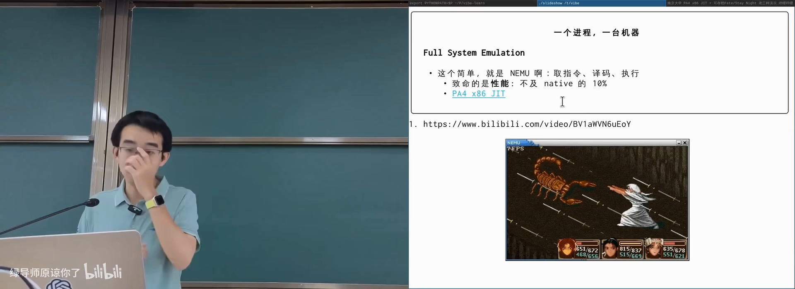
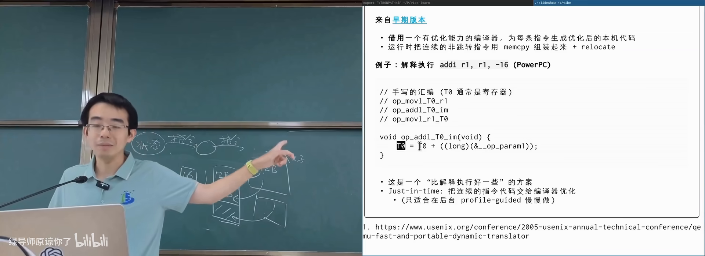
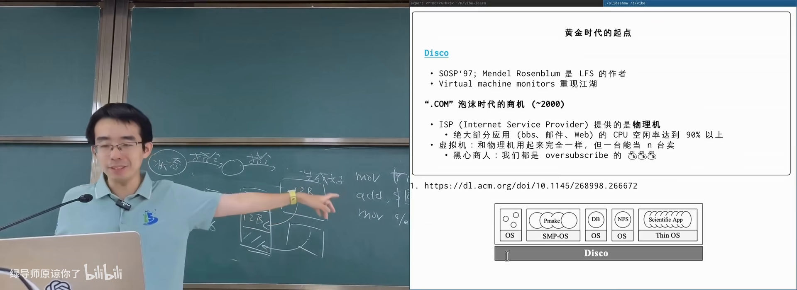
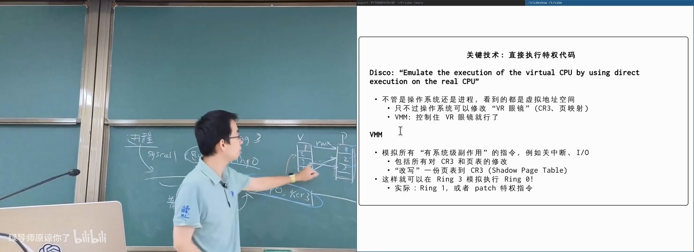
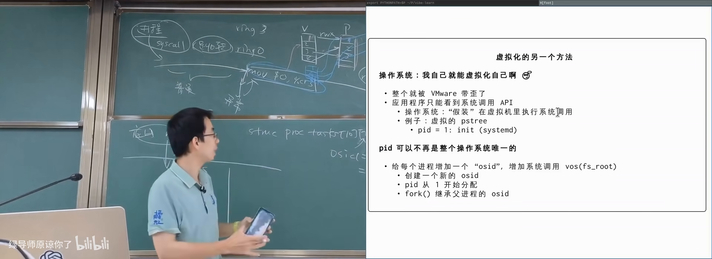
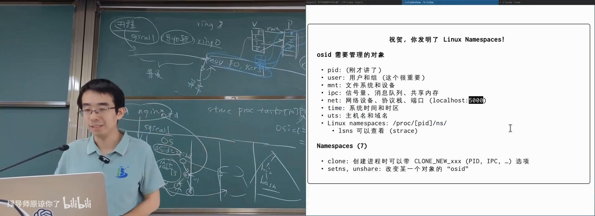
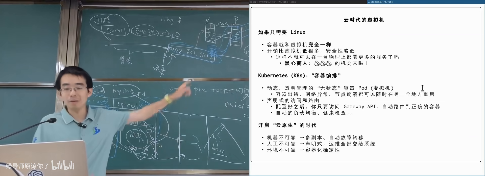

# 虚拟机和容器

> **原视频**：[Bilibili · BV1uaEB66EAH](https://www.bilibili.com/video/BV1uaEB66EAH/)（时长约 84 分钟）
> **课程**：南京大学《操作系统原理》（2026）第 29 讲 · 虚拟机和容器
> **整理说明**：本书由视频语音转录后经 AI 重构而成，口语已转写为书面语；关键思路标注 *(参考时间)*，`SCREENSHOT:` 占位对应演示时刻。本讲为补充内容。

---

## 1. 全系统模拟与性能瓶颈

- 做过或听说过 NEMU 这类「用程序模拟 CPU」的实验
- 知道指令译码与执行循环
- 本章概念零基础可跟

*(参考时间: 00:00)*

**虚拟化**对本课同学并不陌生：NEMU 就是 full system emulation（全系统模拟，用软件完整模拟一台计算机）。概念简单——从第一条指令起译码、执行，包含特权指令，其上可以跑真正的操作系统。

真正难的是**性能**。同一程序在模拟器里往往只有真机 1/10 左右，图形密集的仙剑奇侠传很难满帧。有同学给 NEMU 加了 JIT 优化后，FC 模拟器可接近 60 帧。

---

## 2. JIT：从基本块到「几乎编译」

- 知道 CPU 有 PC，会顺序取指
- 听说过基本控制流（分支、跳转、返回）
- 本章优化细节零基础可跟

*(参考时间: 00:14:40 前后展开）*

### Basic block

**基本块**（basic block，从入口到下一条控制流转移之间、只能顺序执行的指令序列）的取指逻辑：一条条往下取，直到遇到跳转/返回等。块内执行顺序确定，适合做成一个可调用的翻译单元。

### 典型 JIT 做法

1. 把基本块生成为 C 代码（立即数硬编码进指令）；
2. 调用编译器得到共享库；
3. `dlopen` 装入地址空间，直接调用。

对启动阶段只跑一次的冷代码，外挂 GCC 编译不可接受。成熟的 JIT（Java、Node 等）通常是：

- 先**解释执行**保证进展；
- 对热基本块计数，超过阈值再后台编译；
- 下次执行跳进已编译代码。

### QEMU 式模板拼接

QEMU 早期方案（*Fast and Portable Dynamic Translation*）介于解释与完整 JIT 之间：为每种指令准备**宿主机器码模板**，模板里对立即数等留占位；执行时按译码结果 `memcpy` 模板再 **patch** 立即数。

实现技巧：把 `ADDI r1, r1, imm` 拆成 `t0 = r1; t0 += imm; r1 = t0`，每一步写成可编译的 C 小函数，预编译成宿主指令片段；运行时只做拷贝与重定位。模拟一条 guest 指令可能只花数条 host 指令。

---

## 3. 虚拟机黄金时代：Disco 与 VMware

- 知道进程跑在用户态、内核跑在更高特权级
- 听说过 x86 的 Ring 概念（即可）
- 本章历史零基础可跟

*(参考时间: 00:16:00)*

### 商业动机

1970 年代就提出 VMM（virtual machine monitor，虚拟机监视器）：把一台物理机切成多台逻辑机。大型机时代需求合理，但长期未做成熟。

1990 年代末 **dot-com** 泡沫：ISP 卖整机，业务（BBS、邮件、简单 Web）CPU 空闲率可达 80%–90%。若能把一台机器卖成五台、十台「看起来像物理机」的虚拟机，价格打对折仍有暴利。

SOSP 1997 的 **Disco** 工作「bring back an idea popular in 1970s」：在共享内存多处理器上跑多个虚拟机，其上可运行未修改的操作系统。作者随后创办 **VMware**，成为云计算基础设施的重要起点。

### 技术难点：特权指令

同一 ISA 上模拟进程不难：构造地址空间即可。难在虚拟机里的 **Guest OS** 会执行关中断、改页表基址（如 `mov CR3`）等特权指令，不能直接在真 CPU 上跑。

VMware 的经典技巧：

1. Guest 的应用程序仍跑在 Ring3；
2. **Guest 内核被放到 Ring1**（x86 特意保留、日常几乎不用的特权级）；
3. Ring1 无真实特权，执行敏感指令会陷入，由宿主 VMM 模拟；
4. 若架构没有可用 Ring，可扫描并 **patch** Guest 内核指令。

**影子页表**（shadow page table，VMM 维护的、Guest 虚拟地址到**真实**物理页的映射）：Guest 以为自己拥有整块「物理内存」并写自己的页表；VMM 在 `CR3` 切换时换成影子表。Guest 里 99% 的指令是普通计算，以近原生速度执行，只有特权/I/O 才 trap。

### 硬件跟进

| 时间 | 进展 |
|------|------|
| 2005 | Intel VT-x 等硬件虚拟化：Guest 进入专用虚拟机模式，许多特权指令可直接执行 |
| 2008 左右 | EPT（扩展页表）：影子页表由硬件维护，可达「四级 + 四级」嵌套 |
| 更早/并行 | virtio 等虚拟 I/O 标准；如今甚至有 virtio-GPU |

疯狂而认真的后续 idea：记录 VM exit 与 I/O 返回值即可 **replay** 整台虚拟机；热迁移（暂停、拆网、拷贝内存、异地恢复）——Agent 与沙箱时代这些技术再次升温。

---

## 4. 反向问题：操作系统虚拟化自己

- 知道进程标识 PID
- 知道文件系统根目录 `/`
- 本章推导零基础可跟

*(参考时间: 00:54:00)*

虚拟机把「一台机器当十台卖」。但**最终目的是跑应用**，不是模拟硬件。操作系统自己能不能当十个小操作系统来卖？

### OSID：在对象上多打一个标签

教学内核（如 xv6）里的进程、文件等对象本来只有一套。若给每个对象加一个 **OS ID**（概念上的「这个对象属于哪个逻辑操作系统」）：

- 遍历/kill 只能看到相同 OSID 的进程；
- 资源分配仍从全局池子来，只是对象打上标签；
- 启动时为不同 OSID 各准备一份 init ramfs。

隔离成本极低（每对象多几个字节），性能远好于完整虚拟机。

PID 是 **leaky abstraction**（会泄漏细节的抽象）：会被回收，`grep | kill` 中间隔太久可能杀错进程。现代 Linux 用 `pidfd_open` 把 PID 变成引用计数的文件描述符，再对 fd 发信号。

### 从 chroot 到 namespace

1979 年 UNIX V7 的 `chroot`：把进程的文件系统视图限制在某子目录。前提是子目录里要有完整的 `/bin`、`/home` 等结构，否则 shell 都起不来。

系统化做法：**枚举操作系统对象类型，逐类虚拟化「命名空间」**（namespace，一组对象只对同属该命名空间的进程可见）：

- PID、用户/组、文件系统与 mount 点；
- IPC（管道/信号量/共享内存）；
- 网络（各自可有 localhost:5000）；
- UTS（主机名/域名）、time 等。

进程在 `/proc/<pid>/ns/` 下可见自己属于哪些 namespace。PID 1 通常拥有「根命名空间」。

### cgroups：控用量

只隔离还不够，「卖资源」还要**限额**。**cgroups**（control groups，把进程分组并限制/统计 CPU、内存、IO 等资源）与 namespace **正交**：

- 组内进程共享一份 quota（如最多 20% CPU）；
- cgroup v2 呈树状：大组之间策略、小组之间策略可分别设置。

namespace（看不见别人）+ cgroups（用不了超额）+ OverlayFS 分层镜像（共享底层只读层）≈ **容器**。

FreeBSD jail（2000）早已走在类似路上；Linux 的 cgroups/namespace 约 2006 年引入（Google 工程师推动），2008 年 LXC 走红，之后 Docker 成为云原生事实标准。

---

## 5. 容器、镜像与编排

- 读过 Dockerfile 或见过 Docker 镜像分层
- 听说过 Kubernetes
- 本章产品细节零基础可跟

*(参考时间: 01:12:00)*

### 虚拟机 vs 容器

| | 虚拟机 | 容器 |
|--|--------|------|
| 隔离 | 强（各自 OS + 硬件虚拟化） | 较弱（共享宿主内核） |
| 开销 | 模拟内存、影子页表等 | 主要是 namespace/cgroups 标签 |
| 镜像 | 整盘镜像，笨重 | OverlayFS 分层，底层共享 |
| 安全 | 内核漏洞影响面相对独立 | 内核漏洞或 cgroup 漏洞可能导致越权/DoS |

云上对用户而言容器与 VM 往往「用起来一样」，但调度与成本差一个数量级。

### Kubernetes 式声明式编排

VMware 的 vSphere 一类方案「重」：要装专用软件、纳管整机。容器时代更流行 **Kubernetes** 式思路：

- 声明：「这个服务在各数据中心保持 N 个副本」；
- 控制器：容器挂了就在别的机器再起一个（镜像哈希确定，可复现）；
- Gateway：按服务名路由，自动负载均衡与健康检查；
- 见缝插针：按 CPU/内存多维需求做装箱（背包问题，NP-hard）。

又是一层虚拟化：你不知道请求落在哪台物理机。

### 品味与元机制

课上用 *The Bitter Lesson* 对照：强化学习与大模型强调**可扩展的通用机制**。虚拟化史上：

- 1997 让 VMM 复活——疯狂而正确；
- 1998 BSD jail 在 OS 内做隔离——同样疯狂；
- 后来声明式容器编排——改变世界。

但若无限优化「容器装箱 ILP 再快 0.1%」，而假设（静态、已知全部容器）与现实不符，研究品位就存疑。技术浪潮由真实需求与资本推动；做错路径也会沉淀技术。对学生的建议：看清机制、见识更好的工作，不必只被分数定义。

---

## 附录：概念补给

### Full system emulation

- **是什么**：用软件模拟整台计算机（CPU、内存、设备）。
- **课上为何出现**：NEMU 是课程实验主线，也是虚拟化入门。
- **和什么像**：用游戏机模拟器玩老主机卡带。

### JIT（just-in-time compilation）

- **是什么**：运行时把热代码翻译成宿主机器码再执行。
- **课上为何出现**：解释执行太慢时的标准加速手段。
- **和什么像**：把常用菜先备好半成品，现点现炒。

### Basic block

- **是什么**：无分支中间的顺序指令序列。
- **课上为何出现**：JIT/动态翻译的天然编译单元。
- **和什么像**：公交线路中间「不拐弯的一段」。

### VMM / Hypervisor

- **是什么**：创建与管理虚拟机的软件层。
- **课上为何出现**：Disco/VMware 故事的主角。
- **和什么像**：物业管理：房间（VM）背后统一管水电。

### Ring1 hack

- **是什么**：把 Guest 内核放在 x86 Ring1，敏感指令陷入 VMM。
- **课上为何出现**：无硬件虚拟化时实现近原生速度的关键。
- **常见误解**：不是「Guest 内核没权限」，而是**故意**让它没有，以便托管。

### Shadow page table

- **是什么**：VMM 维护的 Guest 虚拟地址到真实物理页的映射。
- **课上为何出现**：Guest 页表不能直接给硬件用。
- **和什么像**：你按酒店房间号找人，前台另有一张真实门牌对照表。

### VT-x / EPT

- **是什么**：CPU 硬件虚拟化扩展与两级页表机制。
- **课上为何出现**：软件 hack 被硬件固化后的形态。
- **和什么像**：以前用土办法搬货，后来修了专用货梯。

### Namespace

- **是什么**：让进程只看见同一命名空间内对象的隔离机制。
- **课上为何出现**：容器「看不见别人」的技术底座。
- **和什么像**：同楼层不同公司的门禁，刷卡只能进本公司。

### cgroups

- **是什么**：按组限制与统计 CPU/内存等资源的内核机制。
- **课上为何出现**：容器「用不了超额」的技术底座。
- **和什么像**：电表限额：超过就跳闸，而不是禁止你插插头。

### Container

- **是什么**：namespace + cgroups + 通常叠加分层 rootfs 的轻量隔离单元。
- **课上为何出现**：与虚拟机对照的现代默认部署形态。
- **常见误解**：不是「轻量虚拟机」，共享宿主内核，安全模型不同。

### OverlayFS 分层镜像

- **是什么**：只读底层 + 可写上层构成容器文件系统。
- **课上为何出现**：千个容器共享一份系统镜像，存储极省。
- **和什么像**：同一本教材大家共用，笔记各写各的透明纸。

### chroot

- **是什么**：把进程文件系统根切换到某子目录。
- **课上为何出现**：容器文件系统视图的史前形式。
- **常见误解**：只隔离路径视图，不隔离 PID/网络等。

### Kubernetes / 声明式编排

- **是什么**：声明期望副本与路由，控制器自动维持实际状态。
- **课上为何出现**：云原生时代管理海量容器的答案。
- **和什么像**：告诉管家「始终保持 5 个苹果」，而不是每次自己去买。

### Leaky abstraction（PID）

- **是什么**：抽象在细节上泄漏，使用者仍可能踩坑。
- **课上为何出现**：PID 复用导致误杀，需要 pidfd 等补丁。
- **和什么像**：门牌号会重复使用，快递员可能送错隔壁。
