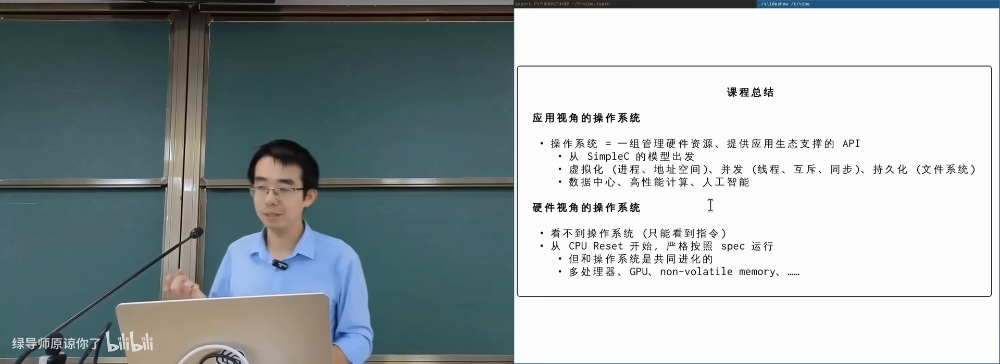
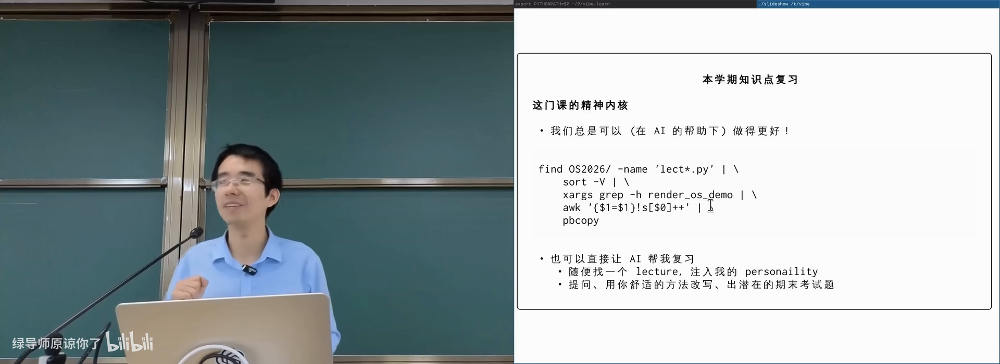
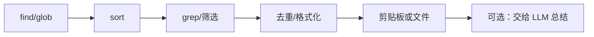
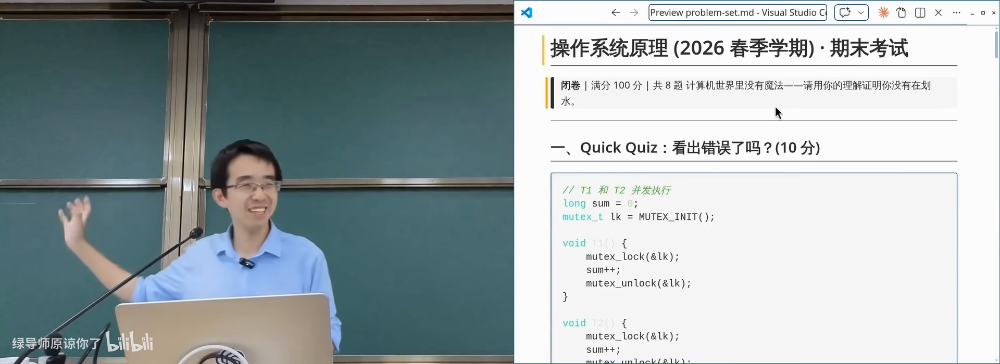
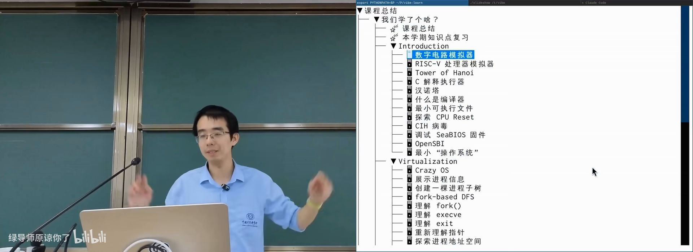

# Agentic AI 与我们的未来：课程总结

> **原视频**：[Bilibili · BV1q2jh6FEhX](https://www.bilibili.com/video/BV1q2jh6FEhX/)（时长约 84 分钟）
> **课程**：南京大学《操作系统原理》（2026）第 30 讲 · Agentic AI 与我们的未来；课程总结
> **整理说明**：本书由视频语音转录后经 AI 重构而成，口语已转写为书面语；关键思路标注 *(参考时间)*，`SCREENSHOT:` 占位对应演示时刻。

---

## 1. 一句话定义：操作系统是什么

<div class="prereq" data-label="你需要先知道">

- 上过本学期操作系统课，或读过前几讲书稿
- 本章零基础可跟（作为全课收束阅读）

</div>

*(参考时间: 00:00)*

全课反复出现的定义是：

> 从应用程序的视角看，操作系统就是**一组管理硬件资源、提供应用生态支撑的 API**（系统调用）。

学完这门课后，这句话可以这样展开：

1. 你写的是程序；程序在**进程**里运行，拥有自己的地址空间；
2. 进程通过系统调用请求服务：创建进程、`mmap` 扩地址空间、建线程与同步、在文件系统上留下持久化痕迹、等待落盘……
3. **公理**：若你认为某件事对应用程序是合理的，系统里就应当有办法做到——纯计算可在进程内完成；要与外部世界交互，就必须借操作系统。



这套形态从单片机玩具芯片、手机、PC 到数据中心推理集群大体同构。AI 时代人们说需要「Agent 操作系统」——多半**不会**从裸机重写，而会像 Android/iOS 那样，站在 Linux 等成熟系统之上再封装应用运行时。

**硬件视角**同样贯穿全课：CPU 是无情的指令执行机（也可看成动态数据流分析的「编译器」）；它与操作系统共同进化——多处理器、GPU、非易失内存出现，系统机制随之增加。

---

## 2. 精神内核：追问与 first principles

<div class="prereq" data-label="你需要先知道">

- 本章零基础可跟

</div>

*(参考时间: 00:07:20)*

具体知识点会考、需要掌握；但长期会忘记的细节之上，应留下一种**精神内核**：

- 每当想到一个问题，都可以**往回追问一步**：若要更好地复习操作系统，有没有办法？去问 AI、对质几轮；
- 计算机世界**没有魔法**：再奇怪的行为（如 fork 后缓冲区打印出 6 还是 8）都有原因；
- **first principles**：操作系统是服务应用程序的；设计取舍要从「服务谁、代价是什么」推出来。

课上点名了几位同学「整学期没下载过 coding agent、没打开过课件代码链接」。门槛往往只是「浏览器点进去看到 raw 文件很丑」。正确的一步是：把链接丢给 agent，让它整理目录、编译运行——在那一刻你会发现事情没那么难。这门课希望你**总是愿意多跨一步**。



---

## 3. UNIX 哲学 vs 巨型应用

<div class="prereq" data-label="你需要先知道">

- 用过一点 Linux 命令行或 Windows 应用
- 本章对比零基础可跟

</div>

*(参考时间: 00:11:50)*

技术层面最值得带走的，是 **UNIX philosophy**（UNIX 哲学：小工具做好一件事，并通过统一接口协作）。

| | Windows 生态倾向 | UNIX 生态倾向 |
|--|------------------|---------------|
| 代表 | Adobe 全家桶、Office、大型 IDE | 命令行工具、管道、脚本 |
| 形态 | 单个巨型应用包办 | 小程序组合完成大事 |
| 新手 | 功能都在手边，上手平滑 | 概念多，一开始有恐惧感 |
| 熟手 | 深度仍可能被工具边界限制 | 组合空间大，可管道进 AI |

操作系统不只是 API，还有**生态设计哲学**。UNIX 的关键机制是**管道**（pipe，把前一进程 stdout 接到后一进程 stdin）：工具进入系统后成为所有其他工具的一部分。

课上现场用命令行从课件仓库抽出本学期全部 code demo：

```bash
# 示意：找到课件文件 → 排序 → 抽出 os demo 行 → 去重 → 进剪贴板
find ... | sort -V | grep ... | ... | pbcopy
```

今天的标准答案也可以是：直接让 coding agent 收集并去重所有 demo。两条路都成立——前者让你看见力量来自**可组合的机制**。



从用户角度，未来或许「所有代码都会消失」，只需表达意图；但计算机专业学生仍须清楚：**力量来自底层可组合的系统机制**。

---

## 4. 怎样复习与对待考试

<div class="prereq" data-label="你需要先知道">

- 即将面对期末或任何闭卷/开卷考试
- 本章零基础可跟

</div>

*(参考时间: 00:29:40 前后）*

### 不要只丢一句「猜考题」

把整学期讲义丢给 AI 问「老师会考什么」并非最高效方式。更接近高考复习的做法是：

1. **划定范围**（某一讲、某一概念）；
2. **穷尽角度**生成练习题（exhaustiveness）；
3. 做题验收，而不是反过来。

有了 AI，几乎可以对每个 lecture、每个知识点生成多套模拟题，概念题覆盖率可以很高；开放题与「品味题」仍考你的理解。宿舍同学分工出题再互测，也是可行的社会实验。

### 考试预期（课上态度）

- 会考基本概念与代码理解，不考犄角旮旯；
- 记不住细节时，可沿 first principles 推出合理答案，有理有据会给分；
- **并发编程**几乎年年有：条件变量「万能同步方法」是稳妥送分；也可写更聪明的同步，但课上会化身「人肉模型检查器」找交错错误；
- 文件系统侧常见 **crash consistency**、fork 与文件描述符、地址空间等问题。

AI 出的示例题（风格仅供体会）：fork 后缓冲区输出 6 还是 8；父子进程写同一文件 offset；UNIX 为何让 fork 继承文件描述符；线程安全链表的资源泄漏等。



---

## 5. 学期知识 Walkthrough

<div class="prereq" data-label="你需要先知道">

- 建议对照本学期课件/代码阅读
- 本章零基础可跟（当作目录导读）

</div>

*(参考时间: 00:33:40)*

课上以 code demo 为线索快速回放全学期（完整逻辑仍在 slides）：

### 起点：从逻辑门到程序

- 逻辑电路模拟器：用**管道**把程序输出接到另一程序输入——全课动机的起点；
- RISC-V 模拟器：寄存器 + CSR + memory 构成最小 CPU 状态；
- 汉诺塔与 **Simple C**：把递归/栈帧打开，明确每条语句如何改变状态机；理解编译优化在「顺序等价」边界内改写代码。

### 系统调用：不可穿过的边界

- `syscall` 像麻醉：陷入内核时进程对外部世界失去感知；
- 控制流进入操作系统后，内存映射等都可能变化；
- **系统调用是编译优化不可穿过的边界**。

### Virtualization

- 进程树：从 init 经 fork/execve/exit 展开；
- 地址空间：mmap、malloc 实现、甚至入侵别的进程；
- Everything is a file：`/proc`、`sysfs`、文件描述符与 handle；
- 管道、终端（tty）、可执行文件、动态链接与加载；
- 文件系统 API 与实现、崩溃一致性（见第 25–26 讲）。

### Concurrency

- 多处理器、互斥、条件变量、信号量；
- 并发 bug 与应对；并行算法与数据结构；
- 协程/Goroutine/异步；GPU 与 SIMD。

### Persistence 与外设

- 输入输出与驱动；存储设备；
- 一个 Token 的旅程等综合案例。

### 补充与展望

- 系统安全、虚拟机与容器；
- Agentic AI：在经典系统之上组合出新的应用形态。



---

## 6. Agentic AI 与我们的未来

<div class="prereq" data-label="你需要先知道">

- 用过 ChatGPT / Claude / coding agent 任一即可
- 本章零基础可跟

</div>

*(参考时间: 00:50:00 之后的讨论，结合课程主线）*

### 你仍然需要系统课的原因

- 用户界面可以极简，但**专业判断**建立在你知道系统能做什么之上；
- 文件系统监控、崩溃一致性、namespace、访问控制——这些「以前觉得没用」的知识，会在你做 Agent 沙箱、可靠存储、安全隔离时突然有用；
- AI 替你写代码，**不能替你定义规格、验收与止损**。

### 做研究的品味

课上借 Disco/VMware 与容器编排再次强调：

- 好工作往往来自「把 1970 年代该做而未做成的事，用今天的条件做出来」；
- 警惕 benchmark crime：隐藏不利数据、只报 state of the art，会污染人类与模型共同的语料；
- 用 LLM 扩大实验规模有价值，但更应去做**没人做过**的事；
- 品味不会自动消失：见过好的工作，才可能做得更好。

### 与 Agent 共处的日常建议

1. **敢想**：把重任务交给 agent，失败再改 harness / 拆任务；
2. **先规格后实现**：哪怕原型很慢（参见第 25 讲）；
3. **管道思维**：中间结果可检查、可替换，终点可以是人也可以是模型；
4. **安全边界**：最小权限、沙箱、可回滚（参见第 28–29 讲）；
5. **持续跨步**：下载代码、跑起来、改一点、再自动化。

分数与保研很重要，但不是唯一评价。若某天分数不再束缚你，你仍应知道想创造什么。

---

## 7. 结语

<div class="prereq" data-label="你需要先知道">

- 本章零基础可跟

</div>

*(参考时间: 课程结束语）*

操作系统课教的是：**计算机系统里合理的事都有办法做到**；办法往往写在 API 与机制里；把机制组合起来，可以做出监控、快照、容器、沙箱，乃至驱动世界的基础设施。

AI 改变了实现的成本曲线，但没有取消「看见机制、定义规格、验证正确性」的人的责任。祝你在更大的系统里，既会用魔法，也知道魔法的开关在哪里。

期末前课程会再安排答疑；具体问题可问助教或老师。

---

## 附录：概念补给

### 应用视角的操作系统

- **是什么**：一组管理资源、支撑应用生态的系统调用 API。
- **课上为何出现**：全课总纲，复习的顶层提纲。
- **和什么像**：餐厅后厨对外的点单窗口：你只通过菜单/窗口交互。

### 硬件视角的操作系统

- **是什么**：内核与 CPU/设备共同演化出的性能与隔离机制。
- **课上为何出现**：解释多处理器、GPU 等如何倒逼系统设计。
- **和什么像**：店里的厨房设备升级，菜单与流程也跟着变。

### Everything is a file

- **是什么**：UNIX 把进程、设备等对象尽量暴露成文件与文件描述符。
- **课上为何出现**：统一访问模型是生态可组合的前提。
- **和什么像**：园区里所有服务都通过统一窗口办理。

### 系统调用边界

- **是什么**：用户态陷入内核的接口；优化与安全策略的分界。
- **课上为何出现**：理解编译器能改什么、不能改什么。
- **常见误解**：不是「函数调用慢一点」，而是**信任级别切换**。

### UNIX philosophy

- **是什么**：小工具 + 文本流 + 管道协作。
- **课上为何出现**：技术上最希望你带走的「方法论」。
- **和什么像**：乐高标准件 vs 一体成型手办。

### 管道（pipe）

- **是什么**：把前一进程输出接到后一进程输入的机制。
- **课上为何出现**：UNIX 哲学的机制载体；复习 demo 的骨架。
- **和什么像**：流水线：上工位半成品直接进下工位。

### First principles

- **是什么**：从最少、最可靠的前提出发推理，而不是背口诀。
- **课上为何出现**：考试与工程判断的共同方法。
- **和什么像**：从「资源有限、服务应用」推出设计，而不是「老师说的」。

### Coding agent

- **是什么**：能读上下文、调工具、多轮改代码的 AI 程序。
- **课上为何出现**：当代学习与作业的现实基础设施。
- **常见误解**：不是聊天窗；可以给仓库级任务，但要会验收。

### Agentic OS（讨论中的概念）

- **是什么**：为 Agent 运行、工具调用、沙箱与记忆设计的系统层。
- **课上为何出现**：课程尾声的未来问题；尚未有唯一标准答案。
- **和什么像**：移动互联网之于 Linux：在成熟内核上再堆应用框架。

### Benchmark crime / 报告品位

- **是什么**：选择性展示实验、隐藏不利结果的研究不端或风气。
- **课上为何出现**：提醒读书与做科研时的判断力。
- **和什么像**：只展示最好一次考试成绩的「状元笔记」。

### The Bitter Lesson（对照讨论）

- **是什么**：可扩展的通用方法长期胜过依赖人类特征的技巧。
- **课上为何出现**：对照虚拟化/容器/Agent 里「通用机制」的力量。
- **常见误解**：不是「不要领域知识」，而是别只堆不可扩展的特例。

### 声明式系统（容器编排对照）

- **是什么**：描述期望状态，由系统自动收敛到实际状态。
- **课上为何出现**：云原生管理海量容器的主流模式。
- **和什么像**：恒温器：你设 26℃，不必自己反复开关空调。
