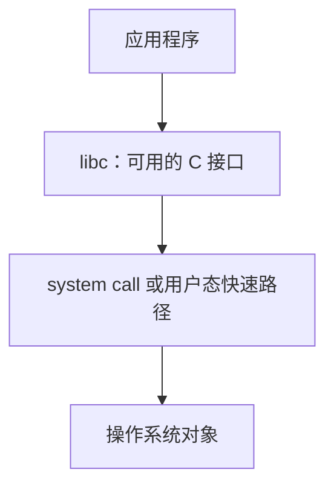
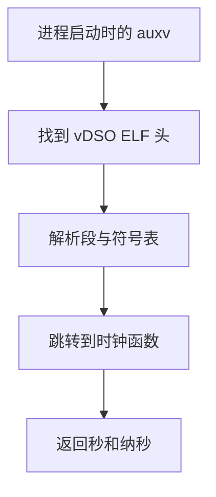

# 调试 C 标准库

> **原视频**：[Bilibili · BV1yu9cBCEAb](https://www.bilibili.com/video/BV1yu9cBCEAb/)（时长约 80 分 52 秒；按校正字幕末条时间估算）  
> **课程**：南京大学《操作系统原理》（2026）第 10 讲  
> **整理说明**：本章按校正字幕重构，保留讲师的实验观察、机制因果和明确的工程判断；口语重复与走场压缩。时间锚点对应字幕时间，未对视频外部事实做独立核验。

本讲从一个失败的调试演示出发，沿着一条线索观察 C 程序如何从进程入口进入标准库实现，再落到系统调用或用户态的快速路径：先弄清调试信息如何把寄存器和内存恢复成源代码模型，再用它追踪启动、打印、变参、非局部跳转、取时间和动态分配。

## 1. 为什么需要 C 标准库

*(参考时间: 00:00:00–00:08:02)*

### 1.1 先验证工具真的改变了系统

实验的 Online Judge（自动运行提交并按测例判定结果的评测系统）已经发布；讲师建议遇到 reject 时，让 AI 帮忙猜测测例、生成测试用例，甚至扮演出题者推断判题方式。这段内容的重点不在提示词，而在验证习惯：AI 说“编译、安装成功”，不等于当前系统正在使用那份库。

上一讲的翻车正是这个原因。讲师让 AI 编译并安装 musl（强调小巧、可移植的 C 标准库实现），看到脚本执行了 `make install`，又因为 GDB（可单步、查看寄存器和源码的调试器）能看到部分启动代码源码就判断安装正确；后来才发现系统仍使用 apt 安装的工具链，目标库的调试信息根本没有生效。本次修复采用逐条命令核对、重新调试和确认工具链来源的做法。这个失败演示揭示了一个可迁移的工程原则：自动化操作的成功提示是待验证的证据，不是结论。

### 1.2 从内核接口到库抽象

system call（用户程序受控请求内核服务的入口）是访问进程、文件和设备等操作系统对象的底层界面。直接调用它通常要显式准备文件描述符、缓冲区和长度，代码既冗长又容易重复出错。

libc（C 程序常用的标准功能库，其中一部分封装系统调用）在上层提供 `printf`、`fopen`、`malloc` 等抽象。file descriptor（内核用整数代表已打开文件等对象的句柄）仍是许多接口的底座；例如 `FILE*` 会把它与缓冲区、标志等状态封装起来。libc 与 C、UNIX 的历史设计紧密相连，但对上层暴露的文件操作语义也可以由 Linux、Windows 或微控制器上的不同实现提供。



这种分层使上层程序不必重复处理每个内核接口；在 C 之上还可以继续构造 Python 等运行时。讲师也提醒，这是一种有用但不绝对严谨的示意：二进制可以绕过 libc 直接执行系统调用，libc 也不只由一种固定实现组成。

### 1.3 从进程入口接管启动

_start（进程执行的底层入口，负责把初始状态交给 C 运行时）可以由程序员直接控制。严格说，free-standing（标准库可以不存在、程序启动不一定从 main 开始的 C 运行环境）描述的是运行环境，不是“自动不链接库”的单一选项。课堂的最小程序还配合额外的链接和启动设置，才得到从自定义入口开始的二进制；程序从这里取出初始参数，再调用外部定义的 `main`。这里的 argc（命令行参数的个数）、argv（参数字符串数组）和 envp（环境变量字符串数组）会按约定传递。

这个调用必须遵守 calling convention（规定参数、返回值和寄存器保存责任的函数调用约定）：把 argc、argv、envp 等指针放进约定的寄存器后跳转到 `main`，返回后再进入 `exit`。C 还可以通过 FFI（让一种语言调用另一种语言或运行时代码的互操作接口；本讲例子是 C 调用汇编）调用符合约定的汇编函数，或直接写 inline assembly（嵌在 C 函数中的汇编片段）。因此，libc 的底层路径可以从 C 进入汇编，再执行系统调用。

## 2. 调试信息把什么放进二进制

*(参考时间: 00:08:02–00:27:34)*

### 2.1 调试信息段

debug info（把机器状态映射回源代码位置、类型和变量含义的元数据）解决了 GDB “没有可用源代码”的问题。对用户程序，`gcc -g` 会在 ELF（Linux 常用的可执行文件和目标文件格式）中加入额外的调试 section（按用途划分的二进制数据区域）；若要调试 musl，则必须用带调试信息的方式重新编译库本身，例如讲师演示的 `-Og -ggdb`，并确认 CFLAGS（传给 C 编译步骤的选项集合）真的传到了库的构建过程。

`readelf` 看到的调试相关段包括：

- `.debug_info`：类型、变量和函数等核心描述；
- `.debug_line`：机器地址与源代码行的映射；
- `.debug_frame`：调用栈展开所需的信息；
- `.debug_ranges`：地址范围与编译单元的对应；
- 字符串相关的 `.debug_str`、`.debug_line_str`。

这些内容采用 DWARF（描述调试信息及其读取方式的通用格式）。讲师提到 DWARF 与 ELF 的 “矮人—精灵”命名梗，但真正有用的是：`-g` 并非打开一个神秘的“可调试开关”，而是把一套可被调试器读取的映射和描述写入构建产物。

### 2.2 地址和行号的定位粒度

即使没有完整的 debug info，ELF 里的符号表（记录函数或变量名称及其地址的表）也能提供粗粒度定位。用 `nm` 查看 `main` 的地址，当程序计数器 PC（当前将要执行的机器指令地址）落在该函数范围内，就能知道程序正在 `main`；这足以支持一个很简陋的调试器，但不能告诉我们函数内部的源代码行或变量值。

addr2line（把程序地址映射为源文件和行号的工具）再利用行号信息把 PC 还原到源代码。没有优化时，一条 C 语句通常对应一段连续的机器指令；启用指令重排或内联后，语句与指令的对应会变得复杂，调试优化代码需要接受“位置不再一一对应”的限制。

### 2.3 调试表达式不只是行号

DWARF 还描述变量在每个 PC 范围内的存放位置和取值方法：变量可能在寄存器、内存，或已经被优化掉。为此它包含一套可执行的表达式指令，能够从寄存器取地址、做运算，再从位域中取出某一位。调试器据此把汇编层的寄存器和内存状态重构成 C 层的变量。

同类的展开信息也服务于 C++ 异常的 stack unwinding（沿调用栈回退到异常处理点的过程）。因此“调试信息”既支撑地址到源码的映射，也支撑变量查看、调用栈恢复和异常处理；缺少某个编译单元的源码文件时，映射仍存在，但调试器可能无法显示对应源码。

### 2.4 跨语言的同一问题

C 通常把调试信息与源码路径分开存储；JavaScript/TypeScript 则可能经历多层 transpiler（把一种源码转换成另一种可执行源码的转译器），最后在浏览器沙盒中运行。浏览器没有项目目录，因此 source map（记录转译后代码如何对应原始源码的映射文件）往往连同源码片段一起提供，让错误位置、变量和调用栈能回到作者看到的版本。

讲师还展示了从源码映射文件拼出可运行项目的尝试，并提醒：构建过程会执行脚本，来源不明的依赖可能窃取凭据；这不是“能运行”就安全的证明。下载或构建此类项目应放在干净的 sandbox（限制程序访问宿主资源的隔离环境）中，并把 AI 的扫描结果当作需要复核的线索。

## 3. 调试信息能恢复什么

*(参考时间: 00:27:34–00:35:03)*

机器层的状态由寄存器、内存和 PC 组成；调试信息把它重新解释成 C 程序的变量、函数和调用关系。由此得到的不只是“能在某行停住”：

- **地址定位与调用栈**：`addr2line` 把 PC 对应到源代码，backtrace（从当前状态恢复完整函数调用链的调试操作）把多层调用者列出来；
- **性能采样**：程序按固定间隔暂停，读取状态并恢复调用栈。把样本聚合为 flame graph（以横向样本宽度、纵向调用栈深度展示函数在采样中的占比），就能估计哪些调用路径占用 CPU 较多、可能构成瓶颈；横向排列本身不是时间顺序。讲师现场把横轴描述成时间轴，这更接近按时间排序的 flame chart；本书采用 flame graph 的标准图义。它是采样估计，不是记录每一次调用；
- **崩溃快照**：从 core 等崩溃状态恢复寄存器和栈，甚至修改 PC 后继续执行。讲师把它描述为调试快照的能力，具体可行性取决于工具和状态完整度；
- **内存错误诊断**：sanitizer（在编译和运行时检查内存等错误的工具集）可借助调试信息报告错误位置。

例如，`free(p)` 后继续使用 `p` 属于 use-after-free（释放堆内存后仍通过旧指针访问的错误）。地址空间中那块内存暂时仍可能可读，所以程序表面上不崩溃；但这已经是 undefined behavior（C 标准不保证结果的程序状态），并可能形成安全漏洞。开启 AddressSanitizer 后，报告会明确指出 `heap-use-after-free`，并给出更多源代码上下文。这个例子说明“运行一次得到正确输出”不能替代内存生命周期检查。

## 4. 从进程入口走到 `main`、`printf`

*(参考时间: 00:35:03–00:48:28)*

### 4.1 初始进程栈与 C 运行时

用只返回 `1` 的最小程序从第一条指令开始调试，可以看到 `_start` 接收一个指向栈的指针。CRT（负责把进程初始状态接到 C 运行时的启动代码）随后读取 initial process stack（`execve` 创建进程时由内核布置、依次放入参数、环境和辅助信息的初始栈区），其内容大致排列为：

```text
argc
argv[0] ... argv[argc-1]，以 NULL 结束
envp[0] ... envp[n-1]，以 NULL 结束
auxv：键值形式的辅助信息
```

auxv（内核传给运行时的键值元数据，如快速时间代码的地址和随机数种子）位于环境变量之后。`_start` 从 `p[0]` 取 `argc`，从 `p+1` 找到 `argv`，再越过 `argc + 1` 个指针找到 `envp`；环境字符串结束后继续遍历辅助向量。讲师通过 GDB 打印 `argv[0]`、环境变量和 `auxv`，确认了这条物理路径。

随后，libc 的初始化逻辑处理环境和辅助向量，通过函数指针进入 `__libc_start_main` 一类的阶段，再按调用约定把参数放到正确寄存器并跳到 `main`。`main` 返回后进入 `exit`，清理工作完成后由 `_exit` 相关系统调用结束进程。这样，调试器就能把一条看似直接的 `main` 调用拆成可观察的启动链。

### 4.2 `printf` 只是短的外壳

在带调试信息的 musl 上对 `printf` 下断点，可看到它先取出变参数，再进入 `vfprintf` 一类的格式化逻辑；`stdout` 的 `FILE` 对象保存文件描述符、缓冲区和标志，演示中其文件描述符为 `1`、缓冲区大小约 `1024`。解析格式字符串后，最终通过 `write` 类系统调用输出。对简单格式化打印，strace（记录进程发出的系统调用及其参数的跟踪工具）观察到的写调用很少，这正体现了 libc 对底层细节的封装。

### 4.3 变参从寄存器落到栈

varargs（参数个数可变的 C 函数参数机制）在旧式 x86 32 位 cdecl 约定下看起来像“从栈上的数组依次取参数”，但这个技巧不能直接搬到 x86-64、ARM64 或 RISC-V：这些体系结构会把前几个参数放进寄存器。

讲师在 ARM64 实验中观察到，调用者把参数放入 `x0`、`x1` 等寄存器；libc 的变参序言再把寄存器内容保存到栈上的约定区域，形成可遍历的参数区。也就是说，`va_arg` 看似在数组中走动，背后先完成了“寄存器参数区的保存”；真正的布局由调用约定和编译器共同决定。

## 5. 用寄存器实验理解非局部跳转

*(参考时间: 00:48:28–00:56:25)*

### 5.1 跳回保存点

setjmp/longjmp（先保存执行环境、后从任意深层调用跳回保存点的 C 机制）像“存档/读档”：`setjmp` 记录一个位置，程序可以继续调用多层函数；`longjmp` 恢复该环境，中间经过的调用路径不再继续。讲师把寄存器分别刷成红色和蓝色，观察哪些值在跳转后回到红色。

在 ARM64 的演示中，`setjmp` 把一组寄存器写入缓冲区；`longjmp` 再加载回来。可见 X19–X28 恢复到保存时的值，而 X0–X18 保留跳转前后的新值。演示还显示栈指针等维持调用所需状态的寄存器不能随意刷写，否则程序会崩溃。

### 5.2 从实验读出调用约定

这组现象对应 ABI（约束跨编译单元、库和函数调用时数据布局与寄存器责任的二进制接口规则）：

- X0–X18 是 call-clobbered（被调用后不保证原值、调用者应自行保存的寄存器），被调用函数可以直接使用；
- X19–X28 属于 callee-saved（被调用函数若要使用、必须先保存并在返回前恢复的寄存器），所以 `setjmp/longjmp` 需要保存这部分；
- 这不是“所有寄存器都会被 setjmp 保存”，而是调用约定决定了哪些值跨函数调用必须保持。

讲师强调，实验的价值在于：即使不先背诵整份 ABI 手册，也能从寄存器的保存与恢复行为反推其中一部分规则。

## 6. 为什么时间读取不出现在系统调用跟踪里

*(参考时间: 00:56:25–01:10:56)*

### 6.1 表面是系统调用，实际走用户态快速路径

gettimeofday（读取墙上时钟时间的 libc 接口）两次调用之间配合 `usleep(200ms)`，测得的间隔略大于 200 ms，因为调用和返回也需要时间。直觉上它似乎应该进入内核，但 `strace` 只能看到 `clock_nanosleep`，看不到 `gettimeofday`。

原因是 vDSO（由内核映射到每个进程地址空间、让 libc 在用户态直接读取时间的一小段代码）提供了快速路径。libc 先从 `auxv` 找到 `AT_SYSINFO_EHDR` 给出的 vDSO ELF 头，再像一个微型加载器那样解析 program header 和符号表，定位 `__kernel_clock_gettime` 等函数，最后直接跳转执行；这条路径没有系统调用陷入。内核仍负责更新可供读取的时钟数据，libc 负责在用户态完成计算。



### 6.2 顺序一致性与单步调试陷阱

vDSO 的时间读取需要避免读到更新一半的值。演示中的指令先读一次 clock tick（内核时钟中断推进的序号），保存它，再读一次；两次相同才认为期间没有跨过更新点，否则重试。这是一种用重复读取换取一致结果的顺序检查。

正常运行时，`gettimeofday` 路径很短，几乎不会碰上 tick 更新；单步调试却在每条指令之间插入巨大延迟，第二次读取经常发现 tick 已改变，于是循环看起来像“卡住”。这不是 vDSO 失效，而是调试器改变了它观察的时序。讲师通过记录指令序列定位循环，并用两次读数比较解释了“正常运行能结束、单步看似不结束”的差异。

## 7. 动态内存：从页粒度到生命周期

*(参考时间: 01:11:00–01:20:52)*

### 7.1 libc 把粗粒度内存切成小块

malloc/free（申请堆内存并在使用后归还的成对接口）看起来能处理一个字节到很大的分配，但操作系统取得内存的接口粒度更粗。mmap（按映射和页粒度向内核申请地址空间的接口）通常以页的整数倍工作；brk（调整进程堆顶的内核接口）则移动堆边界。页常以 4 KB 为例，但具体粒度由系统配置决定。

因此 libc 往往先用 `mmap` 或 `brk` 向系统取得较大的区域，再在用户态维护空闲块池；一次小的 `malloc(4)` 只是从池中切出一块并返回指针，大的分配则可以直接向操作系统请求。`calloc` 等便利接口也建立在这类基础机制上；对 `malloc(0)` 的特殊返回语义，讲师建议不要把它当作程序逻辑的依赖。

### 7.2 API 的真正负担是生命周期

讲师认为 malloc/free 是设计上负担很重的 API。每条可能的控制流都要为一次 `malloc` 找到配对的 `free`，否则就会泄漏；一旦 `free(p)`，旧指针就不能再访问，继续使用便是前面提到的 use-after-free。地址暂时仍可读只说明错误还没暴露，不代表操作合法。

常见的缓解思路是释放后把指针置空，使错误更早暴露；代价是程序可能直接崩溃。C++ 的 RAII（对象构造时取得资源、离开作用域时自动释放的资源管理方式）把配对动作绑定到对象生命周期，例如锁在构造时获取、析构时释放；Rust 的 ownership/borrowing（以所有权和借用规则约束资源访问的编程模型）则把更多悬垂指针问题交给编译期检查。讲师把这些语言设计看作人类应对手工配对心智负担的不同路线，并未声称它们消除了所有错误。

### 7.3 小块分配是数据结构问题

若分配很大的区域，作业实现可以容忍少量边界浪费，直接向操作系统申请；若分配很小，则要维护许多互不相交的空闲区间，每次从中找出足够大的一块切下。算法课上用平衡二叉搜索树解决这个问题是有帮助的练习，但讲师明确说它不等同于现代 memory allocator（在用户态维护分配区间、向程序提供堆内存的分配器）的真实实现。

最后提到的 1995 年 malloc/free 综述被作为继续阅读的入口：课堂没有展开其实现，也没有把“一个平衡树解法”写成现实分配器的定论。

## 8. 读完后的调试路线

本讲的实验可以收束为一条可复用的检查顺序：

1. 先确认编译器、链接器和实际加载的库确实是目标版本；
2. 再确认目标二进制或库包含 debug info，并用符号表、地址到行号和调用栈逐层定位；
3. 遇到启动问题，从 `_start` 的初始栈追到 `main`，不要把 `main` 当作进程的第一条指令；
4. 遇到“看见系统调用但看不见预期调用”，检查 libc 是否走了 vDSO 等用户态路径；
5. 遇到内存错误，沿分配—释放—再次访问的生命周期检查，而不是只看一次运行结果。

