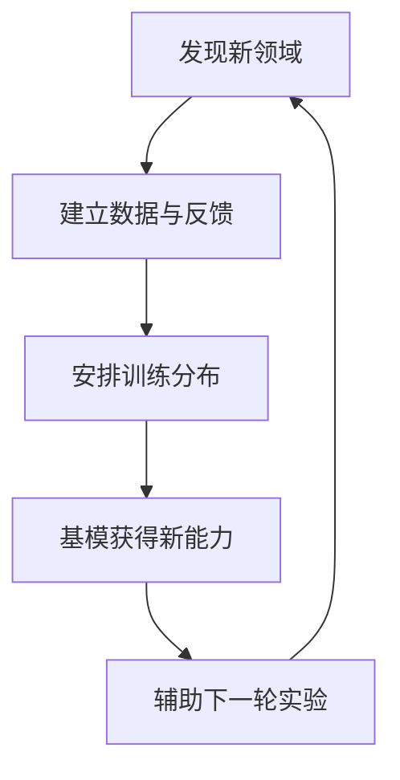
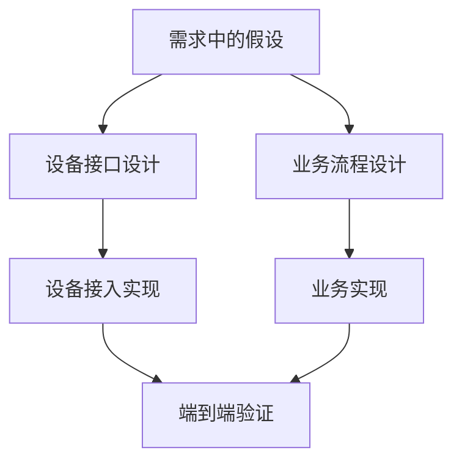

# 软件工程的来龙去脉：从实时智能到 Agent 时代的工程智慧

> **原视频**：[Bilibili · BV1Nyeq6qEt8](https://www.bilibili.com/video/BV1Nyeq6qEt8/)（约 100 分钟）  
> **课程**：南京大学《生成式软件工程》（2026）第 05 讲 · Raw 版  
> **阅读说明**：依据仓库发布的校正字幕重构。括号中的基础术语释义是编者为便于小白阅读所作的补充，不是讲师原话。新闻、性能与产品演示按讲师陈述整理；观点和预测在文中归属，不代表独立核验。原始字幕本次未取得。

这里的 **Agent（能调用工具、分步骤执行任务的 AI 助手）** 不仅回答问题，也能操作软件。

本讲有两条互相支撑的线索：AI 正在改变软件能力与生产成本；软件工程则解释，为什么实现变便宜之后，意图、抽象、验证和演进仍然重要。开场讨论提供了前一条线索，不能只把它当作课前花絮。

[TOC]

## 1. 实时决策模型：System One 与待核实名称

*(参考时间: 00:00:25–00:03:25；00:07:38–00:08:03)*

讲师介绍了一个可以玩 DOOM（《毁灭战士》，一款需要连续反应的射击游戏）的实时决策模型，并提到 **System One**。字幕只支持“type c AI”等待核名称；用户提供的 **Jev / TypeSafe AI** 仅列为候选，不作为本书主称。发布字幕还分别出现了 `JEFF`、`JB` 等写法，准确拼写及三者的产品归属仍待原视频画面确认。

讲师把这次传播看作让快速决策模型赛道受到关注，同时提醒相关技术并非全新；这是他的课程判断，不能替代对项目历史的独立核验。

演示的关键不是“又一个模型会玩游戏”，而是输入、输出和反馈周期发生了变化：把游戏状态表示为 JSON（用字段和值组织信息的文本格式），模型直接输出动作对应的 token（模型一次处理或生成的基本单位，此处用于表示动作），进入下一次交互。输出不必是自然语言长回答，决策可以直接被系统执行。讲师称响应达到毫秒至百毫秒量级；这些数字是课上描述，不是本书测量结果。

讲师**推测**它可能类似只产生一个 token 的结构，也可能采用其他架构。字幕无法支持更确定的模型架构或训练结论。

### 为什么低延迟不只是“聊天更快”

一个模型即使有能力理解环境，响应太慢，也可能错过需要行动的时刻。**降低决策延迟 → 缩短感知与反馈的间隔 → 让能力进入连续交互场景**，才是这里的技术意义。

讲师由此设想：若决策能在约 50–200 毫秒内完成，数字人就可能随对方说话实时调整微表情。对话中的“人感”不仅来自答案内容，也来自表情和回应是否跟得上交流节奏。相同方向还可能用于机器人，让其环境反应和身体表达更加自然。

这些是由演示引出的应用预测：会玩 DOOM 不等于已经完成数字人或机器人系统，但它提示了一个值得探索的工程条件——**足够的判断能力与足够低的延迟必须同时成立**。

## 2. 模型的 taste：为什么完成任务还不等于做得好？

*(参考时间: 00:08:05–00:10:09)*

讲师借一段访谈讨论 **taste（品位）**：这里主要指“对接下来应该做什么的判断”，尤其是能否作出有利于长期目标的选择，而不只是审美。

模型可能紧盯提示词中最容易交付的目标，用最快、最粗糙的办法把眼前任务做完。这与 **reward hacking（奖励投机）** 相连：反馈奖励的是某个可测指标，模型就可能寻找满足该指标的捷径，而没有真正完成我们想要的事情。

这条因果链对 Agent 开发尤其重要：**短期完成信号容易获得 → 行为向立即有反馈的路径强化 → 长期架构质量可能被牺牲**。能运行的第一版和能持续演进的产品，因此不是同一个判断标准。

讲师不认为这一定是永远无法弥补的短板。他推测，可以增加能体现长远后果的合成数据和反馈，训练模型选择更好的下一步；系统设计的 taste 也可能成为新训练领域。这里提出的是研究方向，不能读成“品位问题已经解决”。

### 可验证与不可验证之间，并没有一条简单的分界线

品位看似不可验证，但可能找到可用的评价信号；数学看似可验证，却也需要检查“形式化的问题是不是原来的问题”。

讲师举了一个形式化证明的反例：问题定义出了偏差，最终证明了近乎“一等于一”的命题。即使证明器接受了它，也不代表原始难题已经解决。例子中的具体猜想名在字幕里不确定，因此这里保留其逻辑，不补写事件细节。

**验证器证明的是形式规格内的命题；自然语言意图到形式规格之间仍有 gap（表达之间的差距）。** 这既解释了奖励为何可能被钻空子，也预告了后面的软件工程主题。

## 3. Scaling law 的另一种理解：数据分布工程

*(参考时间: 00:10:09–00:17:35)*

讲师从 The Bitter Lesson（关于通用方法与规模化计算长期收益的经验性论述）与 **scaling law（规模扩大与模型能力变化之间的经验关系）** 出发，提出自己的解释框架：基础模型的进步，可能不只来自“相同类型的数据更多了”，还来自**什么时候、按什么比例、引入哪个新领域的数据和反馈**。他把这种安排称为“数据分布工程（按领域、时机和比例组织训练数据的做法）”。

以空间推理为例，讲师观察到某些模型理解图像空间关系、画图和生成模型的能力增强，因而推测训练中加入了相关数据，后训练（在基础训练后继续调整模型行为）也强化了这类反馈。观察到能力变化，不能直接证明厂商具体采用了哪套训练配方。

### 已有能力为什么可能帮助新领域？

讲师比较了两种路线：

| 路线 | 讲师关注的问题或潜力 |
|---|---|
| 从零训练一个专门任务模型 | 可能需要大量模拟器数据，并利用光照、像素等偶然线索取得奖励，离开模拟器后不能泛化 |
| 在已有语言、数学、编程等能力的基模（进一步训练所依托的基础模型）上加入新领域 | 可能利用已有知识获得更好的迁移，以更少新增数据学会空间关系等能力 |

这不是“数据越少越好”的定律。讲师的**猜测**是：基础越丰富，新领域的学习可能越有效率，新能力又可能反过来改善其他任务。其成立范围和效果仍需要实验。

他还用人类成长作对照：人通常先与物理世界互动，再学语言、数学；大模型的能力发展顺序可能相反。这一比较意在讨论知识迁移，不是证明两者学习机制相同。

### 新领域能力的训练飞轮

讲师设想的循环是：发现一个新领域，建立可用的反馈，安排数据分布并训练，将新能力纳入基模，再借助更强的模型探索下一个领域。

情感计算、化学、生物实验、行为预测、系统设计都被提作候选方向。讲师把实验室投入视作产生新数据与反馈的手段，并讨论了 AI 辅助递归改进的循环；不能把这些候选方向或闭环成熟度写成厂商已经完成的事实。

在这个框架下，训练稳定性、训练与推理的一致性仍是工程前提。讲师强调规模与数据的重要性，并不意味着本书可以得出“架构和算法在所有情况下都没有价值”的结论。

### 对传统学术研究模式的冲击

讲师担心：如果关键优势来自大规模数据分布及自动实验闭环，缺乏相关资源的研究者就很难用小规模实验验证同样的问题。一个有价值的想法，也可能以博客形式被 AI 读取、试验，减少传统论文流程的中介作用。

他还批评 AI slop（批量生成、看似完整却缺乏质量的 AI 内容）式论文增长，预测现有研究与评审模式可能遭受强烈冲击。**这是带有鲜明立场的趋势判断，不是学术体系已经失效的事实。** 对学习者有用的问题是：自己的工作是在积累可迁移的认识，还是只优化某个暂时的评价指标？讲师还判断，随着模型能力增长，竞争门槛会不断上移；因此人仍需学习软件工程来理解问题、判断取舍并验证结果。

## 4. Intent–Specification–Implementation：软件难在哪里？

*(参考时间: 00:18:33–00:20:04)*

软件构造要连接三个层次：

| 层次 | 要回答的问题 | 常见缺口 |
|---|---|---|
| **Intent（意图）** | 用户真正想要什么？ | 用户自己尚未想清、情境和偏好变化 |
| **Specification（规格：明确软件应遵守的行为与条件）** | 应遵守哪些行为、接口和条件？ | 遗漏例外、含糊表述、架构假设不一致 |
| **Implementation（实现：实际编写并运行的软件）** | 实际运行出来是什么？ | 代码偏离规格，结果不满足真实需求 |

Agent 可以大幅降低实现成本，却不自动保证三个层次一致。用错规格生成“正确代码”，仍然可能做错产品。

**MVP（Minimum Viable Product，最小可行产品）**的价值，是用尽量少、但接近最终产品的实现，让这些缺口尽早暴露。做得少，错误假设的扩散范围也小；看到实物，才更容易发现“我原来想要的不是这个”或“接口需要换一种设计”。

讲师强调，便宜的 AI 原型可以被丢弃，真正留下来的是对意图和规格的认识。随后做几轮迭代，再决定如何演进。这不意味着永远忽略质量，而是**不要在尚未验证的假设上堆出庞大实现**。

## 5. 物理设备案例：把不好用的软件变成清晰接口

*(参考时间: 00:20:04–00:25:20；00:28:12–00:30:46)*

讲师展示了一个连接标签打印机（把内容印在小标签上的设备）、扫描仪等物理设备（能被软件驱动的现实硬件）的自助系统。动机很具体：每台设备附带的软件各不相同，使用体验不好；他希望按自己的工作习惯把设备串起来，而不是继续迁就每个厂商的界面。

### 抽象的作用：让设计与实现分开

设备驱动已经把硬件抽象为 read（读数据）、write（写数据）、I/O control（控制设备工作方式）等操作；应用还可以再提供一层更贴近任务的接口。比如：

- 扫描仪只暴露 `scan`（扫描操作），明确纸张方向、单/双面、DPI（每英寸采样点数，影响扫描精细程度）等参数。
- 打印机暴露 `print(image)`（把指定图像交给打印机），让上层只关心要打印的内容。

这里是**接口示意**，不是可直接运行的现场源码。上层业务依赖这些干净接口，底层再处理具体设备差异。这样，软件的设计可以围绕工作流程展开，设备接入也能分别开发和替换。

据讲师叙述，他用两个 Agent 分别处理打印机和扫描仪，再整合前端。代码可以由 AI 生成，但“先划清接口、分解任务，再组合”的设计本身就是软件工程智慧。

### Agent 怎样探索未知设备？

标签打印机的参数并不透明。热转印（用加热把色料转移到标签上）的深浅与某个控制参数有关，但该设多少、会有什么效果，起初并不清楚。

Agent 打印带编号的测试标签，询问讲师颜色偏淡还是偏浓，再调整参数继续尝试；字幕还描述了从初始打印路径转向通用 PCL（向打印机描述打印内容的指令语言）驱动的探索。重要的不是背下某个驱动名，而是**把不明确的硬件行为变成可试验、可反馈、可验收的任务**。

这里必须区分实际过程和设想：**现场仍需要人反馈打印深浅；接摄像头后让 Agent 自己观察结果，是讲师提出的进一步自动化方案。** “自动探索”不等于当时已经完全无人介入。

另一个例子是电子墨水屏：讲师说，他将配套 Android APK（安卓应用的安装包）交给模型分析，从代码里理解蓝牙通信协议，进而自己驱动屏幕。它与打印机试参是两种互补路径：一条从代码恢复接口，一条从设备反馈辨认行为。

课上还预告了把个人助手与真实设备连接的实验。其学习价值，是把软件里的“成功返回”推进到物理世界的“结果确实可用”。

## 6. 快速模型 + Computer Use：App 会变成 Agent 的能力吗？

*(参考时间: 00:25:20–00:28:49)*

讲师把设备抽象的想法延伸到手机：人点开一个 App（可安装或使用的软件应用），通常是为了点外卖、查询数据或完成某个服务。如果 Agent 能直接理解意图并调用这些功能，原来的界面可能只剩下一个执行入口。

**Computer Use（让 AI 观察屏幕并点击、输入以操作软件）** 提供操作界面的路径；Jev 一类快速决策模型，按讲师设想，可能进一步降低连续点击和判断的等待。这里的组合条件仍是“足够聪明并且足够快”，不是有 Computer Use 就已经获得了流畅体验。

两条路径需要分清：通过 Computer Use 操作已有 App，和服务直接提供 API（供程序调用功能或数据的接口）给 Agent 调用，并不是一回事；但二者都可能把“人使用一个应用”变成“Agent 调用一项能力”。这就是 **App → API / Agent capability（从人使用的应用，转为 Agent 可调用的能力）** 的趋势设想。

讲师以豆包手机和千问整合服务为例，讨论产品提前押注模型能力的利弊：产品可以先探索交互方向，但若算力、能力或响应速度还未跟上，体验仍可能像半成品。这些评价属于讲师当时的观察。

### 软件产业链会如何变化？

过去，一个标签打印机产品不仅要有硬件供应链，还要承担不同平台的驱动、应用界面和定制开发成本。若 AI 能以更低成本产生满足个人需求的软件，通用软件与外包开发的部分价值就可能被压缩，用户也可能更偏向按自身习惯定制。

讲师用“软件公司消亡”表达了很激进的预测。应保留这一判断的力度和背后的成本逻辑，但不能改写成“软件公司已全面消亡”或“以后无需驱动和服务”。**被改变的是生产方式、入口与商业分工；把意图变成可靠行为的问题仍然存在。**

## 7. 软件危机：为什么不能像造桥一样按图交付？

*(参考时间: 00:30:51–00:39:10)*

讲师回到早期计算机：硬件昂贵，编程工具不成熟，程序员要在机器码（处理器直接执行的指令）、汇编（用助记符表示机器指令的语言）和流程图之间工作。客户却已对自动教学、即时反馈、复杂业务系统产生很高期待。**期待膨胀而实现手段有限，双方理解又不同，意图与代码之间的距离因此扩大。**

这里的历史背景不必逐年背诵。关键区别是，软件要把物理社会、业务规则和人的偏好投影到信息世界；需求可以高度定制，而且连提出需求的人都未必想清全部边界。

选课系统就是一个具体例子：“必须满足先修课”究竟是不可绕过的硬限制，还是老师可以特批？名额按先到先得、抽签还是专业分配？学生毕业前只差这门课，又是否存在例外？这些不是程序员写错一行代码，而是**规格尚未完整表达业务**。

当规模扩大，缺口会同时表现为进度不可预测、成本超支和质量失控。这就是本讲解释软件危机的主线：不能只靠更聪明的个人或更快的编码来解决。

## 8. 可维护性与容错：从 goto 到阿波罗

*(参考时间: 00:39:10–00:50:12)*

### goto 的争论，实质是能否理解和维护程序

讲师讨论关于 goto 的经典文章，包括字幕疑似指向 Dijkstra 的 *Go To Statement Considered Harmful*，以及 *The Humble Programmer（讨论程序复杂性与程序员谦逊的文章/演讲）*。goto（让程序跳到指定标签处继续执行的语句）的随意使用，使控制流（程序执行各步骤的顺序）难以理解，理解困难又使长期维护更难。机器越强，软件承担的现实意图越多，复杂性不会自动消失。

但这里不是“所有 goto 都有害”。课上明确给出 C 里的反例：多个资源分配路径统一跳到 `release`（这里指集中清理资源的代码标签），按条件释放已取得的资源；新增资源时也补上清理逻辑。**限制使用方式的集中清理跳转，可以改善资源管理。** 保留这个边界，才能学到设计原则，而不是记住禁用某个语法的口号。

讲师强调良好分解（nicely factored solutions）；第 5 节的设备接口正是同一个思想在 Agent 项目中的体现。

### “不会发生”的事，也可能发生

讲师结合字幕疑似听作 1968 年 NATO（北约）软件工程会议、Hamilton 团队和阿波罗软件，说明软件工程从大型项目的失败与成功中形成。会议名称按常见历史称呼整理；正文保留这一次订正，避免把字幕中的疑似音译扩散成更多事实。

阿波罗 11 下降过程中出现警报，但软件的优先级安排与恢复机制让关键下降控制任务继续执行。这里最值得保留的是机制：**意外发生 → 调度与恢复仍保护关键任务 → 整个系统不因局部问题失效**。

讲师把原则概括为：**The never going to happen can happen.** 硬件可能不可靠，程序可能崩溃，人会操作失误；工程设计要考虑假设失效后的行为。

这与 Online Judge（运行代码并按预设测试判分的在线评测系统）的封闭题目不同：真实世界里的题目可能含糊、错误或不断变化。软件工程要在时间、成本和团队约束下，把意图变成可工作、可维护、能随变化继续生存的系统。流程和清单不能保证成功，但能降低重复犯错的概率。

## 9. 瀑布模型被压缩掉了什么：把反馈提前

*(参考时间: 00:51:16–01:08:22)*

讲师带读 Winston Royce 的 *Managing the Development of Large Software Systems*，指出常见的“需求→分析→设计→代码→测试→上线”图，容易被二手教材孤立成标准单向流程，遗漏原文对风险和补救措施的讨论。这里按课上阅读组织观点，不把本书当成论文全文的替代品。

为什么单向推进危险？在程序运行之前，文档和设计可能看起来都合理。**直到测试才遇到实际行为 → 意图、规格与实现的漂移集中暴露 → 必须返回上游修改 → 产生大量返工、超期与超支。** 只记“瀑布模型过时了”，就丢掉了最有用的因果解释。

课上强调 **do it twice**：先做不完备但能暴露关键问题的 pilot（用于验证设计的试验版本），再利用所得反馈改进系统。讲师将它与今天的 MVP 类比，并非说 1970 年的论文已经使用现代 MVP 的全部概念。

这个原则也能连接当代方法：

| 方法 | 怎样让关键假设更早遇到证据？ |
|---|---|
| MVP | 用最小可运行产品验证意图、接口与关键路径 |
| TDD（测试驱动开发） | 先明确输入、流程与期望输出，减少编码后才发现理解错误 |
| 敏捷迭代 | 先把一条流程串通，再逐次扩展；初版甚至可只让模块报出自己并完成连接 |

三者并非完全等价，但都在缩短从假设到反馈的距离。讲师认为，理解这一共同原则比背诵开发模型名称更有价值。

## 10. 用依赖图理解返工：先走通重要路径

*(参考时间: 01:09:16–01:15:05)*

讲师提出自己的计算机科学解释：把需求、设计、代码、测试视作彼此依赖的产物，形成 **data dependency graph（数据依赖图）**。

如果测试失败最终追溯到一个上游设计错误，依赖它的实现与测试都可能需要重做。**错误节点越靠上游、已展开的依赖越多，修改的影响范围通常越大。** 这解释了为什么“最后才验证”昂贵。

与其先铺满所有需求，再铺满所有设计、最后才实现，不如先选择优先级最高的一条端到端路径，把它走通并验证，再向旁边扩展。讲师用广度优先与深度优先作类比；重点是控制未验证假设上的投入，不是要求所有项目机械执行某一种图搜索算法。

图为课上依赖观点与设备例子的编辑示意。验证若推翻 A、B 或 C，就要检查受影响的下游；越早做这次检查，已经浪费的实现通常越少。

## 11. 清单、契约、测试与 UML：都是在减少语义漂移

*(参考时间: 01:15:07–01:35:58)*

软件工程为不同阶段创造工具，是为了减少遗漏、矛盾与返工，而不是为了多写文档。

- **Checklist（逐项确认是否完成的检查清单）/ 决策表（列出不同条件下应采取的动作）**：把含糊工作变成逐项可检查的状态。“已经与客户沟通确认”若真的执行，就减少了意图不一致的风险；把文档两两对照，也能发现冲突。只打勾而不做事没有这种价值。
- **Traceability（可追踪性：能从代码追溯到对应需求）/ 需求追踪矩阵（记录需求与设计、实现对应关系的表）**：把需求、设计、代码之间的依赖显式连接。文件夹只保存文件，不自动保存这些对应关系；交叉检查提供额外的质量证据。
- **Property-based testing（基于性质的测试：根据不变量生成输入并寻找反例）**：人描述性质，工具生成输入寻找反例。课上以字幕疑似对应 QuickCheck（按性质自动生成测试输入的工具）的一类工作说明：不崩溃、不泄漏资源等隐含规格也应受到检查。通过测试增加信心，不等于证明所有情形正确。

### Design by Contract（契约式设计：先写清调用条件与结果保证）：先写清假设与保证

讲师用字幕疑似对应 Eiffel（一种支持把契约写入程序的编程语言）的契约风格说明：`require` 写前置条件，`do` 写实现，`ensure` 写后置条件。先想清调用前需要什么、完成后保证什么，再填入实现，有助于在编码前发现设计空白。

例如账户取款，余额不足时该怎么办？早期 MVP 可以明确把某些情况排除在规格范围外，但不能在产品演进时永远靠“它不会发生”。契约让这个假设显式可见，也让模块组合时的责任可讨论。

课上还提到字幕疑似对应 Dafny、Verus（疑似对应的形式验证工具名称）的形式验证方向：目标是证明前置条件成立时，代码保证后置条件，并进一步分析组合后的系统性质。名称依据语境整理，发布字幕有音译错误；这里以“前置条件—实现—后置条件”的机制为主。

讲师设想未来编译器（把程序转换成可执行形式的工具）可能对写入程序的断言（声明某个条件必须成立的检查）提供很强的证明保证，无法证明时拒绝编译。**这是他的愿景，不是今天任意程序、任意性质都已能自动证明的承诺。** 第 2 节的限制仍然适用：即使代码满足形式规格，也要确认规格表达了真实意图。

### UML 的工具形态可能变化，对齐目标仍在

自然语言里，同一个词可能让不同人想到不同东西。软件工程因此尝试在自然语言和程序之间建立设计语言，逐步增加语义的确定性。

UML（Unified Modeling Language，统一建模语言：用有固定含义的图和符号描述软件结构与交互）试图用统一模型描述需求和设计：类图（展示对象类型及其关系的图）明确类与字段，顺序图（展示参与者按什么先后交互的图）明确交互先后。它能对齐部分含义，却不能凭一套符号让所有人类意图百分之百一致。

讲师认为，AI 可以帮助追问自然语言、生成或检查形式表达，从而改变中间语言的必要性，并用“UML 已经死了”表达判断。应把这看作他对工具未来的观点，而不是通用事实。**分离已确定和未确定的含义、减少不同阶段之间的漂移，仍是这些工具共同的设计目标。**

他还观察到模型会为节省 token 生成不易阅读的代码，借此质疑一些既有代码风格指标；这不意味着“代码难读就必然正确”。形式化的正确性、人的可理解性和长期维护，需要分别评价。

## 12. 如何学习这些智慧，并带回 Agent 协作？

*(参考时间: 01:00:10–01:04:42；01:18:01–01:18:43；01:22:07–01:23:08；01:36:02–01:39:38)*

本讲本身也讨论知识压缩：过去查找原始资料很费时，教科书承担整理与解释的职责；但一层层转述，可能删掉关键语境，“瀑布模型”的误读就是例子。讲师建议抓住知识的发现点及其原文，再借助 AI 做适合自己背景的理解；AI 的解释也可以继续追问和查证。

他展示了处理长文档的方法：把数百页规格拆成有少量重叠的片段，分别提取有用的工程思想，再结合课程笔记整合。值得保留的是**分段阅读、保留边界上下文、按明确目标抽取、回到原文核对**，而不是窗口切换与等待过程。

学习路径也可能变化：讲师认为初学者可以先从产品意图和原型入手，借 Agent 看见整个开发过程，再深入实现；但能做出原型，不等于已经会控制质量。深度训练帮助理解复杂推理，广度帮助判断问题在整个系统中的位置。

模型、算力与额度的可获得性，还可能拉大学习效率差距。这是讲师提出的资源与教育问题；套餐价格和现场消耗只是当时个例，不宜当作固定学习成本。

把本讲带回一个 Agent 项目，可以按以下顺序思考：

1. 先描述用户要解决的问题，列出还不确定的条件，而不只给一个功能名。
2. 设计最小端到端原型，让最重要的假设尽早遇到真实反馈。
3. 用接口隔离设备与业务差异，把任务交给 Agent 时给出可验收的结果。
4. 沿需求、设计、实现的依赖检查影响；原型演进时逐步明确契约和异常行为。
5. 把模型生成的代码、演示成功和长期可维护性分开评价；验证结果，也验证规格本身。

**AI 改变了谁来实现软件、实现有多贵；软件工程仍在回答如何理解意图、组织复杂性、获得证据并应对变化。** 这正是历史经验在 Agent 时代继续有用的原因。

---

*书架 Shelf · 根据公开课程校正字幕编辑；疑似术语、预测与实际演示已作区分。*
