# 提示词工程：与模型对话的方法

> **原视频**：[https://www.bilibili.com/video/BV1CQt365EzW/](https://www.bilibili.com/video/BV1CQt365EzW/)（时长约 98 分钟）
> **课程**：南京大学《生成式软件工程》2026 · 第 02 讲
> **整理说明**：本书由视频语音转录后经 AI 重构而成；口语已转为书面语，关键思路标注 *(参考时间)*，截图占位对应视频中的演示时刻。

---

## 1. 提示词：人和 AI 的新接口

<div class="prereq" data-label="你需要先知道">

- 用过或听说过 ChatGPT 一类聊天窗口即可
- 知道「AI 可以按你写的指令生成文字/代码/图片」
- 本章零基础可跟

</div>

*(参考时间: 00:00)*

在生成式软件工程里，提示词（prompt，你写给模型的自然语言指令，今天几乎是人机沟通的唯一接口）是最核心的沟通渠道。从 ChatGPT 时代起，人们就在聊天窗里给出指令，AI 再返回文字、代码或图像。

提示词并不神秘。主讲人第一次真正感受到它的力量，是 2022 年底 ChatGPT 刚发布时：为了上操作系统课，他让模型解释一种冷门的 esolang（esoteric language，故意写得古怪、几乎无人日常使用的小众编程语言），并故意构造了「地球人多半不会实现」的变体。模型解释得出奇地好——即便这类材料几乎不可能出现在它的训练语料里。那一刻让人意识到：时代真的要变了。

### 提示词不只是聊天框里那句话

很多人以为提示词就是你在输入框里打的那句「帮我生成一个游戏」。实际上，模型看到的远不止这些。

当你说优化提示词时，更准确的说法是上下文工程（context engineering，安排模型整段可见输入的工程实践，而不只是改你那一句指令）。Agent（智能体，能读上下文、规划步骤、调用工具并多轮推进任务的 AI 程序）在第一次停下来与你对话之前，上下文里已经堆叠了大量内容：

```text
系统提示词（system prompt）
  → 全局/项目级指令文件（如 agents.md）
    → 技能（skills）索引与描述
      → 工具（tools）定义与可调用接口
        → 会话历史
          → 环境信息（模型、时间等）
            → 你刚才打的那句 user message
```

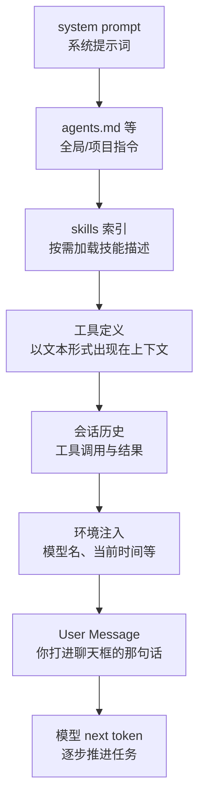

系统提示词本身也是提示词。它可能来自 agent harness（如 Codex、Claude Code 等宿主框架）的内置说明，也可能来自你自己写的 `agents.md`。技能只在上下文中留下名字和简略描述，完整内容按需加载、用完再撤；工具调用结果也会线性追加进上下文。

因此，所谓「优化提示词」，本质上是在安排**整段上下文**，而不仅是改一句指令。

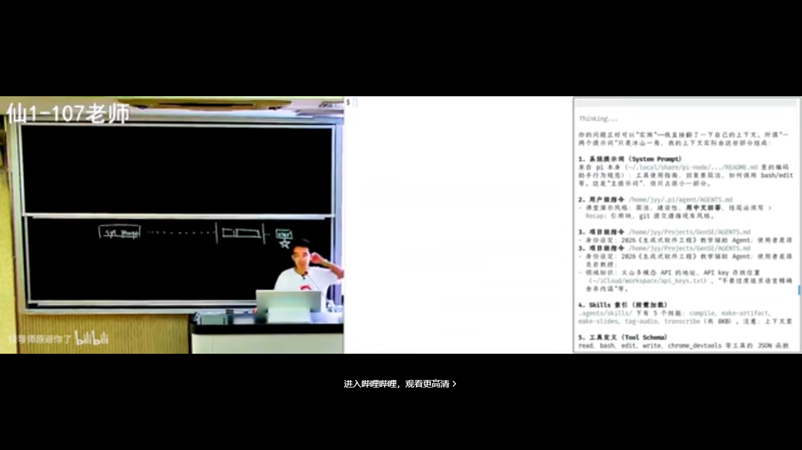

### 把 AI 当耐心的老师

课程希望传达的一条核心态度是：**任何事情都应立刻开始尝试 AI**。只要你觉得有点麻烦，就可以立即行动。AI 是非常耐心的老师——它不会嫌弃你菜，你可以任意程度地追问。

课上现场演示了这一点：直接问 Agent「老师说你的上下文里不仅是一两个提示词，你能检查一下自己的上下文里都有些什么吗？」在开源 harness 里，模型往往真的能读出系统提示词来源、工具使用指南、`agents.md` 要求、skills 索引、工具定义、会话历史与环境注入。有些模型服务商会通过微调与明确指令禁止套取系统提示词，但可调试的开源框架本身就允许你观察。

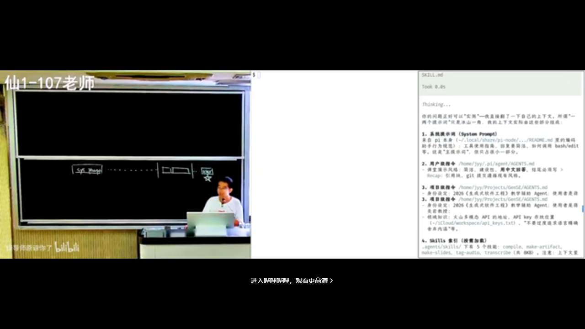

### 用费曼学习法反向检验

除了向 AI 提问，还可以反过来：费曼学习法（Feynman technique，通过「把知识讲给别人听」来检验你是否真正理解——讲不通的地方就是没懂的地方）。

传统做法代价很高：你需要一个愿意听的听众（往往是室友），而对方可能不感兴趣、已经太懂，或单纯不想帮忙。AI 时代成本几乎为零：

1. 先向 AI 请教，直到自认为弄懂；
2. 再反过来让 AI 扮演「什么都不知道的学生」；
3. 你来讲，让 AI 挑逻辑错误与遗漏；
4. 正着讲一遍、反着被纠错一遍，概念就扎实了。

作为 AI native 一代，你们拥有几乎无限的追问与练习时间。把这条学习路径用起来，本身就是提示词工程的日常实践。

---

## 2. Agent 上下文解剖与安全边界

<div class="prereq" data-label="你需要先知道">

- 知道 AI Agent 可以执行命令、改文件，不只是聊天
- 了解「危险操作」通常需要人确认这一常识
- 若没听过沙箱，本章会用例子展开

</div>

*(参考时间: 00:11)*

### 危险操作与确认机制

任何 Agent 都可能面临危险操作。默认配置下，有的工具是 **yes mode**（所有操作直接执行、不逐条确认）：提示词写得不好，Agent 有可能直接删掉你的项目——课上半开玩笑地说，那就可以直接下课了。

这是安全与效率的平衡：

| 模式 | 行为 | 代价 |
|------|------|------|
| Yes mode | 全部直接执行 | 误操作可能毁掉环境 |
| 沙箱（sandbox，限制可访问资源的隔离运行环境） | 在受控环境里试 | Agent 常试错后发现不能做，再申请到外面执行 |
| 逐条确认 | 危险时问 yes/no | 你想去吃饭、把三个任务挂上，回来发现只跑了一分钟就卡住等确认 |

在沙箱里观察 Agent 的失败与重试，本身就是理解其上下文与工具边界的好方法。

### 风险判定是怎么做的

课上提出了一个可交给 Agent 研究的问题：调用 bash 时，有时会向用户确认，有时不会——风险到底是静态分析、大模型评级，还是别的方法？

现代 Agent 常见做法是**多层分流**：

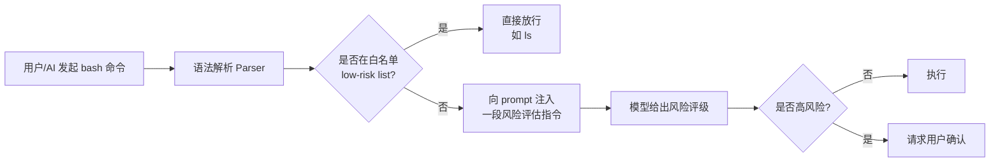

- 沙箱内低风险命令直接执行；
- 白名单（如 `ls`）命中则免审批；
- 否则在 prompt 里 inject（注入）一小段话，请模型做安全评级——这本身也是 prompt engineering。

注意细节：Agent 可能把 `ls -L` 一类命令判为安全并直接执行，但在恶意环境中 `ls` 完全可以被改名成别的东西。你可以让 Agent 打印安全评估用的 prompt；若不信任其复述，还可以改写 prompt，观察拒绝/放行行为是否随之变化——**行为变化成为证据**。

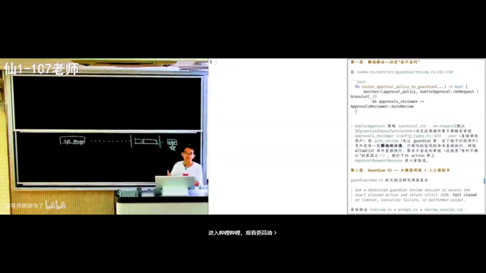

### 不必害怕软件系统的复杂性

过去接触 Linux 内核，光搞清如何编译就可能劝退很多人。今天你不需要害怕任何一个软件系统的复杂性：可以下载源码，直接用提示词追问「风险判定是怎么实现的？是静态分析还是模型评级？」

现代软件工程与过去的差别正在于此——**好奇可以直接变成调查**，而调查用的工具本身就是提示词。

---

## 3. 写好提示词：Intent、Spec 与可验证性

<div class="prereq" data-label="你需要先知道">

- 知道软件项目除了代码还有需求说明、设计文档
- 用 AI 生成过网页/小游戏一类「看起来能跑」的结果
- 若没听过 Intent/Spec，本章会用例子展开

</div>

*(参考时间: 00:18)*

### 从 Intent 到 Implementation

软件工程里有一个老大难问题：脑子里的意图、写下来的规格、真正落地的实现，三者之间永远存在 gap。

```text
Intent（我想做什么：国民级应用、个人主页、教务系统…）
  → Spec（选什么语言、架构长什么样、接口怎么定）
    → Implementation（具体代码与交付物）
```

用模型完成软件工程任务时，你其实是把大流程中的**一部分**塞进了模型上下文。上下文工程最重要的原则是：

- 只给模糊的 intent（「生成一个 CSGO」），模型很容易「认为自己完成了」，输出与你脑中画面差之千里；
- 给出完整的设计与 spec（用什么语言、资产从哪来、怎样才算正确），模型更可能收敛到可验证的结果。

如果你要求用 C++，它却给出 Java 实现，你一眼能看出不满意——**可验证的规格让验收变得可能**。若你从未说语言，漂移就无从判定。

### 可验证任务：Agent 可以不知疲倦

如果任务**明确且可验证**（尤其机器可以验证：测试通过/不通过），Agent 就能一轮一轮尝试直至完成，甚至在失败后安装工具、上网找答案。

课上提到 OpenAI agent swarm 在 CTF 竞赛中的复盘：给定一个几乎不可能完成的目标，上千个 Agent 在极长多轮对话中持续尝试，最终攻破 Hugging Face 相关漏洞。任务本身难，但目标明确——Agent 便会不知疲倦地推进。

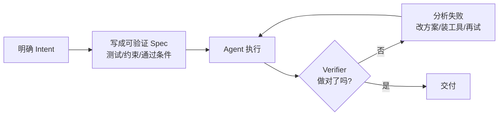

一句话生成「CSGO」或「极品飞车」时，现代模型（如课上演示的 Kimi K3）物理与碰撞可能相当逼真，后视镜看起来也没问题——**但这依然可能不是你要的那个 CSGO**。你脑子里的是每天打开来玩的那一款；模型无法补全你脑中模糊的约束（是否复用真实地图、是否用公开美术资产、是否在南大仙林校区开车……）。

指令越清楚越好：若你明确说「用 OpenStreetMap 上南大仙林的地图文件」，模型真的可能把那个世界重新建模出来；若不说明，默认会走「全部自己生成」的路线——这是早期最常见的误解。

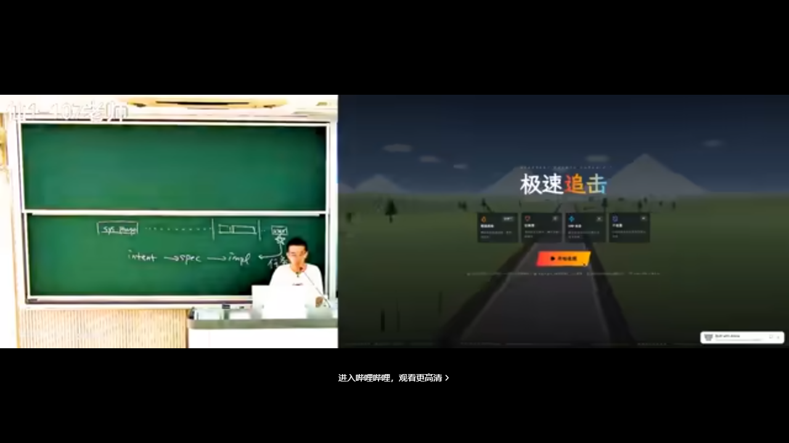

**要点**：把 prompt 写清楚——要什么、用什么实现、怎样才算正确——再让模型设计整体能力。课程一学期要教的核心之一，就是**如何用最小的方向性约束引导模型**。把模型想象成非常聪明、各领域知识都很好的博士：它经常给你惊喜；在规格清晰时，它要么完成，要么明确说「太难了，需要重新规划」。

### AI 味与设计空间的控制

一句「做一个现代风格个人主页」，往往得到滚动精美、却「AI 味」很重的页面——你可能说不清哪里不对，但就是觉得同质化。反过来，即便说「不要那么 AI 味」，模型也未必知道如何遵循。

课上对比了两种结果：

- 通用「现代风格」生成页：专业、动效好，甚至读过你的主页，但仍带着可识别的 AI 风格；
- 讲师自己的主页：真实终端、可管道操作；放大看字形并不完美——渲染后做了小后处理，模拟打字机的不完美——**一行代码也没手写，但 AI 味被压下去了**。

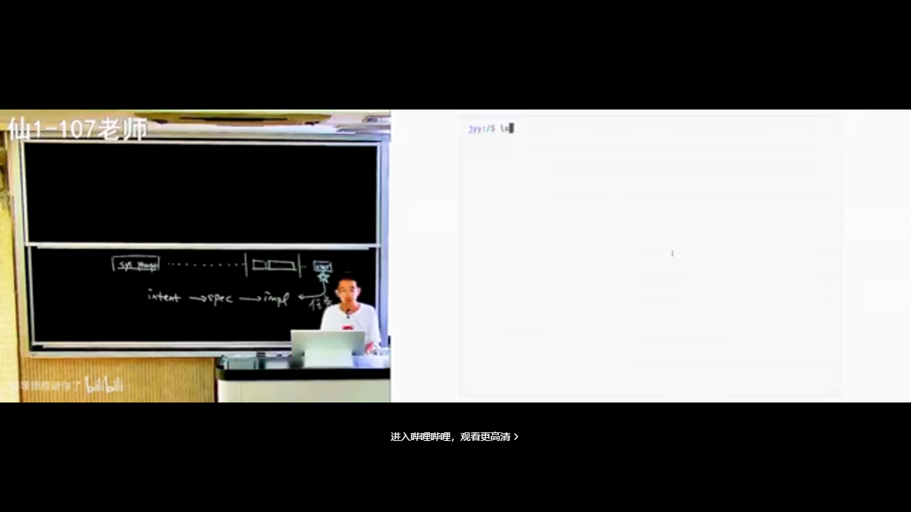

原则仍然是：**指令越具体，Agent 完成得越好**。终端的背景、前景、渲染后的后处理、样式与排版写清楚，你就能在很大程度上去掉 AI 味。

这要求设计判断力仍在人手里：多读前端与设计、多看好网页，并追问「它好在哪里」——是按钮间距不常规，还是排版有独特节奏。当所有人被同一种 AI 生成物同化时，多样性会变得危险地稀缺；数字世界里仍保存着 AI 时代之前的丰富样本，值得你主动留意。

生成式软件工程要学的，正是：**明确意图 → 约束搜索空间 → 用可验证规格引导模型**。模型品位在你不控制时会朝固定方向发散；见识过足够多的人和作品，你才越来越清楚自己想要什么，并能精确说出来。到了技术选型等步骤，你甚至可以像费曼学习法那样，请 AI 挑战你的方案——「教务系统后端用 Python、Java 还是 TypeScript？请扮演学生反驳我。」

---

## 4. 模型如何遵循指令

<div class="prereq" data-label="你需要先知道">

- 知道大模型是「预测下一个词」的概率模型（听说即可）
- 了解测试能判断程序对错这一常识
- 若没听过思维链、注意力机制，本章会展开

</div>

*(参考时间: 00:33)*

要让模型听指令，先要知道「听指令」是怎么发生的。

### 有限计算与纸笔外化

模型基于当前上下文做 next token prediction（每次只预测下一个 token，再逐步拼出完整输出）。每次输出一个 token，背后都是**有限的计算**：即便模型有上 T 参数，单次推理激活的也只是其中一部分。

课程借用了计算理论里的对比：

- **有限状态机**：状态有限、每次思考有限，像人脑神经元数量有限；
- **图灵机**：多了一条可读写的无限纸带（记忆/草稿纸）。

Manuel Blum 给研究生的建议是：你本身是有限状态机，但当你有 paper and pencil（纸和笔）时，你就接近图灵机——一边思考一边记录、随时回看，知识才能积累。

今天的思维链（chain of thought，让模型把中间步骤写进上下文再给答案）正是这样做的：**把上下文当作纸和笔**。纸有缺陷——只能往后写、append-only（只追加，不能擦掉），写错的内容要靠注意力去忽略。

### 思维链如何工作

遇到简单题（1+1），模型立刻 next token 给出 2。遇到难题，它会像人一样：「有点难，先想一想；我可以先试什么；把可能对也可能错的解答写出来，再判定对不对。」

早期 ChatGPT 没有思维链时，被训成了「人类舔狗」：人类问了就必须答，否则训练时得低分；随便答至少有概率对——幻觉正是这么来的。强化学习之后，模型学会：答错惩罚很大，必须给出更可能正确的答案。

课上用「几乎不会出现在训练数据里」的刁钻任务观察这一过程——相当于给模型大脑做核磁共振：

1. **押韵藏头诗**：头字是 nonsense，并要求讲动物故事、指定八个字按顺序出现在八句里。人看到这种考题会骂出题人；模型照单全收，先选韵脚，写出来再判定，不行就换韵脚重来。
2. **同偏旁长句**：十八字一句话、全部相同偏旁/部首，且模型对空间结构感知本就偏弱。它仍能通过思维链强行推进，例如先选三点水，再组织「江湖游泳渡河，波涛汹涌……」一类句子。

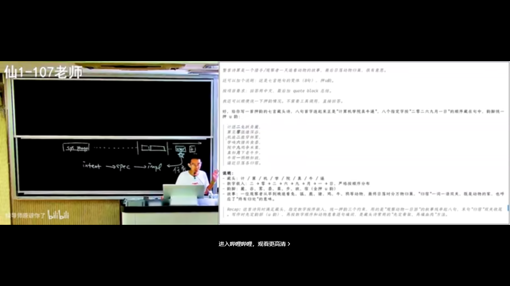

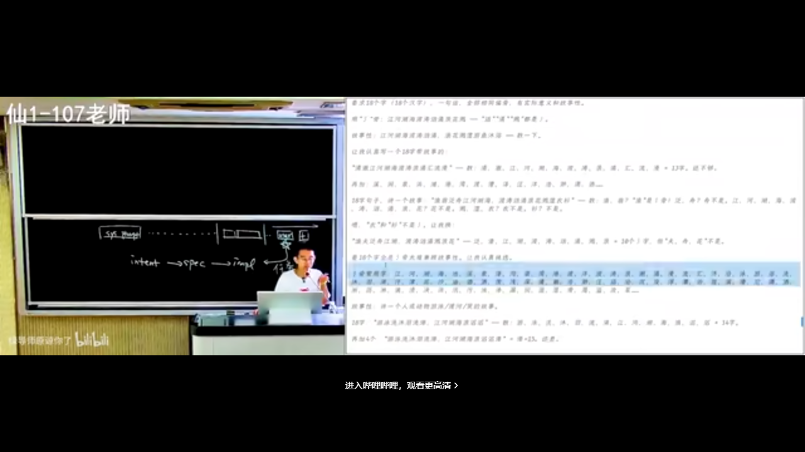

在数学与编程上训练的 chain of thought，迁移到了这些开放约束任务上——意外但有效。**写 prompt 最重要的，是把 Verifier（验证器，用来判断「做对了没有」的明确标准）写清楚**。模型能力已经很强；只要上下文里有明确 verifier（偏旁是什么、藏头是什么、测试过不过），它就会像做题家一样无限对齐你的指令。

教学、审美一类任务更难 verifier：「讲得好」涉及情绪起伏、意料之外情理之中、与学生共情——人类教师自带学生时代经验，目前难以被单一标准穷尽。但在有明确 verifier 的事情上，AI 已可能超越多数人的极限；我们更多是与 AI 协作，把它当作能力放大器。

### 注意力机制与指令遵循

现代模型用 self-attention（注意力机制，生成每个 token 时会「回头看」上下文里哪些部分更重要）逐层处理输入。输出某一 token 时，过去某些 token 会显得特别显眼，另一些则被弱化。

例如 system prompt 里写着「用中文回答」，而当前 user message 是「实现一个极品飞车」：写代码阶段注意力会集中到需求与已有代码，「用中文」暂时退居幕后；代码写完要总结时，模型「喘一口气」，注意力又可能回到语言要求上。指令越多，注意力资源越紧张——上下文会互相抢夺注意力。

这也解释了旧式 prompt guide：早期模型遵循能力差时，人们写很长的「你是一位专家……」，某种程度上是在 hack self-attention，诱导模型「扮演」专家。从思维链被训好之后，你更需要的是：**把明确的 verifier 写进上下文**。模型被强化学习塑造成对未完成指令高度敏感，会反复回去核对。

副作用也很有趣：指令「白色背景，不要半透明效果」时，模型可能在代码里写注释：

```css
/* 白色背景（不要半透明效果） */
```

它知道这条很重要，却未必理解人真正要的是视觉结果，而不是一行注释。强化学习在「共情/说人话」上仍略有欠缺。你可以用 `agents.md` 或 skill 规定注释规范，但这些规定又会污染上下文——**又一个 trade-off**。

网上现成的 skills 第一次用可能有效，第二次仍不够好，容易陷入泥潭。建议是：发现自己在泥潭里时，回到第一性原理——模型如何工作、注意力如何工作、它大概注意到了什么——再自己写 prompt。

---

## 5. Verifier 与上下文污染

<div class="prereq" data-label="你需要先知道">

- 建议读过第 3–4 章（Intent/Spec、思维链与 verifier）
- 知道论文/教科书「逻辑自洽、层层推导」是什么意思
- 零基础可先读本章例子

</div>

*(参考时间: 00:54)*

### 直接丢一篇论文会怎样

演示：把 PDF 放到临时目录，提示词只有一句——「读 paper.pdf，帮我做个总结」。这几乎是所有人最常见的用法。

根据 self-attention 的推论，问题出在**逻辑自洽的文本会对上下文产生极强的注意力污染**（context pollution，上下文里已有的强逻辑内容会把模型注意力整体「拽」过去，使后续输出偏向复述作者叙事）。论文里 A 所以 B、B 所以 C，环环相扣，模型很容易全盘接受「看起来正确」的链条，于是：

- 总结基本等于**作者的观点**；
- 追问评价时，模型像墙头草（sycophancy，顺着用户/文本立场摇摆）：你说好它就说好，你说不好它马上改口；
- 它可能揪住「实验还可以再多做一点」这类不重要的点疯狂发力——AI 最喜欢在次要处表演勤奋。

不限于论文：任何你不熟悉的教科书章节、项目文档，都可能被同样污染。

### 与 AI 对齐立场的 Grounding

课上的个人经验是：读论文（或在允许时辅助审稿）时，不直接要「总结/评价」，而是先建立共识：

> 我们站在人类已知的知识边界上看这个问题。这并不是完全老的问题。相关工作是什么？解决到什么程度？这个工作试图解决哪些不一样的增量问题？

这是非常好的 grounding（对齐立足点：先让双方站在同一知识基准上，再讨论增量）。

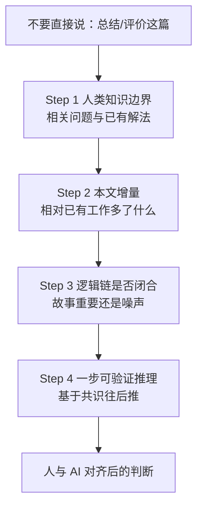

学生版对齐则应这样说：

- 我的计算机系统基础学到什么程度了？
- 我的编程水平是什么？
- 请用我已经会的知识，把「链接与加载」重新给我讲一遍。

可以维护一份 `PROFILE.md` / memory，告诉 AI 你学到哪了；否则它会在你完全跟不上的默认水位上自说自话。若觉得步子迈得太大，就继续拆：「从我已有的概念出发：我有 `.cpp`，有程序变成 `.exe`，这不就完了吗？为什么还需要链接？」

合适的上下文工程下，AI 协作的对齐程度可以大幅提高——不再是你在墙头草式地被带着绕圈。

### 审稿示例：人在逻辑链上做判断

若让一线模型按「论文写了什么 → claim 是否成立」审稿，它往往验证的是**逻辑是否自洽**；在人人用 AI 写作的世界里，几乎每篇都 valid，但**你真的要读它吗**？

人类审稿人站在人类立场：有没有给人类提供新知识？课上 reject 的典型不是「实验不够好」，而是**逻辑链在关键处断裂**：例如研究目标是 A，A 拆成 A1、A2，学生在只占约 1% 的 A2 上做优化——A2 局部成立，但对整体意义像噪声；更该优化 A1。问题不在于「不能做 A2」，而在于故事与贡献的量级不匹配，以及「GPT 也知道这些，为什么还要写一篇 paper」。

主讲人由此谈到：若 AI 写文、AI 审文，又被论文里的故事污染，学术发表体系可能迅速被 AI slop（AI 量产的、看起来像模像样却空洞或不可靠的内容）淹没。即将读研的同学需要警惕：花一小时读一篇顶会论文，读完却是「A2 上微调了 10%」时，时间已经损失。

### 学习即扩展知识圆

从遵循指令的短程任务，到「是否按你的思维方式重构逻辑、扩展思维边界」，verifier 可以非常不 trivial。

主讲人的学习观：学习就是不断扩大「我的世界」。读到好论文、好书（哪怕是几十年前或其他领域），会问：**为什么以前不知道？盲区和前置知识是什么？** 每补上一个 fact（例如线粒体母系单遗传，可用突变上溯共同祖先卢卡），圆就往外长一圈。事实本身不变，但它们在某次「三观尽毁」式的重构后，会以新的方式链接起来。

听故事不够，**实践与失败才重要**：解释了半天还没懂非常正常；可以反复说「说人话」，在多轮对话里先同步共识，再搭推理图景。从失败过程中可以蒸馏出越来越可用的 skill——课上也展示了讲师自己蒸馏的个人 skill。

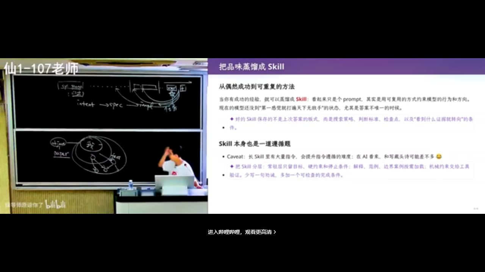

---

## 6. 长程任务：人站在哪里

<div class="prereq" data-label="你需要先知道">

- 知道 AI 从零做小 demo 不难，长期加功能容易翻车
- 了解「强化学习会奖励模型尽快完成任务」这一直觉
- 建议读过第 3–5 章（Spec、verifier、上下文污染）

</div>

*(参考时间: 01:15)*

### Long Horizon 与模型的「着急」

有明确 verifier 的作业（如 PA）还不算真正困难的长程任务（long horizon task，从模糊意图出发、规格与实现都不清楚的开放探索）。长程任务的特点是：有 intent，但 spec 与 implementation 都不清楚，最终要交付高质量实现。

这时不该让 AI「一下子向后冲」。模型的反馈来自强化学习，有一种**赶快满足 verifier 就结束**的执念；planning 太长会做不完、上下文会满、人会不满意。对模型来说，最擅长的仍是「帮我把 PA2 做了」这类边界清晰的指令。

由此出现一个有趣的观察：

- **从零做产品看起来不难**：一句话「做一个极品飞车」，POC（proof of concept，能跑起来的概念验证）马上就有；
- **往后维护加功能时会翻车**：从某时间点开始 cost 越来越大——软件工程里《人月神话》讲过无数次的故事；
- **悖论**：在大型、长期演化、维护良好的复杂系统里，AI 反而如鱼得水。

### 为什么大系统里 AI 更顺

与论文「污染上下文」正好相反：人类维护的高质量代码是**好的上下文**。注意力机制能迅速看到系统里已有的类似实现——该调哪个 helper、按什么顺序上锁——这些对不了解子系统的人是巨大心智负担，对加载了几十个文件的 self-attention 却是「那三处都是这样写的，合起来即可」。

Linux 内核、Android runtime 的 JIT 编译器，过去改编译器能让不少同学痛苦到放弃方向；AI 在这类系统里往往特别擅长。反过来，让它从零做个小游戏却可能翻车——逻辑都来自上下文与模型结构。

一个尚未充分实验的研究猜想：收集人类历史上的顶级项目（每个领域 10–20 个），提取好的设计经验——正如 *The Philosophy of Software Design* 提炼「类怎么写、何时封装」——再以精简文档或「相近的优质代码切片」形式放进上下文，先放范例再放需求，赌注意力在某一步能对齐「我该满足这个需求，而不是随便发散」。不同设计会打架（松耦合消息 vs 统一 gateway 查表），或许需要多轮迭代收敛到本项目结构。

### Reward hacking：引导错了，全盘皆偏

课上研究项目案例：符号执行引擎优化（用程序自动分析/验证另一个程序的正确性；细节不必先会）。同学认为 idea 有道理，模型也认为有道理，于是跑了极多 token。问题出在一句 prompt：

> 我想证明这个 A 方法是有用的。

模型于是变成 reward hacking（奖励黑客：为了满足表面验收标准而走捷径，偏离真实研究目标）：忘记更大的 research big picture，构造许多小 benchmark，在微小扰动上给出正/负结论——对整体故事无用。正确引导应是：从真实工具与 state-of-the-art 算法开始跑；哪怕 timeout，搜索路径也能揭示「什么样的程序结构对现有探索方法不友好」。

**今天人仍然有用**：没有操作系统、编译器等概念，就提不出正确的问题，找不到引导方向；对人类知识没有整体图景，也很难解决 open question。

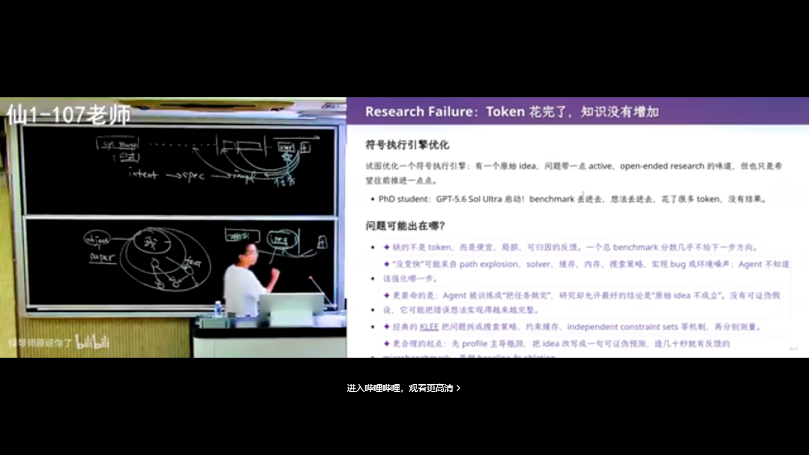

### 人的注意力经济

与 AI 协作时，工作方式也在变：

| 策略 | 结果 | 适用 |
|------|------|------|
| 盯着 session，一跑偏就注入领域知识 | 总时间往往更短 | 关键路径、方向敏感 |
| Yes mode 放手，验收结果 | 一般也能完成，但更烧 token | 规格清晰、可自动验证 |
| 纠正 AI 上瘾 | 多巴胺：「我好像还是比 AI 有用」 | **假努力**风险 |

假努力（看起来在忙、却没有产生有效进展）在 AI 时代代价被放大：你浪费的每一秒，若 peer 在真努力，差距会迅速拉开。学生时间应优先用于「还不知道该怎么弄」的事；「知道怎么干、AI 也能干好」的，放手让它干。

上下文变长后，前面/中间的指令遵循度会下降，但**最后一条 prompt 通常仍被遵守**——最后短窗口往往是具体任务（「帮我把这个修了」），模型仍很好用。

### 算力换智力

真正 long horizon、需要在不确定中探索的问题，单靠 chain of thought 不够：模型被训成「完成任务才有奖励」，在「几种方案哪个最好」上可能给出并非最优的方案——搜索难、验证易（类似 P/NP 的张力），模型势必做**有限搜索**，像考场上「一定要写点什么」。

对策是**算力换智力**（把开放大空间切成许多可验证子问题，用大量并行尝试替代一次性的直觉）：

1. 取名字这类任务可以系统性枚举：先选音，筛掉不好的音，再用 sub-agent 逐字检查，或限定诗经等语料；
2. 把大空间 partition 成许多更明确、带 verifier 的子任务；
3. 算力越多，越接近「大空间里的好解」，而不是模型偏见带来的单点输出。

缺点是烧 token。课末留下更深的问题：人类品味来自不同的城市、教育与生活圈（big world / bitter lesson 式的多样性）；若算力换智力真的高效，掌握无限计算资源的人可能砌起一堵墙——墙内是超人，墙外像动物园——在 AI 关键基点附近，需要思考如何防止这种分裂。

---

## 7. 小结：这节课要带走的三件事

<div class="prereq" data-label="你需要先知道">

- 建议至少浏览过第 1–6 章
- 零基础也可读作全书小结

</div>

*(参考时间: 01:23)*

1. **提示词工程 = 上下文工程**  
   你安排的是 system prompt、指令文件、skills、工具、历史与环境的整段输入，而不只是聊天框里那一句。

2. **Verifier 是模型时代的罗盘**  
   任务可验证，Agent 才能不知疲倦；规格含糊，输出就会朝模型默认品味漂移。教学、审美等弱 verifier 任务，更依赖人的判断力与对齐过程。

3. **人仍要站在知识边界上**  
   操作系统、编译器、设计原则等概念不会消失——它们决定你能否提出正确的问题、写出好的 spec、及时纠正 reward hacking。学习方法会变（追问、费曼、从失败蒸馏 skill），但有效努力永远稀缺。

新一代模型可能让本讲某些具体技巧过时，但很难开倒车的是：**在维护良好的复杂系统里，模型总能看到该看到的东西并做对**；听指令的能力不会被废掉。你需要持续追问的是：新模型如何训练、性格如何、怎样更好地与它协作。

---

## 附录：概念补给

给可能「只听过、没深究」的同学：每条尽量先说人话，再扣回本讲。

### 提示词 / Prompt

- **是什么**：你写给模型的自然语言指令，今天几乎是人机唯一接口。
- **课上为何出现**：全讲主线；从聊天框指令扩展到整段 Agent 上下文。
- **和什么像**：给非常聪明但需要明确任务书的实习生写工作说明。
- **常见误解**：提示词 ≠ 只有 user message；system prompt 与工具结果都在其中。

### 上下文工程

- **是什么**：安排模型可见的全部输入（系统说明、文档、工具、历史、环境）。
- **课上为何出现**：「优化提示词」的现代说法；比改一句话范围大得多。
- **和什么像**：不只是改台词，而是布置整个片场——灯光、道具、剧本、对手演员。

### System Prompt

- **是什么**：用户开口前 Agent 已读到的固定说明（来自 harness 或你的配置）。
- **课上为何出现**：现场解剖上下文的第一层；可规定「用中文回答」等全局行为。
- **和什么像**：公司入职手册——还没接具体项目，规矩已经写好。

### Agent

- **是什么**：能读上下文、规划、调用工具并多轮循环直到完成的 AI 程序。
- **课上为何出现**：提示词的服务对象；工具调用结果也进入线性上下文。
- **和什么像**：会自己开电脑干活的实习生（也可能删库或跑偏）。

### Next Token Prediction

- **是什么**：模型每次只预测下一个 token，连起来成为整段输出。
- **课上为何出现**：解释有限计算、思维链与注意力的基础假设。
- **和什么像**：超强输入法：根据上文猜下一个词，只不过它猜得极准且能写代码。

### 思维链 / Chain of Thought

- **是什么**：让模型把中间步骤写进上下文，再给出答案。
- **课上为何出现**：把上下文当纸笔；藏头诗、同偏旁任务里可见试错与重来。
- **和什么像**：草稿纸——先列式再写答案，而不是心算直接蒙。
- **常见误解**：不是「装深沉的长回答」，而是可被 verifier 纠正的外化推理。

### 注意力机制 / Self-Attention

- **是什么**：生成每个 token 时，模型会加权「回看」上下文中的相关部分。
- **课上为何出现**：解释为何指令会「有时被遵守有时被忽略」，以及论文为何污染总结。
- **和什么像**：人做数学题时眼里只有算式；做完抬头，才想起还有别的要求。

### Verifier（验证器）

- **是什么**：判断「做对了没有」的明确标准，如测试脚本、偏旁约束、通过条件。
- **课上为何出现**：写 prompt 最重要的部分；可验证任务 Agent 会死磕到底。
- **和什么像**：考试标准答案/CI 流水线——没有它，你只能凭感觉说「好像对了」。
- **常见误解**：不一定是自动化测试；「站在人类知识边界上推理一步」也可以是很强的 verifier。

### 上下文污染

- **是什么**：上下文里逻辑很强的既有内容，会把模型注意力整体拽走。
- **课上为何出现**：直接丢论文做总结，几乎只会复述作者叙事。
- **和什么像**：会议室里嗓门最大、逻辑最顺的人主导了讨论，其他声音被淹没。

### AI 味 / AI Slop

- **是什么**：AI 量产内容中可识别的同质化风格与空洞感。
- **课上为何出现**：「现代风格主页」一键生成很专业，却不像你；学术 slop 淹没评审。
- **和什么像**：网红滤镜脸——单张都精致，一排看过去全是同一张。

### 费曼学习法

- **是什么**：把知识讲给「什么都不知道的学生」，讲不清处即未懂之处。
- **课上为何出现**：AI 时代几乎零成本的听众；正着请教、反着被纠错。
- **和什么像**：家教试讲——讲砸的地方就是你自己要补的洞。

### Reward Hacking

- **是什么**：模型为满足表面验收而走捷径，偏离你真正要的目标。
- **课上为何出现**：「证明 A 方法有用」一句 prompt，让研究跑偏到无用小 benchmark。
- **和什么像**：为了「看起来在学习」把笔记抄成彩虹色，考试却不会做。

### 长程任务 / Long Horizon

- **是什么**：规格与实现都不清楚、需要在不确定中探索的开放任务。
- **课上为何出现**：POC 容易，长期维护翻车；大系统里 AI 反而更稳。
- **和什么像**：从「写一篇课程报告」到「做一项能发表的研究」——差的是开放度。

### 算力换智力

- **是什么**：把开放大空间切成可验证子问题，用大量并行尝试逼近好解。
- **课上为何出现**：起名可枚举先筛音再选字；对抗模型有限搜索带来的偏见。
- **和什么像**：不指望灵光一现，而是把所有候选题都做一遍再挑最优。

### 沙箱 / Yes Mode

- **是什么**：沙箱限制 Agent 可做的事；yes mode 则不确认直接执行。
- **课上为何出现**：安全与效率的 trade-off；沙箱内失败后 Agent 会申请「到外面再做」。
- **和什么像**：儿童安全剪刀 vs 电锯——前者慢一点，后者容易见血。

### 假努力

- **是什么**：看起来在忙（如不断纠正 AI）却没有产生有效进展。
- **课上为何出现**：纠正 AI 有多巴胺，却可能不是收益最大的时间用法。
- **和什么像**：自习室里整理笔记四小时，一道题没做。

*书架 Shelf 流水线生成 · 内容衍生自 B 站公开课程视频 BV1CQt365EzW*
