# 欢迎来到未来：生成式软件工程第一讲

> **原视频**：[Bilibili · BV1pb8o6yE8f](https://www.bilibili.com/video/BV1pb8o6yE8f/)（时长约 100 分钟）
> **课程**：南京大学《生成式软件工程》（2026）第 01 讲 · Raw 版
> **整理说明**：本书由视频语音转录后经 AI 重构而成，口语已转写为书面语；关键时间点标注 *(参考时间)*，截图卡片可跳转视频对应位置。

---

## 1. 开场：站在历史的交叉路口

<div class="prereq" data-label="你需要先知道">

- 知道计算机、互联网、手机支付大致改变了生活即可
- 听说过 ChatGPT / 大语言模型
- 本章零基础可跟

</div>

*(参考时间: 00:00)*

课程开场颇具仪式感：主讲人从编辑器按下快捷键打开浏览器，正式上课，并提醒计算机专业学生——我们正站在非常重要的历史交叉路口。

回顾计算机发展史，每一次重大变革都有一个共同主题：**把昂贵的能力变成日用品**。

- **1975 年**，第一台个人计算机 Altair 8800 诞生（开场幻灯片中的复古图本身也是 AI 生成的，「AI 味儿」明显）；
- **互联网时代**，人与人被连接起来（主讲人回忆小学毕业时装 ICQ，腾讯山寨版当时还叫 OICQ）；
- **移动互联网时代**，「一夜之间，所有菜场卖菜的人都挂上了支付宝和微信的二维码」；
- **2022 年**，ChatGPT 出现，成为人类历史上增长最快的产品。

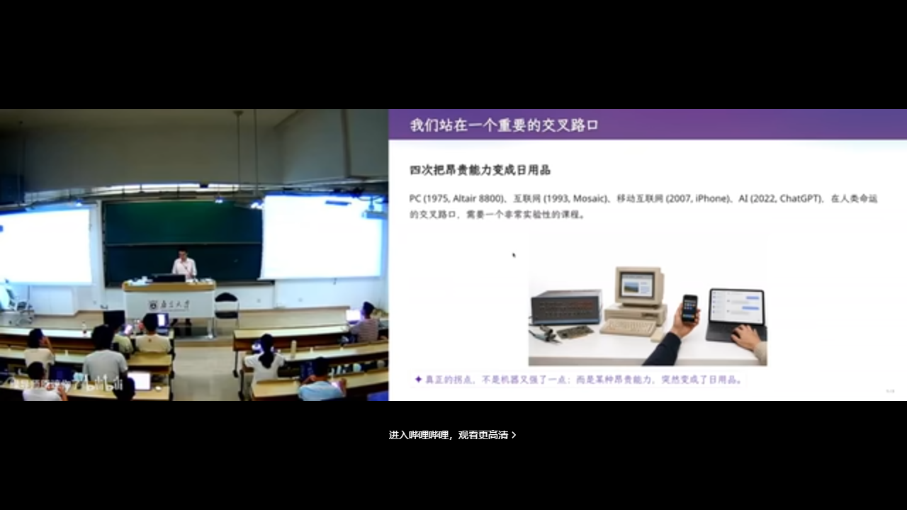

在这样的人类命运交叉路口，**上课的方式、该学什么，都需要重新思考**。《生成式软件工程》正是在这一背景下开设。

---

## 2. AI 时代的焦虑：这门课为什么存在

<div class="prereq" data-label="你需要先知道">

- 对「AI 会不会取代程序员」有隐约焦虑即可
- 本章零基础可跟

</div>

*(参考时间: 00:02:13)*

### 2.1 「AI 替我上大学」

前两年流传一个说法：**AI 替我上大学**。仔细想很对——老师用 AI 出题，学生用 AI 做作业，整个闭环里**只有学生没有受到训练**。

Vibe Coding（用自然语言让 AI 写代码的工作方式）已经强到什么程度？曾经折磨一代代学生的操作系统实验，现在只要把作业链接丢给 coding agent，甚至说一句「蒋老师操作系统课第八个实验，帮我实现一下」，就结束了。

那么问题来了：这个年代还应不应该学编程？答案是**既应该也不应该**——有些能力仍然需要，但应该怎么做，没有人完全知道。

### 2.2 两种焦虑

1. **AI 帮我上完了大学，我什么都没学会。** 若每门课都开卷、都由 AI 答题且全对，走出校门时你会发现自己第一个被 AI 取代。
2. **我认真学了四年，却被大学「骗」了。** 延续中学「老师说什么就做什么」的状态，毕业时却发现：你学会的东西，AI 都会做。

### 2.3 一份「零分简历」

最切实的痛苦来自求职。主讲人展示了一份收到的真实简历（个人信息已用 Unicode 方块抹掉）：

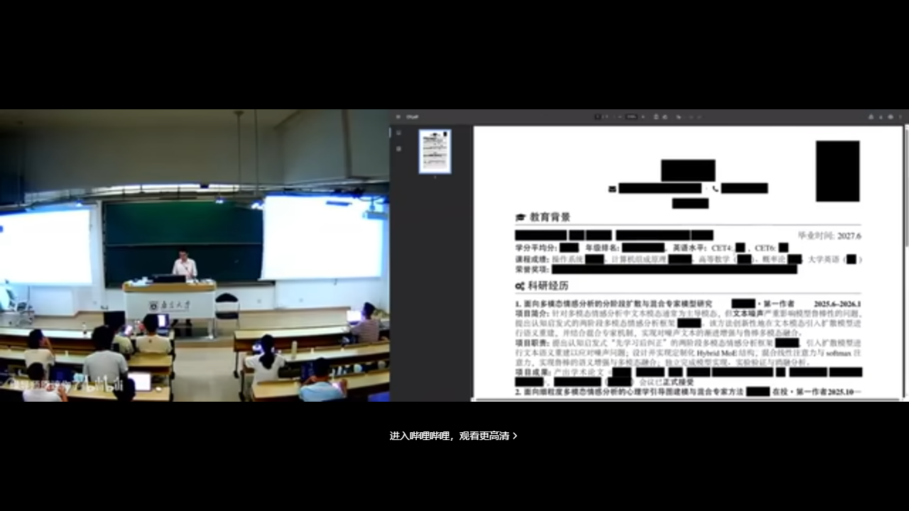

简历「完美」：一整排 CCF 期刊列表上的论文。但在主讲人眼中这是**零分简历**——

> 「所有这一切都是 AI 做的。我没有干任何事，我只是告诉它：有一份简历，我需要在上课时展示一下。」

它没有 GitHub 链接，没有个人主页，没有任何能证明「这个人真正做过什么」的信息。更糟糕的是，这样的简历他收到过无数份。**当所有人的简历都长一个样子，你靠什么脱颖而出？**

### 2.4 这门课的目的

好消息是，这门课希望缓解焦虑，更重要的是带大家**还原 Vibe Coding 的快乐**：

- 在快乐中理解软件工程是怎么工作的；
- 做出一些有趣的东西，让简历显得更好。

主讲人甚至抛出：对他来说，你有一篇已发表论文，**可能是一个减分项**（至少对他如此）。

---

## 3. 课程怎么上：把教学当成一场演出

<div class="prereq" data-label="你需要先知道">

- 知道「讲义 / 幻灯片」是什么即可
- 本章零基础可跟

</div>

*(参考时间: 00:08:48)*

### 3.1 案例驱动、松散组织

课程采用**案例驱动、比较松散的组织形式**。想当面讨论、想「拷打」老师的同学，欢迎线下到场；如果你是「听课型」同学，只想获取知识，那么**既不用到课，也不用看直播**。

### 3.2 幻灯片本身就是 AI 生成的

- 左边是主讲人课前写的讲义（Markdown）：预先想好每个时间点讲什么、举什么例子——相当于**约束好 AI 要做什么**；
- 播放幻灯片时，**紫色部分**全部是模型「添油加醋」加上去的内容；
- 所有插图全部由 AI 生成。

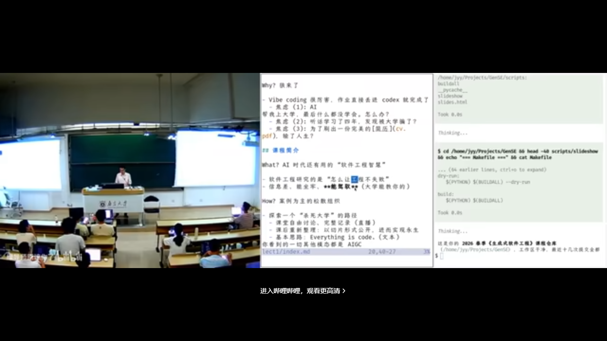

背后是一个名为 `make-slides` 的 skill：从写好的演讲稿 Markdown 出发，生成多个 subagent（子智能体，在隔离上下文里各自干活的 AI 角色），赋予不同 personality（人格），最后主 agent 汇总。**这就是「用算力换智力」：付出更多算力，就获得更多智力。**

主讲人还展示了提示词的迭代方法：每换一版提示词就重新生成，再用另一个模型做**盲评**，比较哪一版幻灯片质量更高。

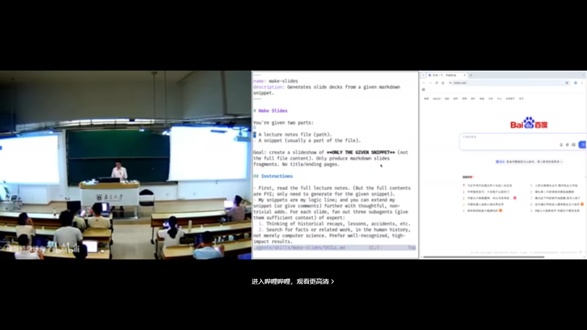

### 3.3 上课是表演，表演要复盘

> 「上课是一种表演。我是一个演员，要调动大家的情绪，根据预先设定好的剧本做一场演出。」

演出结束后还有重要的事：**review 今天的表演**。哪个例子不恰当、哪个案例换一种讲法更好——即兴部分尤其需要事后复盘。课程内容会被重新切片、整理后再发布。

---

## 4. 课程政策：Token、考核与简历

<div class="prereq" data-label="你需要先知道">

- 知道调用大模型 API 通常按用量计费（token）即可
- 本章零基础可跟

</div>

*(参考时间: 00:15:07)*

### 4.1 Token 自费

课程第一条政策是 **Token（模型按次计费的用量单位）自费**。主讲人原想拉 Token 赞助，看到选课人数后放弃了。他甚至说了一句狠话：

> 「如果你们手上没有付费的 Token，就应该立即退学。」

当然这是夸张——他的意思是，在这个时代，**Token 就是生产资料**。课程演示会尽量使用**足够便宜但智能尚可**的模型：除了幻灯片生成用了更聪明的模型，课上几乎所有演示都由 **DeepSeek V4 Flash**（一种主打性价比的大模型）完成。

实用省钱建议：同学们是「夜猫子」，DeepSeek 在夜间低谷时段更便宜——**白天上课是「峰时」，晚上做作业正好是「谷时」**。每位同学充 100 块钱基本够用；实在有困难可以联系老师。

### 4.2 考核难题

主讲人申请课程时把考核方式填成「通过/不通过」，教务反馈：专业选修课一般不这么做。

背后是真实的时代难题：**评判标准是什么？** 同一个任务，用更强的模型就是比用便宜 Flash 做得好，而课程没办法限制大家用什么模型，那该怎么评分？


建议是：实现一个自己的 **eval（评估）管理系统**——老师通过专用邮箱发邮件，你把邮件回回来；可以做一个常驻服务，跑在宿舍里一台一直开着的小电脑上。这本身就是一个不错的 Vibe Coding 实验。

### 4.3 分数不重要，简历才是唯一的考试

> 「到底什么叫做得好、做得不好，该给多少分？我觉得在这个时代，分数已经变得不那么重要了。」

真正重要的，是最后找工作或保研那一刻，**你投出去的简历上有什么东西**。对同学们来说，其实只有那一次「考试」。

比较糟糕的是，为了走到那一刻，你还需要不错的 GPA，还得去 **reward hacking**（针对考核指标钻空子式地优化）、去 **overfit**（过拟合：把应试套路练得极熟）那些考试题目。但最终检验你大学阶段的，是那一份交出去的简历。

课程最终期望：每位同学的简历上能写上「我在生成式软件工程里实现了 ABCDE」，附上链接，每一项都做得漂亮，都能说清楚设计与实现中了不起的地方。

### 4.4 一个恐怖的思想实验

如果每个人的电脑上都装了监控，AI 就能知道你大学四年干的所有事情——你摸的每一次鱼、你看的每一个不想让人知道的内容。这样的 AI 可以评判你度过了一个怎样的大学四年。

「当然这是非常恐怖的事情。我们不知道人类社会什么时候会演绎到那个程度。但是——**保持 open，这是我们课程的 policy。**」

---

## 5. 认识大语言模型：一个概率分布

<div class="prereq" data-label="你需要先知道">

- 概率课上抛过硬币、算过「下一次出现某面」的概率（或能接受类似比喻）
- 不必会训练模型；本讲站在**使用者**视角

</div>

*(参考时间: 00:20:32)*

### 5.1 大语言模型就是概率分布

「我今天不讲什么是大语言模型（LLM，通过海量文本学会预测下一个词的 AI 模型）——**大语言模型就是一个概率分布**。」

主讲人用概率统计课上的抛硬币问题作类比：已知抛了六次硬币、点数之和是多少，求第一次抛出 1 的概率——大家在概率课上都做过类似题目。大语言模型没有任何区别，它就是一个**学到的概率分布**：给它一本书（一段很长的文本，也可以是图像），书读到末尾结束了，你可以在书的后面再写几个字——比如「能不能帮我总结一下这本书」——接下来，模型就不断地预测下一个 token（词元，模型处理文本的最小单位）的概率。每次输出可以理解成吐出一个字符。

这个模型很大，它见过世界上几乎所有的东西；训练它很难——这就是为什么今天的前沿实验室（Frontier Labs）如此强大。

但这门课**站在使用者的视角**：你们只需要知道存在一个叫大语言模型的东西，打开 DeepSeek 的网页或 API，问一句「什么是大语言模型？」，它就会告诉你，而你此刻就在体验大语言模型。**你不需要任何大语言模型的先验知识。**

### 5.2 第一次被大模型「按在地上打」

主讲人第一次被大模型震撼，是 2023 年 GPT-4 时代，他给 5 岁的孩子解释什么是扫描电子显微镜。当时的 prompt（提示词，你写给模型的指令）写法还很朴素：「用朴素的语言，打一个合适的比方，帮助他理解这件事。」

GPT-4 给出的比方让他震惊：

> 你面前有一座山，你闭着眼睛看不到它的形状，但你想知道山长什么样，怎么办？你就对着山扔石头：朝这个方向扔，石头穿过去了；朝那个方向扔，石头弹回来了，你能听到声音。通过哪些地方穿过去、哪些地方弹回来——就像 ray tracing（光线追踪）一样——你就可以推测出山的形状。

小朋友大概听懂了。主讲人事后特意去查了资料：**这个比方在科学上是对的**。GPT-4 是一个幻觉（一本正经地编造事实）非常严重的模型，但在这个例子里，它既有知识，又给出了恰当类比。到了带 reasoning（推理）能力的新模型，还能给出更严谨的解释。

### 5.3 从 Prompt Engineering 到「一句话的事」

GPT-4 时代，人们用 prompt engineering（提示词工程）让模型生成各种奇怪的东西——主讲人举例：一个 prompt 要让模型给某个程序找到 150 个问题，需要反复调整。而到了新一代模型，同样的工作**就是一句话的事情**。

---

## 6. 从模型到 Agent

<div class="prereq" data-label="你需要先知道">

- 读过本册第 5 章，或知道 LLM 会「预测下一个词」
- 知道电脑上可以跑命令行 / 脚本即可

</div>

*(参考时间: 00:24:10)*

随着模型能输出越来越长的文本、也能接受越来越长的上下文，**Agent（智能体）出现了**。路径很清晰：

1. 先有了**推理模型**（reasoning model）；
2. 然后有了 **ReAct 式的 coding agent**。

原理其实很简单：语言模型本来只会输出下一个 token，那就让它输出一个**特殊的 token**——比如「调用一个 bash 程序」。这个 bash 程序会被真正执行，执行结果再重新送回 agent 的循环（loop）里。这样 agent 就可以自主运行，你就可以交给它一个比较复杂的任务。

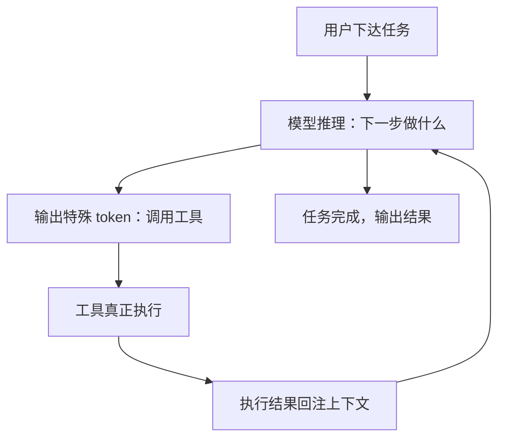

*(参考时间: 00:29:17)*

未来会变成什么样？主讲人坦言无法预测：到底哪一条技术路线会胜出、哪一种模型会胜出，没有人知道。**但可以预见的是，这个世界肯定会变得非常不一样。** 在这个世界上我们该怎么办，是每一位同学都值得好好考虑的问题。

---

## 7. Agent 入门：原则与第一课

<div class="prereq" data-label="你需要先知道">

- 听说过「AI 助手能帮你干活」
- 本章重在看案例，零基础可跟

</div>

*(参考时间: 00:29:44)*

「吓唬人的事情说完了，我们可以吸一口气。」接下来进入课程的主要内容：**怎样实际操作一个 agent**。主讲人假设大家其实并不太会用 agent——除了「帮我把这个作业做了」以外。

### 7.1 课堂演示：一个配置了 AGENTS.md 的 Agent

课上选择的 agent 工具，只要跟它说话就可以干活，并且支持配置文件，比如 `AGENTS.md`（放在项目里、描述「你是谁、这个项目是什么」的说明书）：

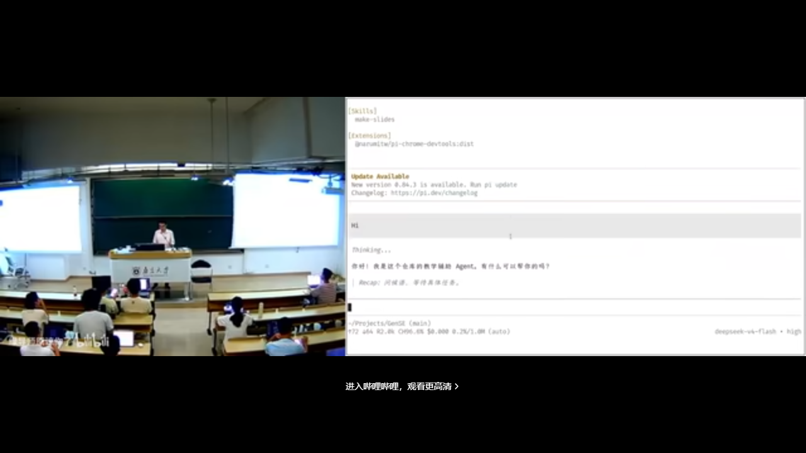

你可以问它：「你是谁？」它会回答自己是《生成式软件工程》的教学辅助。再追问：「你不就是个模型吗，为什么还知道生成式软件工程？」它会告诉你：之所以知道这门课、这个仓库，是因为读到了 `AGENTS.md`。

由此引出使用 agent 的前两个原则：

- **原则一：现在就开始用；**
- **原则二：随时问它。**

在此之上，还有更本质的一条：**你的想象力，限制了你的 agent 的上限。**

### 7.2 案例一：整套上课系统都是 AI 装的

主讲人的第一个例子，就是他当天上课用的整套系统——**所有配置和安装全部由 AI 完成**。

他教操作系统课一直有个传统：带一个 U 盘，里面装一个 Linux 系统，插到教室电脑上直接启动。装机曾经是很痛苦的事；而现在，「装机仙人」已经彻底被 AI 取代——他只用了**一句话**：

```text
你去 mirrors.nju.edu.cn 上找一个 Debian 13 的镜像，
把它装到我的 U 盘上，确保这个 U 盘可以启动，
然后用模拟器验证。
```

点睛之笔是「**用模拟器验证**」。Agent 装完之后，真的在 QEMU（一种虚拟机软件）里启动系统，看到登录界面，创建用户、设置密码，确认登录成功，然后汇报「验证完成」。

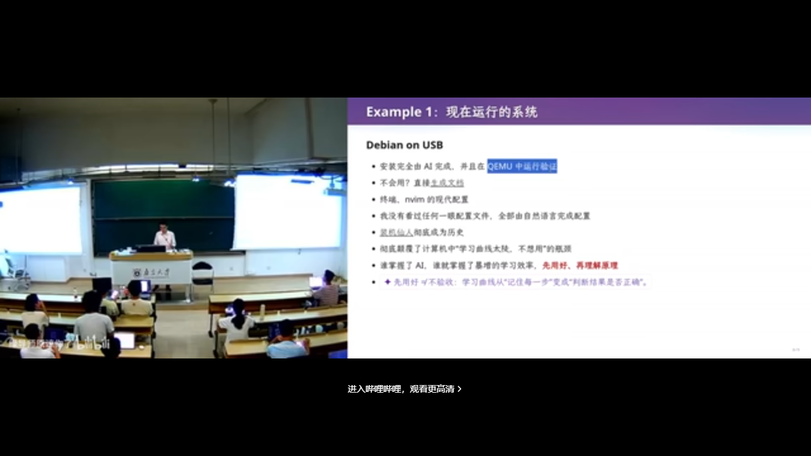

当然，主讲人自己是有「脑袋」的——他知道这个安装是怎么完成的。但这不妨碍整个流程由 AI 执行。

### 7.3 案例二：平铺窗口管理器与「从不看配置文件」

同样的方式，他让 AI 装了一个平铺式（tiled）窗口管理器：

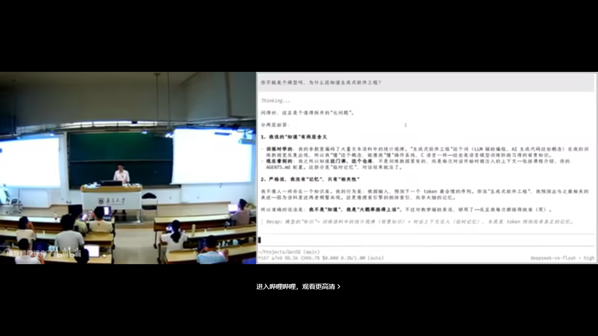

不会用怎么办？他直接让模型生成了一份文档：「看一下我系统现在的设置，我要做各种事情，怎么办？」模型告诉他快捷键是什么。

> 「所有的文档，包括你看到的 Neovim 的现代配置，我没有看过任何一眼配置文件。所有的一切都是用自然语言完成的。我只是让它『包交付』。」

主讲人感慨：他大四时捧着几千页的 CPU 手册逐条研读。而在这个时间点，**有一个「人」可以跟他沟通，把这些东西全看了、都懂、能做对——他需要做的，是解锁它的能力。**

> 「你学习知识的方式变了。你更多时候需要知道**它能做什么、能做到什么程度**，然后带着它去做一件更大的、它自己做不到的事情。**人现在唯一的功能，就是带着 AI 做 AI 现在做不到的事情。**」

---

## 8. 案例集：Agent 的日常操作

<div class="prereq" data-label="你需要先知道">

- 用过命令行或见过别人配置终端（可选）
- 本章零基础可跟，重在建立「Agent 能干什么」的清单感

</div>

*(参考时间: 00:36:44)*

Agent 彻底颠覆了计算机科学的学习曲线。主讲人举了大家都有共鸣的场景：配置终端。

### 8.1 终端配置：从「一改就出错」到「情绪价值」

你们都在网上看过别人花里胡哨的终端，自己也想搞一个——结果配置文件一改就出错，非常痛苦。有了 agent，一点也不痛苦：它不仅可以帮你改，还能事无巨细地解释为什么要这样改；你有什么新想法，它立刻说「好好好」，**还给你情绪价值**。

> 「谁掌握了 AI Agent，谁就掌握了暴增的学习效率。」

他推荐的学习方式是：**先把东西搞出来，再回头复盘理解。** 这个效率比从零开始一点一滴学要高得多。但危险在于：你的理解可能与「比较好的理解」存在差距。

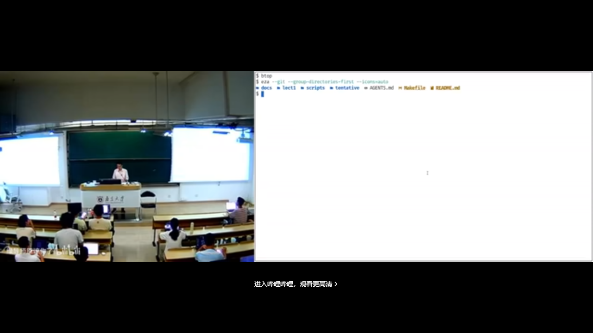

顺带一提，他现场展示的现代化终端——漂亮的进程监控（btop）、`ls` 自动替换为 `eza`、`find` 自动替换为 `fd`——全部来自一条 prompt：「帮我把命令行终端和系统都配置成现代的样子、比较好用的样子。」模型用的还是便宜的 DeepSeek V4 Flash。

### 8.2 收发邮件、写草稿、管发票

主讲人有一个自己的邮件 skill：数据库里存着历史上回过的所有邮件。每当收到一封新邮件，agent 会：

- 自动标记为已读；
- 自动用**他的口吻**写好回复草稿（简单邮件可以直接发，大部分还得改）；
- 把重要附件归档——比如收到一张发票，自动保存到指定位置。

这些全靠事先写好的 instructions。更有意思的是与待办系统的联动：在手机的提醒事项里加一句「帮我把今天的发票打印出来」，后台处理完毕后，agent 会推送通知到手表上。

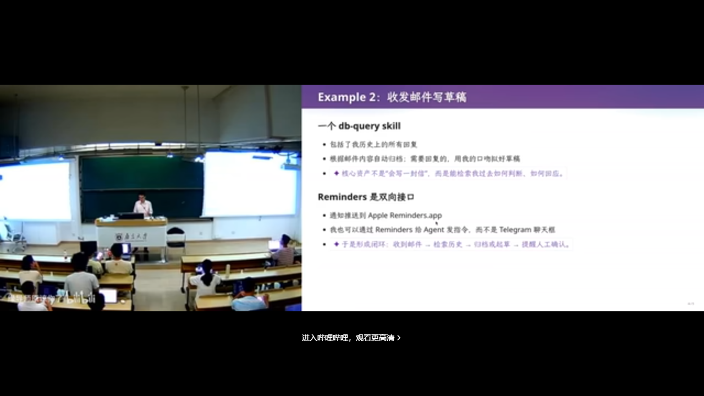

### 8.3 用 AI 读书、读论文

「你们还读书吗？还看论文吗？看论文痛苦吗？」主讲人自认很爱看书，而今天，**他已经不怎么看书了**。

他的读书方式是这样的：自己读完第一章，然后——**agent 启动**。读论文时的 prompt 思路是：**从人类已有的知识出发，假设所有已知的东西都是「已知的」，把这篇论文里真正新的、最少的东西剥离出来。** 这样一篇 12 页的论文基本剩不下多少——「所以我现在读论文的效率非常高。」

> 「我仍然是读论文的。我不是那种只看微信公众号学习的人。」

### 8.4 用 AI 看 B 站视频

「我不仅用 AI 读书、读论文，我还用 AI 上 B 站。」当然，如果是纯娱乐，就不要用 AI 读了。他的流程是：

1. 给一个 BV 号；
2. Agent 把它整理成**自动的图文时间轴**——文本质量比字幕更高；
3. 图片密度可控：两帧间隔大到一定程度就截图——这些截图就是视频的 ground truth（可核对的硬证据）；
4. 结合**他的记忆**来消化这个一个多小时的视频：把所有对他来说 trivial（琐碎、已会）的内容去掉，剩下的才是需要看的。

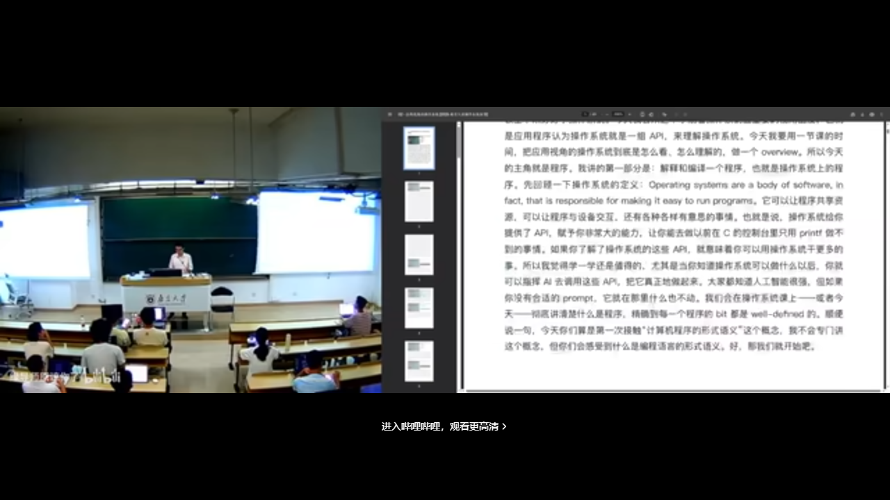

于是，他可以在几分钟内「看完」一个两小时的视频。

---

## 9. Skill 生态与个人知识飞轮

<div class="prereq" data-label="你需要先知道">

- 知道「开源脚本可以复用」的概念即可
- 本章零基础可跟

</div>

*(参考时间: 00:47:00)*

### 9.1 10 倍、100 倍的差距

把前面所有案例加在一起，结论有些残酷：

> 「在 AI agent 的时代，会用 agent 学习的人，和不会用 agent 学习的人，学习效率的差距是 10 倍、100 倍。你们坐在这里，怎么和一个效率是你 100 倍的人竞争？」

回到开头那份简历：如果所有人的简历看起来都一样，那么你应该想一想——**那个学习效率是你 100 倍、你看不见的人，他的简历长什么样？**

### 9.2 课间插曲：Agent 修好了直播采集卡

课间发生了一个绝佳的实时案例：直播用的 USB 采集卡断了。主讲人当场让 agent 修复：「我的 USB 有问题，能不能 reconnect？」模型用了一些「你们前所未见的 Linux 命令」——**用软件的方式把采集卡「拔出来又插进去」**。拔了一下、插了一下，好了。

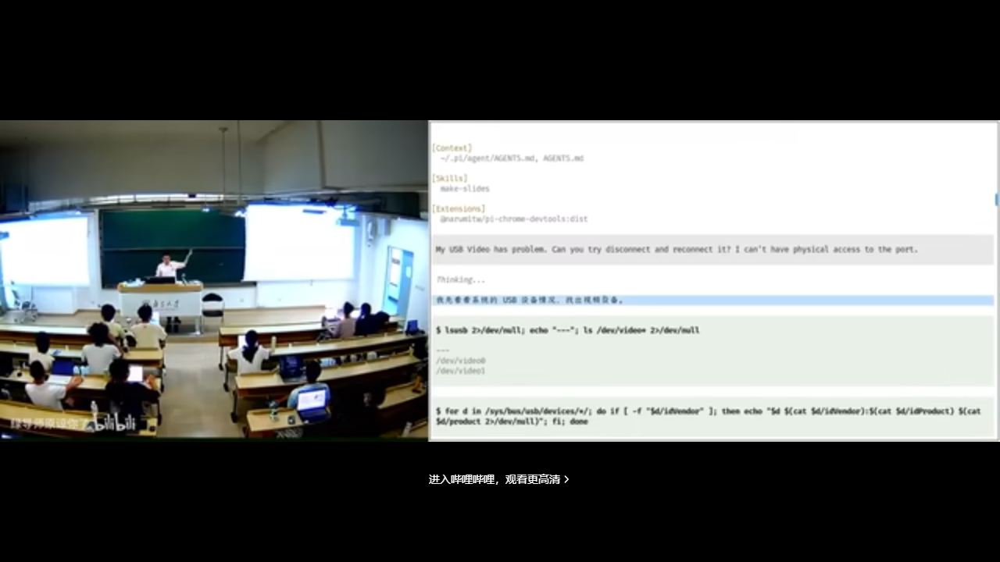

### 9.3 白板 Agent + 一个 API Key

主讲人强调：刚才展示的这些，还不是 AI 的真正形态。作为普通人，你看到的是**一个「白板」的 agent 客户端**——什么也没有。你从官方网站安装下来，配置一个 API key（调用模型的密钥），**你立即就可以得到刚才所有的那些东西。**

### 9.4 Skill：AI 时代的开源脚本

Agent 远不止于此——它有完整的生态系统。主讲人引用了他课上反复提到的「计算机科学定律」：

> 「如果有一件事情它是合理的，并且你想做，那么 100% 一定也有别人想做。」

在 pre-AI 时代，开源社区会公开脚本，到 GitHub 上拉下来就能用。在 AI 时代，**复用别人的能力变得前所未有的轻松**——可以往 Skill Hub 上发布一个 skill，你可以在 agent 的插件生态里找到它。

所以普通人下一步应该做什么？**用插件把浏览器「管」起来，用插件把电脑「管」起来。**

### 9.5 Unix 哲学与生态临界点

主讲人教操作系统，他提到了 Unix 哲学成立的原因：**管道（pipe）实现了所有程序的自由组合与无限复用——1+1 是可以大于 2 的。**

同样的道理，skill 可以加在一起、互相调用。AI agent 的生态其实已经达到了一个临界点：很快你就会看到，这些东西互相组合，可以成百倍、成千倍地放大个人的能力。

### 9.6 个人知识飞轮

对普通人来说，这意味着什么？你可以找到世界上各种各样的信息源——订阅一份 AI 早报、B 站的推送、arXiv 的推送、Hacker News 的推送——然后把「处理这些信息」的能力**沉淀成 skill 或脚本**，搭建一个信息处理系统：

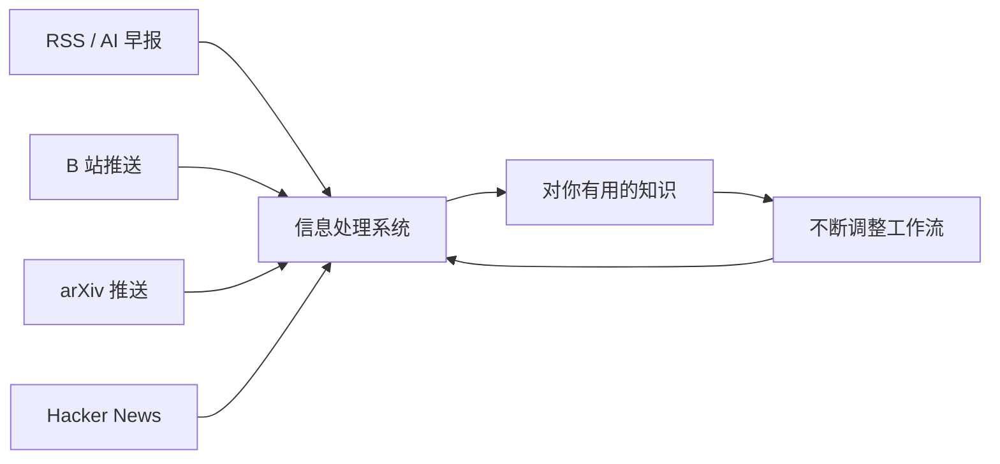

大量的信息源进入处理系统，处理系统由各种各样的 skill 构成——**全部是自然语言，一行代码都不用写，但可以复用**。你会不断调整这个工作流，它就会不断产生对你有用的知识——**你的飞轮就转起来了**。

这时候你就能理解，为什么个人 agent 产品能给人这么大的惊喜。主讲人对此并不惊讶，他更多是自己管理流程，把东西写进自己的记忆库。

### 9.7 让 AI 改进你的流程

> 「你就问 AI：我这一天干的这些事，你觉得我还有没有提升空间？」

很有可能——尤其是初学者阶段——还有很大的提升空间。

---

## 10. 浏览器自动化：DevTools 与填表实战

<div class="prereq" data-label="你需要先知道">

- 用浏览器上过网；按过 F12 看过开发者工具更好，但非必须
- 本章零基础可跟

</div>

*(参考时间: 00:51:36)*

### 10.1 浏览器是软件工程的奇迹

> 「浏览器是一个非常好的工程产品，可以说是人类软件工程史上的奇迹之一。它看起来只是一个显示网页的东西，但代码量甚至远超操作系统内核。」

浏览器有一个专为开发者设计的接口：**Chrome DevTools**（按 F12）。一个冷知识：很多网站会在 Console 里嵌入招聘广告。

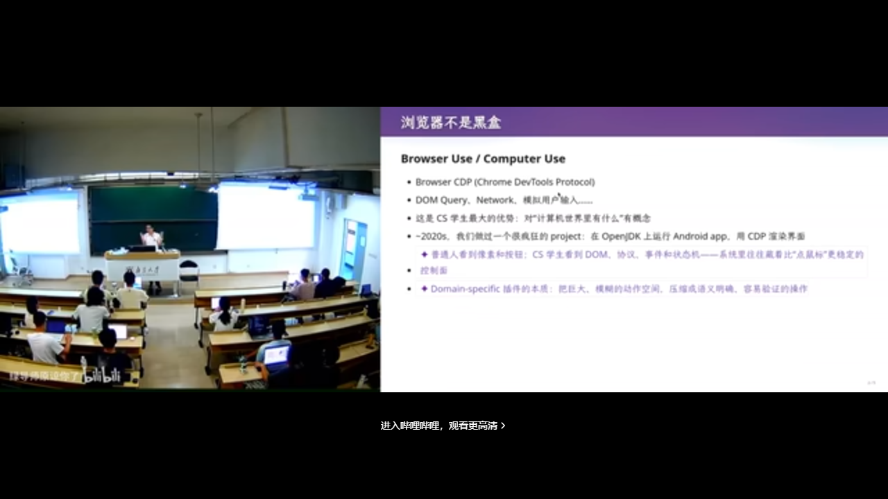

在 pre-AI 时代，开发者用 DevTools 做什么？比如在 Network 面板找到一个请求，Copy as cURL——把命令连同浏览器的 Cookie、所有状态一起复制出来，在终端里直接请求，就能拿到数据。

### 10.2 实战：让 Agent 填写教学周历

现场演示的任务是：**填写教学周历**。「你们都很讨厌动不动就叫你们填东西吧？我也很讨厌。」

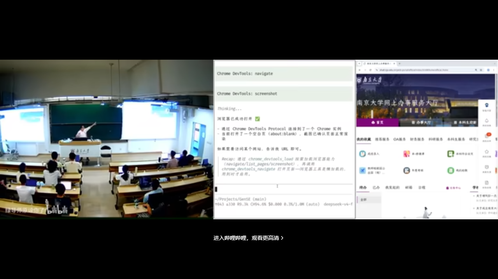

他让 agent 打开浏览器，然后下达指令：「现在教学周历是空的，帮我随便用什么 AI Slop（AI 量产的、看起来像模像样却空洞的内容）填写。不要看任何东西！」

过程并不顺利：模型一直在干别的事，**不听指令**。翻车也是经常有的。

关键的教学点：你看到 agent 的过程——它会不断反思自己做得合不合理，然后找到应该怎么办。看起来翻车了，其实它在尝试；尝试之后，它找到了正确的方式——**直接注入事件不行，但模拟鼠标点击可以**。

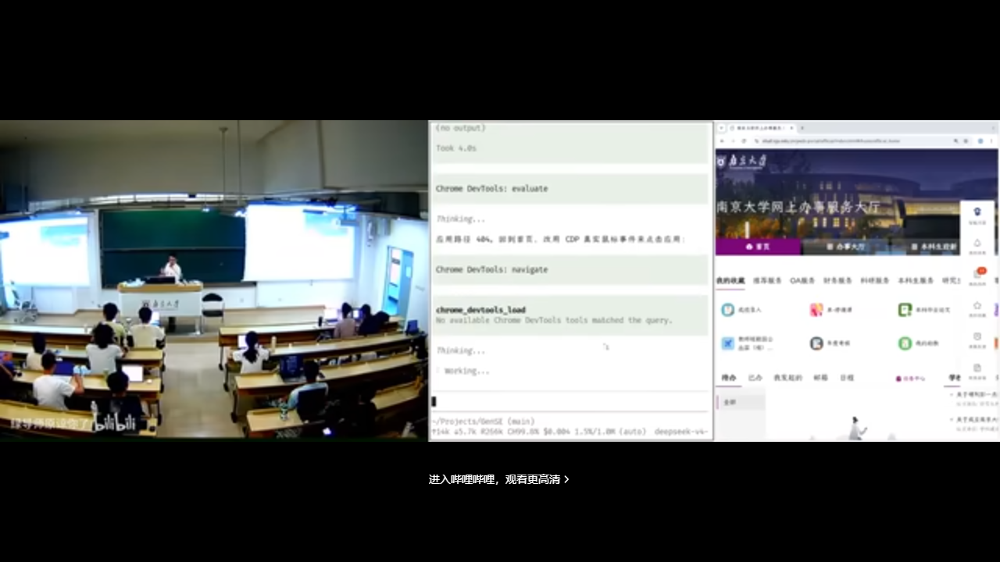

### 10.3 CS 从业者视角：知道边界在哪里

「如果你们只是用 agent 说『帮我把操作系统作业做了』，那你们真的是太小看它了。」

CS 从业者非常清楚编程能力的边界在哪里。普通人也很容易提出一个需求，但 agent 可能做不好、做不了。而 CS 的人知道：**怎么把需求「编译」成 agent 能做的任务——什么东西可以复用、什么应该以代码的形式复用、什么应该以 skill 的形式复用。**

---

## 11. 结语：古法编程已死，软件工程未死

<div class="prereq" data-label="你需要先知道">

- 建议至少浏览过本册前面各章标题
- 零基础也可读作第一讲小结

</div>

*(参考时间: 课程后段)*

课程希望重新找回「上课耽误学习」的感觉：你可能可以不上课，但要**去实践**。禁止古法编程——不是说你们不会手写代码，而是这个时代要求你学会**带着 AI 做更大的事**。

回到软件工程本身：大学里能教你的，比较重要的第一是**信息差**（你有别人不知道的信息，才能做别人做不到的事）；更重要的，是**怎样成为一个更好的人**——你能够驾驭别人驾驭不了的东西。

这门课试着帮大家建立**驾驭人工智能的能力**。

最终检验你大学阶段的，是那份交出去的简历：能不能带你到下一个更高的平台。希望你们在简历里写上：我在生成式软件工程里实现了 ABCDE——每一项都有链接，每一项都说得清设计与实现中了不起的地方。

---

## 附录：概念补给

给可能「只听过、没深究」的同学：每条尽量先说人话，再扣回本讲。

### 大语言模型（LLM）

- **是什么**：通过海量文本学会「预测下一个词」的 AI 模型。
- **课上为何出现**：整门课的工具底座；站在使用者视角，不必会训练。
- **和什么像**：超级会接龙的读书人；你给一段话，它接着往下写。

### Token

- **是什么**：模型处理文本的计费/计量单位，约等于「字或词片段」。
- **课上为何出现**：课程 policy「Token 自费」；省钱与生产资料的隐喻。
- **常见误解**：不是「一个汉字=一个 token」，中文常更碎。

### Prompt（提示词）

- **是什么**：你写给模型的自然语言指令。
- **课上为何出现**：装机、配终端、填表，很多事「一句话」就够。
- **和什么像**：给实习生的任务说明——说得越具体，越不容易做偏。

### Vibe Coding

- **是什么**：用自然语言驱动 AI 写代码的工作方式。
- **课上为何出现**：作业与实验的主形态；快乐与焦虑并存。
- **常见误解**：不等于「完全不管」；Intent 不清时 AI 很会生产空洞产出。

### Agent（智能体）

- **是什么**：能读上下文、规划步骤、调用工具并循环推进任务的 AI。
- **课上为何出现**：从「会聊天」到「会干活」的转折点。
- **和什么像**：不只会聊天的实习生，还能自己开电脑干活。

### AGENTS.md

- **是什么**：放在项目里、告诉 Agent「你是谁、项目是什么」的说明书。
- **课上为何出现**：课堂演示「它怎么知道这门课」。
- **和什么像**：工位上的新人入职手册。

### Skill（技能/插件）

- **是什么**：可复用的指令/流程封装，让 Agent 一键获得某种能力。
- **课上为何出现**：AI 时代的「开源脚本」；知识飞轮的积木。
- **和什么像**：手机 App：装上就会多一件事，不必每次从头教。

### Prompt Engineering / 上下文工程

- **是什么**：设计指令与整段模型可见输入，让输出更符合你要的结果。
- **课上为何出现**：GPT-4 时代要反复调；新模型更「一句话」，但原理仍在。
- **和什么像**：写清楚需求文档，而不是只喊一声「你看着办」。

### Subagent（子智能体）

- **是什么**：主 Agent 派出去、在隔离上下文里干活的分身。
- **课上为何出现**：make-slides 用多个 personality 各写一版，再汇总。
- **和什么像**：老师让几个助教分头备课，最后自己定稿。

### 幻觉（Hallucination）

- **是什么**：模型一本正经地编造不存在或错误的事实。
- **课上为何出现**：GPT-4 幻觉严重，但电镜比方恰好是对的——要会核对。
- **和什么像**：口才很好的朋友讲历史，细节未必都靠谱。

### Reward Hacking / Overfit 应试

- **是什么**：针对考核指标钻空子式优化，而不是真正变强。
- **课上为何出现**：高 GPA 可能仍要 reward hacking；简历才是最终考试。
- **和什么像**：刷题套路极熟，换一张卷子就不会了。

### 算力换智力

- **是什么**：多开子任务、多跑几版，用更多计算换更好结果。
- **课上为何出现**：make-slides 多 personality + 盲评迭代。
- **和什么像**：多请几个顾问各出方案，再开会定一个。

### 个人知识飞轮

- **是什么**：信息源 → 处理系统（skill）→ 有用知识 → 改流程，循环加速。
- **课上为何出现**：普通人如何在信息爆炸里建立复利。
- **和什么像**：健身 App：记录→分析→调整计划→再记录。

### 焦油坑（Tar Pit）

- **是什么**：项目越改越难维护、越投入越陷进去的泥潭。
- **课上为何出现**：后续 Lab 若只堆 AI 产出、不管架构，会掉进去。
- **和什么像**：房间越堆越乱，找东西越找越久。

---

*书架 Shelf 流水线生成 · 内容衍生自 B 站公开课程视频 BV1pb8o6yE8f*
