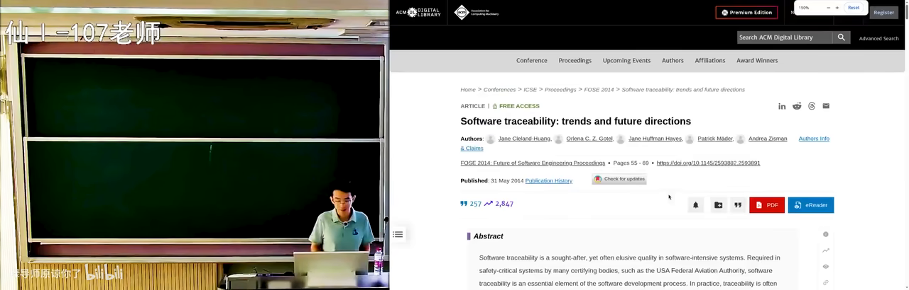
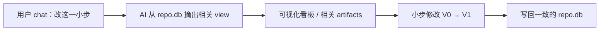
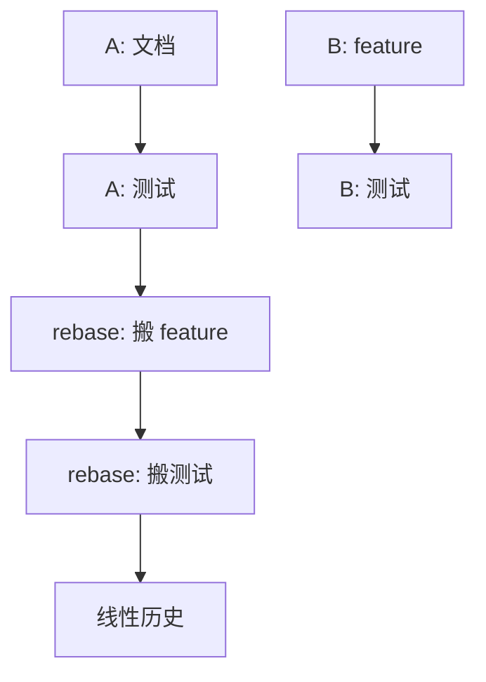
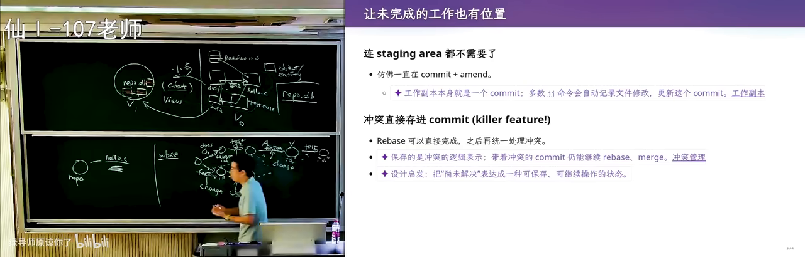
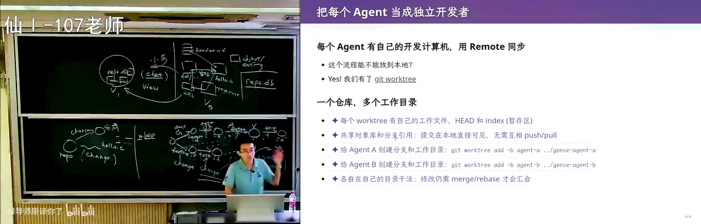
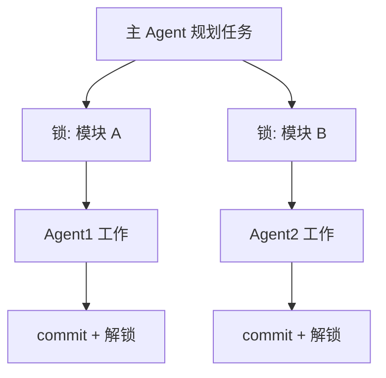
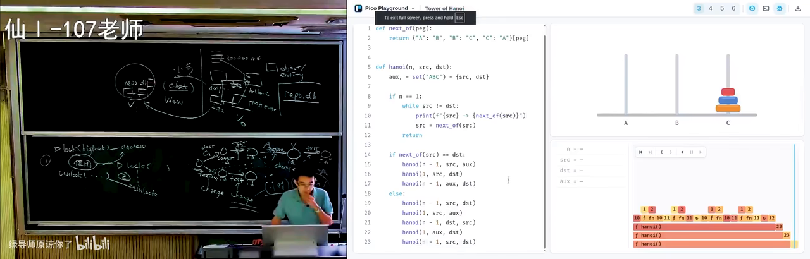
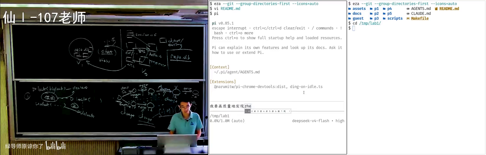
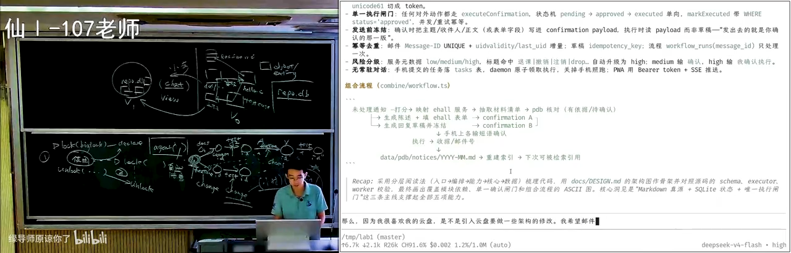

# 软件仓库管理（二）：从 Git 到 Agent 时代的版本控制

> **原视频**：[Bilibili · BV1Q6en6NEUo](https://www.bilibili.com/video/BV1Q6en6NEUo/)（时长约 98 分钟）
> **课程**：南京大学《生成式软件工程》（2026）第 04 讲 · Raw 版
> **整理说明**：由书架流水线根据视频字幕重构；口语已转为书面语；关键时间点标注 *(参考时间)*，截图可点击放大并跳转 B 站。

---

## 1. Lab1：会成长的个人助手

*(参考时间: 00:00)*

课程回顾了上周的软件项目管理内容，并发布了第一个选做实验（Lab1）——**会成长的个人助手**。

作业本身「不限实现方式」：想怎么做就怎么做，最好用 Vibe Coding 完成。课程会在课上留出时间，现场演示直接让 Agent 做一个，并指出其中的坑。

### 为什么要做这个实验

几乎所有任务都在 AI 的能力范围之内。但如果直接把实验要求丢给 AI，它一开始就会做出许多「看起来合理」的决定，而这些决定会让项目维护越来越困难，最终陷入软件工程里的**焦油坑**。

实验的真正目的，是让每位同学体验：

- 当 AI Slop 开始不断消耗 Token 时，你会下定决心删掉项目从头重做，或回退到很早期的版本；
- 下一个 Lab 会与本 Lab 强关联且有一定冲突——如果不认真做 Lab1，就没有完整的软件工程体验。


### 参考需求形态

个人助手可以承载多种「个人数据库」：

- 专业课资料（计算机网络、概率论等）；
- 研究组论文与文献；
- 个人信息（填表场景：姓名、学号、身份证号、简历等）。

在此基础上，还可以：

- 与学校邮箱关联，实现 always-on 的后台 Agent Loop；
- 用一两百元的嵌入式小设备在宿舍持续运行；
- 手机端联动（网页 / iOS / Android）。

主讲人现场展示了自己用 Agent 处理填表的效率提升——过去需要研究生三年做的自动填表系统，如今几乎是一句话的事。

---

## 2. 项目、Intent 与可追踪性

*(参考时间: 00:05:17)*

### 2.1 项目是什么

项目是各种文件的集合：intent、设计文档、README、spec、code implementation。主讲人不喜欢 AI 生成的超长 README；对他而言，README 只应写清楚：

- 设计的**初衷**；
- 想做一个什么样的产品；
- 产品能达到什么效果（可附截图）；
- 最重要的设计取舍。

类比：你有一个能挣一个亿的点子，要说服别人加入创业团队，只需要一份较短的 README——intent。剩下架构、实现、扩展性，由有相应能力的人补完。

层次可以概括为：

```text
Intent（我想做什么）
  → Spec（选型、结构、接口）
    → Code Implementation（实现）
```

### 2.2 文件系统是历史包袱

用文件系统管理项目，更多是历史原因：1950–60 年代操作系统只提供文件存储，关系型数据库尚未发明。程序员别无他法。

文件系统作为树状结构，**丢失了大量不适合用树表达的关联**。例如：

- 文档写「本项目用链表管理」；
- 代码后来改成树；
- 测试用例依赖旧行为。

文档、代码、测试之间形成关联，却没有被强行绑定。这正是**技术债（technical debt）**：随演进，不一致只会越来越多。

软件工程里对应的研究方向叫 **Traceability（可追踪性）**——在系统演进中维持测试、文档、代码之间的关联。



### 2.3 未来可能的仓库形态

如果未来几乎不再手写代码，软件可能不再是「一堆文件」，而是：

- 文档、实现、测试切成对象（object / entity）；
- 对象之间用关系连接（实现了、测试了、引用了）；
- 形成带环的图（graph），存进 `repo.db`。

人类无法用现有 Unix 工具维护这种仓库，但可以**用魔法打败魔法**：用强化学习反馈训练 AI 理解该图；每次小步修改（fix bug、改文档、加功能）时，AI 根据 chat 摘出相关的 view（视图），完成修改后再写回下一版本。



这里借用了数据库「视图」的概念：数据不变，用不同查询以另一种形式展示。

---

## 3. Git 深潜：Merge、Rebase 与 Change

*(参考时间: 00:22:53)*

### 3.1 Merge 的问题

Git 管理的是**目录快照**。开发者 A、B 可在两条线上独立提交，合并时用两路 merge：

- 产生有两个 parent 的 commit；
- 若 merge 由 A 完成，B 写的部分在冲突解决后 **ownership 可能归到 A**。

### 3.2 Rebase 的机制与风险

Rebase 试图把一侧的修改「搬到」另一侧之后，得到**线性历史**：

1. 把 B 的 feature 尝试接到 A 的历史后面；
2. 成功则继续搬 test；
3. 任一步冲突都需 resolve，且会**创建新的 commit id**（base 变了）。



麻烦在于：

- 进入 rebase 冲突模式时，人很容易懵；
- 每次 rebase 都生成新 id，历史被改写；
- 我们真正关心的是 **change（修改）**，Git 却用 commit 代替 change，没有专门的 change 对象。

### 3.3 Stash 与人的单线程假设

经典场景：改到一半（编译不过、测试不过），导师突然打电话要修更高优先级 bug。Git 的解法是 `git stash`——把工作区压栈。

再被打断一次，stash 栈就变深。在「古法编程」时代这尚可接受，因为：

- 人是 **single-threaded**：只有一双手、一张嘴、一对眼睛；
- 读与写不能同时发生（类似 shared memory 的 load/store）；
- 人类提交以小时计，团队沟通以天/会为单位，冲突概率低。

---

## 4. Jujutsu：把 Change 变成一等公民

*(参考时间: 00:28:40)*

如果把 **change 提升为 first-class citizen**，就接近下一代版本控制工具——**Jujutsu（jj）**。

### 核心特点

- 与 Git 底层兼容，可当 Git 用；
- 增加 change 概念：rebase 时搬的是 change，冲突可以「带下来」再 resolve；
- **没有 staging area**：你改一个字节，就像隐式做了一次 commit（并抹掉上一次未完成的提交）；
- 工作区永远处于「当前 change 已提交」的状态，不需要手动 `git add`。

```text
Git:  working tree → index → commit
jj:   working copy ≡ 当前 change（自动提交）
```

### 学习建议

- 上一代人形成 SVN 肌肉记忆，本代人形成 Git 肌肉记忆；
- AI native 一代应**先用更正确的设计建立肌肉记忆**，再回头理解 Git 为何如此；
- 可以把「从 change 理解版本管理」这样的 prompt 交给 Agent 辅助学习。



---

## 5. 为 Agent 重新设计版本管理

*(参考时间: 00:35:54)*

这门课是**生成式软件工程**，真正要问的是：在 Agent 时代如何再次重新设计版本管理。

### 5.1 为人设计的模型跟不上 Agent

| 维度 | 人类 | Agent |
|------|------|-------|
| 并发 | 单线程个体 | 可 10× / 100× 并行 |
| 提交粒度 | 10 分钟～小时 | 秒级原子提交 |
| 沟通 | 会、口头、文档 | prompt / 结构化消息 |
| 冲突处理 | 痛苦、易懵 | 可自动 resolve |

即便使用 Git worktree 等 workaround，本质仍是「为人设计的模型」。

### 5.2 多 Agent 协作的两种拓扑

**方式一：一人一机（严格类比人类）**

- 每个 Agent 独立容器 / 虚拟机；
- 克隆同一 remote；
- 主 Agent 负责协调与 inject prompt。

**方式二：Git worktree（更轻量）**

- 同一仓库多个工作树；
- `.git` 在 worktree 里可只是一个文本文件，指向共享的 git dir；
- 提交本地互相可见，无需反复 push；
- 冲突仍需 merge / rebase。

现场演示中，主讲人开了多个 tmux session 作为 coding agent，让它们并行工作；并让 Agent 把会话改到 worktree 上。



### 5.3 不再需要 blame

Git 为人设计的特性还包括 `git blame`：出问题时回溯是谁的 commit。

Agent 时代：

- Agent 不能被「开除」或「坐牢」；
- 同一模型的克隆体做同一件事，大概率收敛到相同结果；
- 历史价值从「谁写错了」变成「怎么把它修好」；
- 项目可以**大步向前**，快照仍保留（方向走错时可回退），但几乎不必「看过去」。

---

## 6. 从第一性原理看并发控制

*(参考时间: 00:55:36)*

### 6.1 Git ≈ 乐观并发控制

数据库里，事务（transaction）可先读、再算、再写；写时可能冲突或死锁，需 rollback。Git 的协作模型很像**乐观并发控制（optimistic）**：

- 假设事先开过会，各做各的大概率不冲突；
- merge / rebase 时再处理冲突。

教务系统选课是典型低冲突场景：每人读写自己的数据。

### 6.2 Agent 应更偏向悲观并发控制

操作系统课的并发是**锁**：访问可能冲突的资源前先 lock，release 后别人才能 lock。

Agent 动作极快时，乐观模型会更频繁触发冲突。更好的设计可能是：

1. 主 Agent 规划；
2. 对项目 scope（如文件级）**先上锁**；
3. 完成后 commit 并释放锁；
4. 其他 Agent 若所需资源被锁，则等待。

即便悲观，只要 Agent 数量足够多、不冲突的 scope 足够多，整体吞吐仍可很高——与操作系统里「细粒度锁下多线程仍可高效」同理。



---

## 7. 团队管理才是真正的难点

*(参考时间: 01:03:52)*

版本控制本质是工具。真正困难的是**进度与团队管理**。

- 若 AI 能一句话直出微信级产品，软件工程就「死了」；斩杀线暂未到这一层；
- 人月神话指出：人与人沟通关系是**平方级**上升；
- 最难招的不是码农，而是能把国民级应用拆成多个 team、并让十个 team 拼起来仍是一个产品的 leader。

你现在就可以把自己当成主 Agent：如何分解任务给多个 Agent？何时提交？何时合并？——把版本控制概念带进自己的开发流程。

### 汉诺塔的隐喻

课上穿插了一个带方向限制的汉诺塔变体（只能单向移动），用来说明：看起来简单的约束会显著改变最优策略。更重要的是产品思维——如何把这个「小学生考级题」做成可售卖的产品：可编辑 playground + 付费 AI 助教。



设计讨论中出现了一个反例：GPT 给出的「一个 API + 关系数据库 + 对象存储」是正常软件工程课答案，但主讲人不喜欢——因为本质需求是**版本管理**，用 Git 管理学生提交直到格式收敛，再迁移到数据库，往往更合理（Overleaf 导出为 git repo 同理）。

---

## 8. 现场翻车：Vibe Coding 从零做 Lab1

*(参考时间: 01:18:17)*

项目早期**不应直接上 multi-agent**。应先找能力最强的模型，多轮对话把 intent 对齐。

### 8.1 直接丢需求会发生什么

现场把 Lab1 需求直接丢给 Agent，观察其行为：

- 一线模型会进 plan mode，确认事实后生成 workflow；
- 但提示词里每一个词 self-attention 都会看到；模型已被训练成「prompt 的舔狗」，会**过度遵循**讨论稿式需求；
- 结果：满足了字面指令，却不是你想要的东西。



### 8.2 Intent 与实现的巨大 Gap

真正重要的言外之意是：

> 实现一个**持续为你工作的个人助手**。

对同学而言，第一个 feature 往往应是：**高效学习与复习**——自动收集外部信息、层次化归档、给出好界面。

而 Agent 一上来就在做 database、SMail、一一号对接……从 README 看每一步都「对」，最终却得到一个你不想要的系统，甚至像一个教务系统。

它甚至没有 `git init`——你不跟它讲，它就当一次性脚本。

### 8.3 正确的起步方式

1. **先创建空仓库**；
2. 想清楚下一步只迈**一小步**；
3. 不要一上来就上数据库：文件系统膨胀时再让 Agent 提炼 schema；
4. 人对文件目录的心智负担远低于 database schema。

主讲人自己的邮件 Agent 至今没有数据库：邮箱 → 共享云盘上的 email id 目录（含草稿、分类、是否垃圾邮件）→ 下一级流水线处理。

---

## 9. MVP 与可演进架构

*(参考时间: 01:32:40)*

更符合主流 best practice 的是从零构建时使用 **MVP（Minimum Viable Product）**。

> The biggest risk in product development is building something nobody wants.

MVP 逼迫你想清楚：**什么需求是绝对要的**。

### 好架构的标准

不是「当前实现了需求」，而是：

> 需求发生根本性变化时，架构能否以最少变化应对？

这是软件工程与操作系统/数据库课最不一样的地方：**对未来需求变化的应对**。

两种开发方式对比：

| 方式 | 过程 | 风险 |
|------|------|------|
| 大步快跑 | 上来大而全，拖着技术债加功能 | 维护泥潭 |
| MVP 演进 | 最小精巧架构，遇瓶颈再迁移 | 需克制过度设计 |

需求变更示例：希望邮件和资料都与云盘同步——检验现有架构是否需要摧毁性修改。



早期 prompt 对项目走向影响最大：直接丢 README 说「做个 MVP」，与「先讨论再写第一行代码」，结果天差地别。

---

## 10. 结语：版本管理要记住的三件事

*(参考时间: 01:29:46)*

无论古法编程还是 Agent 时代，版本管理本质做三件事：

1. **记住现在**——必须有 repository 把文件/工件管起来；
2. **记住历史**——删掉的东西还能捞回来，能看到如何演进到当前点、哪条路失败了；
3. **记住教训**——lessons 持续警示下一步该怎么迈。

从 SVN 的局限，到 Git 的局限，再到 Agent 时代的破局点：管理快照、版本、change，以及**飞快的 change**。

经典课程（操作系统、数据库、软件工程）里的概念会在生成式软件工程中反复出现：视图、事务、乐观/悲观锁、快照、可追踪性。学它们仍然有用——它们是你带着 AI 做 AI 做不到之事时的判断力来源。

下一讲将进入**软件架构与构造**。

---

*书架 Shelf 流水线生成 · 内容衍生自 B 站公开课程视频 BV1Q6en6NEUo*
