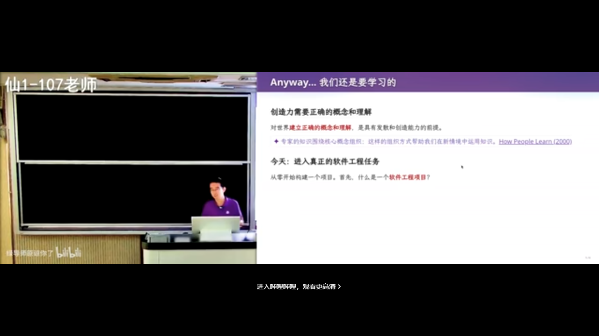
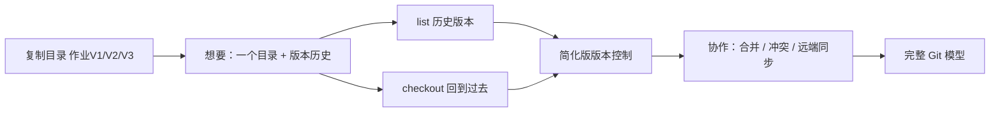
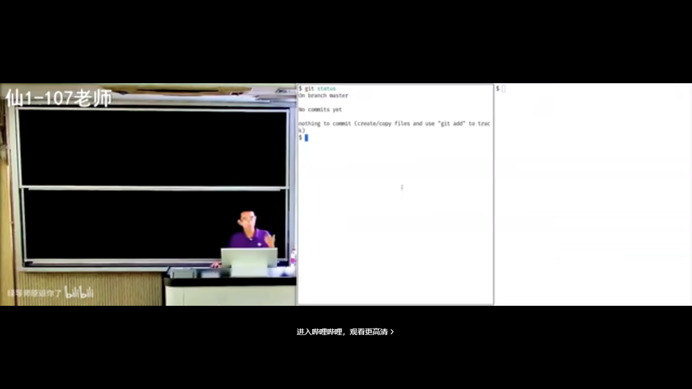
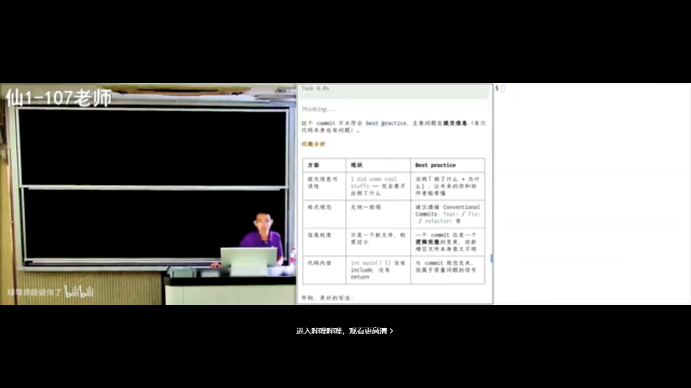
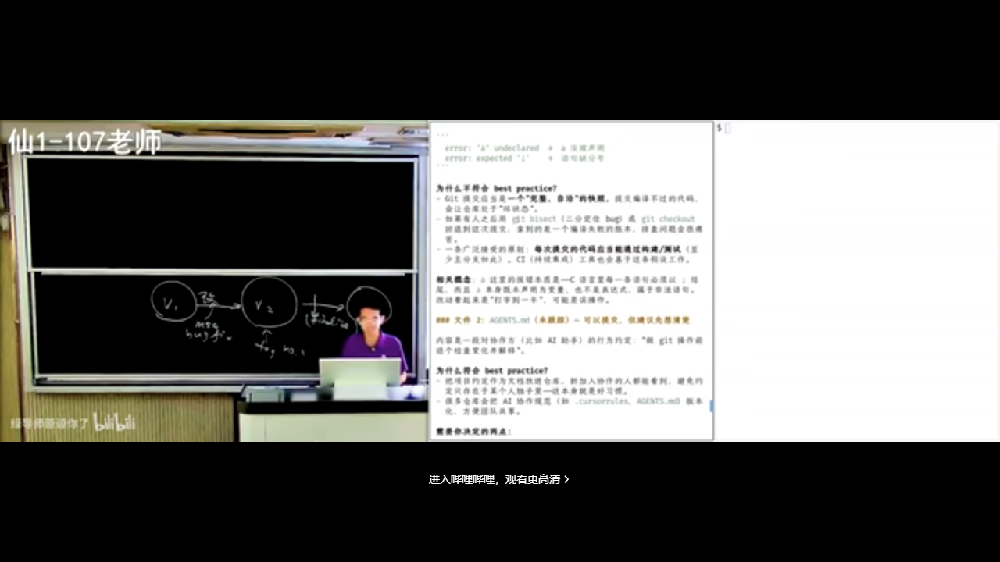
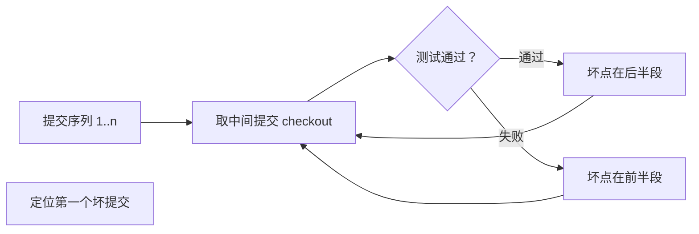
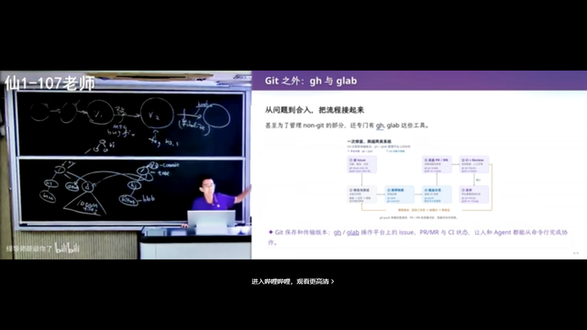
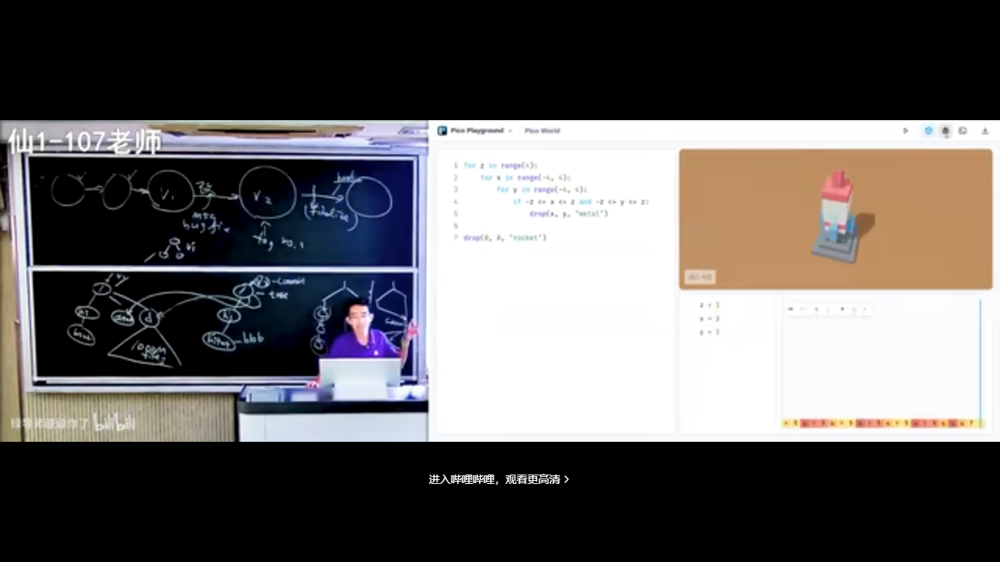

# 软件仓库管理：项目、文件与版本控制入门

> **原视频**：[Bilibili · BV1kybV6DE47](https://www.bilibili.com/video/BV1kybV6DE47/)（时长约 100 分钟）
> **课程**：南京大学《生成式软件工程》（2026）第 03 讲 · Raw 版
> **整理说明**：本书由视频语音转录后经 AI 重构而成，口语已转写为书面语，并修正了转录中的明显识别错误；关键时间点标注 *(参考时间)*，截图卡片可对应视频位置。

---

## 1. 开场：AI 时代为什么还要学软件工程

<div class="prereq" data-label="你需要先知道">

- 听说过 ChatGPT 一类「和 AI 对话、让它写代码」的工具即可
- 知道计算机专业会学操作系统、数据库等基础课
- 本章零基础可跟

</div>

*(参考时间: 00:00:00)*

课程先回顾了前几讲：把 AI 整合进生活流程，把真实意图告诉它，甚至可以把反复出现的流程沉淀成 skills。与此同时，模型本身也在快速迭代——主讲人提到 GPT-6 已发布，在复杂任务上更快、更省 token，编程能力有提升，但「工程品位」仍更多掌握在有经验的工程师手里。

### 1.1 Intent 空间：为什么 AI 会「跑偏」

主讲人指出，我们常觉得 AI 做得不好，往往不是它执行力不够，而是面对了一个非常开放的 intent（意图，你真正想做成什么）空间。

- 同样一句「做一个国民级应用」，不同产品经理脑中的画面完全不同；
- AI 无法与每个人的大脑直接对齐，只能按自己的方式漂移；
- 新一代模型写出的代码越来越紧凑，人越来越难 review——于是大家干脆「随它去，只要能跑对」。


图：主讲人开场讨论新模型进展。读者可关注：模型能力上去了，但「品位」与 Intent 对齐仍是人要做的事。

### 1.2 汽车类比：基础课还要不要学

有人问：AI 时代还要不要学数据库、操作系统？主讲人用汽车打了比方：

- **一百多年前**：汽车开十几公里就可能故障，司机必须懂工作原理；
- **今天**：在车库说一句「帮我开到某地」，自动驾驶就出发了——你已不必理解整条动力链。

AI 很像「更强大的汽车」，替代的不只是腿，还有部分智力。今天的答案仍然是**要学**：学了才能更好地解锁 AI 的创造力。至于以后该怎么学，主讲人坦言还在探索。

至少在现阶段，理解正确概念能帮你从别处借鉴知识、做出更好的东西。本讲由此正式进入**软件工程**：软件仓库怎么管、文件怎么组织、版本怎么记。

---

## 2. 项目是什么：从空目录到可交付物

<div class="prereq" data-label="你需要先知道">

- 会在电脑上新建文件夹、放几个文件
- 见过或打开过 GitHub / Gitee 上的项目网页
- 本章零基础可跟

</div>

*(参考时间: 00:09:03)*

开始 vibe coding（用自然语言驱动 AI 写代码的工作方式）或做软件工程时，第一件事往往不是从网上下载作业模板，而是**先建一个目录**，给它起个名字，然后往里放东西。

### 2.1 软件工程项目 = 一堆文件构成的可交付物

当你面对一个空目录时，怎么知道该放什么？常见路径是：

- 看老师打开的工程里有哪些文件；
- 点开同学推荐的 GitHub 链接，观察别人目录里有什么。

于是你意识到：一个软件工程项目，就是一个目录；目录里有一堆文件；这堆文件共同构成一个**可交付物**（最终能变成产品的那个东西）。

```text
项目目录
├── 意图 / 设计说明（intent）
├── 规格与接口（spec）
├── 源代码（implementation）
├── 测试与文档
└── （理想情况下）版本历史
```



图：从「建一个目录」开始谈项目。读者可关注：项目不只是代码，而是一整组相关文件。

### 2.2 localhost 玩笑与 Intent 写清楚

主讲人讲了一个著名笑话：有人说「GPT-6 太牛了，我又做出了 killer 级产品」——结果全是 `http://localhost:5137` 上的本地页面，别人根本打不开。

这背后是知识问题，也是 Intent 问题：

- 开发者默认流程是先在本机跑 development server，ready 后再部署到远端；
- 如果你在意图文档里写明「这个东西要被全世界看到」，AI 才更可能帮你部署；
- 你不说，它就按「本地调试」这个最常见假设走。

这些都是计算机专业课里反复出现的知识：编译、构建目录、命令行工具把 `hello.c` 变成可执行文件——它们最终都落在「目录 + 文件 + 可交付物」这个朴素模型上。

### 2.3 什么是软件

标准定义大致是：**代码、文档等一切与该软件相关之物的集合**。主讲人更愿意说：

> 软件是人类世界的需求，在信息世界里的一个投影；今天这个投影看起来就是一个目录。

没有软件，教室的投影、连升降桌都升不起来。你知道目录里该有什么——哪怕只有一个 `hello.c` 能编译出 `hello`——你就已经在做软件了。当然，这离现代软件工程的 best practice（最佳实践，前人踩坑后总结的推荐做法）还有距离。

---

## 3. 为什么要版本管理：从 U 盘到 Git

<div class="prereq" data-label="你需要先知道">

- 知道文件可以复制、压缩、发邮件
- 大致听说过 GitHub，不一定用过 Git 命令
- 本章可当作「版本控制是为了解决什么问题」的故事来读

</div>

*(参考时间: 00:13:45)*

### 3.1 U 盘悲剧与「作业 V1 / V2」

主讲人讲了自己第一位博士生的故事：大一时去机房编程，把代码存在 U 盘里来回拷；大二 U 盘坏了，代码与启蒙时期的作业全部丢失。

很长时间里，人们就是这样管理代码的：

- 打压缩包发邮件交作业；
- 复制目录：`作业V1`、`作业V2`、`作业最终版`、`作业最终版2`……

这种方式直观，也能「找回旧文件」，但问题很快暴露：协作同步困难、历史混乱、设备一坏全没。


图：在版本控制普及前，代码常靠 U 盘与复制目录保存。读者可关注：为什么「拷一份」不够。

### 3.2 从需求反推：你会自己发明 Git

从第一性原理出发，需求其实很清晰：

1. 项目是一堆文件，构成一个目录；
2. 我希望**项目级的时间回溯**：手滑改坏了，能回到上一个版本；
3. 我不想要十个作业目录，而想要**一个目录 + 一条命令**，能列出历史版本、能把当前状态切回某一版。



用着用着，你会自然遇到「和室友同时改同一个文件」——于是必须发明分支、合并、冲突处理。Git 的许多概念，都可以这样从需求长出来。

### 3.3 SVN 与 Git：补丁链 vs 快照

在 Git 之前，许多人用过 **SVN（老一代集中式版本管理，服务器上存的是改动补丁链）**，操作叫 check in / check out。

- SVN：存「变化」——每次改一行就存一个 patch（补丁）；
- 看似高效，但项目变大后，回到早期版本可能要一环一环往回退；
- Git：存**目录快照（snapshot，某一时刻整个项目目录的样子）**，模型更干净，切换版本往往一秒钟。

Git 的作者是 Linux 的作者 Linus Torvalds。1991–2002 年维护 Linux 时，社区曾用「作业 V1/V2 + 邮件列表发补丁」的方式，后来又试过 BitKeeper 等工具；2005 年，Linux 社区做出了 Git——比很多人想象的更年轻，设计目标是：**绝对简单、好用、概念正确**。


图：软件工程语境下，项目管理的标准答案是使用 Git。读者可关注：Git 不只保存目录，还保留、比较、恢复历史版本。

### 3.4 课堂更重要的是「学习意识」

主讲人反复强调：这门课上的具体命令不是全部，**学习意识**更重要。

打开一个 GitHub 项目时，你有没有留意：

- 有的项目有这个文件，有的没有；
- 有的 README 很短、链接清晰；有的是 AI 生成的超长 slop（AI 量产的、看起来像模像样却空洞或错误百出的内容）。

主讲人分享了一种学习方法——可称为 **virtually implement（先在脑中虚拟实现）**：

1. 看到问题前，先想「如果我来做，会怎么做」；
2. 再和眼前方案对比；
3. 若对方更好：问「为什么它能想到」；若你更好：惊喜，并考虑能否做成产品。

对比城市路牌也是如此：在某些城市，每个不确定路口都有清晰指示；在另一些地方则要自己找地图。好范例本身就是教材。读论文、学高数、学系统课，都可以用同一套「先自己推、再对照」的方法。

---

## 4. Git 入门：初始化、暂存与提交

<div class="prereq" data-label="你需要先知道">

- 知道终端 / 命令行可以敲命令
- 理解「项目是一个目录」
- 若完全没用过 Git，可先通读，再跟着敲一遍

</div>

*(参考时间: 00:24:39)*

有了 GitHub，分发代码变得空前方便——它已成 AI 时代基础设施之一（npm 等生态也托管在类似平台上）。面试时问「什么是 Git」，多数人能说「下载/分发代码」「管理目录快照」；但更值得追问的是：**merge 发生冲突后你会观察到什么？**

### 4.1 冲突现场长什么样

如果老师更新了作业，而你本地已改得面目全非，如今可以让 Agent 自动修好。但作为学生，冲突时停一秒去看，收获很大：

- 文件里会出现许多 `=======`、尖括号、`incoming` 一类标记；
- **冲突并不是系统自动消失**，而是把责任交到你手上；
- Git 的设计原则类似地铁指示牌：**发生事情的地方，尽量把相关信息都摆在那里**；
- 两边冲突代码会同时显示；在 IDE 里还会有 Accept Incoming Change 等按钮；
- 你决定谁进谁出后，再创建一次 commit（提交，给项目当前状态拍一张带说明的快照）把冲突 resolve（解决）掉。

设计者不能在冲突时直接「躺平不合并」——那对人负担太大；把双方内容与上下文摆在冲突处，是第一性原理的体现。

### 4.2 从零开始：git init 与基本命令

演示从空终端开始：

```bash
mkdir my-cool-game
cd my-cool-game
git init          # 初始化仓库，生成隐藏的 .git 目录
# 写一个 hello.c …
git add hello.c   # 把文件放入暂存区
git status        # 查看工作区 / 暂存区状态
git commit        # 提交，并写清这次改了什么
```



图：`git init` 之后，项目成为被 Git 管理的仓库。读者可关注：`.git` 目录默认隐藏，却是全部历史所在。

命令本身不难：clone、pull、push、add、commit 就能「用起来」。真正水面下的冰山，是大量 **best practice**——每一条背后往往是血和泪的教训。

### 4.3 学会追问：这符合最佳实践吗？

面对新鲜工具，可以养成习惯：操作完问 AI 一句——「我刚才做的符合 best practice 吗？」

主讲人故意做了反面教材：提交信息写成 `I added some cool stuff`，完全看不出做了什么。AI 会指出：

- 提交信息毫无信息量；
- 应用祈使句、现在时，描述变更动机，例如 `fix off-by-one in header length check`；
- 可参考 **conventional commits（约定式提交，用固定前缀规范 commit message）** 等社区规范。



图：让 AI 检查 commit message。读者可关注：Git 存的是快照，但项目本质是「从 V1 经修改到 V2」，message 要能讲清改了什么。

Git 鼓励你在 message 里写清改动：修了多少 bug、加了什么需求、经历了什么重构——顺着 message 能读出项目的历史轨迹。若一万个提交全是 `I did some cool stuff`，message 这个特性就不该存在。

---

## 5. 提交的艺术：规范、忽略与钩子

<div class="prereq" data-label="你需要先知道">

- 会 git add / git commit，或至少知道提交是什么
- 见过 `.gitignore` 这个词更好，没有也可先学
- 理解「编译产物」vs「源代码」即可

</div>

*(参考时间: 00:41:00)*

### 5.1 空提交、Tag 与「我要发版了」

Git 通常拒绝无修改的提交，但 Agent 知道可以用 `--allow-empty` 等方式强行提交。空提交偶尔有用：

- 无代码改动时触发 CI（持续集成，代码一推就自动构建/测试的流水线）；
- 标注「为了 V0.1 freeze 所有东西」这类 finalize 语义。

更常见的做法是打 **tag（标签）**，例如 `v0.1`。空提交不能滥用。

### 5.2 不该进仓库的东西

主讲人演示了另一种坏味道：`git add .` 把一切塞进仓库。AI 会按严重程度批评：

1. 提交信息毫无信息量；
2. 提交粒度与内容混杂；
3. 编译产物（如 `hello` 可执行文件）根本不应进版本库，应写入 **`.gitignore`（告诉 Git 哪些文件不要纳入版本库的清单）**。

原因很实际：

- 每个人环境不同，编译出的二进制往往带日期、hash、本机指纹，**即使是同一份源码也可能不一样**；
- 把二进制放进仓库，合并时会出现几乎无法自动合并的冲突；
- 项目一大、协作者一多，仓库会膨胀到不可维护。

但规则并非绝对：有些 generated file（如某些 lockfile、为方便编译而生成的 header）**可以**提交，让别人在缺少完整工具链时仍能构建。


图：常见工程事故——把编译产物、日志、个人配置（甚至 API Key）提交进仓库。读者可关注：`.gitignore` 与「什么该进版本库」。

### 5.3 导师的「高血压」清单

新同学进组时，研究仓库里常见问题包括：

- `dist/`、`log/` 等生成目录被提交；
- VS Code 等个人配置、甚至写死的本机路径；
- 仍处于 active 状态的 API Key；
- macOS 的 `.DS_Store`（Finder 记录「哪些子目录展开过」的索引文件，点开头所以默认隐藏，`git add .` 时容易被误收）。

大模型出现之前，有人专门研究「Git 项目是否满足 best practice，并在违规时告警」；现在模型可以耐心检查、解释、甚至附上 emoji 安抚情绪——对学习者反而是好事：不必等到导师黑着脸批评，也能知道错在哪。

### 5.4 Hooks：在提交前后自动检查

**Hook（钩子）** 是在 Git 操作某个节点自动触发的脚本，例如 `pre-commit`。Agent 工具（Claude Code、Codex 等）也支持 hook，比如「Agent 需要你输入时叮一声」。

工程标准更高的项目会在 hook 里做几十条检查规则。主讲人还讨论了细节品味：规则名该全大写还是小写？功能上都对，但约定与一致性本身有价值。AI 甚至能引用 RFC，解释为什么固定标识符常用全大写。

在学习 Git 的过程中，对每一个细节多问一句，长期收益极大。

### 5.5 为什么要及时、小步 commit

- 小项目初期，一次提交两三千行或许没事；
- 项目变复杂后，一次巨型 commit 可能 break 多处，再引入多个 fix，历史会变成「V2 引入的」一笔糊涂账；
- **小步提交**则「冤有头债有主」：bug 与修复可以配对，便于审计；
- 及时 commit 并 push，电脑物理损坏时远端仍有备份。

AI 也很清楚这些：可以 review、revert、bisect；它甚至会建议「编译不过不要提交」——因为提交应是**完整自洽的快照**，坏代码会让仓库处于坏状态。

---

## 6. 冲突、Blame 与二分：用好历史

<div class="prereq" data-label="你需要先知道">

- 知道 Git 有一串提交历史
- 听说过「排查 bug」「是谁改坏了」这类问题
- 二分查找若没学过，可先当「每次排除一半」来理解

</div>

*(参考时间: 00:52:30)*

历史不只是纪念品，而是排查工具。

### 6.1 git blame：这一行是谁改的

`git blame（查某一行代码是在哪一次提交、由谁改的）` 会标出文件每一行的来源提交与作者。它常被理解成「追责」，工程上更常用的是：**定位引入问题的上下文**，然后去读那次提交的 message 与 diff。



图：对源文件执行 blame 后，每行对应到具体提交。读者可关注：历史如何变成可查询的数据。

### 6.2 git bisect：对历史做二分查找

把提交历史想成一个长数组：某些提交「测试通过」，从某一刻起开始「失败」。若你有一个能检出 bug 的测试用例，就可以对整个历史做二分查找（bisect），找到**第一个坏提交**。



这正是「前缀全 0、后缀全 1 的数组里找第一个 1」。历史被拆得越清楚（小步、原子提交），bisect 越好用。

### 6.3 交给 Agent 时也要有概念

Agent native 的一代可能不再手敲 `git status`，这像「古代手艺」。但你仍需要概念：Git 能干什么、什么时候该 commit、message 该怎么写、什么不该进仓库。

否则你分不清：是你自己会，还是完全脱节、离了 Agent 就不会。课上的建议是：

- 关键操作前，逐个检查文件变化；
- 让 Agent 按 best practice 干活，同时追问它为什么这样做；
- 把每次提交都当成可审计的完整快照。

---

## 7. Git 底层：对象模型与可视化

<div class="prereq" data-label="你需要先知道">

- 用过或学过 git add / commit / branch 的基本概念
- 知道「目录树」「指针」这类词（没学过也可看图理解）
- 数据结构课的「持久化」不是必须

</div>

*(参考时间: 01:03:08)*

纸面命令学完后，值得问一句：Git 真的是这样实现的吗？

### 7.1 持久化的目录树

Git 可以看成一种**持久化数据结构**：它持久化的是项目的**目录树**。

关键直觉：创建 V2 时，**不需要复制整棵树**。

- 假设只有 `b.txt` 变了，就为新 `b.txt` 创建新对象；
- 从该文件到根的路径上的节点需要新版本（因为子指针变了）；
- 未改动的子树（如 `a.txt`、目录 `d/`）用**指针**指回旧对象即可。

```text
V1:  root ──► tree ──► a.txt, b.txt(old), d/
V2:  root' ──► tree' ──► a.txt（指针复用）
                      ──► b.txt(new)
                      ──► d/（指针复用）
```

因此即便项目有百万文件、目录并不深，每次快照也只需很小的增量。

### 7.2 三类对象：blob、tree、commit

`.git` 目录里是带 hash 索引的 **objects**，主要是三类：

| 对象 | 是什么 | 作用 |
|------|--------|------|
| **blob** | 字节序列（binary large object） | 存文件内容 |
| **tree** | 目录节点 | 记录权限位、文件名 → blob / 子 tree |
| **commit** | 提交节点 | 指向一棵 tree，并记录父提交、作者、message |

**分支**本质上也是一个文件（如 `refs/heads/A`），内容是一个指向某 commit 的指针；**HEAD** 则是指向「当前分支指针」的指针。


图：`.git` 中的真实对象。读者可关注：快照不是整目录复制，而是对象 + 指针构成的图。

### 7.3 可视化学习：从模拟器到 live 仓库

经典工具 Learn Git Branching 用动画模拟 status、commit、checkout 等，帮助建立心智模型。

今天还可以更进一步：用 vibe coding 做一个**直接读真实 `.git`** 的可视化工具——不是模拟，而是解析磁盘上的 object，展示 blob 的字节与解压内容、tree 的 mode（如 644 / 755）与指针、commit 的双亲。


图：可视化 Git 工作原理。读者可关注：分支是指针，冲突时 Git 会保留 base/ours/theirs 等多份现场。

现场还演示了：

- 创建分支后，`refs` 文件与树结构如何变化；
- merge conflict 时，Git 悄悄保留多个版本；
- resolve 之后产生**两个 parent** 的 merge commit，指针关系被正确保留。

用 AI 做出这类工具本身也是极好的学习：边生成、边对照对象模型，知识会爆炸式增长。

---

## 8. 用 Agent 学 Git：从规范到项目组织

<div class="prereq" data-label="你需要先知道">

- 知道可以用自然语言让 AI 写代码、做可视化
- 读过本册第 4–5 章关于 commit 规范的内容更好
- 架构经验不足也可先听流程

</div>

*(参考时间: 01:18:14)*

主讲人展示了更多「AI 直出」的教具：给小朋友用的极简 Python 环境、汉诺塔与递归可视化、排序动画、类似 3D 打印的积木世界等。代码质量可以是 slop，但**架构**值得把关。

### 8.1 为什么细节仍然值钱

求职市场上，「把细节做好」的 bar 会不断提高：一旦有人学会了，招聘方就会用同一标准衡量所有人。

- 问研究生「git merge 之后会发生什么」，若毫无概念；
- 对比另一位同学：在 AI 辅助下，每门专业课都真正消化概念、能从零构建——

两者的竞争力显然不同。上课「耽误学习」的现象部分存在：课外信息密度已超过课堂；成熟的 GitHub 项目往往是工程师十几年心血，包含重构与教训。传统教学很少教「怎么用好这些高密度信息」。

### 8.2 Conventional Commits 与一致性

社区已有 **conventional commits** 等短规范，例如提交前缀：

```text
feat: 新增功能
fix: 修复缺陷
docs: 只改文档
```

常见形式还包括 scope 与正文：`type(scope): summary` + 空行 + body。文档排版上，中英文之间的空格等约定看似琐碎，却关乎**一致性**——工程细节是为人在更大项目中维护而存在的。

AI 也会漂移：前面 message 全是英文「一行 + 详细解释」，后面开始中英混杂。你可以用 Agent 帮你守住约定。

### 8.3 GitHub CLI 与 Agent 长任务

项目托管在 GitHub / GitLab 上时，Agent 常尝试调用 `gh` / `glab` 一类 CLI。因为 Git 管的是代码快照，而 **issue、评论** 等并不随 Git 做持久化，需要平台 API。

装好 `gh` 后，可以在 Agent 里设定长任务目标，并要求：

- 小步提交、可审计的提交；
- 明确的分支规则与（可选）线性历史；
- 遵循团队协作文档（如 `AGENTS.md` / 协作规则：何时禁止调用视觉模型、何时用旁路浏览器看结果等）。



图：Agent 长任务下的提交历史。读者可关注：大量可审计的小提交，以及人对规则的把控。

### 8.4 先设计架构，再开多个 Agent

主讲人的项目管理经验：

1. **架构设计阶段用单线程**，找智力较强的模型充分讨论——设计不好，后面是无穷迭代；
2. 把组件接口定好：例如可视化中的 trace 设为程序的 pure function（纯函数，同样输入永远同样输出、无副作用），全局状态集中注册，核心共享状态只有十几行；
3. 要求 Agent **只看接口、禁止看库函数实现**，token 极省；
4. 架构定稿后，再开多个 terminal 上 Agent，哪里不满意就指出，肉眼看着产物逐步变好。



图：多组件 playground 的架构把控。读者可关注：接口与共享状态先收敛，实现才能交给 Agent 并行。

---

## 9. 总结：用原子改动推进软件项目

<div class="prereq" data-label="你需要先知道">

- 建议至少浏览过本册第 2–6 章标题
- 零基础也可读作全书小结

</div>

*(参考时间: 01:33:30)*

主讲人总结：这门课表面在讲 Git，本质在讲软件工程与 best practice。今天要记住的一句话是：

> 把项目组织成用 **atomic change（原子改动，一次只做一件事、可独立理解与审计的修改）** 推进的快照序列。

### 9.1 从这句话推出一切

- 管理很多小快照，才能随时开分支做尝试：失败则安全丢弃，成功则合并进来；
- 可以并行推进多条主线，以合并方式完成而不互相干扰；
- 人类无法一次处理一团混沌——需求要分解成可理解、可审计的小任务；
- 出问题可以 bisect、blame；冲突也更容易解决（不冲突的小步仍可合并）。

做大作业时若「古法」同时改多处，改着改着就乱；小步原子提交则让历史可追责、可回滚、可审计。

### 9.2 Linear history 与工具链

更严肃的项目常要求 **linear history（线性历史，提交像一条直线，而不是分叉又合并的网）**：

- merge 可以产生双亲 commit，世界可以反复分叉合并；
- 但 AI 时代 resolve / rebase 都更容易，许多团队强行保持线性；
- 线性历史更易追溯，对 cherry-pick（挑拣某次提交）与 blame 更友好；
- 记录拆分得好，AI 维护项目也更省 token。

### 9.3 下一讲预告

如果 Agent 快了一千倍，我们还怎样做版本控制？这是下一讲的议题（更偏 Agent 时代的版本模型与 Jujutsu 等）。本讲请先把「人用的」仓库管理概念建立起来：项目是文件集合，版本靠快照与原子改动推进，工具是 Git，规范靠 best practice 与持续追问。

经典课程里的概念会在生成式软件工程中反复出现：快照、提交、分支、合并、忽略规则、可审计的历史。学它们仍然有用——它们是你带着 AI 做判断时的底气。

---

---

## 附录：概念补给

给可能「只听过、没深究」的同学：每条尽量先说人话，再扣回本讲。

### 版本管理 / 版本控制

- **是什么**：记录文件随时间怎么变，便于回退、对比、多人协作。
- **课上为何出现**：整讲主线；从 U 盘、复制目录、SVN 讲到 Git。
- **和什么像**：游戏存档、网盘历史版本。

### 仓库（Repository）

- **是什么**：项目连同其版本历史一起存放的地方；本地往往是含 `.git` 的目录，远端则是 GitHub 上的副本。
- **课上为何出现**：`git init` 之后，空目录才成为「可回溯的项目」。
- **和什么像**：不仅存现在的照片，还存整本相册的时间线。

### 快照（Snapshot）

- **是什么**：某一时刻整个项目目录的样子；Git 用对象 + 指针高效保存，而非每次全量复制。
- **课上为何出现**：Git 与 SVN「补丁链」的关键差异；也是对象模型的出发点。
- **常见误解**：不是把整个文件夹拷贝 N 份，未改动子树会被指针复用。

### Commit（提交）与 Commit Message

- **是什么**：提交是一次带说明的快照；message 用人类语言写清这次改了什么、为什么。
- **课上为何出现**：最佳实践的核心；`I added some cool stuff` 被当作反面教材。
- **和什么像**：存档时写一行「今天打过了哪关」，而不是只有存档编号。

### 暂存区（Staging Area / Index）

- **是什么**：`git add` 之后、`commit` 之前，决定「下一次快照里有哪些改动」的中间区。
- **课上为何出现**：命令演示里 status / add / commit 的关键一环。
- **和什么像**：寄快递前先把要寄的东西摊在桌上挑一遍。

### `.gitignore`

- **是什么**：一份清单，告诉 Git 哪些路径不要纳入版本库（日志、构建产物、个人配置等）。
- **课上为何出现**：`git add .` 事故与「高血压」清单的解法。
- **常见误解**：不是「删除文件」，而是「从一开始就不追踪」。

### Merge（合并）与 Conflict（冲突）

- **是什么**：merge 把两条开发线接到一起；两边改了同一处且无法自动决定时产生冲突。
- **课上为何出现**：面试追问「冲突后你会看到什么」；现场展示标记与 resolve。
- **和什么像**：两个人改同一份 Word 文档，修订痕迹叠在一起，要人工定稿。

### SVN

- **是什么**：上一代集中式版本管理，服务器上主要存「改动补丁链」，客户端 check in / check out。
- **课上为何出现**：说明 Git 为何选择「快照模型」——回溯更干净。
- **和什么像**：只寄「增补页」的档案室 vs 每次寄「完整一页」的相册。

### Git 对象：blob / tree / commit

- **是什么**：blob 存文件内容；tree 存目录结构与指针；commit 指向一棵 tree 并记录父提交与说明。
- **课上为何出现**：解释「大项目为何快照仍很小」以及可视化演示。
- **和什么像**：blob=照片文件，tree=相册目录页，commit=带日期与备注的封面。

### Branch（分支）与 HEAD

- **是什么**：分支是指向某个 commit 的指针；HEAD 是指向「你当前在哪个分支」的指针。
- **课上为何出现**：可视化里 `refs/heads/*` 的真实含义。
- **和什么像**：书签（分支）夹在某一页；HEAD 是「你现在正拿着哪个书签」。

### git blame

- **是什么**：查看文件每一行分别由哪次提交、哪位作者引入。
- **课上为何出现**：把历史当排查工具，而不只是追责工具。
- **和什么像**：作业批改时标出「这句是谁写的、哪天写的」。

### git bisect

- **是什么**：对提交历史做二分查找，用测试结果定位「第一个坏提交」。
- **课上为何出现**：小步提交的直接收益——历史可被二分。
- **和什么像**：猜数字游戏：每次排除一半可能性。

### Best Practice（最佳实践）

- **是什么**：社区在真实项目中踩坑后形成的推荐做法（小步提交、清晰 message、忽略产物等）。
- **课上为何出现**：本讲明示「表面讲 Git，实际讲 best practice」。
- **和什么像**：交通规则——不是法律考试重点，但上路必须知道。

### Conventional Commits

- **是什么**：约定式提交规范，用 `feat:` / `fix:` 等前缀 + 可选 scope 统一 message 格式。
- **课上为何出现**：AI 与团队协作时，格式一致才利于工具解析与人读历史。
- **和什么像**：邮件标题统一写「【请假】【报销】」，方便检索与分拣。

### Hook（钩子）

- **是什么**：在 Git 或 Agent 工具的特定事件点自动执行的脚本（如 pre-commit 做检查）。
- **课上为何出现**：工程标准更高时的自动门禁；也可给 Agent 配提示音。
- **和什么像**：门禁闸机：刷卡（commit）前先自动查一遍证件。

### Atomic Change（原子改动）

- **是什么**：一次提交只做一件可独立理解、测试、回滚的事。
- **课上为何出现**：全讲总结句——项目应被组织成由原子改动推进的快照序列。
- **和什么像**：乐高按「一块一块」说明书步骤拼，而不是把整袋零件倒进模具。

### Linear History（线性历史）

- **是什么**：提交记录近似一条直线，少用（或整理掉）分叉合并形成的网状结构。
- **课上为何出现**：严肃项目与 AI 维护场景下的常见要求；利于追溯与 blame。
- **常见误解**：不是「禁止开分支」，而是主线历史尽量保持线性可读。

### Intent（意图）与 Spec（规格）

- **是什么**：Intent=你想真正解决什么；Spec=做成什么样、接口与选型怎么定。
- **课上为何出现**：localhost 玩笑说明「不说清楚 Intent，AI 会按默认假设走」。
- **和什么像**：先说「我要去火车站」（Intent），再定「地铁还是打车、几点走」（Spec）。

### localhost

- **是什么**：指「本机」的网络地址（常为 127.0.0.1）；`localhost:5137` 上的服务只有你自己能访问。
- **课上为何出现**：AI 默认本地调试，不部署别人就打不开。
- **和什么像**：在自家厨房做了一桌菜——邻居闻不到，除非你端出去。

*书架 Shelf 流水线生成 · 内容衍生自 B 站公开课程视频 BV1kybV6DE47*
