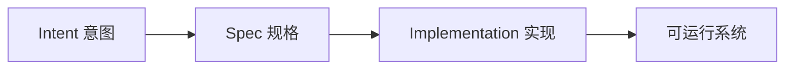
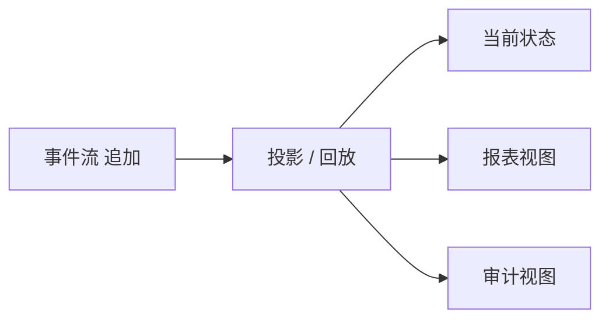

# 需求和架构（一）

> **原视频**：[Bilibili · BV1Rch76WEfQ](https://www.bilibili.com/video/BV1Rch76WEfQ/)（时长约 97 分钟）
> **课程**：南京大学《生成式软件工程》（2026）第 06 讲 · Raw 版
> **整理说明**：本书由视频语音转录后经 AI 重构而成；口语已转为书面语；关键时间点标注 *(参考时间)*，截图卡片可跳转视频对应位置。开场约十五分钟音频质量较差，内容以可辨识部分为准。
>
> **读前提**：架构（architecture：把系统复杂性分解、隔离的结构设计）是本讲后半主线；正文会给出机制、例子与限制。

---

## 1. 引言：Intent、Spec 与会回流的错误

<div class="prereq" data-label="你需要先知道">

- 知道软件开发大致是「想清楚 → 写设计 → 写代码」
- 读过本册第 05 讲（软件工程的来龙去脉）更好
- 本章零基础可跟

</div>

*(参考时间: 00:00)*

上一讲从软件危机讲到软件工程的诞生。本讲进入两件更「日常」却更难的事：**需求** 与 **架构**。这里先建立全课两把钥匙：

- **数据依赖**（制品之间直接或间接的依赖关系，决定错误会传播到哪里）：需求、设计、代码、测试并不是孤立文件；
- **可追踪性**（需求、设计、代码与测试之间可交叉核对的对应关系）：改动时能否说清「影响了谁」。

经典文献（Royce 等人）勾勒的路径，到今天仍然是许多团队的默认想象：



我们希望：先有 intent，再走向 spec，最后走向 implementation，最终产出软件。但真实工程里，这三段并不是单行道，而是布满 **制品之间的数据依赖（artifacts 之间直接或间接的依赖关系，决定错误会传播到哪里）**。


### 1.1 错误会沿着依赖网络回溯

关键机制是：

1. 每个阶段都会产出「制品」：需求文档、设计说明、接口、代码、测试；
2. 制品之间互相引用——测试对应设计，设计对应需求；
3. **后期才暴露的错误**，往往会一路回推到前序的需求或设计；
4. 一旦上游要改，下游大面积受污染，重做成本急剧上升。

也就是说：写代码写到一半发现「需求理解错了」，不是改几行字的事，而是整条 **数据依赖** 链上的规格、接口、用例都要跟着动。这正是软件工程强调「把 intent–spec 做对」的原因——早期便宜的决策，在依赖网络里会被放大。


> 开场后半段音频翻车（官方章节标注「后半音频翻车」），以下以中后段完整录音为准。

---

## 2. 需求工程：把说不清的事说清楚

<div class="prereq" data-label="你需要先知道">

- 知道「用户说的」和「系统要做的」常常不一致
- 本章零基础可跟

</div>

*(参考时间: 00:15:03)*

### 2.1 可追踪性：需求说明书的骨干

需求工程（Requirements Engineering：把客户想要什么调研清楚，并写成可实现、可验收的文档）的核心不是「写一份漂亮文档」，而是建立 **可追踪性（traceability：需求、设计、代码与测试之间可交叉核对的对应关系）**。

理想情况下：

- 每个测试用例都能追溯到某条设计决策；
- 每个代码片段都能说出「为什么存在」；
- 要改需求时，能查清「会影响到谁」。

课堂强调：需求说明书应使用**带语义的编号 ID** 来建立追踪链，而不是靠自然语言长句。例如：

```text
REQ-17  本科生准出：必须满足 A 或 (B 且 C)
DES-4.2 规则引擎如何求值 REQ-17
TC-11   拆课前旧路径仍可通过的验收
```

人脑很难对齐一长段散文；编号 + 短句 + 交叉引用，才能让「改动影响面」变成可计算的问题。


### 2.2 软件「不软」：细微差错也会致命

主讲人反复用一个反差：物理世界里的「软材料」可以弹回；**软件是纯粹逻辑制品**，容不下细微差错——少一个分支、差一个条件，行为就完全走偏。

- 程序每一步在语言定义下都有确定含义（形式语义：操作在规范下的精确含义）；
- 因此「差一点点」在软件里往往等于「全错」；
- 极端环境下，宇宙射线可能造成 bit 翻转；数据中心也会出现 silent error（结果错误却不报错）——运行环境无法被完全预见，所以验证与兜底必须做在软件里。

这与刷题不同：竞赛题假设题目是对的；真实软件面对的是**不可完全预见的世界**。

### 2.3 教务系统：需求为什么会爆炸

贯穿全课的范例是**教务系统**。它不是「一个选课表」，而是长期演进的业务系统：

- 选课、调课、准出、替代课、转专业、慕课班次……不断叠加；
- 后加功能（例如在线课程）会拉出一整条新规则；
- 可称为**史诗级需求爆炸**。

需求工作的本质，是无尽地与客户沟通，把「想要什么」想到界面控件级别：哪个按钮、什么文案、失败时提示什么。AI 可以协助从真实系统里探索、生成含调研方法、证据边界、用例与术语文档的**需求说明书草稿**，但「什么算满足」仍要人拍板。

### 2.4 案例：拆开一门离散数学

把「离散数学」拆成上、下两门课后，毕业准出规则立刻出现裂缝：

- 旧规则：修完一门即可；
- 新事实：课拆成两门；
- 衔接问题：新旧学期学生如何认定；
- 系统里要增加逻辑：「选修了旧课 **或**（新课上 **且** 新课下）」等。

这说明：需求变更不是改一句文案，而是**业务规则、历史数据、认定逻辑**一起动；这就是技术债（早期决定带来的后续维护负担，像债务一样累积利息）最直观的形态。


### 2.5 技术债与「没有银弹」

- 每一次 **MVP**（最小可行产品：优先实现最重要功能、可走完流程的切片）、每一次「先这样吧」的需求决定，都会背上技术债；
- 决定一旦进入上下文，后续所有需求都**带着历史**；
- 需求永远不可能一次说清，也**不是一成不变**的；
- 软件上线后与物理世界交火，早期决策的维护成本会持续变糟——**没有银弹**。

AI 时代并没有取消技术债，只是把「写代码」变便宜了；**边界划清 + validation（验证）** 才决定能不能信任 agent 铺开实现。因此需求、产品设计、架构这三段会成为撬动软件生产力的真正杠杆。

与之配套的工程习惯是 **MVP**（最小可行产品：优先实现最重要功能、可走完流程的切片）：先验证边界与规则是否站得住，再铺开实现，而不是一次性生成「看起来很全」的系统。

---

## 3. 无处不在的架构

<div class="prereq" data-label="你需要先知道">

- 知道软件可以拆模块、定接口
- 本章零基础可跟

</div>

*(参考时间: 00:44:28)*

### 3.1 架构不是玄学：控制复杂性

谈到架构师，容易想到大框图、数据库、流式管道、应用框架。主讲人给出更朴素的定义：

> **架构（architecture）是把系统复杂性分解、隔离的结构设计，不等于框架堆叠。**

**机制**：复杂性不会消失，只会被搬到某一层；切分后多数变更只落在边界清晰的单元内，认知负担与协作成本才可控。

**例子**：把「选课」与「准出规则」拆开后，改学分计算不必碰登录 UI；若共用同一坨脚本，改一行规则可能牵动报表与接口。

**限制**：切得过碎会带来调用与一致性成本；架构是变更成本与协作成本的平衡，不是模块越多越好。

解决需求膨胀与变化的钥匙是架构。哪怕最小的代码也有架构：变量放哪、函数边界在哪、哪些概念被分开。若未仔细分开概念就全部堆进一个数据库，极容易进入维护泥潭。


### 3.2 架构是品位：汉诺塔的四条路

同一问题——**非递归汉诺塔**——可以映射出不同架构理解：

1. **数学闭式**：用公式直接算步数与轨迹；
2. **栈模拟**：用显式栈「编译」递归；
3. **状态机解释**：把三根柱子上的盘子布局看作状态，移动是迁移；
4. **有瑕疵的实现**：能跑通大部分输入，却在边界上语义不清。

把程序看作状态机（state machine：系统在有限状态间按规则迁移）、理解操作语义与小步语义后，甚至可以较机械地翻译出非递归实现。架构能力来自**跳出问题看问题**与第一性原理，而不是背框架名词。

### 3.3 中间语言：二维码 + Excel 案例

需求看起来再明确，坑仍很多。例如「在 Excel 里批量生成二维码」：

- Excel 版本演进、插件差异；
- 硬编码单元格地址；
- 宿主表达力不足，难验证。

一种架构应对是引入 **中间语言**（夹在源与目标之间的表示，便于验证、优化和多后端输出）：

```text
业务表达式  →  表达式树（中间语言）
                 ├─ 译到 Python：做正确性验证
                 └─ 译到 Excel：做交付
```

一份中介语言、两种执行方式；需求变化时改**算子翻译规则**，而不是重写全部。


### 3.4 十行与两千行

有时真正的架构体现在：用很少的结构表达很多行为；有时是把复杂性关进某一层，外面仍简单。`getopt` 这类十行量级的代码里，也有可复用的架构模式（POSIX 里解析 `argv` 的经典接口）。表达力与复杂性管理是架构的两端。

---

## 4. 状态、当前快照与事件历史

<div class="prereq" data-label="你需要先知道">

- 知道数据库常做增删改查
- 本章零基础可跟，会用「记账 / 流水」类比即可

</div>

*(参考时间: 01:12:32)*

本节对比 **CRUD**（增删改查：只维护当前状态快照）与 **event sourcing**（只追加历史事件、需要时回放或投影出当前状态），并展开机制、例子与限制。

### 4.1 软件是物理世界的投影

物理世界有过程、有状态；软件往往是这些过程在信息世界的投影。因此许多业务系统天然适合建成**状态迁移系统**。


### 4.2 CRUD 的黑洞：丢了历史

**定义**：**CRUD**（增删改查：只维护当前状态快照）只保留「现在是什么」。

**机制**：每次 Update 直接覆盖字段，旧值被丢弃，计算依赖（为何从 2 学分变成 3 学分）也不入库，只能靠外部日志或人脑。物理世界已经发生、但未被建模的事实会积累成**无法解释的数据黑洞**（例如：这门课的学分为什么算成 3？谁改的？依据哪版规则？）。

**例子**：教务若只存「当前是否已准出」，拆课前后规则版本一旦丢失，就无法向学生解释争议结论。

**限制**：CRUD 实现简单、查询快，适合无需审计的短生命周期状态；一旦要追责、回放、合规就不够用。

### 4.3 从历史事件生成状态

另一种替代架构是 **event sourcing**（只追加历史事件、需要时回放或投影出当前状态）：

1. 持久化**事件**，而不是只存最终状态；
2. 状态、操作、增量三种视图可以**等价**，都能回放出现状；
3. 事实尽量不可篡改；出错可回退到快照再修逻辑；
4. 性能可用快照缓存等技巧缓解；
5. 在「屎山」上改造很困难，**从一开始就按事件模型设计往往更省事**。



### 4.4 回到教务系统

把需求与架构合在一起看教务系统：

- 选课、准出、替代、拆课——全是会变的规则；
- 规则应落在可表达、可替换的一层；
- 若历史只留在 CRUD 当前表里，规则变更后**旧账对不上**；
- 若保留事件与规则版本，才能解释「当年为何通过」。

这也是需求变更「裂缝」会传到系统各处的原因：改的不是一句提示语，而是认定逻辑与历史解释。

---

## 5. 小结：为什么需求和架构是杠杆

<div class="prereq" data-label="你需要先知道">

- 建议读过本册第 1–4 章标题
- 零基础可读作本讲小结

</div>

*(参考时间: 课程末段)*

AI 生成「目标明确的代码」已经很便宜。真正稀缺的是：

- 边界划清（需求说到可验证）；
- 验证与追踪（spec ↔ 实现 ↔ 测试）；
- 架构上为变化留缝（规则层、中间语言、事件历史）。

所以：**需求、产品设计、架构**才是生产力杠杆。写代码可以交给 agent；「做什么、为何做、如何在十年后仍改得动」仍要人负责。

---

## 附录：概念补给

### 数据依赖

- **是什么**：制品（需求/设计/代码/测试）之间直接或间接的依赖关系。
- **课上为何出现**：解释「后期错误为何会回溯污染上游」。
- **和什么像**：多米诺骨牌：动一张牌，倒一串。

### 可追踪性（Traceability）

- **是什么**：需求、设计、代码、测试能交叉核对的对应关系。
- **课上为何出现**：需求说明书的骨干；编号 ID 比长句更可追踪。
- **和什么像**：论文引用链：这一句依据哪一篇。

### 形式语义

- **是什么**：语言里每一步操作都有确定、精确的含义。
- **课上为何出现**：解释软件为何对细微差错零容忍。
- **和什么像**：数学定义：差一个符号，命题就不同。

### 技术债

- **是什么**：早期决定带来的后续维护负担，会「生利息」。
- **课上为何出现**：需求永远说不清且会变；拆课案例的裂缝。
- **和什么像**：信用卡最低还款：今天轻松，总账更痛。

### 需求工程

- **是什么**：调研客户所需，写成可实现、可验收文档的工程活动。
- **课上为何出现**：本讲主干；教务系统需求爆炸的应对。
- **和什么像**：装修前把插座位置写进合同。

### 架构

- **是什么**：分解、隔离复杂性的结构设计。
- **课上为何出现**：应对需求膨胀与变化的钥匙。
- **和什么像**：承重墙与管线，不是墙纸。

### 状态机

- **是什么**：系统在有限状态之间按规则迁移。
- **课上为何出现**：汉诺塔多解；形式语义的直观模型。
- **和什么像**：红绿灯：只有几档状态，按规则切换。

### 中间语言

- **是什么**：夹在源与目标之间的表示，便于验证与多后端输出。
- **课上为何出现**：Excel 二维码：一树译到 Python 验证、译到 Excel 交付。
- **和什么像**：乐高说明书：一套零件图，可拼不同套装。

### CRUD

- **是什么**：增删改查，只维护当前状态快照。
- **课上为何出现**：丢历史、丢因果，形成数据黑洞。
- **和什么像**：只留「余额」不留「流水」。

### Event Sourcing

- **是什么**：只追加历史事件，用回放/投影得到状态。
- **课上为何出现**：可解释、可回退的教务类系统。
- **和什么像**：银行流水 + 按规则结账出余额。

### MVP

- **是什么**：最小可行产品，先验证最重要路径。
- **课上为何出现**：AI 时代边界与验证决定信任。
- **和什么像**：先做能走通的一条街，再扩成城区。

### 验证（Validation）

- **是什么**：确认做出来的东西符合真实意图与约束。
- **课上为何出现**：没有它，agent 产出不可信任。
- **和什么像**：装修验收：不是「墙砌完了」，而是「尺寸对、水管不漏」。

---

*书架 Shelf 流水线生成 · 内容衍生自 B 站公开课程视频 BV1Rch76WEfQ*

---

## 6. 补充：需求变更裂缝如何传到系统各处

<div class="prereq" data-label="你需要先知道">读过第 2 章即可</div>

**需求变更**（业务规则或流程被修改）会在系统里留下**裂缝**：旧数据按旧规则产生，新数据按新规则产生，而中间状态没有历史可查。教务拆课就是这样：一部分学生按旧培养方案，一部分按新方案，认定逻辑一旦写在散落的 if 里，改一处漏十处。

裂缝传递的典型路径是：

1. 需求文案改了，但规则实现未改；
2. 规则改了，但历史数据未迁移；
3. 测试仍断言旧行为，导致「红了就改断言」；
4. 文档停在旧版本，新人按错误假设继续开发。

因此需求变更管理要同时覆盖：**规则表达、历史数据、验收测试、文档**。这正是**可追踪性**在变更场景下的意义——不是为了应付检查，而是为了回答「这次改动会不会砸到毕业认定」。

**同理心**（站在用户与教务老师角度理解任务）与**领域知识**（学分、培养方案、学期制度等专门知识）是学生做不好需求的常见原因：你若从未在窗口前处理过「插班生如何认定已修课程」，就很难写出可用的规则。需求说明书工程的目标，是把这些领域经验变成可审阅的文本，而不是留在口头传统里。

---

## 7. 补充：getopt——十行代码里的架构

<div class="prereq" data-label="你需要先知道">知道命令行参数即可</div>

POSIX 里的 **getopt**（解析 argv 的经典小接口）是「最小代码也有架构」的样例：输入是 argc/argv，输出是选项与剩余参数；调用方无需理解内部如何扫描字符串。状态机式的解析、清晰的边界、可测试的输入输出——架构思维在十行量级就已经出现。

这与「大框图才是架构」的误解形成对照：先把概念分开，再让它们通过窄接口协作，哪怕规模很小，也已经是在控制复杂性。

---

## 8. 补充：三种等价视图与持久结构

<div class="prereq" data-label="你需要先知道">知道「流水与余额」类比即可</div>

在事件模型里，常可以同时维护三种等价视图：

1. **事件日志**：只追加的事实；
2. **当前状态**：由事件投影出的「余额」；
3. **增量/差异**：用于同步或报表。

持久化数据结构（persistent data structure：更新时保留历史版本的结构）让回放与审计成为可能。若只存 CRUD 当前表，形式语义（程序每一步在语言定义下的确定含义）虽然仍成立，但「系统为何变成这样」的语义已经丢失——这就是黑洞式不一致的根源。

---

## 9. 补充：边界、验证与信任

<div class="prereq" data-label="你需要先知道">读过第 5 章小结即可</div>

AI 生成目标明确的代码已经很便宜，但**信任**来自边界与验证：需求里写清输入域、失败路径与不变量；实现后用测试与人工抽查证明这些边界成立。若边界模糊，agent 只会把模糊放大成大量看似合理的代码，形成新的维护泥潭。

实践上可以把「验证清单」写进需求：哪些条件必须恒成立、哪些操作可回滚、哪些历史必须可解释。这样架构上的选择（CRUD vs 事件、是否有中间语言）才有判断标准——不是追新，而是看能否支撑这些验证与变更。

教务系统再次成为试金石：若准出规则可被引用编号、可被测试用例覆盖、可被历史事件解释，那么十年后改规则仍可预期；否则每一次「教务通知」都会变成通宵改库。
